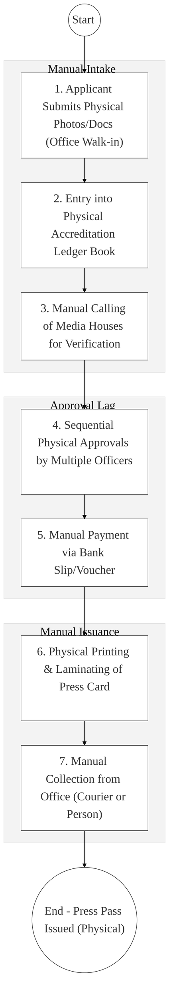
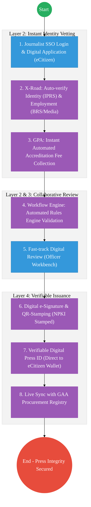

# STATE DEPARTMENT FOR BROADCASTING – Business Process Architecture (Updated)

## Cover Page
- **Ministry:** Ministry of Information, Communications and the Digital Economy
- **State Department:** State Department for Broadcasting
- **Primary Authority:** Principal Secretary, Broadcasting
- **Document Type:** Business Process Architecture (BPA) Standardised
- **Document Version:** 4.1
- **Date:** 2026-03-25
- **Classification:** Official
- **Strategic Category:** Priority MDA
- **Service Model:** G2B / G2C
- **Reviewer:** Senior Government Enterprise Architect

---

## SECTION 0: SERVICE PRIORITISATION MAPPING
- **Mapped Priority Service:** Media Accreditation & Journalist Registry
- **Tier Classification:** Tier 2
- **Strategic Category:** Governance / Media (Information Integrity)
- **Breakout Room Classification:** Room 3 (Agriculture & Economic Development)
- **Lead MDA (Standardised Name):** State Department for Broadcasting
- **Related Cross-Cutting Services:**
    - National Journalist & Media Registry
    - Identity Layer (IPRS / Maisha Namba - Journalist Identity)
    - X-Road (BRS / KRA / Media Council Interop)
    - Government Payment Aggregator (GPA / Accreditation Fees)
    - National EDRMS (Press Release & Policy Archive)

---

## SECTION 0.1: PRIORITISATION JUSTIFICATION
This service is prioritised because the TO-BE design transforms media regulation from a manual "paper-ID" system into a "Verified Media Hub." By implementing a "National Journalist & Media Registry" that integrates with IPRS (Person) and BRS (Business) via X-Road (Huduma Bridge), the design eliminates the widespread risk of counterfeit press credentials and unauthorized media operations. This transformation enables instant digital accreditation for local and international journalists via a dedicated eCitizen portal, automates the "Government Advertising Agency (GAA)" procurement workflows to ensure transparency, and ensures that all official government communications are disseminated through verified, cryptographically-linked media channels, significantly enhancing the integrity of national information.

| Criteria | Evidence from TO-BE Design |
| :--- | :--- |
| **Demand / Volume** | Thousands of journalist accreditations annually; oversight of hundreds of media houses. |
| **National Priority Alignment** | Kenya Information and Communications Act; Media Council Act; Freedom of Expression. |
| **Data Reusability** | Verified Journalist data is the primary input for GAA advertising placement and security clearance. |
| **Interoperability** | Multi-agency data flow between Broadcasting, Media Council, and BRS via X-Road. |
| **Revenue / Efficiency Impact** | Reduces accreditation turnaround from 7 days to <24 hours; digital fee collection via GPA. |
| **Governance / Risk Reduction** | NPKI-signed press IDs prevent forgery and ensure non-repudiation of media filings. |
| **Inclusivity** | Virtual accreditation portal allows community radio journalists in all 47 counties to register. |
| **Readiness** | High; The GAA and Media Council have existing digital record sets. |

> [!NOTE]
> “The TO-BE design transforms media regulation from a manual 'paper-ID' system into a 'Verified Media Hub.' By implementing a 'National Journalist & Media Registry' that integrates with IPRS and BRS via X-Road, the design eliminates the risk of counterfeit press credentials. This transformation enables instant digital accreditation for local and international journalists via a dedicated eCitizen portal, automates the 'GAA' procurement workflows, and ensures that all government communications are disseminated through verified media channels.”

---

# SECTION 1: SERVICE DEFINITION (STANDARDISED)

The State Department for Broadcasting is responsible for the development of mass media and coordinating government communication as per the **Kenya Information and Communications Act**.

In this refactored BPA, the primary service is the **End-to-End Media Accreditation and Journalist Lifecycle**. The objective is to move from manual physical "Press Passes" and paper-vouchers to a **Digital Media Hub** where accreditations are issued as **Verifiable Digital Credentials** and GAA advertising orders are tracked in real-time via the **Huduma Bridge**.

---

# SECTION 2: SERVICE CATALOGUE (NORMALISED)

| Category | Service Name | Description |
| :--- | :--- | :--- |
| **Core Services** | **Journalist Accreditation**| Digital vetting and issuance of press credentials (G2C). |
| | **Media House Registration**| Legal onboarding of broadcasting entities into the Registry. |
| **Extended Services** | **GAA Advertising Order** | Digital placement of government ads in verified media (G2B). |
| | **Content Policy Archive** | Searchable digital repository of broadcasting standards. |
| **Special Case Services**| **Intl. Press Clearance** | Fast-track digital vetting for visiting foreign media. |
| | **Media Grant Tracking** | Management of state support and training for community media. |

---

# SECTION 3: AS-IS PROCESS FLOWS (MANUAL/PAPER-BASED)

Currently, accreditation and advertising coordination rely on physical document submissions and manual registry books, leading to slow turnaround and verification risks.

### 3.1 AS-IS Visualization

### 3.2 Operational Reality
- **Actors:** Journalist, Media Liaison Officer, Registry Clerk, GAA Coordinator.
- **Systems:** Physical Ledger Books, MS Word (Drafting), Manual Payment Vouchers.
- **Pain Points:** 7-10 day delay for standard press IDs; no real-time way to verify an ID in the field; media houses must manually re-submit corporate docs for ogni advertising order; risk of "Fake News" proliferation via unverified channels.

---

# SECTION 4: TO-BE PROCESS INTERPRETATION (NEW LAYER)

### 4.1 TO-BE Process (Verified Media Hub)

### 4.2 Key Capabilities Introduced
*   **Automation:** Automated Employment Verification – system pulls media house payroll/staff lists via X-Road to instantly verify journalist status.
*   **Integration:** Multi-registry integration between **Broadcasting**, **Media Council**, **IPRS**, and **GAA** via X-Road.
*   **Real-time Processing:** "Citizen Wallet Delivery" – the Press ID is delivered as a QR-coded digital card to the journalist's mobile phone instantly.
*   **Digital Identity Validation:** Journalists and media house owners verified via **National Identity (Maisha Namba)**.
*   **Workflow Orchestration:** Orchestrates the entire media lifecycle from journalist onboarding to government advertising settlement.

### 4.3 Transformation Summary
| Dimension | AS-IS | TO-BE |
| :--- | :--- | :--- |
| **Processing** | Manual / Multi-office visits | Digital / Single-window (eCitizen) |
| **Verification** | Physical Photos / Call-backs | Live X-Road API (IPRS/BRS/Media Council) |
| **Records** | Regional Store-rooms | Unified National Media Registry |
| **Tracking** | Manual Ledger Books | Real-time Searchable Media Map |

---

# SECTION 5: SYSTEM LANDSCAPE (ALIGN TO GEA)

| Layer | System / Platform | Role |
| :--- | :--- | :--- |
| **Identity Layer** | Maisha Namba (Journalist) | Identity and Bio-login for all media accreditation. |
| **Interoperability** | KeSEL (X-Road) | Data bridge to Media Council, BRS, and GAA. |
| **shared Services** | National EDRMS | Legal digital archive for all media policy and GAA records. |
| **Workflow / BPM** | Media Hub Engine | Orchestrates accreditation reviews and advertising tasking. |
| **Payment Layer** | GPA (Payment Gateway) | Automated collection of accreditation and licensing fees. |
| **Trust Hub** | NPKI Stamping Service | Cryptographic sealing of all Verifiable Press IDs. |

---

# SECTION 6: TRANSFORMATION VALUE (CRITICAL ADDITION)

| Value Type | Explanation |
| :--- | :--- |
| **Efficiency Gain** | Accreditation time reduced from 7 days to <24 hours. |
| **Economic Impact** | Streamlines government advertising (GAA) spend, preventing payment to "Ghost" media. |
| **Governance Impact** | Absolute integrity of the media registry; prevents credential fraud. |
| **Citizen Experience** | Effortless digital renewals for journalists; transparent government messaging. |
| **Interoperability Value** | Shared Media-Registry ensures all agencies can verify press status instantly. |

---

# SECTION 7: ALIGNMENT TO WHOLE-OF-GOVERNMENT ARCHITECTURE
- **Shared Platforms:** Uses the Government Communication Portal as the central media workbench.
- **Registry Reuse:** Reuses IPRS (Citizen) and BRS (Business) data for zero-document accreditation.
- **Compliance with GEA / GIF:** Standardizing media metadata for whole-of-government information tagging.

---

# SECTION 8: IMPLEMENTATION READINESS (NEW)
*   **Data Readiness:** High; Media Council and GAA have structured digital databases ready for sync.
*   **Legal Readiness:** High; KICA Act supports regulatory oversight and record digitization.
*   **Institutional Readiness:** High; Active Media Liaison offices exist in all Ministries.
*   **Technical Readiness:** High; Media Hub modules can be deployed on the National G-Cloud restricted zone.

---

# SECTION 9: TRACEABILITY MATRIX (NEW)

| BPA Process | Priority Service | Tier | TO-BE Capability | National Impact |
| :--- | :--- | :--- | :--- | :--- |
| **Accreditation Hub**| Journalist Registry | T2 | Maisha Namba Verified SSO | Information Integrity & Security |
| **Media Registry** | Entity Onboarding | T2 | BRS/CA Interop Workflow | Regulatory Accountability |
| **GAA Placement** | Gov Advertising | T2 | Automated Placement Ledger | Transparent Media Spend |
| **NPKI Press ID** | Dispatch | T2 | Verifiable Digital Press ID (QR)| Institutional Trust & Freedom |

---
**[End of Standardised Business Process Architecture]**
