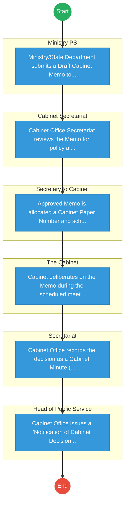
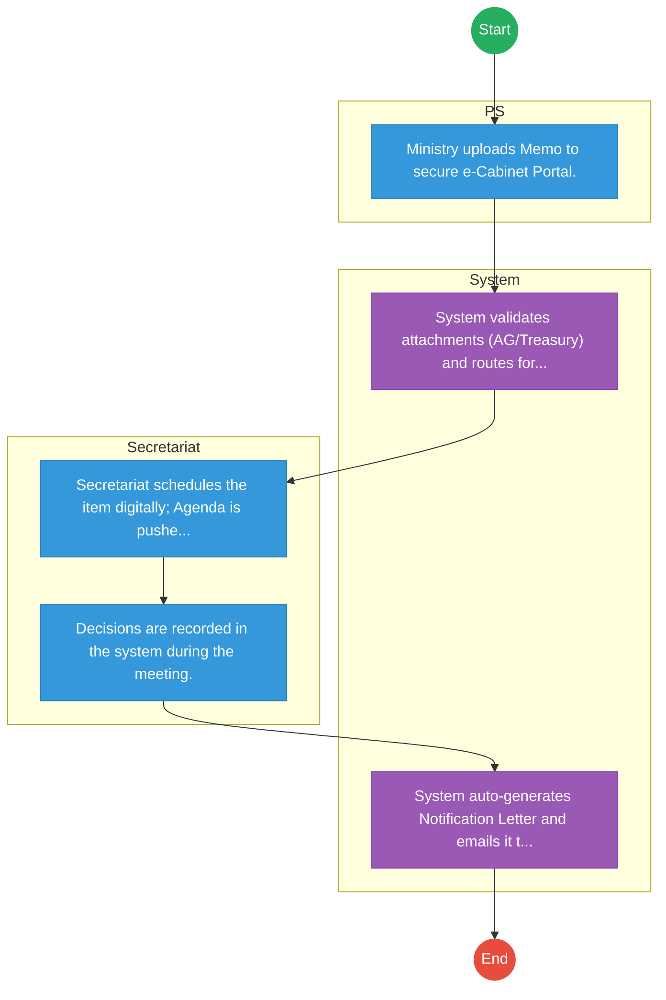

# CABINET OFFICE – Cabinet Memo Processing

## Cover Page
- **Ministry/Department/Agency (MDA):** CABINET OFFICE
- **Process Name:** Cabinet Memo Processing
- **Document Version:** 1.0
- **Date:** 2026-02-14
- **Classification:** Official

---

## Executive Summary
The Ministry of Investment, Trade and Industry in Kenya is dedicated to driving economic recovery, growth, and transformation. It achieves this by promoting and facilitating domestic and foreign investments, enhancing trade opportunities, and fostering industrial development through initiatives like Special Economic Zones, Export Processing Zones, and value addition programs.

---

## 1. AS-IS Process Flowchart (BPMN 2.0)
*Current State visualization.*

---

## Process Overview
### Process Name
Cabinet Memo Processing

### Service Category
- G2C/G2B

### Scope
- **In Scope:** End-to-end processing within CABINET OFFICE.

### Triggers
- Submission of application/request by Ministry PS.

### End States
- **Successful:** Cabinet Paper Number, Cabinet Minute/Resolution, Notification of Decision Letter

### Policy Context
- The CABINET OFFICE Act; The Constitution of Kenya 2010; Data Protection Act 2019.

---

## Stakeholders

| Stakeholder | Role | Responsibilities |
|---|---|---|
| The Cabinet | Process Actor | Performs actions as defined in steps. |
| Secretariat | Process Actor | Performs actions as defined in steps. |
| Secretary to Cabinet | Process Actor | Performs actions as defined in steps. |
| Head of Public Service | Process Actor | Performs actions as defined in steps. |
| Cabinet Secretariat | Process Actor | Performs actions as defined in steps. |
| Ministry PS | Process Actor | Performs actions as defined in steps. |

---

## Detailed Process (AS-IS)

| Step | Role | Action | Tool | Notes |
|---|---|---|---|---|
| 1 | Ministry PS | Ministry/State Department submits a Draft Cabinet Memo to the Head of Public Service. | Manual | |
| 2 | Cabinet Secretariat | Cabinet Office Secretariat reviews the Memo for policy alignment and formatting compliance. | Manual | |
| 3 | Secretary to Cabinet | Approved Memo is allocated a Cabinet Paper Number and scheduled for an upcoming Cabinet Meeting. | Manual | |
| 4 | The Cabinet | Cabinet deliberates on the Memo during the scheduled meeting. | Manual | |
| 5 | Secretariat | Cabinet Office records the decision as a Cabinet Minute (Resolution). | Manual | |
| 6 | Head of Public Service | Cabinet Office issues a 'Notification of Cabinet Decision' to the originating Ministry. | Manual | |

---

## Pain Points & Opportunities
### Pain Points
- Manual movement of sensitive physical files.
- Risk of leakage of confidential information.
- Delays in scheduling and feedback.
- Difficulty in tracking implementation status.

### Opportunities
- Secure e-Cabinet System for digital memo distribution.
- Biometric access control for meeting documents.
- Digital dashboard for tracking Cabinet decision implementation.
- Encrypted communication channels.

---

## 2. TO-BE Process Flowchart (BPMN 2.0)
*Future State visualization (Optimized).*

## Future State Process (TO-BE)
### Narrative
The To-Be process utilizes a secure e-Cabinet System where Ministers access papers via tablets, and decisions are digitally tracked.

### Optimized Steps (Digital)

| Step | Actor | Action | System |
|---|---|---|---|
| 1 | PS | Ministry uploads Memo to secure e-Cabinet Portal. | e-Cabinet |
| 2 | System | System validates attachments (AG/Treasury) and routes for Secretariat review. | e-Cabinet |
| 3 | Secretariat | Secretariat schedules the item digitally; Agenda is pushed to Cabinet tablets. | e-Cabinet |
| 4 | Secretariat | Decisions are recorded in the system during the meeting. | e-Cabinet |
| 5 | System | System auto-generates Notification Letter and emails it to the Ministry. | e-Cabinet |

---

## References
Derived from official mandates.
