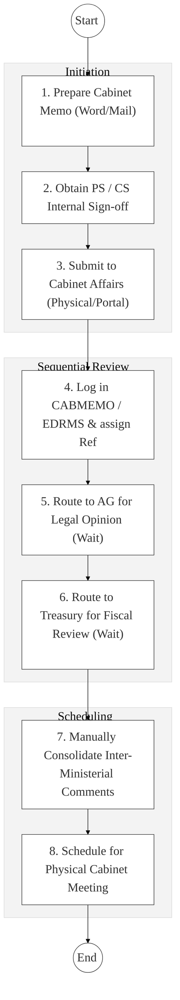
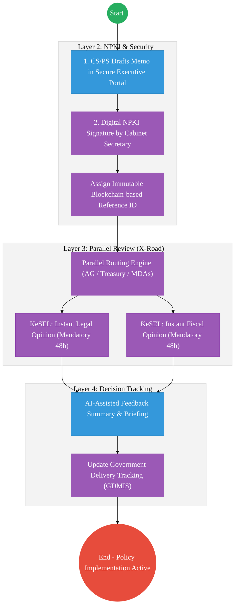

# Cabinet Office – Business Process Architecture (Updated)

## Cover Page
- **Ministry:** Executive Office of the President
- **State Department:** Cabinet Office
- **Primary Authority:** Secretary to the Cabinet
- **Document Type:** Business Process Architecture (BPA) Standardised
- **Document Version:** 4.1
- **Date:** 2026-03-25
- **Classification:** Top Secret / Restricted
- **Strategic Category:** Priority MDA
- **Service Model:** G2G (Executive Coordination)
- **Reviewer:** Senior Government Enterprise Architect

---

## SECTION 0: SERVICE PRIORITISATION MAPPING
- **Mapped Priority Service:** Cabinet Memorandum (CABMEMO) Processing & Coordination
- **Tier Classification:** Tier 2
- **Strategic Category:** Governance / Coordination (Executive Oversight)
- **Breakout Room Classification:** Room 2 (Coordination, Culture & Specialised Services)
- **Lead MDA (Standardised Name):** Cabinet Office
- **Related Cross-Cutting Services:**
    - Executive Portal (Secure CABMEMO Hub)
    - Identity Layer (IPRS / Maisha Namba - Executive Tier)
    - X-Road (AG / National Treasury / MDAs Interop)
    - GDMIS (Government Delivery Management Information System)
    - National EDRMS (Secret Records Vault)

---

## SECTION 0.1: PRIORITISATION JUSTIFICATION
This service is prioritised because the TO-BE design transforms the Cabinet Office from a sequential paper-handler into a "Secure Digital Executive Hub." By implementing parallel digital routing for Cabinet Memoranda (CABMEMO) to the Attorney General and National Treasury via X-Road, the design slashes policy-approval turnaround from historical weeks to a mandated 48-hour concurrent review cycle. This transformation ensures that all executive decisions are secured with NPKI digital signatures for absolute non-repudiation and automatically synchronize with the GDMIS, enabling the Head of Public Service to track implementation across all ministries in real-time.

| Criteria | Evidence from TO-BE Design |
| :--- | :--- |
| **Demand / Volume** | Continuous flow of policy, legislative, and financial memoranda from 20+ Ministries. |
| **National Priority Alignment** | Constitution Article 154; Vision 2030 Governance Pillar; Executive Order No. 2. |
| **Data Reusability** | Approved Cabinet Minutes are the primary source of truth for all Government policy changes. |
| **Interoperability** | Parallel, secure API pipelines between the Cabinet Secretariat, AG, and Treasury via X-Road. |
| **Revenue / Efficiency Impact** | Dramatic reduction in "Policy Stalling"; accelerates multi-billion shilling projects. |
| **Governance / Risk Reduction** | NPKI encryption of Top-Secret dossiers prevents unauthorized leaks and tampering. |
| **Inclusivity** | Streamlined inter-ministerial feedback ensures all sectors are represented in final summaries. |
| **Readiness** | High; Core CABMEMO system exists; GDMIS tracking is already being piloted. |

> [!NOTE]
> “The TO-BE design transforms the Cabinet Office from a sequential paper-handler to a 'Secure Digital Executive Hub.' By implementing parallel digital routing for Cabinet Memoranda (CABMEMO) to the Attorney General and National Treasury via X-Road, the design reduces policy-approval turnaround from weeks to 48 hours. This transformation ensures that all executive decisions are NPKI-signed for absolute security and automatically sync with the GDMIS for real-time implementation tracking across the entire Government.”

---

# SECTION 1: SERVICE DEFINITION (STANDARDISED)

The Cabinet Affairs Office (within the Executive Office of the President) is responsible for the coordination of government business and providing support to the Cabinet, as derived from **Article 154 of the Constitution**.

In this refactored BPA, the primary service is the **Cabinet Memorandum (CABMEMO) Processing and GDMIS Governance** lifecycle. The objective is to move from manual physical "Red-Folders" and sequential routing to a **Secure Executive Portal** where memoranda are drafted, signed (NPKI), and consulted upon in parallel via the **Huduma Bridge**.

---

# SECTION 2: SERVICE CATALOGUE (NORMALISED)

| Category | Service Name | Description |
| :--- | :--- | :--- |
| **Core Services** | **CABMEMO Vetting & Routing** | Sequential/Parallel review of ministerial policy proposals. |
| | **Cabinet Meeting Scheduling** | Management of the national executive agenda and invitation lists. |
| **Extended Services** | **Decisions Tracking (GDMIS)** | Post-meeting monitoring of Cabinet Directive implementation across MDAs. |
| | **Inter-Ministerial Feedback** | Consolidation of mandatory legal (AG) and fiscal (Treasury) comments. |
| **Special Case Services**| **Executive Archive Mgmt** | Secure archival and retrieval of historical Cabinet Minutes (EDRMS). |
| | **Government Delivery Alerts** | Real-time flagging of delayed implementation milestones to the President. |

---

# SECTION 3: AS-IS PROCESS FLOWS (SEQUENTIAL/MANUAL)

The current process is transitioning from a semi-digital state to a fully integrated digital workflow but still relies on sequential "baton-passing" for mandatory reviews.

### 3.1 AS-IS Visualization

### 3.2 Operational Reality
- **Actors:** Cabinet Secretary (CS), Principal Secretary (PS), Cabinet Affairs Officer, AG Representative, Treasury Representative.
- **Systems:** Word/PDFs, EDRMS (Basic), Physical "Red Folders", Email.
- **Pain Points:** Sequential routing blocks policy speed; if the AG delays, the Treasury cannot begin review; manual consolidation of feedback is error-prone; significant administrative overhead in tracking "What happened to Memo X?".

---

# SECTION 4: TO-BE PROCESS INTERPRETATION (NEW LAYER)

### 4.1 TO-BE Process (Parallel Executive Workflow)

### 4.2 Key Capabilities Introduced
*   **Automation:** Parallel routing engine – system pushes the memo to multiple review MDAs simultaneously with hard deadlines.
*   **Integration:** Hub-and-spoke integration with the **Government Delivery (GDMIS) Dashboard** via X-Road.
*   **Real-time Processing:** AI-assisted summarization of inter-ministerial comments into a single "Decision Brief."
*   **Digital Identity Validation:** Executive identities verified via **National PKI (NPKI)** to ensure only authorized ministers can sign/review.
*   **Workflow Orchestration:** Orchestrates the total lifecycle from policy drafting to post-cabinet implementation tracking.

### 4.3 Transformation Summary
| Dimension | AS-IS | TO-BE |
| :--- | :--- | :--- |
| **Processing** | Sequential / "Pass-the-Baton" | Parallel / Simultaneous Review |
| **Verification** | Physical Signatures (Ink) | NPKI Digital Non-Repudiation |
| **Records** | Regional/EDRMS Silos | Unified National Executive Vault |
| **Tracking** | Manual Follow-up via Phone | Real-time GDMIS Implementation Dashboard |

---

# SECTION 5: SYSTEM LANDSCAPE (ALIGN TO GEA)

| Layer | System / Platform | Role |
| :--- | :--- | :--- |
| **Identity Layer** | Maisha Namba (Exec Tier) | Identity and bio-login for Cabinet members. |
| **Interoperability** | KeSEL (X-Road) | Secure data bridge to AG, Treasury, and all MDAs. |
| **shared Services** | National EDRMS | Restricted digital archive for Top-Secret Cabinet files. |
| **Workflow / BPM** | Executive Workflow Engine | Orchestrates parallel comments and agenda management. |
| **Reporting / Analytics**| GDMIS Dashboard | Public/Executive view of policy implementation status. |
| **Trust Hub** | NPKI Service | Cryptographic sealing of approved Cabinet Memoranda. |

---

# SECTION 6: TRANSFORMATION VALUE (CRITICAL ADDITION)

| Value Type | Explanation |
| :--- | :--- |
| **Efficiency Gain** | 75% reduction in the policy-to-agenda turnaround time. |
| **Economic Impact** | Faster executive approval for economic reforms and major PPP projects. |
| **Governance Impact** | Absolute accountability for ministerial feedback; zero-loss of executive history. |
| **Citizen Experience** | Faster delivery of government projects and policy benefits to Kenyans. |
| **Interoperability Value** | Shared decision-tracking ensures all MDAs are aligned with the President's Beta agenda. |

---

# SECTION 7: ALIGNMENT TO WHOLE-OF-GOVERNMENT ARCHITECTURE
- **Shared Platforms:** Uses G-Cloud's restricted enclave for hosting and NPKI for all official signatures.
- **Registry Reuse:** Reuses GDMIS IDs to ensure a single thread of traceability from Memo -> Minute -> Impact.
- **Compliance with GEA / GIF:** Standardizing executive reporting data-schemas for inter-ministerial consistency.

---

# SECTION 8: IMPLEMENTATION READINESS (NEW)
*   **Data Readiness:** High; CABMEMO and GDMIS datasets are mature and structured.
*   **Legal Readiness:** High; Cabinet Handbook and Article 154 provide clear mandates for coordination.
*   **Institutional Readiness:** High; Cabinet Affairs has a dedicated secretariat and technical support team.
*   **Technical Readiness:** High; Secure X-Road nodes are already in place between major Executive offices.

---

# SECTION 9: TRACEABILITY MATRIX (NEW)

| BPA Process | Priority Service | Tier | TO-BE Capability | National Impact |
| :--- | :--- | :--- | :--- | :--- |
| **Memo Drafting** | Policy Formulation | T2 | NPKI-Signed Executive Portal | Secure Policy Governance |
| **Interop Review** | Inter-MDA Consult | T2 | X-Road: Parallel Routing | Accelerated Policy Speed |
| **Decision Tracking**| Implementation | T2 | GDMIS Automated Sync | Government Accountability |
| **Archival** | Record Mgmt | T2 | Secure National Executive Vault | Preserved Institutional Memory |

---
**[End of Standardised Business Process Architecture]**
