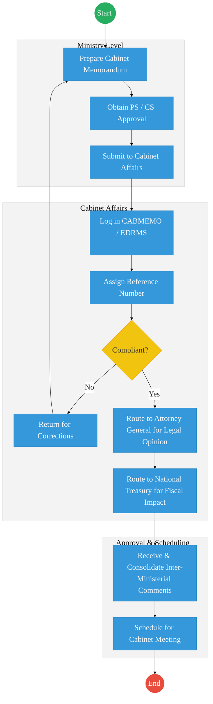
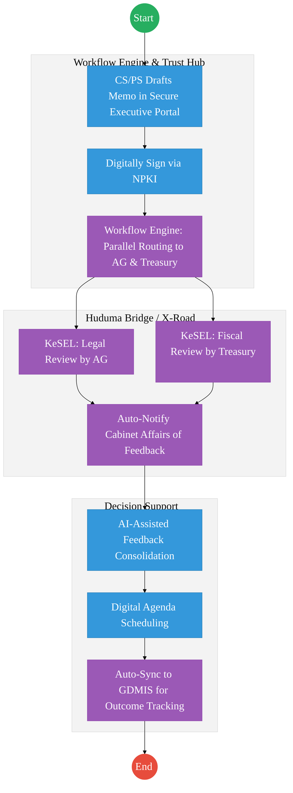

# STATE DEPARTMENT FOR CABINET AFFAIRS – Service Delivery

## Cover Page
- **Ministry/Department/Agency (MDA):** Executive Office of the President
- **Department:** State Department for Cabinet Affairs
- **Process Name:** Cabinet Memorandum Processing & Coordination
- **Document Version:** 2.1
- **Date:** 2026-02-24
- **Classification:** Official
- **Strategic Category:** Priority MDA
- **Service Model:** G2G
- **Life-Cycle Group:** Cradle to Death (5. Social Protection & Justice)

---

## Service Mandate
The Cabinet Affairs Office is a key department within the Executive Office of the President, primarily responsible for the coordination of government business and providing support to the Cabinet. Its mandate is derived from Article 154 of the Constitution and various Executive Orders.

**Official Website:** [https://www.president.go.ke](https://www.president.go.ke)

**Key Functions:**
- **Cabinet Secretariat:** Serving as the secretariat to the Cabinet and its Committees.
- **Coordination of Government Business:** Organizing and coordinating the execution of government policies across various ministries and departments.
- **Policy Management:** Initiating, tracking, and monitoring the implementation of Cabinet decisions.
- **Advisory Services:** Providing policy advisory services to the President, the Cabinet, and other public agencies.
- **Records Management:** Maintaining a register of all Cabinet decisions and ensuring appropriate action by authorities.
- **Meeting Management:** Arranging the business and keeping the minutes of Cabinet meetings.

---

## Executive Summary
The State Department for Cabinet Affairs is responsible for the efficient management of the Cabinet's business. This includes the processing of Cabinet Memoranda (CABMEMO), tracking the implementation of Cabinet decisions through the GDMIS, and managing centralized executive resources like the government fleet. The current process is transitioning from a semi-digital state (using EDRMS) to a fully integrated digital workflow.

---

## 1. AS-IS Process Flowchart (BPMN 2.0)
*Current State visualization (Cabinet Memorandum Processing based on Deep Dive).*

---

## Process Overview
### Process Name
Cabinet Memorandum (CABMEMO) Processing and GDMIS Registration

### Service Category
- G2G (Government to Government)

### Scope
- **In Scope:** Drafting, vetting, inter-ministerial consultation, and final scheduling of Cabinet Memoranda.
- **Out of Scope:** The actual deliberation of the Cabinet (Top Secret).

### Triggers
- A Ministry identifying a policy or legislative matter requiring Cabinet approval.

### End States
- **Successful:** Cabinet Memorandum scheduled for discussion; Recorded in GDMIS for tracking.

### Policy Context
- Cabinet Handbook; The Constitution of Kenya; State Officer's Code of Conduct.

---

## Detailed Process (AS-IS)

| Step | Role | Action | Tool/System | Notes |
|---|---|---|---|---|
| 1 | Ministry | Prepares a Cabinet Memorandum and obtains approval from the Principal Secretary and Cabinet Secretary. | Manual/Word | |
| 2 | Cabinet Affairs Officer | Receives the memorandum, logs it in the CABMEMO system, and assigns a reference. | CABMEMO / EDRMS | |
| 3 | Cabinet Affairs Officer | Checks for compliance with guidelines (e.g., formatting, required attachments). | Manual | |
| 4 | Cabinet Affairs | Routes the memorandum to the AG and Treasury via the system or physical dispatch for mandatory comments. | EDRMS / Physical | |
| 5 | Cabinet Affairs | Consolidates all feedback and prepares the final agenda for the Cabinet. | Manual | |

---

## Pain Points & Opportunities
### Pain Points
- **Sequential Routing:** The "Route to AG then Route to Treasury" flow is slow; if one party delays, the whole policy is stalled.
- **Feedback Loops:** Manual consolidation of inter-ministerial comments is labor-intensive and error-prone.
- **Resource Management:** Fleet management and trip approvals are still largely paper-based (work tickets).

### Opportunities
- **Parallel Processing:** Using the **Huduma Bridge** to route the CABMEMO to AG, Treasury, and other MDAs simultaneously for comments.
- **Immutable Audit Trail:** Using **NPKI**  to digitally sign all Cabinet Memoranda, ensuring they cannot be altered.
- **Integrated Fleet Management:** Automating work tickets and vehicle allocation via a mobile app linked to the **Government Payment Aggregator** for fuel and maintenance.

---

## 2. TO-BE Process Flowchart (BPMN 2.0)
*Future State visualization (Kenya DSAP Architecture - Huduma Bridge).*

## Future State Process (TO-BE)
### Narrative
**TO-BE Process: Secure Digital Cabinet Workflows**

**Design Principles:**
- **Non-Repudiation:** All memoranda are digitally signed using **NPKI** certificates issued to Cabinet Secretaries, ensuring absolute security and legal validity.
- **Agility:** The **Workflow Engine** enables parallel consultation. Instead of a serial "passing of the baton," all required reviewers provide feedback simultaneously.
- **Transparency:** Once a decision is reached, the result is auto-synced to the **GDMIS** (Government Delivery Management Information System) via **X-Road**, enabling immediate tracking of implementation by the Head of Public Service.

### Optimized Steps (Digital)

| Step | Actor | Action | System |
|---|---|---|---|
| 1 | CS / PS | Drafts and reviews the memorandum within the secure Executive Portal. | Executive Portal |
| 2 | Cabinet Secretary | Digitally signs the final version using their National PKI (NPKI) certificate. | Trust Hub / NPKI |
| 3 | System | Routes the signed memo via X-Road to the AG and Treasury for concurrent 48-hour review. | Workflow Engine / X-Road |
| 4 | Cabinet Affairs | Uses AI tools to summarize and consolidate inter-ministerial feedback for the final Cabinet brief. | Analytics Engine |
| 5 | System | Automatically creates tracking milestones in the GDMIS based on the approved Cabinet Minute. | GDMIS / KeSEL |

---

## References
- https://cabinetoffice.go.ke
- Cabinet Handbook
- Desk Review

---

### Validation Survey
Please provide your feedback here: [https://ee.kobotoolbox.org/x/4Ls7SlCG](https://ee.kobotoolbox.org/x/4Ls7SlCG)

