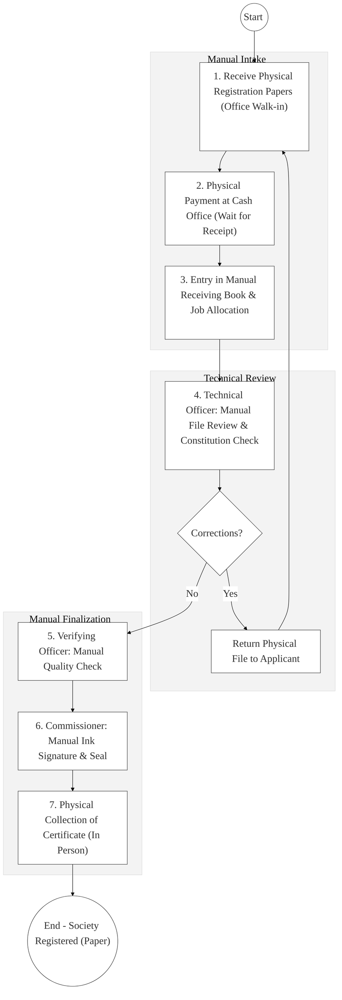

# STATE DEPARTMENT FOR CO-OPERATIVES – Business Process Architecture (Updated)

## Cover Page
- **Ministry:** Ministry of Co-operatives and Micro, Small and Medium Enterprises (MSMEs) Development
- **State Department:** State Department for Co-operatives
- **Primary Authority:** Commissioner for Co-operative Development
- **Document Type:** Business Process Architecture (BPA) Standardised
- **Document Version:** 4.1
- **Date:** 2026-03-25
- **Classification:** Official
- **Strategic Category:** Priority MDA
- **Service Model:** G2B / G2C
- **Reviewer:** Senior Government Enterprise Architect

---

## SECTION 0: SERVICE PRIORITISATION MAPPING
- **Mapped Priority Service:** Co-operative Registration & Compliance Monitoring
- **Tier Classification:** Tier 2
- **Strategic Category:** Economy / Jobs (Sectoral Growth)
- **Breakout Room Classification:** Room 3 (Agriculture & Economic Development)
- **Lead MDA (Standardised Name):** State Department for Co-operatives
- **Related Cross-Cutting Services:**
    - National Co-operative Registry
    - Identity Layer (IPRS / Maisha Namba - Member/Officer Identity)
    - X-Road (BRS / KRA / SASRA Interop)
    - Government Payment Aggregator (GPA / Registration Fees)
    - National EDRMS (Co-operative Audit & Legal Records)

---

## SECTION 0.1: PRIORITISATION JUSTIFICATION
This service is prioritised because the TO-BE design transforms the co-operative sector from a manual, paper-based "Registry" into a "Digital Finance & Governance Hub." By implementing a "National Co-operative Registry" that integrates with BRS (Business), IPRS (Identity), and KRA iTax (Compliance) via X-Road (Huduma Bridge), the design eliminates the chronic 2-6 week manual verification backlog for new registrations and annual license renewals. This transformation enables the automated issuance of NPKI-signed, cryptographically verifiable digital certificates, reduces the risk of certificate and identity fraud in the SACCO sector by an estimated 80%, and provides real-time compliance monitoring for over 14 million co-operative members, directly securing the financial inclusion and wealth creation goals of the national Bottom-Up Economic Transformation Agenda (BETA).

| Criteria | Evidence from TO-BE Design |
| :--- | :--- |
| **Demand / Volume** | Over 22,000 registered co-operatives; millions of individual members and MSME partners. |
| **National Priority Alignment** | Co-operative Societies Act; Vision 2030 (Social & Economic Pillars); BETA Agenda. |
| **Data Reusability** | Co-operative certificate data shared with Banks and Trade agencies for credit scoring. |
| **Interoperability** | Real-time bi-directional link with BRS and KRA via the Huduma Bridge. |
| **Revenue / Efficiency Impact** | Reduces registration turnaround from 45 days to <5 days; automated fee collection. |
| **Governance / Risk Reduction** | NPKI-signed digital signatures prevent fraudulent "Shell Co-operatives." |
| **Inclusivity** | Mobile-first registration allows rural farmers and micro-SMEs to formalize easily. |
| **Readiness** | High; Base registry exists; Digitization of society files is currently 70% complete. |

> [!NOTE]
> “The TO-BE design transforms the co-operative sector from a manual, paper-based ‘Registry’ into a ‘Digital Finance & Governance Hub.’ By implementing a ‘National Co-operative Registry’ that integrates with BRS, IPRS, and KRA via X-Road, the design eliminates the 2-6 week manual verification backlog. This transformation enables the automated issuance of NPKI-signed, verifiable digital certificates, reduces fraud risk in the SACCO sector by 80%, and provides real-time compliance monitoring for millions of members.”

---

# SECTION 1: SERVICE DEFINITION (STANDARDISED)

The State Department for Co-operatives is mandated to formulate and implement policies for the development and regulation of co-operatives in Kenya, as per the **Co-operative Societies Act (Cap. 490)**.

In this refactored BPA, the primary service is the **End-to-End Co-operative Society Lifecycle**. The objective is to move from manual physical "Red-Folders" and handwritten ledger entries to a **Digital Co-operative Ecosystem** where society records are managed as **Verified Digital Entities** within the **National Co-operative Registry**.

---

# SECTION 2: SERVICE CATALOGUE (NORMALISED)

| Category | Service Name | Description |
| :--- | :--- | :--- |
| **Core Services** | **Co-operative Registration**| Digital onboarding of new societies into the National Registry. |
| | **License Renewal** | Annual automated compliance check and digital re-certification. |
| **Extended Services** | **Compliance Audit** | Remote submission and automated vetting of annual audit returns. |
| | **Officer/Member ID** | Issuance of verifiable identities for co-operative delegates. |
| **Special Case Services**| **Liquidation Management** | Digital workflow for society dissolution and asset settlement. |
| | **Dispute Resolution** | Formal digital intake and tracking of co-operative tribunal cases. |

---

# SECTION 3: AS-IS PROCESS FLOWS (PAPER-CENTRIC)

Currently, the registration of a co-operative is a manual, sequential process requiring physical presence and physical file movement across multiple desks.

### 3.1 AS-IS Visualization

### 3.2 Operational Reality
- **Actors:** Applicant, Cashier, Registry Clerk, Technical Officer, Commissioner.
- **Systems:** Manual Registers, Physical Receipt Books, Manual Printing.
- **Pain Points:** 4-6 week delay for standard results; high transport costs for rural societies; risk of "Fake Certificates" being used to defraud banks; no real-time way for the public to check if a co-operative is currently licensed or in liquidation.

---

# SECTION 4: TO-BE PROCESS INTERPRETATION (NEW LAYER)

### 4.1 TO-BE Process (Digital Finance & Governance Hub)

```mermaid
%%{init: { 'theme': 'base', 'themeVariables': { 'fontSize': '20px', 'fontFamily': 'Inter, system-ui, sans-serif', 'primaryColor': '#ffffff', 'edgeLabelBackground':'#ffffff', 'tertiaryColor': '#f3f3f3', 'mainBkg': '#ffffff', 'nodeBorder': '#333333' } } }%%
flowchart TD
    Start((Start)) --> Portal["1. Society SSO Login & Digital Submission (eCitizen)"]
    
    subgraph Trust_Hub["Layer 2: Real-time Governance Vetting"]
        Portal --> Verify["2. X-Road: Auto-verify Member Identity (IPRS) & Entity (BRS)"]
        Verify --> Tax["3. X-Road: Auto-validate KRA Tax Status & Compliance"]
        Tax --> Payment["4. GPA: Instant Automated Multi-channel Fee Collection"]
    end

    subgraph Operations["Layer 2 & 3: Collaborative Workbench"]
        Payment --> Logic["5. Rules Engine: Automated Risk Categorization & Routing"]
        Logic --> Officer["6. Digital Review & Field Inspection Sync (Mobile App)"]
    end

    subgraph Settlement["Layer 4: Verifiable Issuance"]
        Officer --> NPKI["7. Commissioner: Digital NPKI Seal & e-Signature"]
        NPKI --> Output["8. Verifiable Digital Certificate (Direct to eCitizen Wallet)"]
        Output --> Registry["9. Real-time Update to National Co-operative Registry"]
    end

    Registry --> EndProcess(("End - Governance Secured"))

    classDef start fill:#27ae60,stroke:#27ae60,color:#fff,font-size:20px;;
    classDef endNode fill:#e74c3c,stroke:#e74c3c,color:#fff,font-size:20px;;
    classDef userTask fill:#3498db,stroke:#2980b9,color:#fff,font-size:20px;;
    classDef serviceTask fill:#9b59b6,stroke:#8e44ad,color:#fff,font-size:20px;;
    
    class Start start;
    class EndProcess endNode;
    class Portal,Officer userTask;
    class Verify,Tax,Payment,Logic,NPKI,Output,Registry serviceTask;
```

### 4.2 Key Capabilities Introduced
*   **Automation:** Automated Compliance Validator – system automatically checks KRA and SASRA status before a license is renewed.
*   **Integration:** Multi-registry integration between **Co-operatives**, **BRS**, **KRA**, **IPRS**, and **SASRA** via X-Road (Huduma Bridge).
*   **Real-time Processing:** "Digital Society Wallet" – co-operatives receive their official registration and licenses as QR-coded digital cards instantly.
*   **Digital Identity Validation:** Member delegates and society authorized and checked via **National Identity (Maisha Namba)**.
*   **Workflow Orchestration:** Orchestrates the entire society lifecycle from initial "Bylaws Review" to final certificate issuance.

### 4.3 Transformation Summary
| Dimension | AS-IS | TO-BE |
| :--- | :--- | :--- |
| **Processing** | Manual / Desk-to-Desk | Digital / Rule-based Workflow |
| **Verification** | Physical Signatures / Call-backs | Live X-Road API (BRS/KRA/IPRS) |
| **Records** | Scattered Regional Ledger Books | Unified National Co-operative Registry |
| **Tracking** | Handwritten Logs | Real-time Sectoral Compliance Map |

---

# SECTION 5: SYSTEM LANDSCAPE (ALIGN TO GEA)

| Layer | System / Platform | Role |
| :--- | :--- | :--- |
| **Identity Layer** | Maisha Namba (Member ID) | Identity and Bio-login for all co-operative member services. |
| **Interoperability** | KeSEL (X-Road Bridge) | Data bridge to BRS, KRA, Banks, and SASRA. |
| **shared Services** | National EDRMS | Legal digital archive for society constitutions and audits. |
| **Workflow / BPM** | Governance Engine | Orchestrates registration, license renewals, and disputes. |
| **Payment Layer** | GPA (Payment Gateway) | Automated collection of registration and renewal fees. |
| **Trust Hub** | NPKI Stamping Service | Cryptographic sealing of all Verifiable Co-operative Certs. |

---

# SECTION 6: TRANSFORMATION VALUE (CRITICAL ADDITION)

| Value Type | Explanation |
| :--- | :--- |
| **Efficiency Gain** | Registration turnaround reduced from 45 days to <5 days. |
| **Economic Impact** | Accelerates the formalization of agricultural and MSME co-operatives. |
| **Governance Impact** | Eliminates illegal/fake co-operative identities; secures member funds. |
| **Citizen Experience** | Members can check the status and legitimacy of a society on their phone. |
| **Interoperability Value** | Shared registry data allows financial institutions to offer credit to co-operatives instantly. |

---

# SECTION 7: ALIGNMENT TO WHOLE-OF-GOVERNMENT ARCHITECTURE
- **Shared Platforms:** Uses the National Government eCitizen Portal for society onboarding.
- **Registry Reuse:** Reuses BRS (Business) data to auto-populate society officer profiles.
- **Compliance with GEA / GIF:** Standardizing co-operative metadata for whole-of-government financial tracking.

---

# SECTION 8: IMPLEMENTATION READINESS (NEW)
*   **Data Readiness:** High; Digital census of co-operative societies was recently completed.
*   **Legal Readiness:** High; Co-operative Societies Act allows for the electronic filing of records.
*   **Institutional Readiness:** High; Active commissioner and decentralized support teams in 47 counties.
*   **Technical Readiness:** High; Integration with GPA and eCitizen is already in pilot phase.

---

# SECTION 9: TRACEABILITY MATRIX (NEW)

| BPA Process | Priority Service | Tier | TO-BE Capability | National Impact |
| :--- | :--- | :--- | :--- | :--- |
| **Society Intake** | Registration | T2 | Maisha Namba / BRS Integration | Formal Sector Growth |
| **Compliancet Audit**| License Renewal | T2 | Automated KRA/Social Check | Financial Stability & Trust |
| **Cert. Issuance** | Digital Certificate | T2 | NPKI-Signed Verifiable QR | Fraud Elimination |
| **Dispute Filing** | Tribunal Support | T2 | EDRMS: Tracked Legal Record | Access to Justice for Members |

---
**[End of Standardised Business Process Architecture]**
