# Cooperatives — Service Delivery
 
## Cover Page
- **Ministry/Department/Agency (MDA):** Ministry of Co-operatives and Micro, Small and Medium Enterprises (MSMEs) Development
- **Process Name:** Cooperative Registration and Service Delivery
- **Document Version:** 2.0
- **Date:** 2026-03-18
- **Classification:** Official
- **Strategic Category:** Priority MDA
- **Service Model:** G2C / G2B
- **Life-Cycle Group:** Cradle to Death (4. Employment & Business)
 
---

## Service Mandate
The Ministry of Co-operatives and Micro, Small and Medium Enterprises (MSMEs) Development is mandated to formulate, adopt, and implement policy and legal frameworks for the development and growth of all co-operatives and MSMEs in Kenya. Its key functions include cooperative policy development, promotion of cooperative ventures, supervision and oversight of cooperative societies, cooperative auditing, financial services policy, and coordinating the transformation of the MSME sector through capacity development and financial inclusion.

---

## Executive Summary
The Ministry of Co-operatives and Micro, Small and Medium Enterprises (MSMEs) Development is mandated to formulate, adopt, and implement policy and legal frameworks for the development and growth of all co-operatives in Kenya. The Ministry is responsible for the registration, regulation, oversight, promotion, and capacity building of the cooperative sector, aiming to enhance economic growth, financial inclusion, wealth creation, and improved livelihoods for millions of Kenyans.
 
The current registration and service delivery process is entirely paper-based — applicants physically deliver registration documents to the Registry, pay at a Cash Office, and wait through sequential manual review, allocation, correction, and verification cycles before a certificate is issued. This results in long turnaround times, high physical transaction costs, and significant fraud risk from manually issued certificates.
 
The transition to the Kenya DSAP Architecture will replace this process with a fully digital cooperative registration and licensing platform — integrating with BRS, IPRS, KRA iTax, and the Government Payment Aggregator (GPA) via the Service Bus to automate compliance validation, risk-based approvals, and verifiable digital certificate issuance.
 
---
 
## 1. AS-IS Process Flowchart (BPMN 2.0)
*Current State — Cooperative Registration and Service Delivery*
 

 
---
 
## Process Overview
### Process Name
Cooperative Registration and Service Delivery
 
### Service Category
- G2C (Government to Citizen) — Individual cooperative members and applicants
- G2B (Government to Business) — Cooperative societies, SACCOs, and MSMEs
 
### Scope
- **In Scope:** End-to-end processing of cooperative registration applications, licence renewals, compliance inspections, and official response issuance.
- **Out of Scope:** Internal audit functions; inter-ministerial policy development.
 
### Triggers
- Submission of a registration application, licence renewal, compliance query, or service request by a customer or cooperative society.
 
### End States
- **Successful:** Licence / Permit / Certificate, Compliance Inspection Report, Official Receipt, or Gazette Notice issued to the applicant.
- **Unsuccessful:** Application returned to applicant with documented corrections required.
 
### Policy Context
- The Co-operative Societies Act (Cap. 490)
- The Constitution of Kenya (2010)
- Kenya Data Protection Act (2019)
- Kenya DSAP Architecture — Huduma Bridge Technical Specification
 
---
 
## Stakeholders
 
| Stakeholder | Role | Responsibilities |
|---|---|---|
| Customer / Applicant | Initiator | Submits registration documents, application, or inquiry via courier, by hand, or official portal. Responds to correction requests. |
| Cash Office | Process Actor | Receives documents and processes payment receipting before handoff to Registry. |
| Registry | Process Actor | Records submissions in the Receiving Register, allocates duty to Technical Officers, and logs allocations in the Job Allocation Register. |
| Technical Officers | Process Actor | Receive allocated files, perform assigned tasks (review, verification, drafting), and flag corrections required. |
| Verifying Officers | Quality Control Actor | Review completed work for accuracy. Approve clean submissions or return flagged files for correction. |
| Management / Accounting Officer | Decision Maker | Approves the appropriate action or service delivery outcome. Signs off on certificates, licences, and official responses. |
| Customer Care | Delivery Actor | Communicates the service outcome or official response to the customer. |
 
---
 
## Detailed Process (AS-IS)
 
| Step | Role | Action | Tool/System | Notes |
|---|---|---|---|---|
| 1 | Customer / Applicant | Delivers registration documents to the Registry via courier or by hand. | Physical / Courier | No online submission channel. Physical presence or courier required for every application. |
| 2 | Cash Office | Receives the documents and processes payment receipting. | Cash Register / Manual Receipt | Cash-based payment only. No electronic payment integration. Receipts issued manually. |
| 3 | Registry | Records the submission in the Receiving Register. | Manual Register | Paper-based register. No digital tracking or SLA monitoring from this point. |
| 4 | Registry | Allocates duty to Technical Officers and enters the allocation in the Job Allocation Register. | Manual Register | Allocation is manual and based on officer availability. No workload balancing system. |
| 5 | Technical Officers | Receive the allocated file and perform the assigned tasks — review, drafting, or inspection. | Manual / Physical Files | Files passed physically. No version control or collaborative review capability. |
| 6 | Technical Officers / Verifying Officers | Assesses whether corrections are needed. If corrections required, file is returned to the applicant; if no corrections, verifying officers proceed. | Manual Judgement | Correction cycles add unpredictable delays. No formal correction tracking or deadline. |
| 7 | Verifying Officers | Verify the completed work and prepare the certificate or official response. | Manual | No digital signature. Certificate authenticity cannot be independently verified by recipients. |
| 8 | Management / Accounting Officer | Approves the final service delivery action. | Manual / Physical Signature | Approval bottleneck when management is unavailable. No digital delegation capability. |
| 9 | Customer Care | Delivers the certificate, licence, or official response to the customer. | Physical / Post | No automated notification. Customer must follow up manually to collect. |
 
---
 
## Pain Points & Opportunities
### Pain Points
- **Manual Document Verification Takes Time:** Every application requires manual cross-checking of submitted documents against internal policy registers, creating review backlogs of 2–6 weeks for standard registrations.
- **High Cost and Time for Physical Inspections:** Compliance inspections require physical officer visits with no geo-tagged evidence capture, standardised scoring, or digital reporting capability.
- **Risk of Counterfeit Licences / Certificates:** Manually issued paper certificates with physical signatures cannot be independently verified, creating significant fraud risk in the cooperative sector.
- **Lack of Real-time Monitoring of Licensees:** There is no live registry of currently licensed cooperatives and SACCOs. Lapsed licences go undetected until an ad-hoc inspection occurs.
- **Correction Cycles are Untracked:** When documents are returned for corrections, there is no formal tracking of what was wrong, the correction deadline, or resubmission status.
- **Cash-only Payment:** All fees are paid at the Cash Office in person, excluding applicants outside Nairobi from convenient access and creating manual reconciliation burdens.
 
### Opportunities
- **Integration with IPRS / BRS via Service Bus:** Auto-verify applicant identity and cooperative registration details at the point of submission, eliminating manual document cross-checking.
- **Adoption of Government Payment Gateway (GPA):** Replace cash-based payment with M-Pesa, card, and EFT via GPA — enabling remote applications and automatic receipt generation.
- **Implementation of Automated Rules Engine:** Codify review criteria in a workflow rules engine to auto-approve low-risk standard renewals, routing only complex or flagged applications to officers.
- **Issuance of Digital Verifiable Credentials:** Issue QR-coded, digitally signed certificates that any third party can verify instantly — eliminating counterfeit risk and enabling real-time licence status checks.
- **Risk-Based Digital Inspections:** Deploy a mobile inspection app with geo-tagging, photo evidence, and standardised compliance scoring to replace paper-based field visits.
 
---
 
## 2. TO-BE Process Flowchart (BPMN 2.0)
*Future State — Kenya DSAP Architecture (Huduma Bridge)*

```mermaid
%%{init: { 'theme': 'base', 'themeVariables': { 'fontSize': '24px', 'fontFamily': 'Inter, system-ui, sans-serif', 'primaryColor': '#ffffff', 'edgeLabelBackground':'#ffffff', 'tertiaryColor': '#f3f3f3', 'mainBkg': '#ffffff', 'nodeBorder': '#333333' } } }%%
flowchart TD
    Start((Start))
    EndApprove(("End - Certificate\nIssued"))
    EndReject(("End - Returned\nfor Correction"))
 
    subgraph Applicant ["Applicant"]
        direction LR
        Login["Login via SSO\non eCitizen Portal"]
        SelectService["Select Service Type\n(Registration / Renewal\n/ Compliance Query)"]
        ConfirmData["Confirm Auto-populated\nCooperative Details"]
        MakePayment["Pay Fees via GPA\n(M-Pesa / Card / EFT)\nAuto-receipt Generated"]
    end
 
    subgraph ServiceBus ["Government Service Bus"]
        direction LR
        ValIPRS["Auto-verify Applicant\nIdentity via IPRS"]
        ValBRS["Auto-verify Cooperative\nRegistration via BRS"]
        ValKRA["Auto-validate Tax\nCompliance via KRA iTax"]
    end
 
    subgraph WorkflowEngine ["Workflow Engine"]
        direction TB
        RulesEngine["Rules Engine Processes\nApplication"]
        RiskGateway{"Risk Level?"}
    end
 
    subgraph OfficerWorkbench ["Officer Workbench — Exception-Based"]
        direction TB
        OfficerReview["Officer Reviews\nApplication Digitally"]
        CorrectionGateway{"Corrections\nNeeded?"}
        NotifyCorrection["Notify Applicant\nof Required Corrections\n(SMS / Email)"]
    end
 
    subgraph Issuance ["Digital Certificate Issuance"]
        direction TB
        MgmtApproval["Management Digital\nApproval (e-Signature)"]
        GenCertificate["Generate Verifiable\nDigital Certificate\n(QR-coded and Signed)"]
        NotifyApplicant["Notify Applicant\n(SMS / Email / Portal)"]
        UpdateRegistry["Update Live\nCooperatives Digital Registry"]
    end
 
    Start --> Login
    Login --> SelectService
    SelectService --> ValIPRS
    ValIPRS --> ValBRS
    ValBRS --> ValKRA
    ValKRA --> ConfirmData
    ConfirmData --> MakePayment
    MakePayment --> RulesEngine
    RulesEngine --> RiskGateway
 
    RiskGateway -- "Low Risk —\nAuto-approved" --> MgmtApproval
    RiskGateway -- "Medium / High Risk" --> OfficerReview
 
    OfficerReview --> CorrectionGateway
    CorrectionGateway -- "Yes" --> NotifyCorrection
    NotifyCorrection --> Login
    CorrectionGateway -- "No" --> MgmtApproval
 
    MgmtApproval --> GenCertificate
    GenCertificate --> NotifyApplicant
    NotifyApplicant --> UpdateRegistry
    UpdateRegistry --> EndApprove
 
    classDef startEvent fill:#27ae60,stroke:#27ae60,color:#fff,font-size:24px;
    classDef endEvent fill:#e74c3c,stroke:#e74c3c,color:#fff,font-size:24px;
    classDef userTask fill:#3498db,stroke:#2980b9,color:#fff,font-size:24px;
    classDef serviceTask fill:#9b59b6,stroke:#8e44ad,color:#fff,font-size:24px;
    classDef gateway fill:#f1c40f,stroke:#f39c12,color:#333,font-size:24px;
 
    class Start startEvent;
    class EndApprove,EndReject endEvent;
    class RiskGateway,CorrectionGateway gateway;
    class ValIPRS,ValBRS,ValKRA,RulesEngine,GenCertificate,NotifyApplicant,UpdateRegistry serviceTask;
    class Login,SelectService,ConfirmData,MakePayment,OfficerReview,NotifyCorrection,MgmtApproval userTask;
```
 

 
## Future State Process (TO-BE)
### Narrative
**TO-BE Process: Digital Cooperative Registration via Huduma Bridge**
 
**Design Principles:**
- **Once-Only Principle:** Cooperative registration details (BRS), applicant identity (IPRS), and tax compliance (KRA iTax) are fetched automatically via the Government Service Bus — applicants do not re-submit information already held by government.
- **Cashless and Presence-less:** All fees paid digitally via GPA (M-Pesa, card, EFT). No physical visit to the Cash Office required for any service type.
- **Risk-Based Decision Automation:** The Rules Engine auto-approves standard low-risk renewals. Only medium and high-risk applications are routed to the Officer Workbench, reducing officer workload by an estimated 60%.
- **Digital Verifiable Credentials:** All certificates and licences are issued as QR-coded, digitally signed documents — instantly verifiable by any third party, eliminating counterfeit risk.
- **Live Cooperative Registry:** Every issued or lapsed certificate is reflected in real time in the national Cooperatives Digital Registry, enabling public verification and automated enforcement.
- **Structured Correction Workflow:** Correction requests are formally logged, timestamped, and communicated to applicants digitally with a defined resubmission deadline — no more untracked manual returns.
 
### Optimized Steps (Digital)
 
| Step | Actor | Action | System |
|---|---|---|---|
| 1 | Applicant | Logs in via Single Sign-On (SSO) on eCitizen and selects the service type — registration, renewal, or compliance query. | eCitizen Portal / SSO |
| 2 | Government Service Bus | Auto-verifies applicant identity via IPRS, cooperative registration details via BRS, and tax compliance status via KRA iTax. Application form auto-populated with verified data. | Service Bus / IPRS / BRS / KRA iTax |
| 3 | Applicant | Reviews and confirms the auto-populated cooperative details. Pays the applicable fees digitally via GPA. Auto-receipt generated and sent instantly. | eCitizen Portal / Government Payment Aggregator (GPA) |
| 4 | Rules Engine | Processes the application against codified policy criteria. Low-risk standard renewals are auto-approved. Medium and high-risk applications are routed to the Officer Workbench. | Workflow / Rules Engine |
| 5 | Technical Officer | Reviews flagged application digitally on the Officer Workbench with full document history and compliance data visible. Assesses whether corrections are needed. | Officer Workbench |
| 6 | System (if corrections) | Notifies applicant of required corrections via SMS and email with a structured correction checklist and resubmission deadline. Correction status tracked in the system. | Notification Engine / DPCMS |
| 7 | Management | Reviews approved applications and applies digital e-signature via the Government e-Signature Framework. | Government e-Signature Framework |
| 8 | System | Generates a QR-coded, digitally signed Verifiable Digital Certificate. Notifies the applicant via SMS and email. Updates the live Cooperatives Digital Registry. | Output Generator / Cooperatives Digital Registry |
 
---
 
## References
- https://www.cooperatives.go.ke
- The Co-operative Societies Act (Cap. 490)
- The Constitution of Kenya (2010)
- Kenya Data Protection Act (2019)
- Kenya DSAP Architecture — Huduma Bridge Technical Specification
- KeSEL Integration Framework — ICT Authority Kenya
- Desk Review — Cooperatives Deep Dive, March 2026
 
---
 
### Validation Survey
Please provide your feedback here: [https://ee.kobotoolbox.org/x/4Ls7SlCG](https://ee.kobotoolbox.org/x/4Ls7SlCG)
