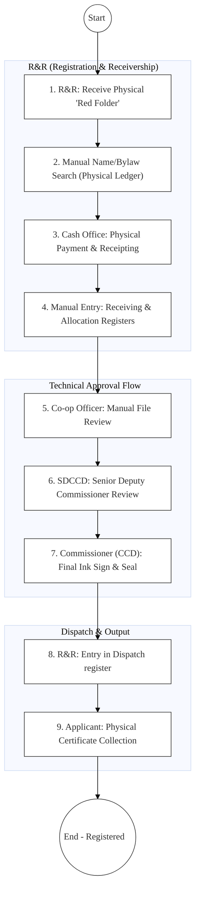
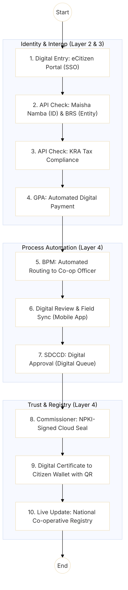

# State Department for Co-operatives – Business Process Architecture (Standardised)

## Cover Page
- **Ministry:** Ministry of Co-operatives and Micro, Small and Medium Enterprises (MSME) Development
- **State Department:** State Department for Co-operatives
- **Primary Authority:** Commissioner for Co-operative Development (CCD)
- **Review Level:** SDCCD (Senior Deputy Commissioner) & R&R (Registration and Receivership)
- **Document Type:** Business Process Architecture (BPA) - Senior Architect Refactored
- **Document Version:** 5.0 (GEA/DPI Aligned)
- **Date:** 2026-03-26
- **Classification:** Official
- **Service Model:** G2B / G2C
- **Reviewer:** Senior Government Enterprise Architect

---

## SECTION 0: SERVICE PRIORITISATION MAPPING
- **Mapped Priority Service:** Co-operative Society Registration & Compliance Lifecycle
- **Tier Classification:** Tier 2
- **Strategic Category:** Economic Formalisation & Financial Inclusion (Co-operative Sector)
- **Lead MDA (Standardised Name):** State Department for Co-operatives
- **Breakout Room Classification:** Room 3 (Policy, Economy & Foundational Systems)

---

## SECTION 0.1: PRIORITISATION JUSTIFICATION
This service is a national priority as the co-operative movement in Kenya manages over KES 1.5 trillion in assets. The current manual lifecycle (handled across R&R and multiple approval layers like SDCCD) creates a 2-6 week bottleneck that delays the formalisation of agricultural and MSME groups. By digitising this lifecycle and linking it to BRS and IPRS via X-Road, the government secures the "Bottom-Up" economic agenda by providing millions of citizens with a trusted, verifiable, and digitally compliant vehicle for wealth creation.

---

# SECTION 1: ENHANCED AS-IS PROCESS (MDA GROUND TRUTH)

The current operational reality for Co-operative Registration and Compliance involves a heavy reliance on physical document handling and manual record-keeping across the **Registration and Receivership (R&R)** unit and the technical approval hierarchy (SDCCD/CCD).

### 1.1 AS-IS Process Description
1.  **Submission (Intake):** The applicant submits a physical application ("Red Folder") at the **R&R (Registration & Receivership)** desk.
2.  **Initial Vetting:** R&R Clerk manually checks and verifies the proposed name and bylaws against physical ledger books.
3.  **Payment:** Applicant is directed to the **Cash Office** to pay the registration fee; a physical receipt is issued and photocopied for the file.
4.  **Logging & Allocation:** R&R Clerk enters the details in the **Manual Receiving Register** and the **Job Allocation Register**.
5.  **Technical Processing:** The file is physically moved to a **Co-operative Officer** who conducts a manual review of the society's objectives and proposed membership.
6.  **Senior Review (SDCCD):** The file is moved to the **Senior Deputy Commissioner for Co-operatives Development (SDCCD)** for detailed vetting and recommendation for approval.
7.  **Final Approval (CCD):** The file reaches the **Commissioner (CCD)** for manual ink signature and the application of the official seal.
8.  **Dispatch:** The approved file is returned to **R&R** where it is entered into the **Dispatch Register**.
9.  **Collection:** The applicant collects the physical certificate in person.

### 1.2 AS-IS Process Visualization

---

# SECTION 2: PAIN POINTS (EVIDENCE-BASED)

| AS-IS Step | Pain Point | Root Cause |
| :--- | :--- | :--- |
| **All Steps** | Extreme latency (21-45 days) | Physical movement of tiles between R&R, SDCCD, and CCD floors/offices. |
| **Manual Vetting** | Risk of name duplication | Reliance on manual names search in handwritten ledger books. |
| **Intake Log** | Data fragmentation | Registry clerks and technical officers maintain separate parallel registers. |
| **SDCCD Review** | High personnel bottleneck | All T2 applications must wait for senior-level physical file availability. |
| **Collection** | High transport cost for citizens | Requirement for physical presence at the central/regional R&R desk. |

---

# SECTION 3: TO-BE PROCESS (GEA & DPI ALIGNED)

The TO-BE design transforms the State Department into a **Digital Co-operative Registry** where the roles of R&R and SDCCD are supported by automated workflows and real-time API integrations.

### 3.1 TO-BE Process Flow

---

# SECTION 4: AS-IS → TO-BE MAPPING

| AS-IS Step | Pain Point | TO-BE Solution | GEA Component |
| :--- | :--- | :--- | :--- |
| **R&R Intake** | Physical reliance | **eCitizen Digital Entry** | Digital Entry Point / SSO |
| **Manual Ledger Search**| Duplication / Fraud | **BRS & IPRS Integration** | Identity & Trust Layer |
| **Cash Office Payment** | Manual reconciliation | **GPA (Payment Aggregator)** | Payment Layer |
| **Physical File Movement**| Approval delays | **Automated Task Routing/SLA** | Workflow / BPM Engine |
| **Ink Sign & Seal** | Verifiability risks | **NPKI Digital Signature & Cloud Seal** | Trust & Certification |
| **Dispatch Register** | Record loss | **National EDRMS Integration** | Data & Records Management |

---

# SECTION 5: KEY CAPABILITIES INTRODUCED

*   **Automation:** Manual R&R allocation registers are replaced by an **Automated Resource Management (ARM) Engine** that routes cases based on officer workload and SLA priority.
*   **Integration:** Bi-directional real-time data exchange with **BRS** and **SASRA** ensures co-operative members are vetted against the national business and financial registers.
*   **Trust:** All certificates are issued as **Verifiable Credentials (VCs)**, sealed by the Commissioner via **National PKI (NPKI)**, making them impossible to forge and instantly verifiable by banks via QR.
*   **Data Governance:** Implements a **National Co-operative Registry** as a Single Source of Truth, replacing regional physical ledger books.

---

# SECTION 6: TRANSFORMATION SUMMARY (AS-IS VS TO-BE)

| Dimension | AS-IS (Manual / R&R Led) | TO-BE (Digital / GEA Aligned) |
| :--- | :--- | :--- |
| **Submission** | Physical "Red Folder" walk-in | eCitizen Portal / Mobile Access |
| **Verification** | Manual ledger/phone verification | X-Road (Huduma Bridge) Real-time API |
| **Approvals** | Sequential desk-to-desk (SDCCD) | Parallel Digital Workflow / SLA-led |
| **Payment** | Cashier / Physical Receipt | Automated GPA Integration (Mobile/Bank) |
| **Storage** | Physical Registry (Ledges) | National EDRMS & Live Digital Registry |
| **Outputs** | Physical Certificate (Hardcopy) | Verifiable Digital Cert (Citizen Wallet) |

---
**[End of GEA-Aligned Business Process Architecture]**
