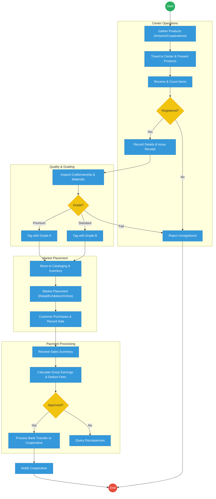
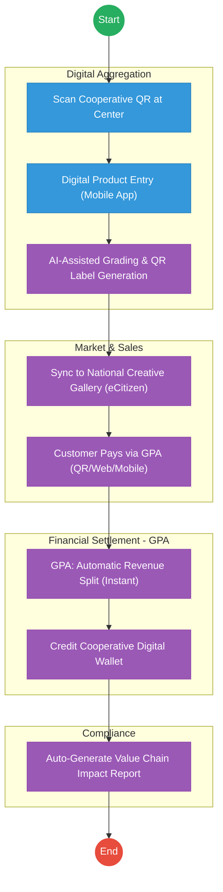

# STATE DEPARTMENT FOR CULTURE, ARTS AND HERITAGE – Service Delivery

## Cover Page
- **Ministry/Department/Agency (MDA):** Ministry of Youth Affairs, Creative Economy and Sports
- **Department:** State Department for Culture, Arts and Heritage
- **Process Name:** Ushanga Kenya (Beadwork Value Chain)
- **Document Version:** 2.1
- **Date:** 2026-02-24
- **Classification:** Official

---

## Executive Summary
The State Department for Culture, Arts and Heritage oversees the Ushanga Kenya initiative, which empowers pastoralist women through the beadwork value chain. The current process involves manual product aggregation, physical quality inspections, and traditional market placement (exhibitions/retail). The transition to the Kenya DSAP Architecture aims to digitize the inventory, provide verifiable product traceability, and automate payments to cooperatives via the government payment aggregator.

---

## 1. AS-IS Process Flowchart (BPMN 2.0)
*Current State visualization (End-to-End Ushanga Kenya based on Deep Dive).*

---

## Process Overview
### Process Name
End-to-End Ushanga Kenya Value Chain (Aggregation to Payment)

### Service Category
- G2B (Government to Business / Cooperative)

### Scope
- **In Scope:** Cooperative registration check, quality grading, inventory logging, sales recording, and final payment processing.
- **Out of Scope:** The creative design process of the artisans.

### Triggers
- Submission of finished beadwork products by a registered cooperative.

### End States
- **Successful:** Products sold; Payment transferred to cooperative; Digital sales record updated.

### Policy Context
- The Culture Policy; Ushanga Kenya Guidelines; Public Finance Management Act.

---

## Detailed Process (AS-IS)
| Step | Role | Action | Tool/System | Notes |
|---|---|---|---|---|
| 1 | Artisans | Cooperatives gather beadwork from members and travel to a central aggregation center. | Physical | |
| 2 | Center Officer | Receives products, counts items, and verifies if the cooperative is registered. | Manual Ledger | |
| 3 | Quality Officer | Examines craftsmanship and materials to assign a Grade (A, B, or Fail). | Manual | |
| 4 | Market Officer | Places products in retail shops, exhibitions, or online portals and records sales manually. | Manual/EDRMS | |
| 5 | Finance Officer | Calculates earnings, deducts management fees, and processes batch transfers via bank. | Manual/Excel | Target: Payment within 14 days. |

---

## Pain Points & Opportunities
### Pain Points
- **Lack of Traceability:** Once products are aggregated, it is difficult to trace a specific sale back to a specific artisan.
- **Manual Inventory:** Paper-based logging at centers leads to stock discrepancies and loss.
- **Delayed Payments:** The 14-day payment target is often missed due to manual reconciliation of sales summaries.

### Opportunities
- **Digital Inventory (QR-Based):** Assigning a unique QR code to every item upon grading to allow for instant tracking and automated sales logging.
- **Unified Payment Aggregator:** Using the **GPA** to receive customer payments and auto-split the funds (Artisan share, Cooperative fee, Government fee) instantly.
- **E-Commerce Integration:** Direct API integration between the center's inventory and a national e-commerce portal via **X-Road**.

---

## 2. TO-BE Process Flowchart (BPMN 2.0)
*Future State visualization (Kenya DSAP Architecture - Huduma Bridge).*

## Future State Process (TO-BE)
### Narrative
**TO-BE Process: Digital Creative Economy (Ushanga)**

**Design Principles:**
- **Product Traceability:** Every beadwork item is assigned a digital identity (QR Code) that links back to the artisan's **Maisha Namba** profile.
- **Real-Time Settlement:** The **Government Payment Aggregator (GPA)** eliminates the 14-day delay. When a customer buys a necklace, the funds are instantly split according to the agreed policy.
- **Global Reach:** By exposing inventory via the **Huduma Bridge APIs**, Ushanga products can be listed on international marketplaces while maintaining a single authoritative source of truth for stock.

### Optimized Steps (Digital)
| Step | Actor | Action | System |
|---|---|---|---|
| 1 | Center Officer | Scans the cooperative's digital ID to start the intake session. | Ushanga App |
| 2 | Quality Officer | Uses an AI-assisted tool to verify grading standards and prints a QR-coded price tag. | Smart Printer / AI |
| 3 | System | Instantly lists the item on the eCitizen Creative Economy portal. | eCitizen / X-Road |
| 4 | Customer | Pays for the item by scanning the QR code at a retail shop or exhibition. | GPA |
| 5 | System | GPA automatically deducts the management fee and transfers the artisan's share to their digital wallet immediately. | GPA / Mobile Money |

---

## References
- The Culture Policy.
- Huduma Bridge DSAP Architecture.