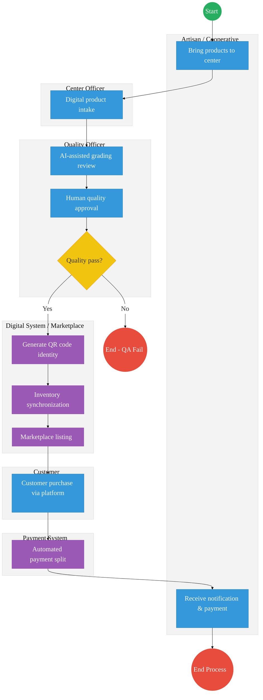

# STATE DEPARTMENT FOR CULTURE, ARTS AND HERITAGE – Service Delivery

## Cover Page
- **Ministry/Department/Agency (MDA):** Ministry of Youth Affairs, Creative Economy and Sports
- **Department:** State Department for Culture, Arts and Heritage
- **Process Name:** Ushanga Kenya (Beadwork Value Chain)
- **Document Version:** 2.1
- **Date:** 2026-03-04
- **Classification:** Official
- **Strategic Category:** Priority MDA
- **Service Model:** G2C
- **Life-Cycle Group:** Cradle to Death (4. Employment & Business)

---

## Executive Summary
The State Department for Culture, Arts and Heritage oversees the Ushanga Kenya initiative, which empowers pastoralist women through the beadwork value chain. The current process involves manual product aggregation, physical quality inspections, and traditional market placement (exhibitions/retail). The transition to the Kenya DSAP Architecture aims to digitize the inventory, provide verifiable product traceability, and automate payments to cooperatives via the government payment aggregator.

---

## 1. AS-IS Process Flowchart (BPMN 2.0)
*Current State visualization (End-to-End Ushanga Kenya based on Deep Dive).*

```mermaid
%%{init: { 'theme': 'base', 'themeVariables': { 'fontSize': '24px', 'fontFamily': 'Inter, system-ui, sans-serif', 'primaryColor': '#ffffff', 'edgeLabelBackground':'#ffffff', 'tertiaryColor': '#f3f3f3', 'mainBkg': '#ffffff', 'nodeBorder': '#333333' } } }%%
flowchart TD
    %% Events
    Start((Start))
    EndProcess(("End Process"))
    EndReject(("End - Rejected"))

    subgraph Artisan["Artisan & Cooperative"]
        direction TB
        Onboard["Cooperative onboarding"]
        Aggregate["Product aggregation"]
    end

    subgraph CenterOps["Center Operations"]
        direction TB
        VerifyReg["Verification of cooperative registration"]
        RegGateway{"Registered cooperative?"}
        Intake["Product intake and counting"]
        QualityGrad["Quality grading"]
        QualGateway{"Product passed quality check?"}
        StoreInv["Inventory storage"]
        CatList["Catalog listing"]
    end

    subgraph MarketSales["Market & Sales"]
        direction TB
        MarketPlac["Market placement"]
        ProdSale["Product sales"]
        SoldGateway{"Product sold?"}
    end

    subgraph Settlement["Finance & Settlement"]
        direction TB
        SalesRec["Sales reconciliation"]
        PaySett["Payment settlement"]
    end

    %% Flow connections
    Start --> Onboard
    Onboard --> Aggregate
    Aggregate --> VerifyReg
    VerifyReg --> RegGateway
    
    RegGateway -- "No" --> EndReject
    RegGateway -- "Yes" --> Intake
    
    Intake --> QualityGrad
    QualityGrad --> QualGateway
    
    QualGateway -- "No" --> EndReject
    QualGateway -- "Yes" --> StoreInv
    
    StoreInv --> CatList
    CatList --> MarketPlac
    MarketPlac --> ProdSale
    ProdSale --> SoldGateway
    
    SoldGateway -- "No" --> MarketPlac
    SoldGateway -- "Yes" --> SalesRec
    
    SalesRec --> PaySett
    PaySett --> EndProcess

    %% Styling
    classDef startEvent fill:#27ae60,stroke:#27ae60,color:#fff,font-size:24px,font-size:24px;;
    classDef endEvent fill:#e74c3c,stroke:#e74c3c,color:#fff,font-size:24px,font-size:24px;;
    classDef userTask fill:#3498db,stroke:#2980b9,color:#fff,font-size:24px,font-size:24px;;
    classDef gateway fill:#f1c40f,stroke:#f39c12,color:#333,font-size:24px,font-size:24px;;
    
    class Start startEvent;
    class EndProcess,EndReject endEvent;
    class RegGateway,QualGateway,SoldGateway gateway;
    class Onboard,Aggregate,VerifyReg,Intake,QualityGrad,StoreInv,CatList,MarketPlac,ProdSale,SalesRec,PaySett userTask;
```

---

## Process Overview
### Process Name
End-to-End Ushanga Kenya Value Chain (Aggregation to Payment)

### Service Category
- G2B (Government to Business / Cooperative)

### Scope
- **In Scope:** Cooperative registration check, quality grading, inventory logging, sales recording, and final payment processing.
- **Out of Scope:** The creative design process of the artisans.

### Triggers
- Submission of finished beadwork products by a registered cooperative.

### End States
- **Successful:** Products sold; Payment transferred to cooperative; Digital sales record updated.

### Policy Context
- The Culture Policy; Ushanga Kenya Guidelines; Public Finance Management Act.

---

## Detailed Process (AS-IS)

| Step | Role | Action | Tool/System | Notes |
|---|---|---|---|---|
| 1 | Artisan / Cooperative Leader | Coordinates the onboarding of the cooperative and aggregation of beadwork from members. Travels to the aggregation center. | Physical | |
| 2 | Center Officer | Receives products, counts items, and verifies if the cooperative is formally registered with Ushanga Kenya. | Manual Ledger | |
| 3 | Quality Officer | Examines craftsmanship and materials to assign a Grade (A, B, or Fail) during the quality grading process. | Manual | |
| 4 | Center Officer | Stores the graded inventory securely and logs items into the local catalog. | Paper Records / Excel | |
| 5 | Market Officer | Manages market cataloging and placement, displaying products in retail shops, exhibitions, or online portals. | Manual/EDRMS | |
| 6 | Market Officer | Facilitates product sales and records transaction details. | Receipt Books | |
| 7 | Finance Officer | Conducts sales reconciliation, calculates gross earnings, and deducts management fees. | Manual/Excel | Target: Payment within 14 days. |
| 8 | Finance Officer | Processes payment settlement via batch bank transfers to the respective cooperatives. | Banking Portal | High delay risk. |

---

## Pain Points & Opportunities
### Pain Points
- **Lack of Traceability:** Once products are aggregated, it is difficult to trace a specific sale back to a specific artisan.
- **Manual Inventory:** Paper-based logging at centers leads to stock discrepancies and loss.
- **Delayed Payments:** The 14-day payment target is often missed due to manual reconciliation of sales summaries.

### Opportunities
- **Digital Inventory Registry:** Assigning a unique QR code to every item upon grading to allow for instant tracking and automated sales logging.
- **Unified Payment Aggregator:** Using the **GPA** to receive customer payments and auto-split the funds (Artisan share, Cooperative fee, Government fee) instantly.
- **Creative Economy Marketplace:** Direct API integration between the center's inventory and a national e-commerce portal via **X-Road**.

---

## 2. TO-BE Process Flowchart (BPMN 2.0)
*Future State visualization (Kenya DSAP Architecture - Digital Value Chain).*

## Future State Process (TO-BE)
### Narrative
**TO-BE Process: Digital Creative Economy (Ushanga)**

The To-Be architecture transforms the manual beadwork value chain into a **digital, traceable ecosystem**.

**Core Digital Components:**
- **Digital Inventory Registry:** Replaces paper logs with a cloud-based stock management system.
- **QR-Based Product Identity:** Gives every single product a unique digital footprint linking it to its creator.
- **Creative Economy Marketplace Platform:** An integrated e-commerce portal exposing inventory to a global audience.
- **Mobile Inventory Scanning:** Empowers center officers to manage intake and dispatch via smartphones.
- **Automated Payment Settlement:** Integrates with the Government Payment Aggregator for instant fund disbursement.

### Optimized Steps (Digital)

| Step | Actor | Action | System |
|---|---|---|---|
| 1 | Center Officer | Performs digital product intake using a mobile inventory scanning app, instantly verifying the cooperative's registration. | Ushanga Mobile App |
| 2 | Quality Officer | Uses an AI-assisted tool to evaluate the product, but provides the final human approval for the quality pass. | Digital QA Portal |
| 3 | System | Generates a unique QR code serving as the product's digital identity and prints the physical label. | Digital Inventory Registry |
| 4 | System | Performs inventory synchronization and automatically pushes the catalog listing to the Creative Economy Marketplace Platform. | Integration Hub / eCitizen |
| 5 | Customer | Browses the marketplace and completes a customer purchase using integrated digital payments. | Marketplace / GPA |
| 6 | Payment System | Executes an automated payment settlement, instantly splitting revenue between the artisan, cooperative, and program management. | GPA / Mobile Money API |
| 7 | System | Sends a real-time notification to the cooperative and artisan regarding the successful sale and payment. | Notification Gateway |

---

## References
- https://www.sportsheritage.go.ke
- Culture Policy
- Desk Review