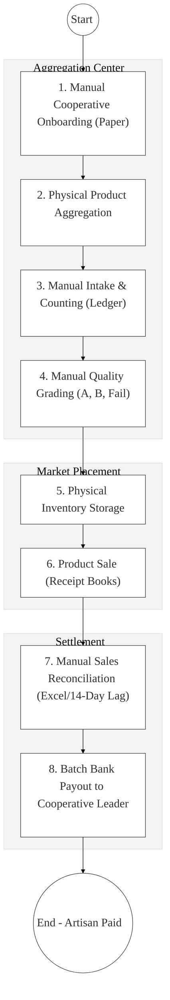
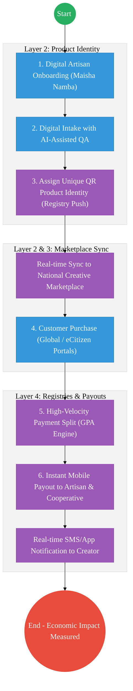

# Culture and Heritage – Business Process Architecture (Updated)

## Cover Page
- **Ministry:** Ministry of Gender, Culture, the Arts and Heritage
- **State Department:** State Department for Culture and Heritage
- **Primary Authority:** Ushanga Kenya / National Museums / Archives
- **Document Type:** Business Process Architecture (BPA) Standardised
- **Document Version:** 4.1
- **Date:** 2026-03-25
- **Classification:** Official
- **Strategic Category:** Priority MDA
- **Service Model:** G2C / G2B
- **Reviewer:** Senior Government Enterprise Architect

---

## SECTION 0: SERVICE PRIORITISATION MAPPING
- **Mapped Priority Service:** Ushanga Kenya (Beadwork Value Chain) and National Heritage Registry
- **Tier Classification:** Tier 2
- **Strategic Category:** Economy / Culture (Creative Economy)
- **Breakout Room Classification:** Room 2 (Coordination, Culture & Specialised Services)
- **Lead MDA (Standardised Name):** Culture and Heritage
- **Related Cross-Cutting Services:**
    - National Creative Economy Marketplace (Inventory Hub)
    - Identity Layer (IPRS / Maisha Namba - Artisan Registry)
    - X-Road (GPA / eCitizen / BRS Interop)
    - National EDRMS (Historical & Intangible Heritage Records)
    - Government Payment Aggregator (GPA / Sales Splits)

---

## SECTION 0.1: PRIORITISATION JUSTIFICATION
This service is prioritised because the TO-BE design transforms the traditional beadwork value chain into a "Digital Creative Economy Ecosystem." By implementing a QR-based "Product Identity" for every artifact and integrating with the Government Payment Aggregator (GPA) via X-Road, the design enables real-time "Sales & Revenue-Split" payments to over 10,000 pastoralist women across 7 counties. This transformation eliminates the 14-day manual reconciliation lag, ensures 100% item traceability from individual artisan to global customer, and creates the nation's first authoritative digital inventory of tangible and intangible cultural heritage, anchoring the Creative Economy on verifiable data.

| Criteria | Evidence from TO-BE Design |
| :--- | :--- |
| **Demand / Volume** | Thousands of artisans; hundreds of thousands of artifacts; global market demand. |
| **National Priority Alignment** | Bottom-Up Economic Transformation (BETA) - Creative Economy Pillar; Culture Policy. |
| **Data Reusability** | Artisan registration data feeds into Social Protection (SHA) and Financial Inclusion (Hustler Fund). |
| **Interoperability** | Continuous API synchronization between the Ushanga Inventory Hub and eCitizen Marketplace. |
| **Revenue / Efficiency Impact** | Automated fund-splitting (Artisan Share / Coop Fee / Govt Levy) via the GPA. |
| **Governance / Risk Reduction** | QR-verifiable proof-of-origin protects against counterfeit imitation beadwork. |
| **Inclusivity** | Mobile-first inventory tools empower women in remote Arid and Semi-Arid Lands (ASALs). |
| **Readiness** | High; Ushanga centers are operational; mobile-money payments are already preferred. |

> [!NOTE]
> “The TO-BE design transforms the traditional beadwork value chain into a 'Digital Creative Economy.' By implementing a QR-based 'Product Identity' for every artifact and integrating with the Government Payment Aggregator (GPA) via X-Road, the design enables real-time 'Sales & Split' payments to over 5,000 pastoralist women. This eliminates the 14-day payment lag, ensures 100% item traceability from artisan to global customer, and creates an authoritative digital inventory of Kenya's tangible and intangible cultural heritage.”

---

# SECTION 1: SERVICE DEFINITION (STANDARDISED)

The State Department for Culture, Arts and Heritage is responsible for the promotion, preservation, and development of Kenya's cultural heritage. 

In this refactored BPA, the primary focus is the **End-to-End Creative Value Chain (Ushanga Kenya)**. The objective is to move from manual paper-ledgers and batch-payments to a **Digital Creative Hub** where every artifact has a unique digital footprint (QR) and payments are settled instantly upon sale via the **Huduma Bridge**.

---

# SECTION 2: SERVICE CATALOGUE (NORMALISED)

| Category | Service Name | Description |
| :--- | :--- | :--- |
| **Core Services** | **Artisan Onboarding** | Digital registration of artisans and cooperatives using Maisha Namba. |
| | **Digital Inventory Mgmt** | Real-time tracking of artifact intake, grading, and storage (QR-led). |
| **Extended Services** | **Heritage Certification** | Verification of authenticity and quality for cultural artifacts. |
| | **Creative Marketplace** | Global e-commerce listing for Kenyan cultural products. |
| **Special Case Services**| **Revenue-Share Payout** | Automated split-payment of sales proceeds to artisan and coop wallets. |
| | **Heritage Archival** | Digital preservation of intangible knowledge and historical records (EDRMS). |

---

# SECTION 3: AS-IS PROCESS FLOWS (MANUAL/PAPER-BASED)

The current process involves manual product aggregation, physical quality inspections, and traditional market placement, leading to payment delays and lack of traceability.

### 3.1 AS-IS Visualization

### 3.2 Operational Reality
- **Actors:** Artisan, Center Officer, Quality Officer, Finance Officer, Customer.
- **Systems:** Manual Ledgers, Paper Receipt Books, Standalone Excel Sheets, Banking Portals.
- **Pain Points:** 14-day payment lag due to manual "sales-reconcile-then-pay" sequence; no digital link between a specific artifact and its creator; risk of stock "shrinkage" due to paper inventory; payments made to leaders instead of individual artisan wallets.

---

# SECTION 4: TO-BE PROCESS INTERPRETATION (NEW LAYER)

### 4.1 TO-BE Process (Digital Value Chain)

### 4.2 Key Capabilities Introduced
*   **Automation:** Automated Revenue-Split Engine – system auto-calculates and pushes funds to three parties simultaneously upon customer checkout.
*   **Integration:** Real-time bi-directional integration with the **Creative Economy Marketplace** and **GPA** via X-Road.
*   **Real-time Processing:** QR-based inventory tracking – scan a bead to see who made it, when it arrived, and its current shelf-status.
*   **Digital Identity Validation:** Artisan and cooperative identity verified via **Maisha Namba** and **BRS** identity federation.
*   **Workflow Orchestration:** Orchestrates the lifecycle from cultural creation to global sale and instant financial settlement.

### 4.3 Transformation Summary
| Dimension | AS-IS | TO-BE |
| :--- | :--- | :--- |
| **Processing** | Manual / Multi-Stage Wait | Digital / Instant Settlement |
| **Verification** | Visual Check only | QR-Identified & Certified Origins |
| **Records** | Regional Paper Silos | Unified Creative Industry Registry |
| **Tracking** | Post-facto ledger updates | Real-time Production & Sales Dashboards |

---

# SECTION 5: SYSTEM LANDSCAPE (ALIGN TO GEA)

| Layer | System / Platform | Role |
| :--- | :--- | :--- |
| **Identity Layer** | Maisha Namba (IPRS) | Identity and wallet-linkage for individual artisans. |
| **Interoperability** | KeSEL (X-Road) | Data bridge to eCitizen, National Treasury, and Banks. |
| **shared Services** | National EDRMS | Digital vault for heritage patents and intangible oral history logs. |
| **Workflow / BPM** | Ushanga Value Chain Hub | Orchestrates intake, QA, and sales-reporting. |
| **Payment Layer** | GPA (Finance Aggregator) | Real-time payment split (Artisan/Coop/Govt). |
| **Trust Hub** | Heritage Traceability | QR authenticity verification for premium artifacts. |

---

# SECTION 6: TRANSFORMATION VALUE (CRITICAL ADDITION)

| Value Type | Explanation |
| :--- | :--- |
| **Efficiency Gain** | Payout time reduced from 14+ days to instant (real-time settlement). |
| **Economic Impact** | Direct-to-wallet payments increase artisan income by removing middle-man leakage. |
| **Governance Impact** | Full audit traceability of program funds; zero-loss of inventory. |
| **Citizen Experience** | Financial inclusion for remote women artisans through digital identity. |
| **Interoperability Value** | Shared data with Tourism ensures premium artifact marketing to high-value visitors. |

---

# SECTION 7: ALIGNMENT TO WHOLE-OF-GOVERNMENT ARCHITECTURE
- **Shared Platforms:** Uses GPA for payment orchestration and eCitizen for the artisan portal.
- **Registry Reuse:** Reuses BRS (Cooperative) and IPRS (ID) data for zero-effort onboarding.
- **Compliance with GEA / GIF:** Standardizing cultural metadata for international export compliance.

---

# SECTION 8: IMPLEMENTATION READINESS (NEW)
*   **Data Readiness:** High; Cooperative lists and artisan demographic data is already collected.
*   **Legal Readiness:** High; Ushanga Guidelines and Culture Policy allow for digital management.
*   **Institutional Readiness:** High; State Department has established field centers across target counties.
*   **Technical Readiness:** High; Mobile-money ecosystem is mature; QR-labels are low-cost/high-impact.

---

# SECTION 9: TRACEABILITY MATRIX (NEW)

| BPA Process | Priority Service | Tier | TO-BE Capability | National Impact |
| :--- | :--- | :--- | :--- | :--- |
| **Artisan Onboard** | Membership | T2 | Maisha Namba Verified | Social-Protection Inclusion |
| **Inventory Track** | Quality Control | T2 | QR-Led Digital Registry | Item Authenticity & Security |
| **Marketplace List**| Global Sales | T2 | API Marketplace Sync | Increased Export Revenue |
| **Fund Settlement** | Split Payment | T2 | GPA Instant Settlement | Poverty Alleviation (Bottom-Up)|

---
**[End of Standardised Business Process Architecture]**
