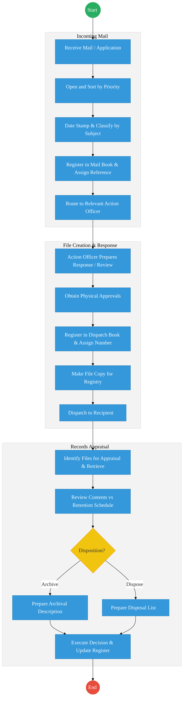
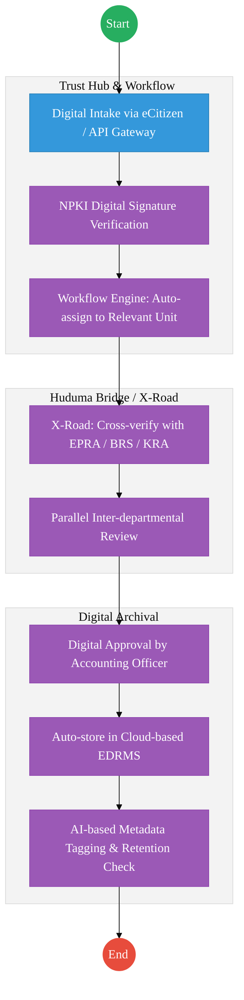

# STATE DEPARTMENT FOR ENERGY – Service Delivery

## Cover Page
- **Ministry/Department/Agency (MDA):** Ministry of Energy and Petroleum
- **Department:** State Department for Energy
- **Process Name:** Records Management & Energy Licensing
- **Document Version:** 2.1
- **Date:** 2026-02-24
- **Classification:** Official
- **Strategic Category:** Priority MDA
- **Service Model:** G2C
- **Life-Cycle Group:** Cradle to Death (4. Employment & Business)

---

## Executive Summary
The State Department for Energy is responsible for the regulation and licensing of energy entities and the management of critical sector records. The current records management process is a hybrid of paper and digital, leading to delays in correspondence and licensing approvals. The transition to the Kenya DSAP Architecture aims to establish a fully digital EDRMS integrated with the national service bus to automate licensing and digitize the archival process.

---

## 1. AS-IS Process Flowchart (BPMN 2.0)
*Current State visualization (End-to-End Records Management based on Deep Dive).*

---

## Process Overview
### Process Name
End-to-End Records Management and Energy Sector Licensing

### Service Category
- G2B (Government to Business) / G2G (Government to Government)

### Scope
- **In Scope:** Incoming/outgoing correspondence tracking, file lifecycle management (creation to archival), and processing of energy permits.
- **Out of Scope:** Physical maintenance of energy grids.

### Triggers
- Receipt of official correspondence or a licensing application from an energy entity.

### End States
- **Successful:** Correspondence acted upon; Licensing decision communicated; Records appraised and archived.

### Policy Context
- The Energy Act 2019; Public Archives and Documentation Service Act; Data Protection Act 2019.

---

## Detailed Process (AS-IS)
| Step | Role | Action | Tool/System | Notes |
|---|---|---|---|---|
| 1 | Registry Clerk | Receives mail, sorts it into priority categories (Urgent/Normal/Confidential), and date-stamps it. | Physical Stamp | |
| 2 | Records Officer | Classifies the document by subject and registers it in a manual mail book. | Manual Ledger | |
| 3 | Action Officer | Reviews the file, prepares a response, and routes it physically for multiple levels of approval. | Physical File | |
| 4 | Dispatch Clerk | Assigns a dispatch number, makes a physical copy for the file, and registers it in the dispatch book. | Manual | |
| 5 | Archivist | Periodically appraises files against the retention schedule to determine if they should be archived or disposed. | Manual | |

---

## Pain Points & Opportunities
### Pain Points
- **Lost Correspondence:** Physical files are difficult to track once they leave the registry.
- **Slow Licensing:** Manual routing of license applications through multiple departments leads to massive delays.
- **Storage Constraints:** Physical archives are reaching capacity, and retrieval of old records is slow.

### Opportunities
- **Full EDRMS Implementation:** Digitizing every incoming document at the point of entry and using digital workflows for approvals.
- **Licensing via Huduma Bridge:** Integrating with **BRS** and **KRA** to automate the vetting of energy companies.
- **Digital Archives:** Using OCR and metadata tagging to make the national energy archive instantly searchable.

---

## 2. TO-BE Process Flowchart (BPMN 2.0)
*Future State visualization (Kenya DSAP Architecture - Huduma Bridge).*

## Future State Process (TO-BE)
### Narrative
**TO-BE Process: Paperless Energy Administration**

**Design Principles:**
- **Digital First:** All incoming documents are scanned and OCR-processed at the registry, or received directly via the **Huduma Bridge APIs**.
- **Automated Retention:** The system automatically tags records with a "Disposition Date" based on the Public Archives Act, removing the need for manual appraisal.
- **Inter-Agency Vetting:** Energy licensing applications are automatically vetted against **BRS** (ownership) and **KRA** (tax) via **X-Road**, reducing approval time from months to days.

### Optimized Steps (Digital)
| Step | Actor | Action | System |
|---|---|---|---|
| 1 | Applicant | Submits an application for an energy permit via the eCitizen business portal. | eCitizen Portal |
| 2 | System | Instantly pings EPRA and BRS to verify the entity's regulatory standing. | KeSEL / X-Road |
| 3 | System | Routes the digitized file to the technical team for concurrent review (parallel workflow). | Workflow Engine |
| 4 | Accounting Officer | Approves the permit using a digital signature (NPKI). | Trust Hub / NPKI |
| 5 | System | Automatically archives the entire application trail in the secure government cloud with AI-generated metadata. | EDRMS / AI |

---

## References
- https://energy.go.ke
- Energy Act 2019
- Desk Review
