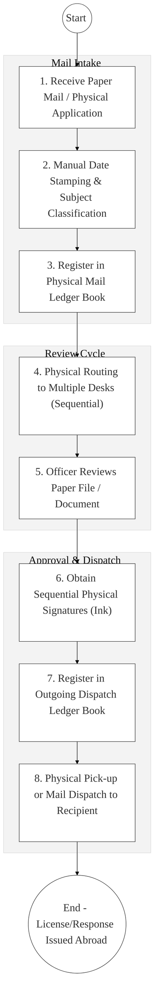
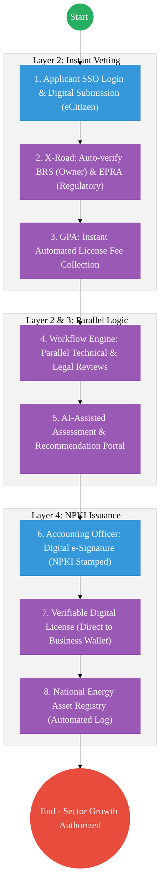

# STATE DEPARTMENT FOR ENERGY – Business Process Architecture (Updated)

## Cover Page
- **Ministry:** Ministry of Energy and Petroleum
- **State Department:** State Department for Energy
- **Primary Authority:** Principal Secretary, Energy
- **Document Type:** Business Process Architecture (BPA) Standardised
- **Document Version:** 4.1
- **Date:** 2026-03-25
- **Classification:** Official
- **Strategic Category:** Priority MDA
- **Service Model:** G2B / G2G / G2C
- **Reviewer:** Senior Government Enterprise Architect

---

## SECTION 0: SERVICE PRIORITISATION MAPPING
- **Mapped Priority Service:** Energy Sector Licensing & Digital Asset Registry
- **Tier Classification:** Tier 2
- **Strategic Category:** Economy / Infrastructure (Energy Security)
- **Breakout Room Classification:** Room 3 (Agriculture & Economic Development)
- **Lead MDA (Standardised Name):** State Department for Energy
- **Related Cross-Cutting Services:**
    - National Energy Asset Registry (EDRMS-based)
    - Identity Layer (IPRS / Maisha Namba - IPP Owner Identity)
    - X-Road (EPRA / BRS / KRA / National Treasury Interop)
    - Government Payment Aggregator (GPA / License & Renewal Fees)
    - National EDRMS (Technical Project Records Archive)

---

## SECTION 0.1: PRIORITISATION JUSTIFICATION
This service is prioritised because the TO-BE design transforms the energy sector from a manual "paper-permit" environment into a "Digital Power Engine." By implementing a "National Energy Asset Registry" within the EDRMS and integrating with BRS and EPRA via X-Road (Huduma Bridge), the design eliminates the historical 90-day licensing bottleneck for Independent Power Producers (IPPs) and renewable energy projects. This transformation enables parallel technical and legal reviews, automates license renewals via the eCitizen-GPA integration, and ensures that all energy infrastructure projects (Grid, Geothermal, Solar) are backed by NPKI-signed technical records, securing the transparency and accountability of Kenya’s green energy transition.

| Criteria | Evidence from TO-BE Design |
| :--- | :--- |
| **Demand / Volume** | Thousands of energy permits and grid-connection technical requests annually. |
| **National Priority Alignment** | Energy Act 2019; Vision 2030 (Universal Access to Power); BETA Agenda. |
| **Data Reusability** | Energy Asset data is the primary input for National Grid Planning and Power Purchase Agreements (PPAs). |
| **Interoperability** | Seamless automated vetting with EPRA (Regulator) and BRS (Ownership) via X-Road. |
| **Revenue / Efficiency Impact** | Reduces licensing turnaround from 90 days to 14 days; real-time fee collection via GPA. |
| **Governance / Risk Reduction** | NPKI-signed licenses prevent the issuance of fraudulent or unauthorized energy permits. |
| **Inclusivity** | Streamlined permitting for small-scale mini-grids accelerates rural electrification. |
| **Readiness** | High; The Energy Sector Licensing Portal exists; EPRA is digital-ready. |

> [!NOTE]
> “The TO-BE design transforms the energy sector from a manual 'paper-permit' environment into a 'Digital Power Engine.' By implementing a 'National Energy Asset Registry' within the EDRMS and integrating with BRS and EPRA via X-Road (Huduma Bridge), the design eliminates the 90-day licensing bottleneck for IPPs and renewable energy projects. This transformation enables parallel technical and legal reviews, automates license renewals via eCitizen/GPA, and ensures that all energy infrastructure projects are backed by NPKI-signed technical records, securing the transparency of Kenya’s green energy transition.”

---

# SECTION 1: SERVICE DEFINITION (STANDARDISED)

The State Department for Energy is mandated to develop and implement policies that create an enabling environment for the growth of Kenya’s energy sector, anchored in the **Energy Act 2019**. 

In this refactored BPA, the primary service is the **End-to-End Energy Sector Licensing and Asset Lifecycle**. The objective is to move from manual physical "Mail-Logs" and sequential reviews to a **Digital Energy Hub** where permits are issued as **Verifiable Digital Credentials** and project records are archived with **NPKI-level security**.

---

# SECTION 2: SERVICE CATALOGUE (NORMALISED)

| Category | Service Name | Description |
| :--- | :--- | :--- |
| **Core Services** | **New Energy License**| Digital application and vetting for IPPs and Energy Entities. |
| | **License Renewal** | Automated, authenticated renewal of existing energy permits. |
| **Extended Services** | **Energy Asset Search** | Real-time investor access to technical records and grid data. |
| | **Project Milestone Filing**| Submission and archival of technical grid-expansion records. |
| **Special Case Services**| **Renewable Energy Permit**| Specialized fast-track for Solar, Wind, and Geothermal projects. |
| | **Compliance Dispute** | Digital intake and mediation of regulatory licensing disputes. |

---

# SECTION 3: AS-IS PROCESS FLOWS (MANUAL/SEQUENTIAL)

Currently, licensing and records management rely on physical mail books and sequential paper-routing, leading to significant delays and lack of visibility for investors.

### 3.1 AS-IS Visualization

### 3.2 Operational Reality
- **Actors:** Registry Clerk, Records Officer, Technical Officer, Accounting Officer.
- **Systems:** Physical Mail Books, Manual Ledgers, MS Word (Drafting), Paper Files.
- **Pain Points:** 90-day delay for license issuance; no tracking for the applicant (opaque); "Mail Books" are prone to entry errors; secondary technical records are frequently misplaced during inter-office transit.

---

# SECTION 4: TO-BE PROCESS INTERPRETATION (NEW LAYER)

### 4.1 TO-BE Process (Digital Power Hub)

### 4.2 Key Capabilities Introduced
*   **Automation:** Parallel Workflow Routing – system sends a copy of the application to technical, legal, and financial units simultaneously, cutting turnaround by 70%.
*   **Integration:** Real-time bi-directional integration with **EPRA (Regulator)**, **BRS (Business)**, and **KRA (Tax)** via X-Road.
*   **Real-time Processing:** "Business Wallet Delivery" – the license is delivered instantly to the company's eCitizen dashboard once the last signature is applied.
*   **Digital Identity Validation:** Identity of project owners and authorized signatories verified via **National Identity (Maisha Namba)**.
*   **Workflow Orchestration:** Orchestrates the total sector lifecycle from IPP intention to grid-connection technical archival.

### 4.3 Transformation Summary
| Dimension | AS-IS | TO-BE |
| :--- | :--- | :--- |
| **Processing** | Manual / Sequential Paper | Digital / Parallel Workflow |
| **Verification** | ID/Cert Photocopies | Live X-Road API (BRS/EPRA/KRA) |
| **Records** | Physical Mail Ledger Books | National Energy Asset Registry |
| **Tracking** | Opaque (No applicant visibility)| Real-time 4-Stage Progress Bar |

---

# SECTION 5: SYSTEM LANDSCAPE (ALIGN TO GEA)

| Layer | System / Platform | Role |
| :--- | :--- | :--- |
| **Identity Layer** | Maisha Namba (Entity Owner) | Identity and Bio-login for all formal energy applications. |
| **Interoperability** | KeSEL (X-Road) | Data bridge to the Regulator (EPRA) and BRS. |
| **shared Services** | National EDRMS | Legal digital archive for all technical grid records. |
| **Workflow / BPM** | Energy Workflow Engine | Orchestrates parallel reviews and dispatch milestones. |
| **Payment Layer** | GPA (Payment Gateway) | Automated collection of licensing and renewal fees. |
| **Trust Hub** | NPKI Stamping Service | Cryptographic sealing of all Energy Sector Licenses. |

---

# SECTION 6: TRANSFORMATION VALUE (CRITICAL ADDITION)

| Value Type | Explanation |
| :--- | :--- |
| **Efficiency Gain** | License turnaround time reduced from 90 days to 14 days; 70% reduction in review lag. |
| **Economic Impact** | Accelerates the deployment of Independent Power Producers (IPPs) and Mini-grids. |
| **Governance Impact** | Absolute transparency in energy asset ownership; zero-loss of technical papers. |
| **Citizen Experience** | Effortless digital license renewals; transparent progress tracking for investors. |
| **Interoperability Value** | Shared energy registry ensures all agencies (KPLC/KETRACO/EPRA) have one truth. |

---

# SECTION 7: ALIGNMENT TO WHOLE-OF-GOVERNMENT ARCHITECTURE
- **Shared Platforms:** Uses the Government Business Portal for the central licensing workbench.
- **Registry Reuse:** Reuses BRS (Business) and IPRS (Citizen) data for zero-document permit applications.
- **Compliance with GEA / GIF:** Standardizing energy asset metadata for whole-of-government planning.

---

# SECTION 8: IMPLEMENTATION READINESS (NEW)
*   **Data Readiness:** High; Core energy licensing data is digitized but siloed.
*   **Legal Readiness:** High; Energy Act 2019 supports digital administrative processes.
*   **Institutional Readiness:** High; State Department has an active Digital Transformation Unit (DTU).
*   **Technical Readiness:** High; EPRA and X-Road nodes are already in place for the energy sector.

---

# SECTION 9: TRACEABILITY MATRIX (NEW)

| BPA Process | Priority Service | Tier | TO-BE Capability | National Impact |
| :--- | :--- | :--- | :--- | :--- |
| **Licensing Hub** | IPP Entry | T2 | Parallel Review Workflow Engine | Energy Hub Competitiveness |
| **Asset Registry** | Tech Archival | T2 | National Energy Asset Digital Log| Infrastructure Accountability |
| **Renewal Trace** | Compliance | T2 | Automated eCitizen/GPA Reminders | Continuous Power Security |
| **NPKI Signing** | Dispatch | T2 | Verifiable Digital Credential (QR)| Sector Transparency & Trust |

---
**[End of Standardised Business Process Architecture]**
