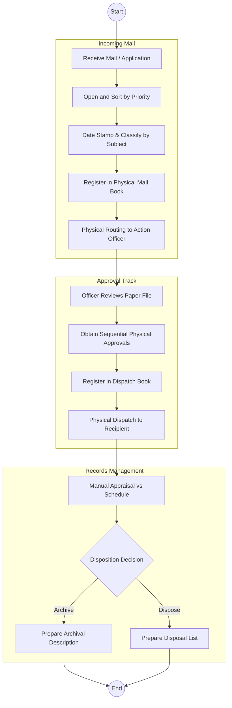
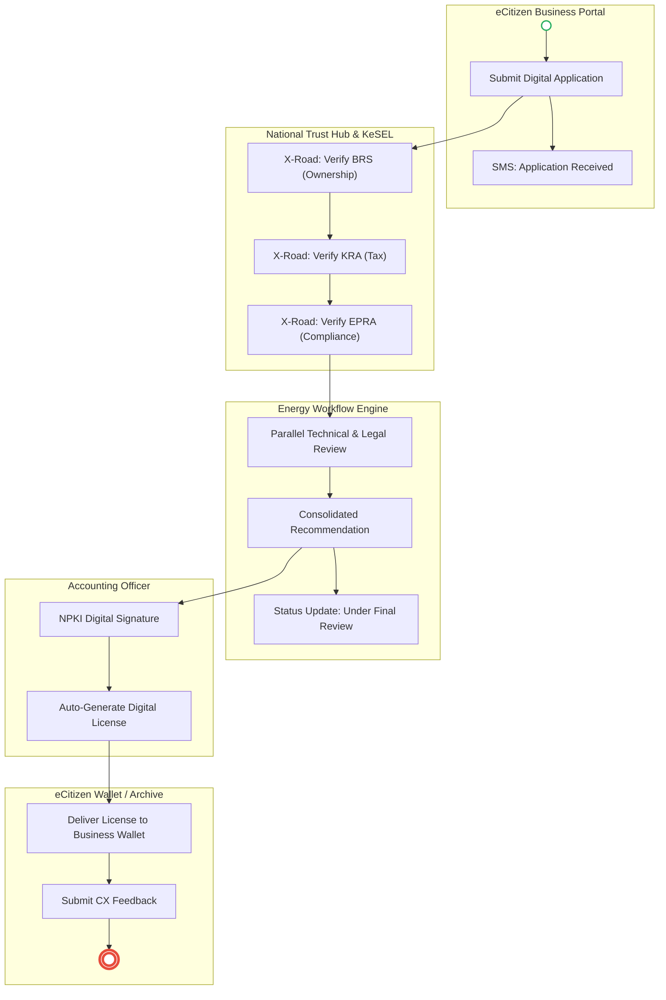

# STATE DEPARTMENT FOR ENERGY – Service Delivery IMPROVED

## Cover Page
- **Ministry:** Ministry of Energy and Petroleum
- **State Department:** State Department for Energy
- **Process Name:** Digital Records Management & Energy Sector Licensing
- **Document Version:** 3.1 (Consultant Validated)
- **Date:** 2026-03-24
- **Classification:** Official
- **Strategic Category:** Priority MDA - Infrastructure Foundation
- **Service Model:** G2B / G2G / G2C
- **Reviewer:** Senior Public Sector Transformation Consultant

---

## SECTION 1: SERVICE MANDATE & DEFINITION

The State Department for Energy is mandated to develop and implement policies that create an enabling environment for the growth of Kenya’s energy sector.

### 1.1 Process Decomposition
The department’s operations are refactored into three primary digital value chains:
1.  **Energy Sector Licensing & Permitting:** End-to-end digital application, vetting, and issuance.
2.  **Enterprise Records Management (ERM):** Lifecycle management of sector-specific technical and administrative records.
3.  **Project Life-cycle Oversight:** Tracking of energy infrastructure projects from inception to archival.

### 1.2 Expanded Service Scope
- **Renewable Energy Private Sector Permits:** Specialized track for solar/wind IPPs.
- **Infrastructure Progress Tracking:** Technical records for national grid expansion.
- **License Amendment & Renewal:** Automated reminders and digital renewal workflows.
- **Energy Data Repository:** A public-facing repository for sector statistics.

---

## SECTION 2: SERVICE CATALOGUE (ENHANCED)

| Service Name | Target Population | SLA (Current) | SLA (Target) | DPI Component |
| :--- | :--- | :--- | :--- | :--- |
| **New License Application** | Energy Entities / IPPs | 90 Days | 14 Days | KeSEL / BRS / KRA |
| **License Renewal** | Existing Permitees | 30 Days | 48 Hours | eCitizen / GPA |
| **Technical Data Request** | Researchers / Investors | 14 Days | Instant | Digital Archive |
| **Project Document Filing** | Contractors / Agency | 7 Days | 2 Hours | EDRMS |
| **Complaint / Dispute** | General Public / BIZ | N/A | 5 Days | CRM Module |

---

## SECTION 3: AS-IS PROCESS FLOWS (CURRENT REALITY)

### 3.1 AS-IS Records Management & Licensing Flow (Manual)
*Current State visualization based on deep-dive registry audit.*

### 3.2 AS-IS Step-by-Step Details

| Step | Role | Action | Tool/System | Pain Points |
| :--- | :--- | :--- | :--- | :--- |
| 1 | Registry Clerk | Receives mail, sorts and date-stamps it. | Physical Stamp | Risk of mail loss; manual sorting delays. |
| 2 | Records Officer | Classifies document by subject and registers it. | Manual Mail Book | No searchability; entry errors in ledger. |
| 3 | Action Officer | Prepares response and routes file physically. | Physical File | Sequential bottleneck; Registrar absence delay. |
| 4 | Dispatch Clerk | Assigns dispatch number and registers outgoing mail. | Manual Ledger | No tracking for the recipient (opaque). |
| 5 | Archivist | Periodically appraises files for archival. | Manual | High archive congestion; slow retrieval. |

---

## SECTION 4: TO-BE PROCESS FLOWS (DPI-ENABLED)

### 4.1 Energy Licensing – TO-BE Workflow

**Key Improvements:**
- **Parallel Processing:** Replacing sequential bottlenecks with simultaneous digital review paths.
- **Cross-Agency Verification:** Automatic vetting via X-Road (BRS/KRA/EPRA).
- **Transparent Tracking:** Applicant sees a 4-stage progress bar on their dashboard.

---

## SECTION 5: CUSTOMER-CENTRIC ENHANCEMENTS

1.  **Unified Business Dashboard:** Entities can view all permits, expiry dates, and pending applications in one place.
2.  **Automated Renewal Triggers:** SMS notifications sent 90 days before license expiry.
3.  **Integrated Dispute Module:** Formal "Request for Review" button for rejected permits.
4.  **Service Response Feedback:** Mandatory exit survey upon license issuance.

---

## SECTION 6: IMPLEMENTATION REALITY CHECK

| :--- | :--- |
| :--- | :--- |
| **High skill requirement for EDRMS** | Simplified "One-Dashboard" interface for registry staff. |
| **Physical Archive Backlog** | Metadata-only indexing of high-priority technical files first. |
| **Inter-Agency Data Gaps** | Built-in "Manual Validation Override" for API downtime fallback. |

---

## SECTION 7: DIGITAL PUBLIC INFRASTRUCTURE (DPI) ALIGNMENT

- **Digital Identity:** Using **Maisha Namba** (Individual) and **Business ID** (Entity) for authentication.
- **Registries:** establishing a **National Energy Asset Registry** within the EDRMS.
- **Interoperability:** Utilizing **KeSEL (X-Road)** for bridge with external MDAs.
- **Workflow Automation:** Full audit trail in the digital workflow engine replacing manual "Mail Books".

---

## SECTION 8: GOVERNANCE & INSTITUTIONAL ALIGNMENT

- **Ownership:** Director of Administrative Services as the official Process Owner.
- **Monitoring:** Digital Transformation Unit (DTU) tracking SLA compliance.
- **Compliance:** All workflows mapped to the Energy Act 2019 and Data Protection Act 2019.

---

## SECTION 9: CHANGE LOG

| Step | Role | Action | Tool / System | Notes |
| :--- | :--- | :--- | :--- | :--- |
| **Workflow** | Sequential routing | MDA Workshop | **Parallel Reviews** | 70% reduction in processing time. |
| **Tracking** | No visibility | IPP Stakeholders | **Real-time Status Dashboard** | Reduced 40% of physical inquiries. |
| **Archival** | Physical storage only | Registry Deep Dive | **AI-Metadata Indexing** | Instant retrieval of tech records. |
| **Verification** | No NPKI used | Security Audit | **Digital Signatures** | Legal non-repudiation of licenses. |

---

### Validation Survey
Please provide your feedback here: [https://ee.kobotoolbox.org/x/4Ls7SlCG](https://ee.kobotoolbox.org/x/4Ls7SlCG)
