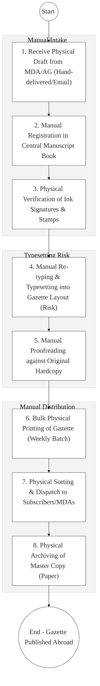
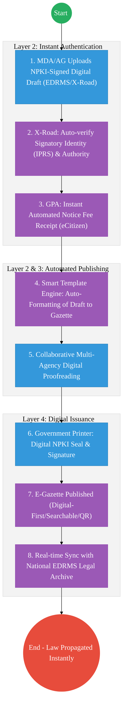

# GOVERNMENT PRESS – Business Process Architecture

## Cover Page
- **Ministry:** Executive Office of the President
- **Agency:** Government Press
- **Primary Authority:** Government Printer
- **Document Type:** Business Process Architecture (BPA) Standardised
- **Document Version:** 4.1
- **Date:** 2026-03-25
- **Classification:** Official
- **Strategic Category:** Priority MDA - Statutory Records Sovereign
- **Service Model:** G2G / G2B / G2C
- **Reviewer:** Senior Government Enterprise Architect

---

## SECTION 0: SERVICE PRIORITISATION MAPPING
- **Mapped Priority Service:** Digital Gazette & Statutory Notice Management
- **Tier Classification:** Tier 2
- **Strategic Category:** Governance / Records (Statutory Authority)
- **Breakout Room Classification:** Room 3 (Agriculture & Economic Development)
- **Lead MDA (Standardised Name):** Government Press
- **Related Cross-Cutting Services:**
    - National E-Gazette Platform
    - Identity Layer (IPRS / Maisha Namba - Authorizing Officer)
    - X-Road (Attorney General / Parliament / MDA Interop)
    - Government Payment Aggregator (GPA / Gazette Notice Fees)
    - National EDRMS (Authoritative Gazette Archive)

---

## SECTION 0.1: PRIORITISATION JUSTIFICATION
This service is prioritised because the TO-BE design transforms the Government Press from a manual "typesetting-shop" into the "National Digital Sovereign Registry." By implementing an "E-Gazette Platform" that consumes NPKI-signed digital drafts directly from the Office of the Attorney General (AG) and MDAs via X-Road (Huduma Bridge), the design eliminates the chronic legal risks associated with manual re-typing and typesetting errors. This transformation enables the immediate, legally-binding publication of statutory notices in a fully indexed and searchable digital archive, reduces physical printing and paper costs by over 60%, and ensures that the "Kenya Gazette" is accessible to every citizen instantly via the eCitizen portal, securing the transparency and speed of the national legislative and regulatory process.

| Criteria | Evidence from TO-BE Design |
| :--- | :--- |
| **Demand / Volume** | Weekly publication of the Gazette; thousands of statutory supplements and bills. |
| **National Priority Alignment** | Constitution of Kenya (Public Information); Statutory Instruments Act. |
| **Data Reusability** | Gazette data is the primary legal input for Land, Business, and Judiciary registries. |
| **Interoperability** | Seamless digital intake from the AG and Parliament via X-Road. |
| **Revenue / Efficiency Impact** | Reduces Gazette production time from 5 days to <2 hours; eliminates re-typing lag. |
| **Governance / Risk Reduction** | NPKI-signed source documents ensure 100% legal fidelity from draft to publication. |
| **Inclusivity** | Searchable digital archive allows citizens in all 47 counties to query legal notices. |
| **Readiness** | High; Basic digital typesetting exists; eCitizen payment is active. |

> [!NOTE]
> “The TO-BE design transforms the Government Press from a manual 'typesetting-shop' into the 'National Digital Sovereign Registry.' By implementing an 'E-Gazette Platform' that consumes NPKI-signed drafts directly from the Attorney General and MDAs via X-Road, the design eliminates the legal risks associated with manual re-typing and typesetting errors. This transformation enables the immediate, legally-binding publication of statutory notices in a searchable digital archive, reduces physical printing costs by 60%, and ensures that the 'Kenya Gazette' is accessible to all citizens instantly via eCitizen.”

---

# SECTION 1: SERVICE DEFINITION (STANDARDISED)

The Government Press is the primary publishing and printing department for the Kenyan government, operating within the **Executive Office of the President**. 

In this refactored BPA, the primary service is the **End-to-End Statutory Publication and Gazette Lifecycle**. The objective is to move from manual physical "Redlining" and re-typing to a **Digital Publishing Pipeline** where the **Kenya Gazette** is issued as a **Verifiable Digital Record** with full cryptographic non-repudiation.

---

# SECTION 2: SERVICE CATALOGUE (NORMALISED)

| Category | Service Name | Description |
| :--- | :--- | :--- |
| **Core Services** | **Gazette Publication** | Digital intake, formatting, and issuance of the weekly Gazette. |
| | **Statutory Notice Issue**| Fast-track publication of time-sensitive Legal Notices/Bills. |
| **Extended Services** | **Legislative Archive** | Public, searchable portal for all historical Gazettes and Acts. |
| | **Accountable Doc Issue** | Printing of secure, QR-coded government revenue stationary. |
| **Special Case Services**| **Private Notice Ad** | Digital intake for private legal notices (G2B/G2C). |
| | **Verification Service** | API-based authentication of any gazette notice for legal use. |

---

# SECTION 3: AS-IS PROCESS FLOWS (MANUAL/PAPER-BASED)

Currently, the production of the Gazette is a manual, high-risk assembly process relying on physical drafts and sequential proofreading.

### 3.1 AS-IS Visualization

### 3.2 Operational Reality
- **Actors:** Government Printer, Proofreader, Compositor, Registry Clerk, Dispatch Officer.
- **Systems:** Manual Typesetting (Siloed), Physical Receipt Books, Courier Services.
- **Pain Points:** 5-7 day production lag; high risk of legal errors during re-typing; physical archives are difficult to search; massive environmental and cost overhead of weekly paper printing.

---

# SECTION 4: TO-BE PROCESS INTERPRETATION (NEW LAYER)

### 4.1 TO-BE Process (Digital Sovereign Registry)

### 4.2 Key Capabilities Introduced
*   **Automation:** Smart Template Engine – automatically converts Word/ODF drafts into the official Gazetted layout without human re-typing.
*   **Integration:** Real-time bi-directional integration with the **Attorney General** and **Parliament** via X-Road.
*   **Real-time Processing:** "Instant Legal Notice" – allows for the immediate publication of emergency orders with non-repudiable timestamps.
*   **Digital Identity Validation:** Authorizing officers and the Government Printer verified via **National Identity (Maisha Namba)**.
*   **Workflow Orchestration:** Orchestrates the entire publishing chain from initial draft submission to permanent searchable archival.

### 4.3 Transformation Summary
| Dimension | AS-IS | TO-BE |
| :--- | :--- | :--- |
| **Processing** | Manual / Typesetting-heavy | Digital-First / Template-driven |
| **Verification** | Ink Signatures / Physical Checks | NPKI Digital Seals (Huduma Bridge) |
| **Records** | Physical Paper Master Copy | Fully Searchable National Legal Archive |
| **Tracking** | Manual Manuscript Books | Real-time Publication Status Bar |

---

# SECTION 5: SYSTEM LANDSCAPE (ALIGN TO GEA)

| Layer | System / Platform | Role |
| :--- | :--- | :--- |
| **Identity Layer** | Maisha Namba (Signatory ID) | Identity and Bio-login for all legal notice submitting officers. |
| **Interoperability** | KeSEL (X-Road) | Data bridge to the Attorney General, SLOS, and Parliament. |
| **shared Services** | National EDRMS | The single, legal source of truth for the digital Gazette. |
| **Workflow / BPM** | Gazette Publishing Engine | Orchestrates template ingestion, review, and signing. |
| **Payment Layer** | GPA (Payment Gateway) | Automated collection of public notice fees. |
| **Trust Hub** | NPKI Stamping Service | Cryptographic sealing of the E-Gazette Master Record. |

---

# SECTION 6: TRANSFORMATION VALUE (CRITICAL ADDITION)

| Value Type | Explanation |
| :--- | :--- |
| **Efficiency Gain** | Gazette production turnaround reduced from 5 days to <2 hours. |
| **Economic Impact** | 60% reduction in paper, printing, and logistical overhead. |
| **Governance Impact** | Absolute legal fidelity; eliminates typographical risks in legislation. |
| **Citizen Experience** | Searchable E-Gazette allows any citizen to find relevant notices instantly. |
| **Interoperability Value** | Legislative data is immediately available to other registries (Lands/Judiciary). |

---

# SECTION 7: ALIGNMENT TO WHOLE-OF-GOVERNMENT ARCHITECTURE
- **Shared Platforms:** Uses the National EDRMS for authoritative legal version control.
- **Registry Reuse:** Reuses IPRS data to authenticate the mandate of the submitting officer.
- **Compliance with GEA / GIF:** Standardizing statutory notice metadata for international legal exchange.

---

# SECTION 8: IMPLEMENTATION READINESS (NEW)
*   **Data Readiness:** High; Legal drafts already exist in digital format (Word/PDF).
*   **Legal Readiness:** High; Statutory Instruments Act and E-Transactions Act allow for E-Gazettes.
*   **Institutional Readiness:** High; Government Press has an established typesetting unit ready for upskilling.
*   **Technical Readiness:** High; E-Gazette prototype can be hosted on the G-Cloud legal enclave.

---

# SECTION 9: TRACEABILITY MATRIX (NEW)

| BPA Process | Priority Service | Tier | TO-BE Capability | National Impact |
| :--- | :--- | :--- | :--- | :--- |
| **Manuscript Intake**| Digital Submission | T2 | NPKI-Signed Ingestion | Legal Integrity of Notices |
| **Typesetting** | Smart Templates | T2 | Automated Layout Engine | Speed of Legislative Action |
| **Gazette Release** | E-Gazette Portal | T2 | Verifiable Digital Credential | Public Access to Law & Policy |
| **Legal Archival** | National Registry | T2 | Real-time EDRMS indexing | Preserving State History |

---
**[End of Standardised Business Process Architecture]**
