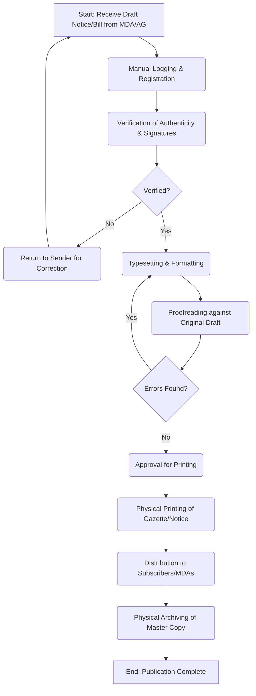

# Government Press - Service Delivery

## Service Mandate
**Official Website:** [governmentpress.ecitizen.go.ke](https://governmentpress.ecitizen.go.ke)

The Government Press is the primary publishing and printing department for the Kenyan government, operating under the Executive Office of the President. Its mandate is to serve as the centralized facility for creating, authenticating, disseminating, and archiving official government information to ensure transparency and accountability.

**Key Functions:**
- **Publishing the Kenya Gazette:** Responsible for the weekly publication of official notices, legislative updates, and legal appointments.
- **Printing Official Documents:** Producing Acts of Parliament, Bills, Legal Notices, Subsidiary Legislations, and Government Reports.
- **Revenue & Accountable Documents:** Printing secure, accountable documents used for government revenue collection (e.g., receipt books, permits).
- **Document Authentication:** Ensuring the authenticity of official publications through specialized printing and official sealing.
- **Cataloging & Archiving:** Maintaining a comprehensive catalog of government publications and preserving historical records for archival purposes.
- **Public Services via eCitizen:** Facilitating legal notices, advertisements, and sales of publications digitally.

## MDA Overview
The **Government Press** is a Medium–Large Strategic Records Infrastructure institution. It is responsible for publishing the Kenya Gazette, laws, statutory instruments, government notices, and official publications. It serves as the centralized national facility for the legally authoritative dissemination and archiving of public information.

## Identified Business Process: Statutory Notice and Gazette Production

### 1. AS-IS Process Flowchart (BPMN 2.0)

### 2. Process Description

1.  **Receipt & Registration:** Draft statutory notices, bills, or supplements are received from the Office of the Attorney General, Parliament, or respective MDAs, typically as hard copies or secure emails. They are manually logged in a central registry.
2.  **Verification:** The Government Press verifies the authenticity of the documents, checking for proper authorization and wet signatures.
3.  **Typesetting:** The verified documents are manually re-typed or formatted to meet the strict layout and typographical standards of the Kenya Gazette.
4.  **Proofreading:** The formatted version is meticulously proofread against the original submission to ensure legal accuracy.
5.  **Printing & Distribution:** Approved proofs are sent to the printing presses. Physical copies are dispatched to government offices, subscribers, and sold to the public.
6.  **Archiving:** A master physical copy is stored in the archives.

### 3. Pain Points & Bottlenecks

- **Manual Data Entry:** Re-typing and manual typesetting introduce high risks of typographical errors which can alter legal meanings.
- **Physical Verification Delays:** Relying on physical signatures and hardcopy drafts slows down the publication timeline significantly.
- **Limited Public Accessibility:** Physical distribution limits access. Finding historical gazette notices is difficult without a robust, searchable digital archive.
- **Resource Intensive:** Printing massive volumes of physical copies is costly and environmentally taxing.

### 4. Opportunities for Digital Transformation (TO-BE)

- **E-Gazette Platform:** Transitioning to a fully electronic, legally binding E-Gazette as the primary source of truth, reducing reliance on physical printing.
- **Digital Publishing Workflows:** Implementing a secure portal where MDAs and the AG's office can submit cryptographically signed, pre-formatted digital drafts.
- **Automated Formatting:** Using standardized templates and ingestion tools to automatically format submissions into the Gazette layout without manual typesetting.
- **Searchable Digital Archive:** Digitizing historical records and implementing a powerful indexing and search engine for public and legal reference.

---

### Validation Survey
Please provide your feedback here: [https://ee.kobotoolbox.org/x/4Ls7SlCG](https://ee.kobotoolbox.org/x/4Ls7SlCG)

