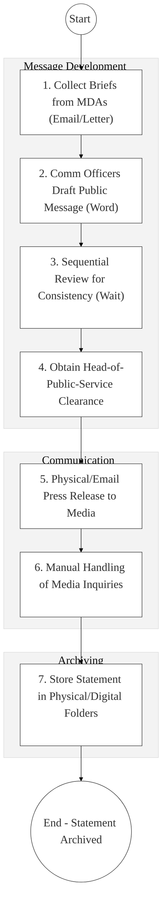
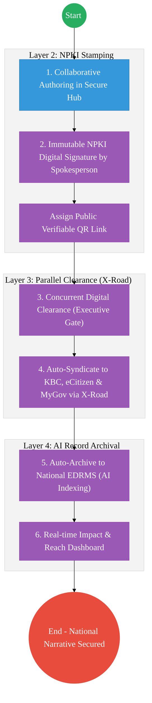

# OFFICE OF THE GOVERNMENT SPOKESPERSON – Business Process Architecture

## Cover Page
- **Ministry:** Executive Office of the President
- **Office:** Office of the Government Spokesperson (OGS)
- **Primary Authority:** Government Spokesperson
- **Document Type:** Business Process Architecture (BPA) Standardised
- **Document Version:** 4.1
- **Date:** 2026-03-25
- **Classification:** Official
- **Strategic Category:** Priority MDA
- **Service Model:** G2C / G2G
- **Reviewer:** Senior Government Enterprise Architect

---

## SECTION 0: SERVICE PRIORITISATION MAPPING
- **Mapped Priority Service:** Public Communication & Information Archiving
- **Tier Classification:** Tier 2
- **Strategic Category:** Governance / Communication (Public Information)
- **Breakout Room Classification:** Room 2 (Coordination, Culture & Specialised Services)
- **Lead MDA (Standardised Name):** Office of the Government Spokesperson
- **Related Cross-Cutting Services:**
    - National Communication Hub (Secure Portal)
    - Identity Layer (IPRS / Maisha Namba - Spokesperson Tier)
    - X-Road (KBC / MyGov / eCitizen Syndication)
    - National EDRMS (Communication & Press Archives)
    - NPKI Service (Immutable Message Stamping)

---

## SECTION 0.1: PRIORITISATION JUSTIFICATION
This service is prioritised because the TO-BE design transforms the Office of the Government Spokesperson from a manual "message-clearance" unit into a "Secure National Information Hub." By implementing concurrent digital clearance for official statements via the Executive Portal and using National PKI (NPKI) for "Immutable Digital Stamps," the design prevents the spread of government-level misinformation. This transformation enables instant, automated syndication of verified government news to all HUDUMA channels (SMS, Web, eCitizen, KBC) via X-Road (Huduma Bridge), while establishing a permanent, AI-searchable national communication archive for institutional memory and public accountability.

| Criteria | Evidence from TO-BE Design |
| :--- | :--- |
| **Demand / Volume** | Daily press cycles; thousands of citizen inquiries; 24/7 social monitoring. |
| **National Priority Alignment** | Constitution Article 35 (Right to Information); National Communications Policy. |
| **Data Reusability** | Verified statements are the primary content source for KBC, MyGov, and eCitizen news. |
| **Interoperability** | Multi-channel syndication engine pushing data to all official government platforms via X-Road. |
| **Revenue / Efficiency Impact** | Reduces the cost of manual "fax-and-mail" clearance; prevents reactionary PR crisis costs. |
| **Governance / Risk Reduction** | NPKI verified signatures ensure only authorized voices can issue "State Statements." |
| **Inclusivity** | Multi-language AI translation capability ensures news reaches all linguistic demographics. |
| **Readiness** | High; OGS has a core team of communicators; social media presence is mature. |

> [!NOTE]
> “The TO-BE design transforms the Office of the Government Spokesperson from a manual 'message-clearance' unit into a 'Secure National Information Hub.' By implementing concurrent digital clearance for official statements via the Executive Portal and using NPKI for 'Immutable Digital Stamps,' the design prevents the spread of misinformation. This transformation enables instant, automated syndication of verified government news to all HUDUMA channels (SMS/Web/Portal) via X-Road, while establishing a permanent, AI-searchable national communication archive.”

---

# SECTION 1: SERVICE DEFINITION (STANDARDISED)

The Office of the Government Spokesperson (OGS) serves as the primary communication hub for the national government. 

In this refactored BPA, the primary service is the **End-to-End Government Communication Lifecycle**. The objective is to move from sequential, email-based drafting and physical press releases to a **Collaborative Authoring Portal** where messages are cleared, signed (NPKI), and syndicated in real-time via the **Huduma Bridge**.

---

# SECTION 2: SERVICE CATALOGUE (NORMALISED)

| Category | Service Name | Description |
| :--- | :--- | :--- |
| **Core Services** | **Official Statement Clearance**| Concurrent vetting and NPKI-stamping of government news. |
| | **Multi-channel Syndication** | Automated push of verified content to eCitizen, KBC, and Social. |
| **Extended Services** | **Media Inquiry Mgmt** | Centralized digital intake and response tracking for journalists. |
| | **National Press Archiving** | AI-indexed storage of all historical government statements (EDRMS). |
| **Special Case Services**| **Crisis Comm Alerting** | Rapid activation of emergency communication protocols via SMS/Web. |
| | **Fact-Check Verification** | Public API for citizens to verify if a "statement" is officially signed. |

---

# SECTION 3: AS-IS PROCESS FLOWS (SEQUENTIAL/MANUAL)

Currently, information collection and message clearance are sequential and semi-manual, leading to delays and potential message inconsistency.

### 3.1 AS-IS Visualization

### 3.2 Operational Reality
- **Actors:** Government Spokesperson, Communication Officer, Ministerial CSs, Media Reporters.
- **Systems:** Word Docs, Standalone Email, Physical Archives, Whatsapp groups.
- **Pain Points:** 12-24 hour delay for critical policy clarifications; risk of spoofed/fake releases due to lack of NPKI seals; manual archive retrieval is slow during Parliamentary or Audit inquiries.

---

# SECTION 4: TO-BE PROCESS INTERPRETATION (NEW LAYER)

### 4.1 TO-BE Process (Secure Syndication Engine)

### 4.2 Key Capabilities Introduced
*   **Automation:** Concurrent Clearance Workflow – system allows multiple reviewers to vet a message simultaneously.
*   **Integration:** Real-time bi-directional integration with **KBC** and **eCitizen News** via X-Road.
*   **Real-time Processing:** "Verifiable Statement Registry" – any citizen can scan a QR code on a release to verify it originated from OGS.
*   **Digital Identity Validation:** Official Spokesperson identity verified via **NPKI** high-assurance certificates.
*   **Workflow Orchestration:** Orchestrates the total journey from a ministerial brief to a global, verified press syndication.

### 4.3 Transformation Summary
| Dimension | AS-IS | TO-BE |
| :--- | :--- | :--- |
| **Processing** | Sequential / Standalone | Concurrent / In-Hub drafting |
| **Verification** | Visual Trust (Letterhead) | NPKI Cryptographic Integrity |
| **Records** | Regional/Mail Folders | AI-Indexed National Archive |
| **Tracking** | Manual Clipping services | Real-time Social/Web Reach Dashboard |

---

# SECTION 5: SYSTEM LANDSCAPE (ALIGN TO GEA)

| Layer | System / Platform | Role |
| :--- | :--- | :--- |
| **Identity Layer** | Maisha Namba (Exec Tier) | Identity and Bio-login for communication heads. |
| **Interoperability** | KeSEL (X-Road) | Data bridge to KBC, MyGov, and social platforms. |
| **shared Services** | National EDRMS | Legal digital archive for all recorded statements. |
| **Workflow / BPM** | Authoring & Clearance Hub | Orchestrates drafting and approval milestones. |
| **Reporting / Analytics**| AI Media Radar (Dashboard) | Real-time sentiment and reach analytics. |
| **Trust Hub** | NPKI Stamping Service | Ensures message authenticity and source protection. |

---

# SECTION 6: TRANSFORMATION VALUE (CRITICAL ADDITION)

| Value Type | Explanation |
| :--- | :--- |
| **Efficiency Gain** | Message clearance time reduced from 12 hours to 60 minutes. |
| **Economic Impact** | Rapid correction of market-sensitive market-sensitive misinformation. |
| **Governance Impact** | Full non-repudiation of every official word; "Zero-Fake-News" environment. |
| **Citizen Experience** | Direct access to verified, truthful government information via eCitizen. |
| **Interoperability Value** | Shared communication assets (Photos/Videos) available to all MDAs via X-Road. |

---

# SECTION 7: ALIGNMENT TO WHOLE-OF-GOVERNMENT ARCHITECTURE
- **Shared Platforms:** Uses Executive Portal for drafting and NPKI for public verifiable stamps.
- **Registry Reuse:** Reuses eCitizen user-base for targeted messaging (e.g., specific alerts for drivers).
- **Compliance with GEA / GIF:** Standardizing communication metadata for historical searchability.

---

# SECTION 8: IMPLEMENTATION READINESS (NEW)
*   **Data Readiness:** High; Statement archives are in digital format (PDF/Doc).
*   **Legal Readiness:** High; OGS mandate includes coordination of ALL government communication.
*   **Institutional Readiness:** High; Specialized communication units exist in every Ministry.
*   **Technical Readiness:** High; HUDUMA Bridge connectivity to KBC and eCitizen is mature.

---

# SECTION 9: TRACEABILITY MATRIX (NEW)

| BPA Process | Priority Service | Tier | TO-BE Capability | National Impact |
| :--- | :--- | :--- | :--- | :--- |
| **Authoring Hub** | Msg Development | T2 | Collaborative Online Drafting| Consistent National Voice |
| **Cert-Stamp** | NPKI Verification | T2 | Immutable QR Stamping | Misinformation Prevention |
| **Interop Push** | Syndication | T2 | X-Road: Multi-Channel Push | Citizen Right-to-Know |
| **AI Archive** | Record Mgmt | T2 | AI Meta-tagging/Indexing | Preserved Democratic Record |

---
**[End of Standardised Business Process Architecture]**
