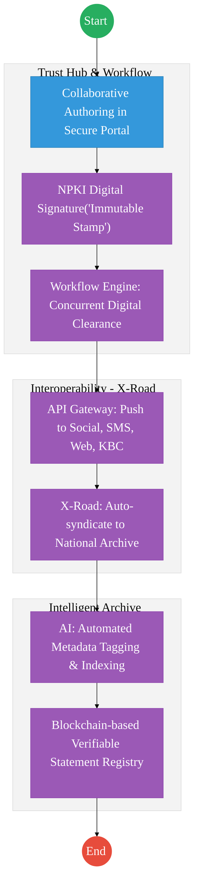

# OFFICE OF THE GOVERNMENT SPOKESPERSON – Service Delivery

## Cover Page
- **Ministry/Department/Agency (MDA):** Executive Office of the President
- **Office:** Office of the Government Spokesperson
- **Process Name:** Public Communication & Information Archiving
- **Document Version:** 2.2
- **Date:** 2026-02-25
- **Classification:** Official
- **Strategic Category:** Priority MDA
- **Service Model:** G2G
- **Life-Cycle Group:** Cradle to Death (5. Social Protection & Justice)

---

## Service Mandate
The Office of the Government Spokesperson (OGS) serves as the primary communication hub for the national government of Kenya. Its core mandate is to ensure coherence, alignment, and consistency in how government priorities, policies, and programs are communicated to the public.

**Official Website:** [www.communication.go.ke](http://www.communication.go.ke)

**Key Functions:**
- **Official Communication:** Issuing official government statements and clarifying policy matters on behalf of the Republic of Kenya.
- **Coordination:** Planning and managing the communication of government policies and initiatives across all Ministries, Departments, and Agencies (MDAs).
- **Oversight:** Providing technical oversight for several key information bodies, including the Directorates of Information, Public Communication, Film Services, Kenya News Agency (KNA), and the Government Advertising Agency (GAA).
- **Public Engagement:** Leveraging modern communication tools alongside traditional channels (radio, barazas) to bridge the gap between the government and citizens.
- **Feedback Mechanism:** Acting as a conduit for citizen feedback to reach policymakers.

---

## Executive Summary
The Office of the Government Spokesperson manages official government communication, public messaging, and media coordination. Currently, information collection and message clearance are sequential and semi-manual. The transition to the Kenya DSAP Architecture aims to establish a secure, multi-channel dissemination portal with automated AI archiving and blockchain-based verifiable statements.

---

## 1. AS-IS Process Flowchart (BPMN 2.0)
*Current State visualization (Manual Government Communication).*

```mermaid
%%{init: { 'theme': 'base', 'themeVariables': { 'fontSize': '24px', 'fontFamily': 'Inter, system-ui, sans-serif', 'primaryColor': '#ffffff', 'edgeLabelBackground':'#ffffff', 'tertiaryColor': '#f3f3f3', 'mainBkg': '#ffffff', 'nodeBorder': '#333333' } } }%%
graph TD
    Start((Start)) --> Collection["Collect Info: MDAs submit Briefs/Announcements"]
    
    subgraph Development["Message Creation"]
        Collection --> Draft["Communication Officers Draft Public Messages"]
        Draft --> Review["Review for Accuracy and Consistency"]
        Review --> Clearance["Obtain Clearance from Authorized Offices"]
        Clearance --> Approval["Final Message Approval"]
    end
    
    subgraph Dissemination [Communication]
        Approval --> Media["Disseminate via Press Briefings / Release / Channels"]
        Media --> Inquiries["Handle Media Inquiries Manually"]
        Inquiries --> Coordinate["Coordinate Internal Responses"]
    end
    
    subgraph Archiving [Records]
        Coordinate --> Compile["Compile Final Statements & Materials"]
        Compile --> Save["Store in Physical Files / Digital Folders"]
        Save --> Retrieval["Manual Retrieval on Request"]
    end
    
    Retrieval --> End((End))

    classDef start fill:#27ae60,stroke:#27ae60,color:#fff,font-size:24px,font-size:24px;;
    classDef endNode fill:#e74c3c,stroke:#e74c3c,color:#fff,font-size:24px,font-size:24px;;
    classDef userTask fill:#3498db,stroke:#2980b9,color:#fff,font-size:24px,font-size:24px;;
    class Start start;
    class End endNode;
    class Collection,Draft,Review,Clearance,Approval,Media,Inquiries,Coordinate,Compile,Save,Retrieval userTask;
```

---

## Process Overview
### Process Name
End-to-End Government Communication (Collection to Archiving)

### Service Category
- G2C (Government to Citizen) / G2B (Media)

### Scope
- **In Scope:** Message development, clearance, dissemination, and archiving.
- **Out of Scope:** Political campaigning.

### Triggers
- Government announcements, policies, or events requiring public dissemination.

### End States
- **Successful:** Information communicated; Records archived.

---

## 2. TO-BE Process Flowchart (BPMN 2.0)
*Future State visualization (Kenya DSAP Architecture - Huduma Bridge).*

## Future State Process (TO-BE)
### Narrative
The To-Be process uses a **Secure Shared Service Portal** for collaborative drafting. **NPKI** ensures that every statement has an immutable digital stamp, preventing misinformation. **X-Road** enables instant syndication to all official government nodes (eCitizen, KBC, MyGov), while **AI** ensures that every word is instantly archived and searchable for future reference.

---

## References
- https://www.spokesperson.go.ke
- Communications Act
- Desk Review

---

### Validation Survey
Please provide your feedback here: [https://ee.kobotoolbox.org/x/4Ls7SlCG](https://ee.kobotoolbox.org/x/4Ls7SlCG)

