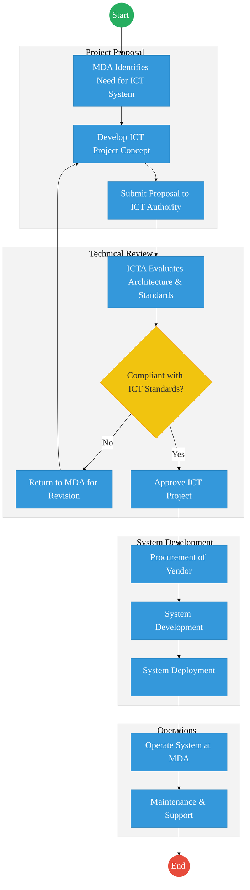
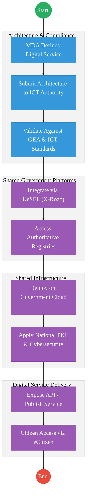

# ICT AUTHORITY – Service Delivery

## Cover Page
- **Ministry/Department/Agency (MDA):** Ministry of Information, Communications and the Digital Economy
- **Department:** ICT Authority (ICTA)
- **Process Name:** Government ICT Project Implementation and Digital Infrastructure Management
- **Document Version:** 2.1
- **Date:** 2026-03-04
- **Classification:** Official
- **Strategic Category:** Priority MDA
- **Service Model:** G2G
- **Life-Cycle Group:** Cradle to Death (5. Social Protection & Justice)

---

## Executive Summary
The ICT Authority (ICTA) is the principal implementing agency responsible for coordinating, implementing, and standardizing ICT initiatives across the Government of Kenya.

Operating under the State Department for ICT and the Digital Economy, ICTA ensures that government ICT investments align with the Government Enterprise Architecture (GEA), national digital standards, and cybersecurity frameworks.

ICTA provides centralized capabilities including:
- ICT project oversight and technical approvals
- Government digital infrastructure implementation
- Interoperability and shared platforms
- Government cloud and data center management
- Digital standards and architecture enforcement

Currently, ICT projects are often implemented at the MDA level with varying degrees of coordination, resulting in fragmented systems and duplication of infrastructure.

The future state introduces a platform-based government architecture where ICTA operates shared national digital infrastructure including:
- Government Cloud
- KeSEL / X-Road Interoperability Layer
- National PKI
- Digital identity integrations
- Shared digital services platforms

This transition enables whole-of-government interoperability, improved security, and efficient digital service delivery.

---

## 1. AS-IS Process Flowchart (BPMN 2.0)
*Current State visualization of ICT project approval and implementation.*

---

## Process Overview
### Process Name
Government ICT Project Governance and Implementation

### Service Category
- G2G (Government to Government)

### Scope
- **In Scope:** Review and approval of government ICT projects; Enforcement of Government Enterprise Architecture (GEA); Implementation of national digital infrastructure; ICT standards development and compliance; Coordination of ICT programs across MDAs.
- **Out of Scope:** Sector-specific service delivery systems operated by MDAs.

### Triggers
- A ministry, department, or agency proposes a new ICT system or digital platform.

### End States
- **Successful:** ICT system approved and deployed; System complies with national ICT standards; Government digital infrastructure expanded.

### Policy Context
- ICT Authority Act (2013); Kenya Digital Economy Blueprint; Government Enterprise Architecture (GEA) Framework; Data Protection Act (2019); National Cybersecurity Strategy.

---

## Detailed Process (AS-IS)

| Step | Role | Action | Tool/System | Notes |
|---|---|---|---|---|
| 1 | MDA | Identifies need for ICT system | Internal | |
| 2 | MDA | Develops project concept and submits to ICT Authority | Project Proposal | |
| 3 | ICT Authority | Reviews architecture and compliance with standards | GEA Framework | |
| 4 | ICT Authority | Approves or rejects project | ICTA Governance | |
| 5 | MDA / Vendor | Procures vendor and develops system | Vendor Systems | |
| 6 | MDA | Deploys and operates system | Local Infrastructure | |

---

## Pain Points & Opportunities
### Pain Points
- **Fragmented Digital Systems:** Multiple government systems operate independently without integration.
- **Duplicated Infrastructure:** Different agencies procure similar ICT infrastructure.
- **Limited Interoperability:** Data exchange between MDAs is often manual or through batch exports.
- **Procurement Complexity:** Long procurement cycles slow the deployment of digital services.

### Opportunities
- **Shared Government Platforms:** Centralized infrastructure including government cloud and national interoperability platforms.
- **Secure Interoperability:** Adoption of KeSEL / X-Road for secure data exchange.
- **Digital Trust Infrastructure:** Integration with National PKI and digital identity frameworks.
- **Platform-Based Service Delivery:** Reusable government services such as payments, notifications, identity verification, and registries.

---

## 2. TO-BE Process Flowchart (BPMN 2.0)
*Future State visualization (Shared Digital Infrastructure & Platform Government).*

---

## Future State Process (TO-BE)
### Narrative
**TO-BE Process: Platform-Based Government ICT Implementation**

ICT Authority transitions from merely reviewing ICT projects to operating shared digital government platforms.

**Design Principles:**
- **Architecture First:** All ICT initiatives must align with Government Enterprise Architecture (GEA) before implementation.
- **Shared Platforms:** Instead of each agency building separate systems, MDAs use shared government platforms and APIs.
- **Interoperability by Default:** Systems exchange data through KeSEL (X-Road) ensuring standardized integration.
- **Cloud-First Government:** All government digital services are deployed on Government Cloud Infrastructure.
- **Secure Digital Trust:** Systems utilize National PKI, identity verification services, and cybersecurity frameworks.

### Optimized Steps (Digital)

| Step | Actor | Action | System |
|---|---|---|---|
| 1 | MDA | Designs digital service aligned with GEA | Architecture Portal |
| 2 | ICT Authority | Reviews architecture and integration | GEA Compliance System |
| 3 | System | Integrates with national registries via interoperability layer | KeSEL Bridge |
| 4 | Government Cloud | Hosts digital service platform | National Data Center |
| 5 | Citizen/Business | Accesses service through digital government portals | eCitizen Platform |

---

## References
- ICT Authority Act (2013)
- Kenya Digital Economy Blueprint
- Government Enterprise Architecture Framework
- Data Protection Act (2019)
- National Cybersecurity Strategy

<<<<<<< HEAD

---

### Validation Survey
Please provide your feedback here: [https://ee.kobotoolbox.org/x/4Ls7SlCG](https://ee.kobotoolbox.org/x/4Ls7SlCG)

=======
---

## Feedback
We value your input on this blueprint. Please take a moment to provide your feedback using the link below:

[Provide Feedback](https://ee.kobotoolbox.org/x/4Ls7SlCG)
>>>>>>> fa7c468774fe7aa62241faa0890b6d9a0f43c246
