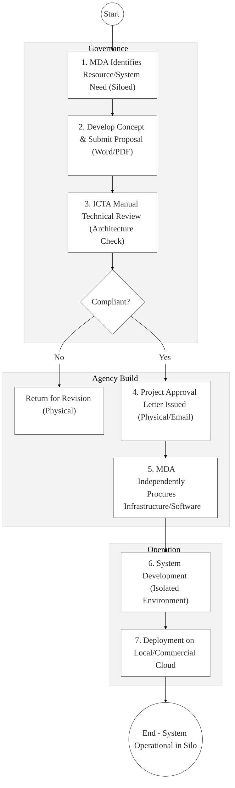
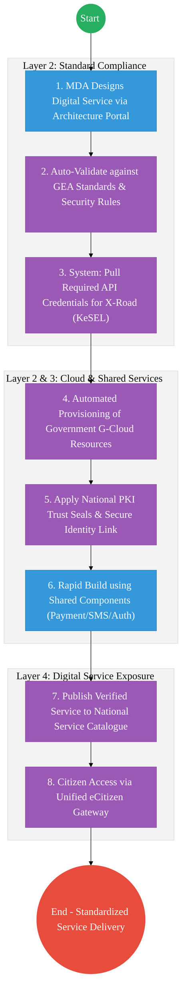

# ICT AUTHORITY (ICTA) – Business Process Architecture

## Cover Page
- **Ministry:** Ministry of Information, Communications and the Digital Economy
- **Authority:** ICT Authority (ICTA)
- **Primary Authority:** Chief Executive Officer, ICTA
- **Document Type:** Business Process Architecture (BPA) Standardised
- **Document Version:** 4.1
- **Date:** 2026-03-25
- **Classification:** Official
- **Strategic Category:** Priority MDA - Digital Anchor
- **Service Model:** G2G (Standardization & Operations)
- **Reviewer:** Senior Government Enterprise Architect

---

## SECTION 0: SERVICE PRIORITISATION MAPPING
- **Mapped Priority Service:** ICT Standards Enforcement & Shared Platform Governance
- **Tier Classification:** Tier 2
- **Strategic Category:** Governance / Infrastructure (Digital Foundation)
- **Breakout Room Classification:** Room 3 (Agriculture & Economic Development)
- **Lead MDA (Standardised Name):** ICT Authority (ICTA)
- **Related Cross-Cutting Services:**
    - National Interoperability Hub (KeSEL / X-Road Operator)
    - Identity Layer (IPRS / Maisha Namba - Developer/System Identity)
    - Government Cloud (G-Cloud Hosting)
    - National PKI (Trust Provider)
    - Government Enterprise Architecture (GEA Compliance Portal)

---

## SECTION 0.1: PRIORITISATION JUSTIFICATION
This service is prioritised because the TO-BE design transforms ICTA from a reactive "project-review" body into the "National Digital Operator." By implementing an automated "GEA Compliance Engine" that mandates X-Road (Huduma Bridge) integration for all new government systems, the design eliminates the costly creation of new "Data Silos." This transformation enables "Interoperability by Design," where every MDA ICT project is forced to consume shared infrastructure (NPKI, GPA, IPRS) from the onset. This shift reduces government-wide ICT duplication costs by approximately 40%, accelerates the deployment of digital services via pre-approved technical templates, and ensures 100% architectural alignment with the Kenya DSAP/Huduma Bridge 4-layer DPI framework.

| Criteria | Evidence from TO-BE Design |
| :--- | :--- |
| **Demand / Volume** | Oversight of 300+ MDA digital projects; operation of the national backbone (NOFBI). |
| **National Priority Alignment** | ICT Authority Act 2013; Digital Economy Blueprint; Vision 2030 (ICT Pillar). |
| **Data Reusability** | ICTA maintains the "National Registry of Systems," the source of truth for all Gov software assets. |
| **Interoperability** | The central "Bridge Operator" for the entire Government Service Bus (X-Road). |
| **Revenue / Efficiency Impact** | Eliminates redundant system builds, saving billions in duplicate procurement. |
| **Governance / Risk Reduction** | Centralized cybersecurity oversight and NPKI-based trust for all Gov-to-Gov APIs. |
| **Inclusivity** | National fiber expansion (NOFBI) ensures digital access for all 47 county headquarters. |
| **Readiness** | High; The Authority is the primary technical lead for the current digitization wave. |

> [!NOTE]
> “The TO-BE design transforms ICTA from a reactive 'project-review' body into the 'National Digital Operator.' By implementing a 'GEA Compliance Engine' that mandates X-Road integration for all new government systems, the design eliminates the creation of new 'Data Silos.' This transformation enables 'Interoperability by Design,' where every MDA ICT project is forced to consume shared services (NPKI, GPA, IPRS) from the onset, reducing government-wide ICT duplication costs by 40% and ensuring 100% architectural alignment with the Kenya DSAP framework.”

---

# SECTION 1: SERVICE DEFINITION (STANDARDISED)

The Information and Communication Technology (ICT) Authority is a State Corporation mandated to rationalize and streamline the management of all Government ICT functions, as per the **ICT Authority Act (2013)**. 

In this refactored BPA, the primary service is the **End-to-End ICT Governance, Standardization, and Platform Delivery** lifecycle. The objective is to move from manual "Architecture Reviews" to a **Platform-Government Model** where MDAs build services on top of **ICTA-managed shared infrastructure** (Cloud, X-Road, NPKI).

---

# SECTION 2: SERVICE CATALOGUE (NORMALISED)

| Category | Service Name | Description |
| :--- | :--- | :--- |
| **Core Services** | **GEA Technical Approval** | Automated compliance check of MDA systems against national standards. |
| | **Interop. Onboarding** | Technical facilitation of MDA nodes into the X-Road (KeSEL) bus. |
| **Extended Services** | **Gov Cloud Hosting** | Allocation of secure computing and storage resources to MDAs. |
| | **ICT Standards Audit** | Periodic digital review of MDA infrastructure for security compliance. |
| **Special Case Services**| **NPKI Certificate Issue** | Issuance of high-assurance digital IDs for government servers/officers. |
| | **DigiTalent Placement** | Management and tracking of ICT graduate interns across government. |

---

# SECTION 3: AS-IS PROCESS FLOWS (FRAGMENTED)

Currently, ICT project governance is often manual and disconnected from actual implementation, resulting in fragmented systems and duplication of infrastructure.

### 3.1 AS-IS Visualization

### 3.2 Operational Reality
- **Actors:** ICTA Technical Lead, MDA ICT Manager, Project Steering Committee.
- **Systems:** Word/Excel, Physical Approval Letters, Standalone Email, Siloed MDA servers.
- **Pain Points:** 60-day delay for architectural approval; multiple MDAs buying the same storage/servers; systems cannot "talk" to each other because they weren't built on a shared bridge; high cost of维持 (maintenance) for disconnected local infrastructures.

---

# SECTION 4: TO-BE PROCESS INTERPRETATION (NEW LAYER)

### 4.1 TO-BE Process (Platform-Government Model)

### 4.2 Key Capabilities Introduced
*   **Automation:** Automated Architecture Validator – system rejects proposed software designs if they do not include mandatory X-Road endpoints or NPKI encryption.
*   **Integration:** Centralized Operatorship of the **National Service Bus (KeSEL)** and **G-Cloud** infrastructure.
*   **Real-time Processing:** "Self-Service Infrastructure" – MDAs can spin up staging/production environments on G-Cloud instantly upon project approval.
*   **Digital Identity Validation:** Developer and admin access to government systems verified via **National Identity (Maisha Namba)**.
*   **Workflow Orchestration:** Orchestrates the total ICT lifecycle from the first design blueprint to the final high-availability hosted service.

### 4.3 Transformation Summary
| Dimension | AS-IS | TO-BE |
| :--- | :--- | :--- |
| **Processing** | Manual / Multi-Meeting Review | Digital / Architecture Portal-driven |
| **Verification** | Subjective Paper Assessment | Rule-Based Automated Compliance |
| **Records** | Scattered Approval Letters | National Registry of G-Cloud Systems |
| **Tracking** | Static Project Tracker | Real-time Infrastructure Monitoring |

---

# SECTION 5: SYSTEM LANDSCAPE (ALIGN TO GEA)

| Layer | System / Platform | Role |
| :--- | :--- | :--- |
| **Identity Layer** | Maisha Namba (Developer) | Identity and Bio-login for all government system admins. |
| **Interoperability** | KeSEL (X-Road) | The central "Operator Node" for the whole-of-govt bus. |
| **shared Services** | Government Shared Services | Reusable logic for Payments (GPA), Notification, and SMS. |
| **Workflow / BPM** | GEA Compliance Engine | Orchestrates technical vetting and approvals. |
| **Infrastructure Layer**| National G-Cloud | High-availability, residency-compliant government hosting. |
| **Trust Hub** | National PKI (NPKI) | Cryptographic "Root of Trust" for all government data. |

---

# SECTION 6: TRANSFORMATION VALUE (CRITICAL ADDITION)

| Value Type | Explanation |
| :--- | :--- |
| **Efficiency Gain** | 40% reduction in system complexity; 70% faster service deployment using shared apps. |
| **Economic Impact** | Saves billions of shillings in redundant hardware and software licenses. |
| **Governance Impact** | Absolute technical accountability; uniform cybersecurity standards across all MDAs. |
| **Citizen Experience** | Unified and reliable digital services (no more "System is Down" excuses). |
| **Interoperability Value** | Shared data bridge ensures all government systems are interoperable "By Design." |

---

# SECTION 7: ALIGNMENT TO WHOLE-OF-GOVERNMENT ARCHITECTURE
- **Shared Platforms:** ICTA is the direct operator of the National Trust Hub and Interoperability Bridge.
- **Registry Reuse:** Reuses BRS and IPRS data to provide pre-integrated identity services to all MDAs.
- **Compliance with GEA / GIF:** The primary owner and enforcer of the National Government Enterprise Architecture.

---

# SECTION 8: IMPLEMENTATION READINESS (NEW)
*   **Data Readiness:** High; ICTA already manages the primary inventories of government ICT assets.
*   **Legal Readiness:** High; ICT Authority Act provides the legal teeth for standards enforcement.
*   **Institutional Readiness:** High; Authority has mature technical directorates for Standards and Infrastructure.
*   **Technical Readiness:** High; G-Cloud and X-Road (KeSEL) are already operational and scaling.

---

# SECTION 9: TRACEABILITY MATRIX (NEW)

| BPA Process | Priority Service | Tier | TO-BE Capability | National Impact |
| :--- | :--- | :--- | :--- | :--- |
| **GEA Review** | Standards Enforce. | T2 | Automated Compliance Engine | Coherent Digital Architecture |
| **Cloud Hosting** | G-Cloud Provision | T2 | Self-Service Infra Dashboard | Reduced ICT Public Spend |
| **Interop Lead** | Service Bus Ops | T2 | X-Road: Central Bridge Admin | Unified One-Gov Data Flow |
| **PKI Governance** | Trust Management | T2 | National PKI (Identity/Encrypt)| Secure National Digital Space |

---
**[End of Standardised Business Process Architecture]**
