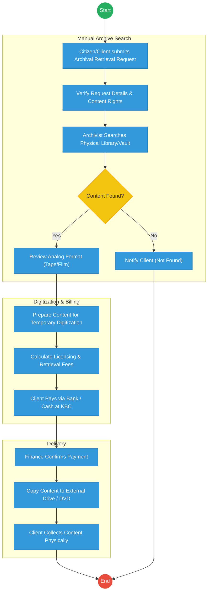
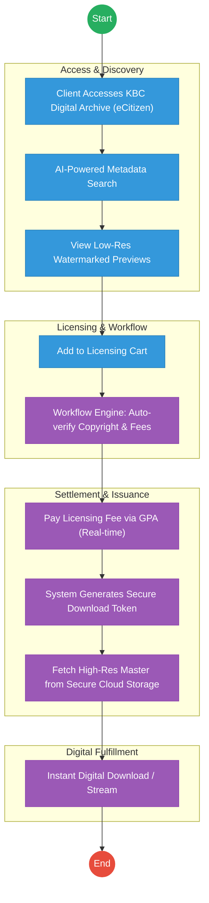

# KENYA BROADCASTING CORPORATION (KBC) – Service Delivery

## Cover Page
- **Ministry/Department/Agency (MDA):** Ministry of Information, Communications and the Digital Economy
- **Authority:** Kenya Broadcasting Corporation (KBC)
- **Process Name:** Archival Access and Content Licensing
- **Document Version:** 2.1
- **Date:** 2026-02-24
- **Classification:** Official

---

## Executive Summary
The Kenya Broadcasting Corporation (KBC) is the state broadcaster, holding over 33 million archival records (audio, video, and print) dating back to the colonial era. These archives are a national treasure but are currently largely physical or stored on deteriorating analog formats. The transition to the Kenya DSAP Architecture aims to digitize these archives and establish a digital "Content Licensing Portal" integrated with the government payment aggregator for public and commercial access.

---

## 1. AS-IS Process Flowchart (BPMN 2.0)
*Current State visualization (Archival Retrieval and Licensing).*

---

## Process Overview
### Process Name
End-to-End Archival Retrieval, Digitization, and Content Licensing

### Service Category
- G2C (Citizens) / G2B (Media Houses/Researchers)

### Scope
- **In Scope:** Search requests for historical footage/audio, copyright verification, fee assessment, and delivery of digital copies.
- **Out of Scope:** Live broadcasting operations.

### Triggers
- A request from a media house, researcher, or citizen for specific historical content.

### End States
- **Successful:** Digital content delivered; Licensing fee collected; Copyright terms accepted.

### Policy Context
- KBC Act; Public Archives and Documentation Service Act; Copyright Act.

---

## Detailed Process (AS-IS)
| Step | Role | Action | Tool/System | Notes |
|---|---|---|---|---|
| 1 | Client | Submits a manual request for a specific historical event or footage. | Paper/Email | |
| 2 | Librarian | Physically searches through thousands of tapes/reels in the KBC vaults. | Index Cards | High risk of missing content. |
| 3 | Archivist | Verifies the copyright status of the content (KBC-owned vs. shared). | Manual Registry | |
| 4 | Finance Officer | Manually calculates the digitization and licensing fee. | Excel | |
| 5 | Client | Pays via bank deposit and brings the slip to the KBC registry for verification. | Manual | Major delay. |

---

## Pain Points & Opportunities
### Pain Points
- **Format Deterioration:** Analog tapes (U-matic, Betacam) are degrading, leading to permanent loss of history.
- **Access Barriers:** Citizens must physically travel to KBC Nairobi to search or collect content.
- **Payment Friction:** Lack of mobile payment options for small archival requests (e.g., student researchers).

### Opportunities
- **National Content Lake:** Digitizing all 33M archives and storing them in a secure government cloud.
- **Public Content Portal:** Allowing citizens to browse low-resolution previews on eCitizen and pay for high-resolution downloads.
- **GPA Integration:** Enabling instant M-Pesa payments for "Clip Licensing" via the **Government Payment Aggregator**.

---

## 2. TO-BE Process Flowchart (BPMN 2.0)
*Future State visualization (Kenya DSAP Architecture - Huduma Bridge).*

## Future State Process (TO-BE)
### Narrative
**TO-BE Process: Kenya Digital Heritage Portal**

**Design Principles:**
- **Democratized Access:** The entire archive is indexed using **AI-based tagging**, allowing any citizen to find historical clips from their home via eCitizen.
- **Monetization of Assets:** The **Government Payment Aggregator (GPA)** enables KBC to monetize its vast content library seamlessly, with automatic revenue splitting for royalty holders.
- **Security & Provenance:** Every digital download is watermarked and issued with a **Digital Verifiable License (QR)** to ensure legal use and non-repudiation.

### Optimized Steps (Digital)
| Step | Actor | Action | System |
|---|---|---|---|
| 1 | Client | Searches for content on the KBC eCitizen Portal using keywords (e.g., "Madaraka Day 1963"). | eCitizen / AI Search |
| 2 | System | Displays high-resolution previews and automatically calculates the license fee based on the client's profile (Commercial vs. Academic). | Workflow Engine |
| 3 | Client | Authorizes an M-Pesa payment through the GPA. | GPA |
| 4 | System | Upon payment confirmation, the system triggers an "Asset Fetch" from the secure government content lake. | Cloud Storage |
| 5 | System | Generates a time-bound download link and a verifiable digital license for the content. | Output Generator |

---

## References
- https://www.kbc.co.ke
- Kenya Broadcasting Corporation Act
- Desk Review
