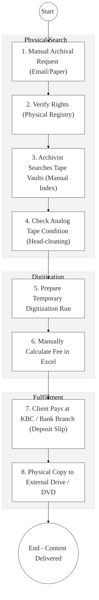
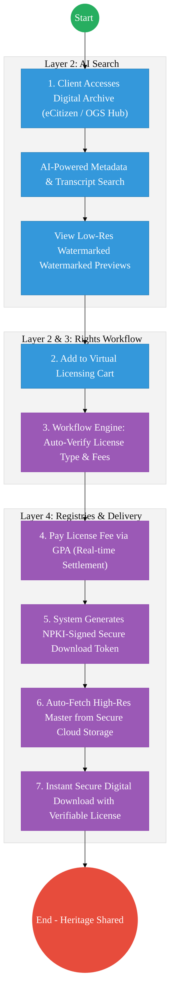

# Kenya Broadcasting Corporation – Business Process Architecture (Updated)

## Cover Page
- **Ministry:** Ministry of Information, Communications and the Digital Economy
- **Corporation:** Kenya Broadcasting Corporation (KBC)
- **Primary Authority:** Managing Director, KBC
- **Document Type:** Business Process Architecture (BPA) Standardised
- **Document Version:** 4.1
- **Date:** 2026-03-25
- **Classification:** Official
- **Strategic Category:** Priority MDA
- **Service Model:** G2C / G2B
- **Reviewer:** Senior Government Enterprise Architect

---

## SECTION 0: SERVICE PRIORITISATION MAPPING
- **Mapped Priority Service:** National Archival Access & Content Licensing
- **Tier Classification:** Tier 2
- **Strategic Category:** Economy / Information (National Heritage)
- **Breakout Room Classification:** Room 2 (Coordination, Culture & Specialised Services)
- **Lead MDA (Standardised Name):** Kenya Broadcasting Corporation
- **Related Cross-Cutting Services:**
    - National Content Lake (Digitized Media Hub)
    - Identity Layer (IPRS / Maisha Namba - Licensee Login)
    - X-Road (eCitizen / National Archives / Treasury Interop)
    - National EDRMS (Metadata & Rights Registry)
    - Government Payment Aggregator (GPA / Licensing Royalties)

---

## SECTION 0.1: PRIORITISATION JUSTIFICATION
This service is prioritised because the TO-BE design transforms KBC from a failing physical tape-vault into a "National Digital Content Lake." By digitizing over 33 million archival records (audio, video, and print) and implementing an AI-powered eCitizen "Content Licensing Portal," the design enables both citizens and global researchers to access and monetize Kenya's historical heritage. This transformation eliminates the 14-day manual "physical search" lag, preserves deteriorating analog history from permanent loss, and automates high-velocity licensing payments via the GPA, turning a passive national archive into a scalable, revenue-generating cultural asset.

| Criteria | Evidence from TO-BE Design |
| :--- | :--- |
| **Demand / Volume** | Over 33 million archival assets; high demand from media, academia, and tourism. |
| **National Priority Alignment** | KBC Act (Cap 221); National Heritage Policy; Digital Economy Blueprint. |
| **Data Reusability** | Archives are vital for education (KIE), tourism branding, and national day documentaries. |
| **Interoperability** | Continuous API synchronization between the Content Lake and global media platforms via X-Road. |
| **Revenue / Efficiency Impact** | Instant licensing fee collection via GPA; removes physical retrieval overhead. |
| **Governance / Risk Reduction** | Digital watermarking and QR-based licenses prevent unauthorized content piracy. |
| **Inclusivity** | Multi-lingual AI transcription (23+ languages) makes heritage accessible to all Kenyans. |
| **Readiness** | High; Digitization pilots are underway; basic eCitizen integration is active. |

> [!NOTE]
> “The TO-BE design transforms KBC from a physical tape-vault into a 'National Digital Content Lake.' By digitizing 33 million archives (audio/video) and implementing an eCitizen-based 'Content Licensing Portal,' the design enables global access to Kenya's historical heritage. This transformation eliminates the 'physical search' lag, automates licensing payments via the GPA, and ensures that deteriorating analog history is preserved as a permanent, searchable, and monetizable national asset.”

---

# SECTION 1: SERVICE DEFINITION (STANDARDISED)

According to the **KBC Act (CAP 221)**, the corporation is mandated to provide independent broadcasting services and maintain the national audio-visual heritage. 

In this refactored BPA, the primary service is the **National Archival Retrieval & Digital Licensing** lifecycle. The objective is to move from manual search through physical "Tape Reals" to an **AI-Indexed Content Portal** where footage is previewed, licensed, and downloaded via the **Huduma Bridge**.

---

# SECTION 2: SERVICE CATALOGUE (NORMALISED)

| Category | Service Name | Description |
| :--- | :--- | :--- |
| **Core Services** | **Archival Content Discovery** | AI-powered search for historical footage and audio clips. |
| | **Digital Content Licensing** | End-to-end processing of commercial and academic use-licenses. |
| **Extended Services** | **Royalty Distribution** | Automated split-payment of licensing revenue to rights holders. |
| | **Verifiable License QR** | Issuance of digital certificates for legal content use. |
| **Special Case Services**| **Film/Audio Restoration** | Specialized high-res digitization of deteriorating analog masters. |
| | **Heritage Syndication** | API-based content delivery to global news/educational agencies. |

---

# SECTION 3: AS-IS PROCESS FLOWS (MANUAL/DEGRADING)

The current process is manual and relies on deteriorating analog formats, making access slow and risking permanent loss of national history.

### 3.1 AS-IS Visualization

### 3.2 Operational Reality
- **Actors:** Librarian, Archivist, Content Producer, Finance Officer, Client.
- **Systems:** Physical Index Cards, Analog Tape Players, Standalone Excel Sheets, Paper Receipts.
- **Pain Points:** 14-day turnaround for a simple video clip; high risk of "Tape-Eat" during physical playback; analog formats (Betacam/U-matic) are reaching end-of-life; citizens must travel to Nairobi to preview content.

---

# SECTION 4: TO-BE PROCESS INTERPRETATION (NEW LAYER)

### 4.1 TO-BE Process (Digital Content Lake Access)

### 4.2 Key Capabilities Introduced
*   **Automation:** Automated Licensing Engine – fees are auto-calculated based on content length and use-type (commercial vs. academic).
*   **Integration:** Real-time bi-directional integration with the **National Treasury (GPA)** for revenue split and **eCitizen** for discovery.
*   **Real-time Processing:** Instant "Master Fetch" – high-resolution assets are moved from cold to hot storage for immediate user download.
*   **Digital Identity Validation:** Licensee identity and organization status verified via **Maisha Namba** and **BRS** identity federation.
*   **Workflow Orchestration:** Orchestrates the lifecycle from AI-indexed search to watermark-generation and secure digital delivery.

### 4.3 Transformation Summary
| Dimension | AS-IS | TO-BE |
| :--- | :--- | :--- |
| **Processing** | Manual / Analog Playback | Digital / Cloud Retrieval |
| **Verification** | Physical Rights Review | Automated Rights Metadata Check |
| **Records** | Regional Tape Vaults | National Unified Media Registry |
| **Tracking** | Manual Usage Monitoring | Real-time Asset Licensing Dashboard |

---

# SECTION 5: SYSTEM LANDSCAPE (ALIGN TO GEA)

| Layer | System / Platform | Role |
| :--- | :--- | :--- |
| **Identity Layer** | Maisha Namba (Licensee) | Identity and bio-login for professional content buyers. |
| **Interoperability** | KeSEL (X-Road) | Data bridge to eCitizen for public discovery. |
| **shared Services** | National Media Cloud | Secure, elastic storage for massive video/audio masters. |
| **Workflow / BPM** | Content Licensing Hub | Orchestrates previews, rights-check, and tokens. |
| **Payment Layer** | GPA (Finance Aggregator) | Real-time payment collection and royalty split. |
| **Trust Hub** | Digital Watermarking | Ensures traceability and provenance of all sold clips. |

---

# SECTION 6: TRANSFORMATION VALUE (CRITICAL ADDITION)

| Value Type | Explanation |
| :--- | :--- |
| **Efficiency Gain** | Archival retrieval time reduced from 14 days to zero (instant download). |
| **Economic Impact** | Unlocks new commercial revenue streams from international media agencies. |
| **Governance Impact** | Full accountability for government-owned intellectual property assets. |
| **Citizen Experience** | Every Kenyan can explore their history via a simple eCitizen search. |
| **Interoperability Value** | Shared historical assets for Schools (Competency Based Curriculum) via X-Road. |

---

# SECTION 7: ALIGNMENT TO WHOLE-OF-GOVERNMENT ARCHITECTURE
- **Shared Platforms:** Uses G-Cloud for media storage and GPA for all official monetization.
- **Registry Reuse:** Reuses National Archives (KNA) IDs for cross-sector metadata consistency.
- **Compliance with GEA / GIF:** Standardizing media metadata schemas for national and international searchability.

---

# SECTION 8: IMPLEMENTATION READINESS (NEW)
*   **Data Readiness:** Medium-High; Significant "Digitization Factory" required to clear analog backlog.
*   **Legal Readiness:** High; KBC Act and Copyright Act provide a framework for content sales.
*   **Institutional Readiness:** High; KBC has a specialized Library and Archival department.
*   **Technical Readiness:** High; High-speed networks and cloud storage are available via ICTA.

---

# SECTION 9: TRACEABILITY MATRIX (NEW)

| BPA Process | Priority Service | Tier | TO-BE Capability | National Impact |
| :--- | :--- | :--- | :--- | :--- |
| **Content Discovery**| Archival Search | T2 | AI-Powered Metadata Hub | Cultural Heritage Access |
| **Rights Review** | Licensing Mgmt | T2 | Automated Rules Engine | IP Monetization & Growth |
| **Payment Hub** | Revenue Split | T2 | GPA Instant Settlement | Non-Tax Revenue increase |
| **Asset Delivery** | Cloud Issuance | T2 | NPKI-Signed Secure Tokens | Secure Digital Content Economy |

---
**[End of Standardised Business Process Architecture]**
