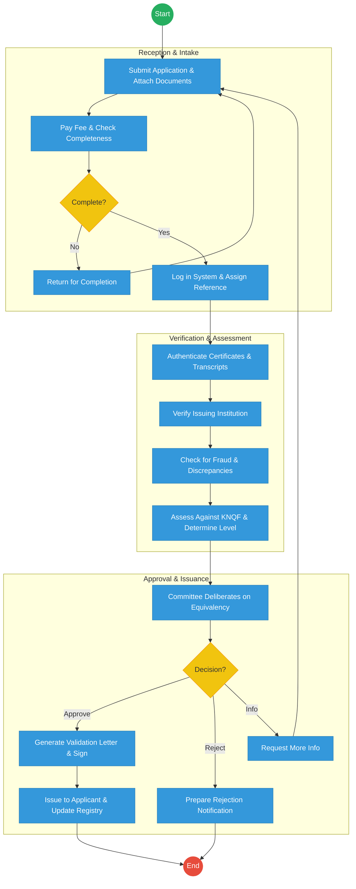
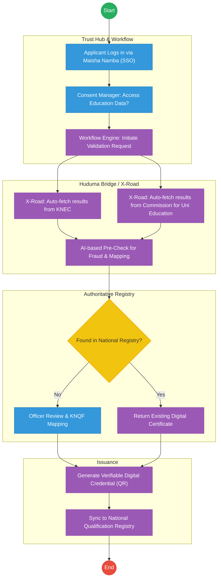

# KENYA NATIONAL QUALIFICATIONS AUTHORITY (KNQA) – Service Delivery

## Cover Page
- **Ministry/Department/Agency (MDA):** Ministry of Education
- **Authority:** Kenya National Qualifications Authority (KNQA)
- **Process Name:** Qualification Validation and Recognition of Prior Learning (RPL)
- **Document Version:** 2.1
- **Date:** 2026-02-24
- **Classification:** Official

---

## Executive Summary
The Kenya National Qualifications Authority (KNQA) is responsible for coordinating and harmonizing education, training, and assessment in Kenya. Its key mandate is to validate national and foreign qualifications and recognize prior learning (RPL). The current process involves extensive manual verification of academic documents, leading to delays in the issuance of validation letters. The transition to the Kenya DSAP Architecture aims to establish an automated validation registry integrated with KNEC and global qualification databases via X-Road.

---

## 1. AS-IS Process Flowchart (BPMN 2.0)
*Current State visualization (End-to-End Qualification Validation based on Deep Dive).*

---

## Process Overview
### Process Name
End-to-End Qualification Validation and Recognition of Prior Learning

### Service Category
- G2C (Government to Citizen) / G2B (Employers)

### Scope
- **In Scope:** Validation of local/foreign degrees, diplomas, and artisan certificates; RPL assessments; maintenance of the National Qualifications Validation Registry.
- **Out of Scope:** Issuance of actual degrees (handled by universities).

### Triggers
- An individual applying for qualification validation for employment or further study.

### End States
- **Successful:** Verifiable Validation Letter issued; Qualification added to the National Registry.

### Policy Context
- Kenya National Qualifications Framework (KNQF) Act; The Constitution of Kenya; Data Protection Act 2019.

---

## Detailed Process (AS-IS)
| Step | Role | Action | Tool/System | Notes |
|---|---|---|---|---|
| 1 | Applicant | Submits application form and scans of certificates/transcripts. | Manual/Portal | |
| 2 | KNQA Clerk | Manually checks for completeness and confirms the payment of the fee. | Manual | |
| 3 | Technical Officer | Contacts issuing institutions (KNEC, Universities) to authenticate certificates. | Email/Letter | High latency step. |
| 4 | Technical Officer | Maps the qualification against the KNQF levels. | Manual/Excel | |
| 5 | Committee | Reviews the mapping and approves the equivalency. | Committee Meeting | |
| 6 | KNQA Admin | Manually generates the validation letter and updates the registry. | Standalone Registry | |

---

## Pain Points & Opportunities
### Pain Points
- **Manual Authentication:** Contacting global universities via email takes weeks or months.
- **Duplicate Records:** No real-time link to KNEC or university student portals.
- **Fraud Risk:** Easy to forge paper-based validation letters.

### Opportunities
- **Automated Verification:** Using **KeSEL (X-Road)** to query KNEC and University databases instantly for student records.
- **Verifiable Credentials:** Issuing digital validation letters with a QR code that employers can verify instantly on eCitizen.
- **Blockchain for Qualifications:** Creating an immutable national repository of all academic achievements linked to **Maisha Namba**.

---

## 2. TO-BE Process Flowchart (BPMN 2.0)
*Future State visualization (Kenya DSAP Architecture - Huduma Bridge).*

## Future State Process (TO-BE)
### Narrative
**TO-BE Process: Zero-Touch Qualification Validation**

**Design Principles:**
- **Once-Only Principle:** The system pulls academic results directly from the **KNEC** and **CUE** (Commission for University Education) registries via **X-Road**. Applicants no longer need to upload scans of their certificates.
- **Instant Recognition:** Recognized qualifications are cached in the **National Qualification Registry**. If an applicant asks for validation of a degree that KNQA has already mapped, the response is instantaneous.
- **Digital Trust:** All validation letters are issued as **Verifiable Digital Credentials**, eliminating the possibility of forgery and removing the need for employers to call KNQA for verification.

### Optimized Steps (Digital)
| Step | Actor | Action | System |
|---|---|---|---|
| 1 | Applicant | Logs into eCitizen and selects "Qualification Validation." | eCitizen / SSO |
| 2 | System | Fetches the applicant's KNEC/KCSE data and University data via X-Road APIs. | KeSEL / X-Road |
| 3 | System | Automatically matches the data against the KNQF level framework. | AI Rules Engine |
| 4 | Technical Officer | Only reviews "Exceptions" where the mapping is ambiguous or from a new foreign institution. | Officer Workbench |
| 5 | System | Generates a digital validation certificate with a verifiable QR code and pushes it to the citizen's digital wallet. | Output Generator |

---

## References
- KNQF Act.
- Huduma Bridge DSAP Architecture.