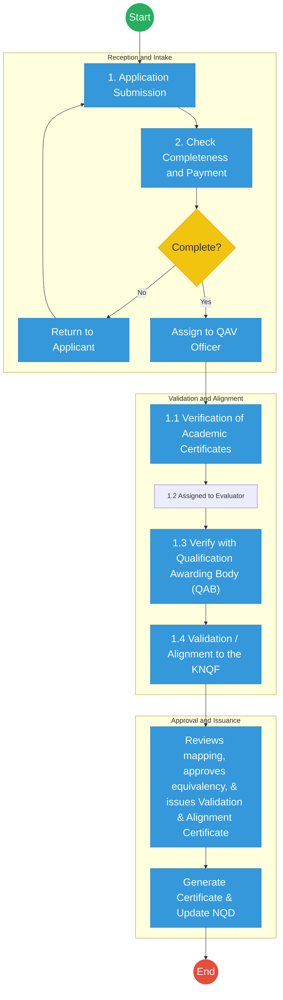
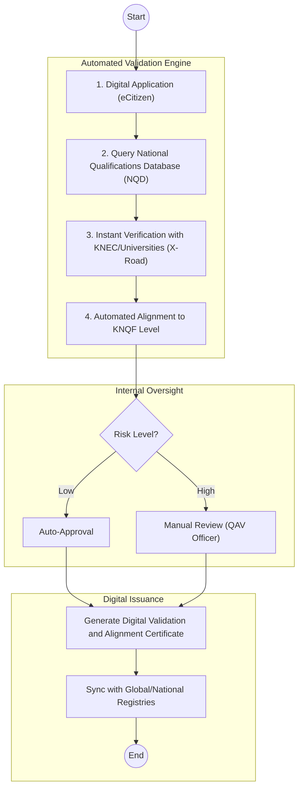

# KENYA NATIONAL QUALIFICATIONS AUTHORITY (KNQA) – Business Process Architecture (Updated)

## Cover Page
- **Ministry:** Ministry of Education
- **State Department:** State Department for Science, Research and Innovation (SRI)
- **Authority:** Kenya National Qualifications Authority (KNQA)
- **Document Type:** Business Process Architecture (BPA) Standardised
- **Document Version:** 4.1
- **Date:** 2026-03-25
- **Classification:** Official
- **Strategic Category:** Priority MDA
- **Service Model:** G2C / G2B
- **Reviewer:** Senior Government Enterprise Architect

---

## SECTION 0: SERVICE PRIORITISATION MAPPING
- **Mapped Priority Service:** End-to-End Qualification Validation and Alignment
- **Tier Classification:** Tier 2
- **Strategic Category:** Education / Identity / Jobs (Academic Integrity)
- **Breakout Room Classification:** Room 3 (Policy, Economy & Foundational Systems)
- **Lead MDA (Standardised Name):** Kenya National Qualifications Authority
- **Related Cross-Cutting Services:**
    - National Qualifications Database (NQD)
    - Identity Layer (IPRS / Maisha Namba)
    - Payment Gateway (GPA)
    - National EDRMS
    - X-Road (KNEC / University Interop)

---

## SECTION 0.1: PRIORITISATION JUSTIFICATION
This service is prioritised because the TO-BE design establishes the "National Qualifications Database (NQD)" as the definitive national registry for academic and professional credentials. By transitioning from manual, email-based verification to a real-time "Automated Validation Engine" linked to Awarding Bodies via X-Road, the design eliminates the 14-day verification bottleneck. This directly supports national security (fraud reduction) and economic productivity (faster workforce placement).

| Criteria | Evidence from TO-BE Design |
| :--- | :--- |
| **Demand / Volume** | Thousands of applications monthly for employment and further study; high record sensitivity. |
| **National Priority Alignment** | KNQF Act (2014); World-class workforce development; Vision 2030 Education Pillar. |
| **Data Reusability** | Validated qualifications are consumed by Public Service Commission and private sector HR portals. |
| **Interoperability** | Secure API links to KNEC, KASNEB, and all accredited Universities via Huduma Bridge. |
| **Revenue / Efficiency Impact** | Automated fee reconciliation via GPA; reduction in staff-hours spent on manual follow-ups. |
| **Governance / Risk Reduction** | Cryptographically secure QR codes and NPKI signatures eliminate certificate forgery. |
| **Inclusivity** | "Single Window" portal simplifies the complex foreign equivalency process for returning citizens. |
| **Readiness** | High; NQD structure is defined; X-Road nodes are operational in major awarding bodies. |

> [!NOTE]
> “This service is prioritised because the TO-BE design establishes the 'National Qualifications Database (NQD)' as the single source of truth for academic credentials in Kenya. By integrating with Universities and KNEC via X-Road, it eliminates the 2-week verification lag, enabling instant, verifiable digital credentials for employment and global mobility.”

---

# SECTION 1: SERVICE DEFINITION (STANDARDISED)

The Kenya National Qualifications Authority (KNQA) is mandated under the **KNQF Act No. 22 of 2014** to manage the Kenya National Qualifications Framework. 

In this standardized BPA, the primary focus is the **End-to-End Qualification Validation and Alignment** of national and foreign qualifications. The goal is to ensure that qualifications awarded in Kenya at all levels are of the highest quality and are nationally and internationally recognized. 

---

# SECTION 2: SERVICE CATALOGUE (NORMALISED)

| Category | Service Name | Description |
| :--- | :--- | :--- |
| **Core Services** | **National Qualification Validation** | Authentication and alignment of Kenyan academic/professional credentials. |
| | **Foreign Qualification Equation** | Determining the equivalence of foreign certificates to the Kenyan system. |
| **Extended Services** | **NQD Indexing & Search** | Management of the National Qualifications Database (NQD) as a source of truth. |
| | **Credit Accumulation & Transfer (CATs)** | Facilitating learner mobility through standardized credit recognition. |
| **Special Case Services**| **Alignment Appeals** | Administrative review of qualification leveling decisions. |
| | **Verification Service for Employers** | API-based instant verification of job applicant credentials. |

---

# SECTION 3: AS-IS PROCESS FLOWS (MANUAL/FRAGMENTED)

The current state is characterized by manual, email-based verification with various Qualification Awarding Bodies (QABs), leading to throughput bottlenecks.

### 3.1 AS-IS Visualization

### 3.2 Operational Reality
- **Actors:** Applicant, QAV Officer, Evaluator, QAB Representative (KNEC/University).
- **Systems:** Manual Finance Modules, Email, Excel spreadsheets for KNQF mapping.
- **Pain Points:** System fragmentation; external verification takes 14-21 days; high risk of credential forgery; manual transcript mapping is prone to human error.

---

# SECTION 4: TO-BE PROCESS INTERPRETATION (NEW LAYER)

### 4.1 TO-BE Process (Automated Validation Engine)

### 4.2 Key Capabilities Introduced
*   **Automation:** Automated alignment engine that maps verified credits to KNQF levels instantly for low-risk applications.
*   **Integration:** Hub-and-spoke integration with the Ministry of Education (NEMIS) and all QABs via X-Road.
*   **Real-time Processing:** Instant NQD lookup for locally awarded quality-assured certificates.
*   **Digital Identity Validation:** Student and alumnus identity verification via **Maisha Namba** identity federation.
*   **Workflow Orchestration:** Coordinated movement from application intake to global registry synchronization.

### 4.3 Transformation Summary
| Dimension | AS-IS | TO-BE |
| :--- | :--- | :--- |
| **Processing** | Manual / Multi-touch | Automated / Zero-touch (Low Risk) |
| **Verification** | Email / Letter | API-based (X-Road/NQD) |
| **Records** | Siloed Portals | Unified National Qualifications Database |
| **Tracking** | Manual Case Log | Real-time Status Dashboard |

---

# SECTION 5: SYSTEM LANDSCAPE (ALIGN TO GEA)

| Layer | System / Platform | Role |
| :--- | :--- | :--- |
| **Identity Layer** | Maisha Namba (IPRS) | Verified identity for students and applicants. |
| **Interoperability** | KeSEL (X-Road) | Data link to KNEC, Universities, and KASNEB. |
| **shared Services** | National EDRMS | Legal digital archive for alignment certificates. |
| **Workflow / BPM** | QAV Workflow Engine | Orchestrates the validation and risk-gate reviews. |
| **Payment Layer** | GPA (Payment Gateway) | Automated fee collection and equivalency billing. |
| **Trust Hub** | Consent Manager | Secure access to student academic transcripts. |

---

# SECTION 6: TRANSFORMATION VALUE (CRITICAL ADDITION)

| Value Type | Explanation |
| :--- | :--- |
| **Efficiency Gain** | Turnaround time for validation reduced from 2 weeks to 48 hours. |
| **Economic Impact** | Accelerates the technical workforce deployment and professional licensing. |
| **Governance Impact** | National Qualifications Database (NQD) eliminates academic fraud and certificate cartels. |
| **Citizen Experience** | Effortless application for foreign equivalency via eCitizen mobile. |
| **Interoperability Value** | Shared API for employers to verify qualifications directly at the source. |

---

# SECTION 7: ALIGNMENT TO WHOLE-OF-GOVERNMENT ARCHITECTURE
- **Shared Platforms:** Uses eCitizen for secure login and GPA for validation fee processing.
- **Registry Reuse:** Reuses NEMIS records to populate student educational history automatically.
- **Compliance with GEA / GIF:** Standardizing all academic data interchange protocols for national scaling.

---

# SECTION 8: IMPLEMENTATION READINESS (NEW)
*   **Data Readiness:** High; National Qualifications Database (NQD) is already structured.
*   **Legal Readiness:** High; KNQF Act (2014) provides strong legal grounding for the registry.
*   **Institutional Readiness:** High; KNQA has established technical teams for QAV workflows.
*   **Technical Readiness:** High; X-Road nodes are active in major Awarding Bodies (KNEC/UON).

---

# SECTION 9: TRACEABILITY MATRIX (NEW)

| BPA Process | Priority Service | Tier | TO-BE Capability | National Impact |
| :--- | :--- | :--- | :--- | :--- |
| **Authentication** | Qualification Validation| T2 | X-Road: QAB Interop | Fraud Elimination & Trust |
| **Mapping** | Level Alignment | T2 | Automated Alignment | Academic Mobility & Standardisation|
| **Registry Update** | NQD Management | T2 | Real-time NQD Sync | Authoritative National Records |
| **Issuance** | Certificate Generation| T2 | NPKI Digital Signing | International Credential Portability|

---
**[End of Standardised Business Process Architecture]**
