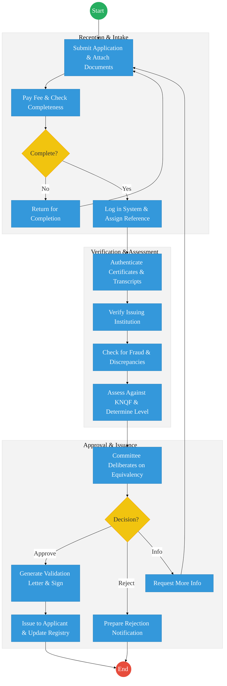
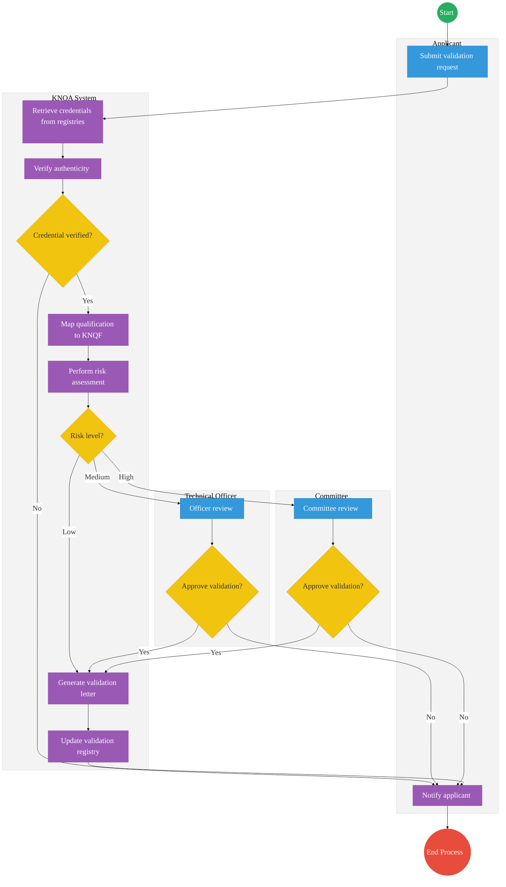

# KENYA NATIONAL QUALIFICATIONS AUTHORITY (KNQA) – Service Delivery

## Cover Page
- **Ministry/Department/Agency (MDA):** Ministry of Education
- **Authority:** Kenya National Qualifications Authority (KNQA)
- **Process Name:** Qualification Validation and Recognition of Prior Learning (RPL)
- **Document Version:** 2.1
- **Date:** 2026-03-04
- **Classification:** Official
- **Strategic Category:** Priority MDA
- **Service Model:** G2C
- **Life-Cycle Group:** Cradle to Death (2. Childhood & Education)

---

## Executive Summary
The Kenya National Qualifications Authority (KNQA) is responsible for coordinating and harmonizing education, training, and assessment in Kenya. Its key mandate is to validate national and foreign qualifications and recognize prior learning (RPL). The current process involves extensive manual verification of academic documents, leading to delays in the issuance of validation letters. The transition to the Kenya DSAP Architecture aims to establish an automated validation registry integrated with KNEC and global qualification databases via X-Road.

---

## 1. AS-IS Process Flowchart (BPMN 2.0)
*Current State visualization (End-to-End Qualification Validation based on Deep Dive).*

---

## Process Overview
### Process Name
End-to-End Qualification Validation and Recognition of Prior Learning

### Service Category
- G2C (Government to Citizen) / G2B (Employers)

### Scope
- **In Scope:** Validation of local/foreign degrees, diplomas, and artisan certificates; RPL assessments; maintenance of the National Qualifications Validation Registry.
- **Out of Scope:** Issuance of actual degrees (handled by universities).

### Triggers
- An individual applying for qualification validation for employment or further study.

### End States
- **Successful:** Verifiable Validation Letter issued; Qualification added to the National Registry.

### Policy Context
- Kenya National Qualifications Framework (KNQF) Act; The Constitution of Kenya; Data Protection Act 2019.

---

## Detailed Process (AS-IS)

| Step | Role              | Action                                                                           | Tool/System         | Notes              |
| ---- | ----------------- | -------------------------------------------------------------------------------- | ------------------- | ------------------ |
| 1    | Applicant         | Submits application form and scans of certificates/transcripts.                  | Manual/Portal       |                    |
| 2    | KNQA Clerk        | Manually checks for completeness and confirms the payment of the fee.            | Manual              |                    |
| 3    | Technical Officer | Contacts issuing institutions (KNEC, Universities) to authenticate certificates. | Email/Letter        | High latency step. |
| 4    | Technical Officer | Maps the qualification against the KNQF levels.                                  | Manual/Excel        |                    |
| 5    | Committee         | Reviews the mapping and approves the equivalency.                                | Committee Meeting   |                    |
| 6    | KNQA Admin        | Manually generates the validation letter and updates the registry.               | Standalone Registry |                    |

---

## Pain Points & Opportunities
### Pain Points
- **Manual Authentication:** Contacting global universities via email takes weeks or months.
- **Duplicate Records:** No real-time link to KNEC or university student portals.
- **Fraud Risk:** Easy to forge paper-based validation letters.

### Opportunities
- **Automated Verification:** Using **KeSEL (X-Road)** to query KNEC and University databases instantly for student records.
- **Verifiable Credentials:** Issuing digital validation letters with a QR code that employers can verify instantly on eCitizen.
- **Blockchain for Qualifications:** Creating an immutable national repository of all academic achievements linked to **Maisha Namba**.

---

## 2. TO-BE Process Flowchart (BPMN 2.0)
*Future State visualization (Kenya DSAP Architecture - Huduma Bridge).*

## Future State Process (TO-BE)
### Narrative
**TO-BE Process: Automated Qualification Validation**

**Design Principles:**
- **Once-Only Principle:** Applicants should not upload certificates if they already exist in national registries.
- **Registry-Centric Architecture:** The system retrieves academic records directly from authoritative databases such as KNEC, accredited universities, and global credential databases.
- **Automated Credential Verification:** The system automatically validates the certificate number, verifies the issuing institution, and confirms program accreditation.
- **Automated Qualification Mapping:** Validated credentials are automatically mapped to the corresponding level on the Kenya National Qualifications Framework (KNQF).
- **Risk-Based Processing:** Applications are processed based on their assessed risk level: Low-risk cases receive automatic approval, medium-risk cases are flagged for an officer review, and high-risk cases escalate to a committee review.
- **Digital Issuance:** Upon approval, validation letters are digitally generated, featuring a QR verification code, verification ID, and an official registry entry for instantaneous third-party verification.

### Optimized Steps (Digital)

| Step | Actor | Action | System |
|---|---|---|---|
| 1 | Applicant | Submits a validation request via the digital portal. Does not upload certificates if records exist in registries. | eCitizen / Digital Portal |
| 2 | KNQA System | Retrieves credentials automatically from national and international education registries. | Integration Hub / KeSEL |
| 3 | KNQA System | Performs automated authenticity verification (checks number, institution, accreditation) and maps to KNQF. | Workflow / Rules Engine |
| 4 | KNQA System | Conducts a risk assessment to determine the approval routing (Low, Medium, or High risk). | Risk Assessment Engine |
| 5 | Technical Officer / Committee | Handles exceptions based on risk. Officer reviews medium-risk cases; the Committee reviews high-risk cases. | KNQA Workbench |
| 6 | KNQA System | Generates a digitally signed validation letter, updates the central validation registry, and notifies the applicant. | Digital Registry / Output Generator |

---

## References
- https://www.knqa.go.ke
- Kenya National Qualifications Framework (KNQF) Act
- Desk Review

---

## Feedback
We value your input on this blueprint. Please take a moment to provide your feedback using the link below:

[Provide Feedback](https://ee.kobotoolbox.org/x/4Ls7SlCG)
