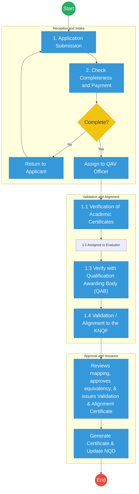
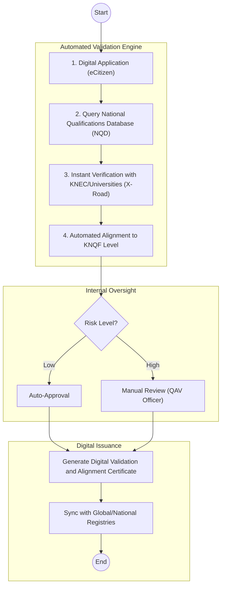

# KENYA NATIONAL QUALIFICATIONS AUTHORITY (KNQA) – Service Delivery

## Cover Page
- **Ministry:** Ministry of Education
- **State Department:** State Department for Science, Research and Innovation (SRI)
- **Authority:** Kenya National Qualifications Authority (KNQA)
- **Process Name:** End-to-End Qualification Validation and Alignment
- **Document Version:** 3.0 (Government Process Re-engineered)
- **Date:** 2026-03-24
- **Classification:** Official
- **Strategic Category:** Priority MDA
- **Service Model:** G2C / G2B
- **Life-Cycle Group:** Cradle to Death (2. Childhood & Education)

---

## Service Mandate

The Kenya National Qualifications Authority (KNQA) is mandated under the KNQF Act No. 22 of 2014 to manage the Kenya National Qualifications Framework (KNQF). The primary mandate of the Authority is the **implementation of the Kenya National Qualifications Framework (KNQF) to ensure that qualifications awarded in Kenya at all levels are of the highest quality and are nationally and internationally recognized.** 

Key operational functions include:

1. **Validation and Alignment:** Evaluating and aligning national and foreign qualifications to the corresponding levels of the KNQF.
2. **Quality Assurance Coordination:** Harmonizing education and training standards across the Basic, TVET, and University sub-sectors.
3. **Database Management:** Maintaining the **National Qualifications Database (NQD)** as the single national source of truth for all record-keeping of quality-assured qualifications and learners.
4. **Equation of Qualifications:** Determining the equivalence of foreign certificates to the Kenyan education system.
5. **Credit Accumulation and Transfer (CATs):** Facilitating learner mobility through standardized credit recognition.

> [!NOTE]
> Recognition of Prior Learning (RPL) is managed as a separate institutional service and is outside the scope of this specific validation and alignment process.

---

## Executive Summary

The Kenya National Qualifications Authority (KNQA) is responsible for the implementation of the Kenya National Qualifications Framework (KNQF). A critical function of the Authority is the **End-to-End Qualification Validation and Alignment** of national and foreign qualifications. The current "As-Is" environment is characterized by manual, email-based verification with various Qualification Awarding Bodies (QABs), leading to throughput bottlenecks. This document outlines the transition toward a Digital Public Infrastructure (DPI) model where the **National Qualifications Database (NQD)** serves as a real-time validation engine, significantly reducing the turnaround time for the issuance of **Validation & Alignment Certificates**.

---

## 1. AS-IS Process Flowchart (BPMN 2.0)

*Current State visualization representing the standardized Validation and Alignment sequence.*

---

## Process Overview

### Process Name
End-to-End Qualification Validation and Alignment

### Service Category
- G2C (Government to Citizen)
- G2B (Employers / Professional Bodies)

### Scope

- **In Scope:** Validation of national and foreign academic/professional credentials; Alignment of certificates to the Kenya National Qualifications Framework (KNQF); Maintenance of the National Qualifications Database (NQD).
- **Out of Scope:** Accreditation of institutions (Separate Process); Recognition of Prior Learning (RPL - Separate Process); Issuance of original degree/diploma certificates by Awarding Bodies.

### Triggers
- Citizen or employer request for qualification validation or equivalency determination.

### End States
- **Successful:** Verifiable **Validation and Alignment Certificate** issued; Record successfully indexed in the National Qualifications Database (NQD).

### Policy Context
- Kenya National Qualifications Framework (KNQF) Act; Data Protection Act 2019; KNQF Regulations.

---

## 2. Detailed Process (AS-IS)

| Step | Role | Action | Tool/System | Notes |
| :--- | :--- | :--- | :--- | :--- |
| **1** | Applicant | **Application Submission:** Submits copies of certificates, transcripts, and ID documents. | Portal / Manual | Citizen initiates the request. |
| **2** | QAV Officer | **Reception & Intake:** Confirms payment and validates that all required documents are attached. | Manual / Finance | Gateway for processing. |
| **3** | QAV Officer | **Validation & Alignment:** Authenticates certificates; contacts QABs (e.g., KNEC, Universities) for verification. | Email / Web Portal | **Critical Pain Point:** External verification latency. |
| **4** | QAV Officer | **Validation & Alignment:** Maps the verified credential against the 10 levels of the KNQF. | KNQF Matrix / Excel | Determines the local equivalency. |
| **5** | QAV Officer | **Final Decision:** Reviews the mapping, approves the equivalency and issues a Validation & Alignment Certificate. | Management System | Final technical decision. |

---

## Pain Points and Opportunities

### Pain Points

- **System Fragmentation:** Lack of real-time digital links to major QABs (KNEC, KASNEB, Universities) necessitates manual email follow-ups.
- **Data Latency:** Verification from international awarding bodies can take weeks, delaying employment or study opportunities.
- **Verification Risk:** Manual paper-based outputs are susceptible to sophisticated forgery without a real-time verification portal.
- **Data Sensitivity:** Handling of academic records requires strict adherence to the **Data Protection Act (2019)** to prevent unauthorized data exposure.

### Opportunities

- **DPI Integration:** Utilization of **KeSEL (X-Road)** for secure, instantaneous data exchange between KNQA and accredited awarding bodies.
- **NQD as Single Source of Truth:** Establishing the **National Qualifications Database (NQD)** as the authoritative registry accessible to employers for instant verification.
- **Verifiable Digital Credentials:** Transitioning to **Validation and Alignment Certificates** equipped with cryptographically secure QR codes.

---

## 3. TO-BE Process (DPI-Enabled)

*Future State leveraging Automated Validation and Alignment.*

---

# PART 4: ARCHITECTURE ALIGNMENT (KENYA HUDUMA BRIDGE)

The Qualification Validation and Alignment Service is engineered to operate across the four layers of the **Kenya DSAP Architecture**:

### Layer 1: Access Channels
- **eCitizen / KNQA Portal:** The primary window for citizens and employers to apply for and track validation requests.
- **Officer Workbench (NQD Interface):** The specialized interface for QAV Officers to manage technical evaluations and alignment mappings.
- **Huduma Centers:** Physical intake points for the scanning (IDP) of manual academic certificates and foreign credentials.

### Layer 2: Core Platform
- **Workflow Engine (BPMN 2.0):** Orchestrates the validation journey (Application → NQD Query → QAB Verification → Alignment → Issuance) with risk-based automated approvals.
- **Trust Hub:**
  - **Consent Manager:** Mandatory citizen consent before querying individual academic records from Universities or KNEC via X-Road.
  - **Identity Federation:** Real-time verification of applicant identity via **Maisha Namba (IPRS)**.
  - **NPKI:** Digitally signing **Validation & Alignment Certificates** to ensure authenticity and international recognition.
- **Shared Services:**
  - **Intelligent Document Processing (IDP):** Digitizing historical qualification records and foreign transcripts into the National EDRMS.
  - **Document Generator:** Automated creation of verifiable certificates with cryptographically secure QR codes.
  - **Notifications:** SMS/Email alerts for verification milestones and certificate ready notifications.

### Layer 3: Interoperability (Huduma Bridge)
- **KeSEL (X-Road):** Secure, decentralized data exchange between KNQA and **QABs (KNEC, KASNEB, Universities)** and **MoE (NEMIS)**.
- **Central Service Catalogue:** Cataloguing qualification-related APIs for national and international verification.

### Layer 4: Authoritative Registries & Payments
- **Registries:**
  - **National Qualifications Database (NQD):** The sector-specific authoritative registry for all quality-assured qualifications and learners.
  - **National EDRMS:** The legal digital archive for all signed validation certificates and qualification mapping benchmarks.
  - **IPRS / Maisha Namba:** Foundational person registry for learner identification.
- **Payments:** **Government Payment Aggregator (GPA)** for processing validation fees, equivalency charges, and institutional registry fees.

---

## 5. Change Summary

| Functional Area | Before | After (Corrected) | Rationale |
| :--- | :--- | :--- | :--- |
| **Process Name** | Qualification Validation and RPL | **End-to-End Qualification Validation and Alignment** | Precise alignment with KNQA operational mandate. |
| **Service Scope** | Included RPL assessments | **Validation and Alignment only** | RPL is a distinct institutional function. |
| **Role Nomenclature** | Technical Officer | **QAV Officer** | Reflects the specialized focus on Alignment and Validation. |
| **Process Logic** | Redundant Admin step (Step 6) | **Streamlined QAV Officer Ownership** | Improves accountability and speed. |
| **Key Output** | Validation Letter | **Validation and Alignment Certificate** | Formalizes the legal and academic standing of the output. |
| **Terminology** | Verification & Assessment | **Validation and Alignment** | Consistent with KNQF statutory language. |

---
**[End of Corrected Document]**
