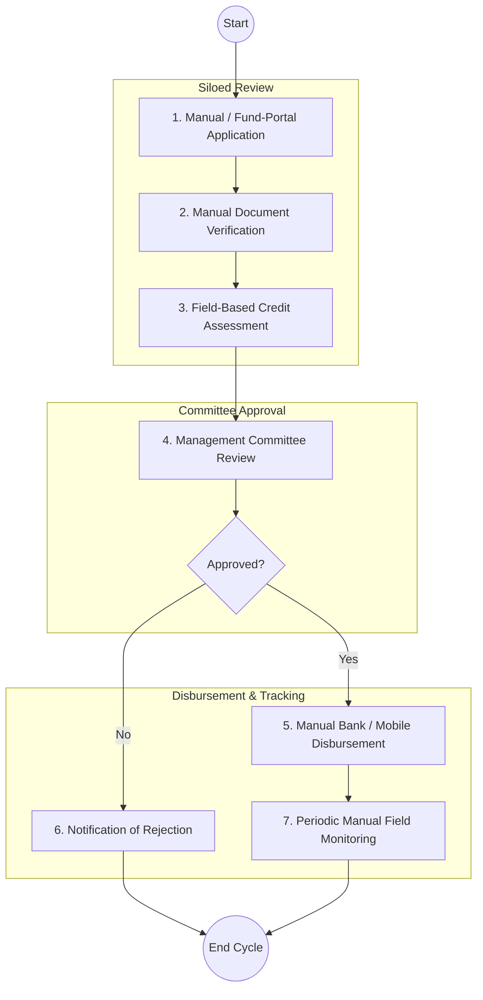
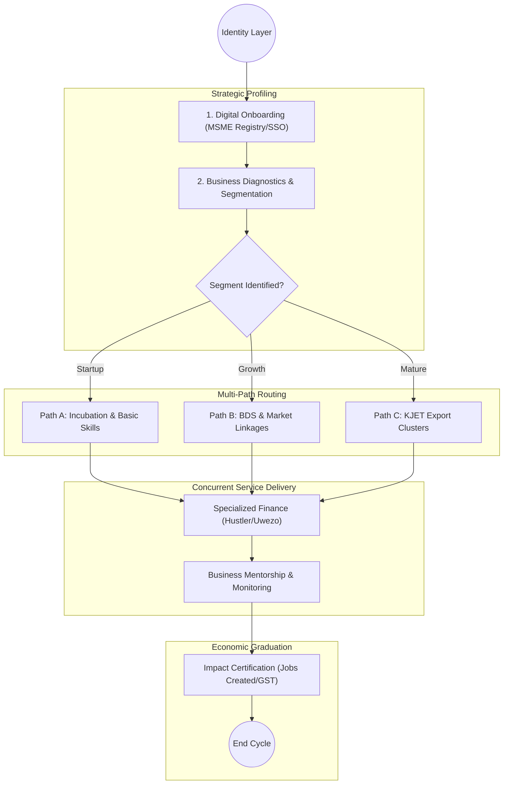

# STATE DEPARTMENT FOR MSME DEVELOPMENT – Business Process Architecture (Updated)

## Cover Page
- **Ministry:** Ministry of Co-operatives and Micro, Small and Medium Enterprises (MSME) Development
- **State Department:** State Department for MSME Development
- **Primary Authority:** MSME Registry / MSEA
- **Document Type:** Business Process Architecture (BPA) Standardised
- **Document Version:** 4.2
- **Date:** 2026-03-25
- **Classification:** Official
- **Strategic Category:** Priority MDA
- **Service Model:** G2B
- **Reviewer:** Senior Government Enterprise Architect

---

## SECTION 0: SERVICE PRIORITISATION MAPPING
- **Mapped Priority Service:** MSME Programme Ecosystem (KJET Alignment)
- **Tier Classification:** Tier 2
- **Strategic Category:** Economy / Jobs (KJET Flagship)
- **Breakout Room Classification:** Room 3 (Policy, Economy & Foundational Systems)
- **Lead MDA (Standardised Name):** State Department for MSME Development
- **Related Cross-Cutting Services:**
    - Unified MSME Registry
    - Identity Layer (IPRS / Maisha Namba)
    - Payment Gateway (GPA / Digital Wallet)
    - Business Registration Service (BRS) Interop
    - Notification Engine

---

## SECTION 0.1: PRIORITISATION JUSTIFICATION
This service is prioritised because the TO-BE design enables the transition from a siloed "Credit-only" model to a holistic "MSME Lifecycle Journey." By integrating the KJET programme as a core capability, the design moves beyond disbursement to track and drive "Economic Graduation," directly impacting national job creation and sectoral GVA.

| Criteria | Evidence from TO-BE Design |
| :--- | :--- |
| **Demand / Volume** | Over 7.4 million MSMEs in Kenya; high frequency of micro-credit and support requests. |
| **National Priority Alignment** | Bottom-Up Economic Transformation Agenda (BETA); KJET Flagship. |
| **Data Reusability** | Diagnostic business profiles shared with Trade and Investment portals via X-Road. |
| **Interoperability** | Continuous verification with BRS (Registration) and KRA (Tax) via Huduma Bridge. |
| **Revenue / Efficiency Impact** | GPA-linked automated repayments reduce default rates; eliminates redundant paperwork. |
| **Governance / Risk Reduction** | Biometric/SSO-linked identity prevents duplicate funding across different funds. |
| **Inclusivity** | USSD-based diagnostic tools ensure reach to informal and rural micro-enterprises. |
| **Readiness** | High; MSME Registry pilot is active; KJET funding and roadmap are in place. |

> [!NOTE]
> “This service is prioritised because the TO-BE design enables the transition from a siloed 'Credit-only' model to a multi-path MSME Journey. By integrating diagnostic profiling and path routing, the design ensures 'Economic Graduation' through training, market linkages, and GPA-linked digital finance.”

---

# SECTION 1: SERVICE DEFINITION (STANDARDISED)

The State Department for MSME Development is undergoing a fundamental shift from a **credit-disbursement provider** into a **multi-service MSME support ecosystem**. Previously, processes were structured as linear "Apply-Approve-Disburse" tracks, which limited long-term economic scalability. 

The prioritised **MSME Programme Ecosystem** refactors the model to center on a **multi-path MSME journey**. By integrating the **Kenya Jobs and Economic Transformation (KJET)** programme, the department orchestrates a network of services including Business Development Services (BDS), Incubation, Market Linkages, and specialized financing.

---

# SECTION 2: SERVICE CATALOGUE (NORMALISED)

| Category | Service Name | Description |
| :--- | :--- | :--- |
| **Core Services** | **MSME Onboarding & Registration** | Digital creation of a legal MSME Persona in the Unified Registry. |
| | **Diagnostic & Segmentation** | Digital diagnostic tools to identify business maturity (Startup, Growth, Mature). |
| **Extended Services** | **KJET Cluster Support** | Specialized support for sectoral clusters (Textiles, Leather, Agri-processing). |
| | **Business Development Services (BDS)** | Linkage to mentorship, accounting, and digital skills training. |
| **Special Case Services**| **Micro-Credit Disbursement** | Specialized financing via Digital Wallets (Hustler/Uwezo/WEF). |
| | **Impact Certification** | Formal graduation certificates showing jobs created and tax readiness. |

---

# SECTION 3: AS-IS PROCESS FLOWS (MANUAL/FUND-CENTRIC)

The current state is characterized by siloed, fund-centric workflows that operate independently of a unified MSME development strategy.

### 3.1 AS-IS Visualization

### 3.2 Operational Reality
- **Actors:** Applicant, Fund Officer, Credit Officer, Management Committee, Finance Dept.
- **Systems:** Manual Registers, Paper Forms, isolated Fund Portals.
- **Pain Points:** Siloed entry; no "once-only" data reuse; high operational cost due to physical visits; bottlenecks in committee-based decision making.
- **Legal Compliance:** Under the **PFMA Act**, certain funds like Uwezo require physical forms and manual records validation for audit trails.

---

# SECTION 4: TO-BE PROCESS INTERPRETATION (NEW LAYER)

### 4.1 TO-BE Process (Lifecycle Journey)

### 4.2 Key Capabilities Introduced
*   **Automation:** Automated diagnostic profiling and path routing based on MSME maturity scores.
*   **Integration:** Real-time link to BRS for registration verification and KRA for "Impact Certification."
*   **Real-time Processing:** USSD-based micro-credit and instant diagnostic results.
*   **Digital Identity Validation:** Business owners verified via **Maisha Namba** identity federation.
*   **Workflow Orchestration:** Orchestrates a non-linear journey from registration to graduation.

### 4.3 Transformation Summary
| Dimension | AS-IS | TO-BE |
| :--- | :--- | :--- |
| **Processing** | Linear / Fund-centric | Non-linear / Journey-centric |
| **Verification** | Manual (Paper) | API-based (BRS/IPRS) |
| **Records** | Siloed Files | Unified MSME Registry |
| **Tracking** | Repayment % | Jobs Created & Sectoral GVA |

---

# SECTION 5: SYSTEM LANDSCAPE (ALIGN TO GEA)

| Layer | System / Platform | Role |
| :--- | :--- | :--- |
| **Identity Layer** | Maisha Namba (IPRS) | Verified identity for MSME owners. |
| **Interoperability** | KeSEL (X-Road) | Secure exchange with BRS, KRA, and Banks. |
| **shared Services** | National EDRMS | Legal archive for loan agreements and contracts. |
| **Workflow / BPM** | Journey Engine | Orchestrates profiling and service routing. |
| **Payment Layer** | GPA (Digital Wallets) | Automated disbursements and repayments. |
| **Trust Hub** | Consent Manager | MSME control over shared tax/registration data. |

---

# SECTION 6: TRANSFORMATION VALUE (CRITICAL ADDITION)

| Value Type | Explanation |
| :--- | :--- |
| **Efficiency Gain** | Reducing redundant verification across different government funds. |
| **Economic Impact** | Direct stimulation of sectoral MSME clusters (Textiles, Leather) for export. |
| **Governance Impact** | Single identity prevents "double-dipping" and improves fund auditability. |
| **Citizen Experience** | Unified portal access for training, markets, and finance (Single Window). |
| **Interoperability Value** | Business data portability between government and private financial institutions. |

---

# SECTION 7: ALIGNMENT TO WHOLE-OF-GOVERNMENT ARCHITECTURE
- **Shared Platforms:** Uses Huduma Centers for physical onboarding and eCitizen for digital access.
- **Registry Reuse:** Reuses BRS records to instantly populate MSME diagnostic profiles.
- **Compliance with GEA / GIF:** Implementation of "Once-Only" principle for MSME registration data.

---

# SECTION 8: IMPLEMENTATION READINESS (NEW)
*   **Data Readiness:** High; MSME Registry digitisation is advanced.
*   **Legal Readiness:** Medium; Requires PFMA reform to allow digital-only signatures for group loans.
*   **Institutional Readiness:** High; Departmental structure already aligned to sectoral clusters.
*   **Technical Readiness:** High; Integration with GPA and X-Road is already in pilot.

---

# SECTION 9: TRACEABILITY MATRIX (NEW)

| BPA Process | Priority Service | Tier | TO-BE Capability | National Impact |
| :--- | :--- | :--- | :--- | :--- |
| **Onboarding** | Registration | T2 | Maisha Namba / BRS Link | Business Formalization |
| **Diagnosis** | Profiling | T2 | AI Diagnostic Engine | Targeted Economic Intervention|
| **KJET Routing** | Support Clusters | T2 | Multi-Path Workflow | Job Creation & Export Growth |
| **Disbursement** | Micro-Finance | T2 | Digital Wallet (GPA) | Financial Inclusion |

---
**[End of Standardised Business Process Architecture]**
