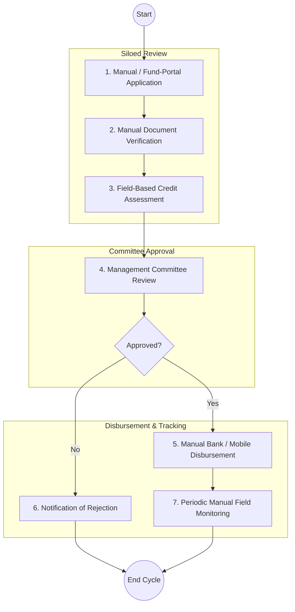
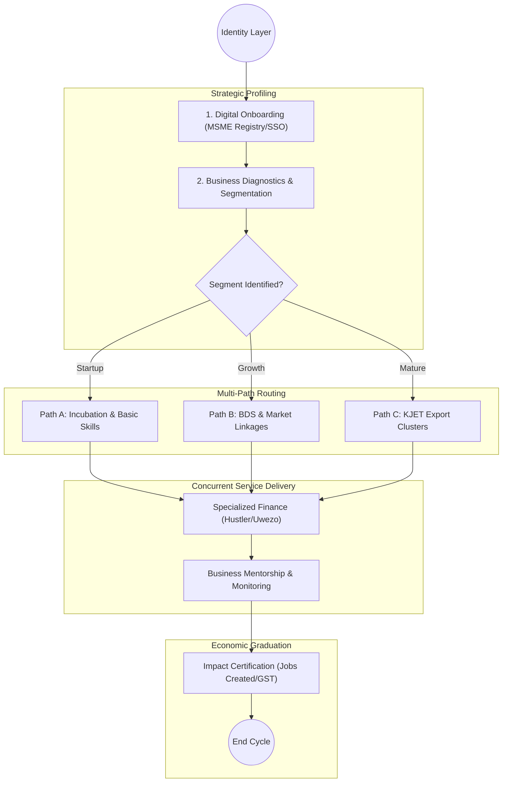

# STATE DEPARTMENT FOR MSME DEVELOPMENT – MSME Programme Ecosystem

## Cover Page
- **Ministry:** Ministry of Co-operatives and Micro, Small and Medium Enterprises (MSMEs) Development
- **State Department:** State Department for MSME Development
- **Document Type:** Integrated Programme Ecosystem Document (BPR Aligned)
- **Document Version:** 4.1 (Strategic Transformation Template)
- **Date:** 2026-03-24
- **Classification:** Official
- **Strategic Category:** Priority MDA
- **Programmatic Focus:** Kenya Jobs and Economic Transformation (KJET)
- **Reviewer:** Senior Public Sector Transformation Expert

---

# PART 1: EXECUTIVE SUMMARY

The State Department for MSME Development is undergoing a fundamental shift from a **credit-disbursement provider** into a **multi-service MSME support ecosystem**. Previously, processes were structured as linear "Apply-Approve-Disburse" tracks, which limited the department's ability to drive long-term economic scalability. 

This document refactors the model to center on a **multi-path MSME journey**. By integrating the **Kenya Jobs and Economic Transformation (KJET)** programme as a core operational framework, the department now orchestrates a network of services including **Business Development Services (BDS), Incubation, Market Linkages, and specialized financing**. This ensures that MSMEs are not just "funded" but "graduated" through business stages from subsistence to export-ready clusters.

---

---

# PART 2: AS-IS PROCESS (CURRENT REALITY)

The current operational state of MSME support is characterized by siloed, fund-centric workflows that operate independently of a unified MSME development strategy.

### 2.1 AS-IS Process Flowchart (Linear/Disbursement-Centric)

### 2.2 AS-IS Process Details

| Step | Role | Action | Tool/System | Pain Points |
| :--- | :--- | :--- | :--- | :--- |
| **1** | Applicant | **Application:** Applies for a specific fund (e.g., Uwezo, WEF, Hustler). | Paper / Web Portal | Siloed entry; no "once-only" data reuse. |
| **2** | Fund Officer | **Verification:** Checks business certificates and ID copies. | Manual / BRS Lookup | Redundant verification if already known to another fund. |
| **3** | Credit Officer | **Assessment:** Evaluates business viability via physical visits. | Physical Visit | High operational cost; no central digital history. |
| **4** | Committee | **Approval:** Collective decision-making on funding. | Meeting / Letter | Bottlenecks due to scheduled meetings. |
| **5** | Finance Dept | **Disbursement:** Transfers funds to the MSME. | Bank / M-Pesa | Fragmented disbursement rails. |
| **6** | Field Officer | **Monitoring:** Manual follow-ups on business performance. | Field Notes / Paper | No real-time data on business impact or jobs. |

---

# PART 3: MSME PROGRAMME ECOSYSTEM MODEL (TO-BE)

The MSME model is redefined as a **Lifecycle-Based Ecosystem** rather than a standalone financial service.

### 3.1 The MSME Lifecycle Journey
1.  **Onboarding & Identity:** Creating a legal "MSME Persona" via the **MSME Registry**.
2.  **Profiling & Needs Assessment:** Using digital diagnostic tools to identify the business's current maturity (Startup, Growth, Mature).
3.  **Path Routing:** Directing the MSME to one or more specialized support tracks (e.g., KJET Clusters, Training, or Finance).
4.  **Value-Add Services:** Simultaneous access to training, incubation, and market data.
5.  **Economic Graduation:** Moving from informal micro-entities to formal, taxable, and bankable enterprises.

---

# PART 4: UPDATED PROCESS ARCHITECTURE

## 3.1 End-to-End MSME Journey (Non-Linear)

## 3.2 Service Pathways

### A. Training & Capacity Building Pathway
*   **Trigger:** Diagnostic identifies skill gap in accounting or digital marketing.
*   **Flow:** Enrollment in NYOTA Apprenticeship or specialized BDS; Completion tracked in the NQD (Qualifications Registry); Digital certification issued.

### B. Financing Pathway (Hustler / Uwezo / WEF)
*   **Trigger:** Business reaches a growth milestone or requires working capital.
*   **Conditions:** Linked to training completion or "Maisha Namba" identity lock.
*   **Disbursement:** Digital Wallet (GPA) or Hybrid (Manual Bank for large group funds).

### C. Market Access & Investor Linkages Pathway
*   **Focus:** Connecting MSMEs to GOK procurement (Preference schemes) and private export traders.
*   **Integration:** Real-time data sync with the Trade and Investment portals.

---

# PART 5: KJET INTEGRATION (FLAGSHIP PROGRAMME)

The **Kenya Jobs and Economic Transformation (KJET)** programme is embedded as the high-tier "Impact Service" within the department.

1.  **Cluster-Based Model:** MSMEs are grouped into production clusters (e.g., Textiles, Leather, Agri-processing).
2.  **Multi-MDA Coordination:** Shared platform with the Ministry of Trade to ensure MSMEs meet export quality standards.
3.  **Investor Linkage:** Digital "Investment Readiness" profiles shared with verified private investors via the Investment Authority portal.
4.  **Outcome Metrics:** Direct tracking of **Direct Jobs Created** per cluster and **Sectoral GVA** contribution.

---

# PART 6: HYBRID IMPLEMENTATION MODEL

To ensure practical execution within the current legal framework:

| Phase | Category | Process Elements |
| :--- | :--- | :--- |
| **Fully Digital** | High Automation | Registration, Diagnostic Profiling, USSD-based Micro-Credit, Performance Tracking. |
| **Hybrid** | Oversight Required | Large Group Fund Processing (Uwezo), On-site Incubation Mentorship, Asset Verification. |
| **Manual** | Legal Compliance | Uwezo Fund Loan Agreements (Section 12 of PFMA requires physical signatures); Physical ID original validation. |

---

# PART 7: DIGITAL PUBLIC INFRASTRUCTURE (DPI) ALIGNMENT

1.  **Unified MSME Registry:** A single source of truth for business metadata, replacing siloed fund-specific databases.
2.  **Huduma Bridge (X-Road):** Real-time identity verification with IPRS and business compliance checks with BRS/KRA.
3.  **Government Payment Aggregator (GPA):** Standardized disbursement and automated repayment collection engine.
4.  **eCitizen Single-Window:** All services—from KJET registration to loan application—occur behind a single eCitizen login.

---

# PART 8: POLICY & LEGAL CONSTRAINTS

### 7.1 Identified Constraints
- **PFMA Act Requirements:** The Public Finance Management Act currently mandates physical vouchers and non-digital signatures for certain fund categories (Uwezo/WEF).
- **Digital Signature Gap:** The lack of a universal government digital signature framework prevents the transition of large-scale lending contracts to a pure digital state.
- **Data Sharing Silos:** Current laws on data privacy require individual "Consent Tokens" for MSMEs to share their BRS/KRA data across MDAs.

### 7.2 Design & Policy Adjustments
- **Interim Solution:** Implement a "Digital-First Manual-Second" model where applications are digital until the point of contract signing (physical).
- **Proposed Reform:** Standardize the "Maisha Namba" as a valid digital signature for small-scale MSME contracts (<KES 500k).

---

# PART 9: CHANGE LOG

| Area | Original Issue | Change Made | Impact |
| :--- | :--- | :--- | :--- |
| **Operational Model**| Disbursement-centric (Linear) | **MSME Programme Ecosystem** | Holistic business growth vs simple debt. |
| **KJET Integration** | Treated as side-note | **Embedded into Core Flow** | Strategic alignment with national priorities. |
| **Service Scope** | Just Credit & NYOTA | **BDS, Incubation, Market Entry** | Diversified support for varied MSME needs. |
| **DPI Use Case** | BRS lookup only | **Single Window + Consent Manager** | Seamless data-driven eligibility desk. |
| **Output Focus** | Loan Repayment % | **Jobs Created & Growth Metrics** | Shift to economic outcome orientation. |
| **System Flow** | Manual bank accounts | **GPA-linked Digital Wallets** | Financial inclusion for informal groups. |

---
**[End of Document]**
