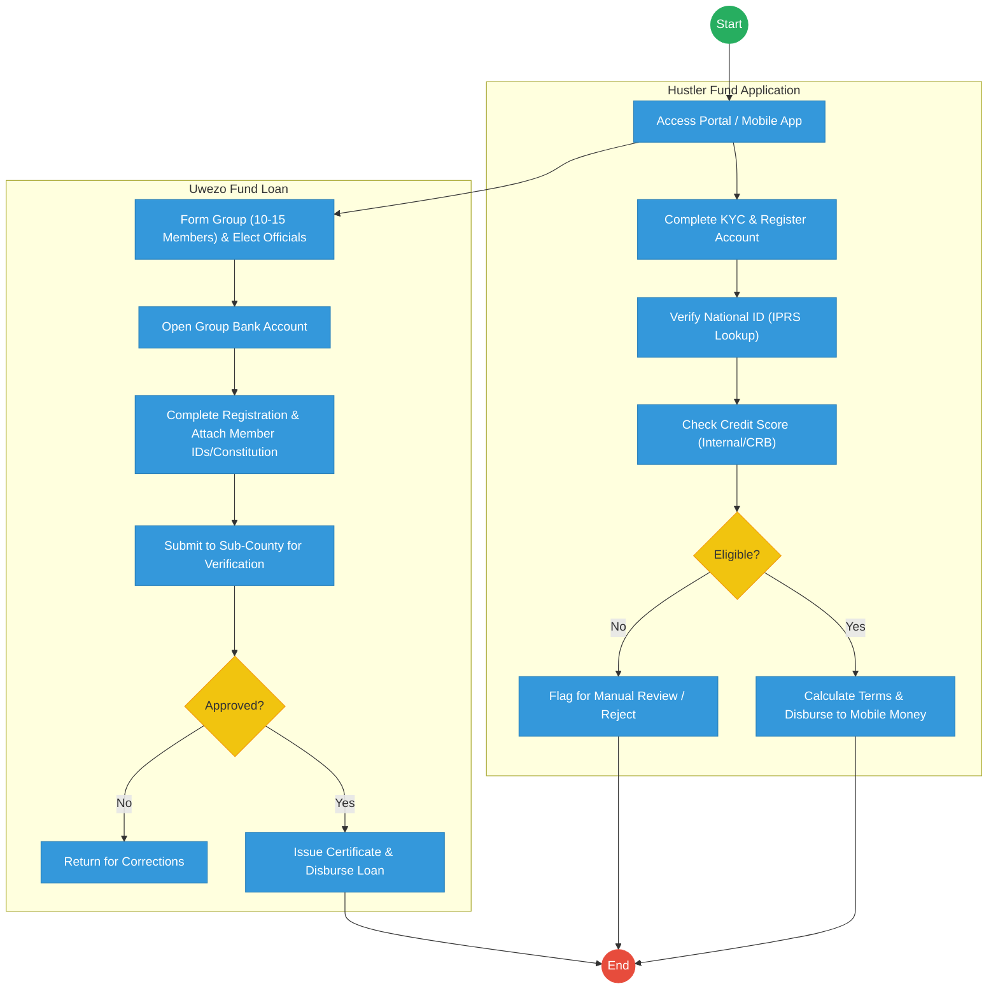
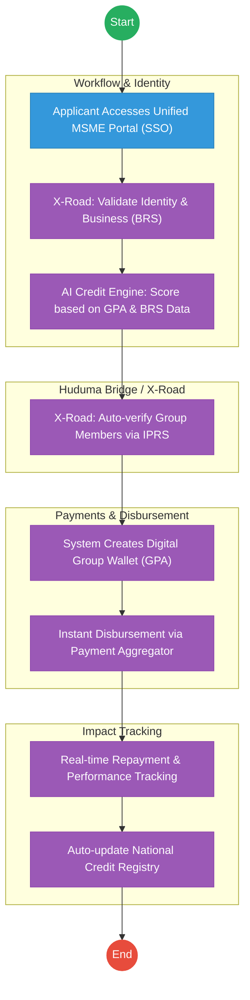

# STATE DEPARTMENT FOR MSME DEVELOPMENT – Service Delivery

## Cover Page
- **Ministry/Department/Agency (MDA):** Ministry of Co-operatives and MSMEs
- **Department:** State Department for MSME Development
- **Process Name:** MSME Credit, Fund Management & Apprenticeship
- **Document Version:** 2.1
- **Date:** 2026-02-24
- **Classification:** Official

---

## Executive Summary
The State Department for MSME Development is mandated to support the growth of small businesses through access to affordable credit (Hustler Fund, Uwezo Fund), capacity building, and apprenticeships (NYOTA). While the Hustler Fund is highly digitized, other funds like Uwezo still rely on manual group registrations and physical bank accounts. The transition to the Kenya DSAP Architecture aims to unify all MSME support into a single digital ecosystem integrated with BRS and the national identity system.

---

## 1. AS-IS Process Flowchart (BPMN 2.0)
*Current State visualization (Hustler Fund & Uwezo Fund based on Deep Dive).*

---

## Process Overview
### Process Name
MSME Credit Access (Hustler/Uwezo), Repayment, and NYOTA Apprenticeship

### Service Category
- G2C (Government to Citizen) / G2B (Government to Business)

### Scope
- **In Scope:** Application, KYC verification, credit scoring, disbursement, and tracking of repayments.
- **Out of Scope:** Commercial bank lending outside government-sponsored funds.

### Triggers
- Citizen/MSME applying for credit or an apprenticeship opportunity.

### End States
- **Successful:** Credit disbursed; Apprenticeship matched; Credit history updated.

### Policy Context
- The Micro and Small Enterprises Act; Public Finance Management (Hustler Fund) Regulations.

---

## Detailed Process (AS-IS)
| Step | Role | Action | Tool/System | Notes |
|---|---|---|---|---|
| 1 | Applicant | Accesses the fund portal (USSD/Web) and registers using their National ID. | USSD / Web Portal | |
| 2 | System | Performs KYC by querying IPRS to verify identity and age eligibility. | IPRS API | |
| 3 | System | Checks internal credit history and external CRB scores to determine the loan limit. | Credit Engine | |
| 4 | Applicant | For Uwezo/NYOTA, attaches scanned copies of business registrations or ID documents. | Manual Upload | |
| 5 | Fund Officer | For group loans, verifies group composition and bank details manually at the Sub-County level. | Standalone System | |

---

## Pain Points & Opportunities
### Pain Points
- **Fragmented Portals:** Hustler, Uwezo, and Women Enterprise Fund (WEF) have different entry points and rules.
- **Manual Group Registration:** Opening physical bank accounts and submitting paper constitutions for Uwezo is a significant barrier.
- **Limited Business Data:** Reliance on ID data alone; lack of integration with BRS for business performance metrics.

### Opportunities
- **Unified MSME Portal:** A single "eCitizen for Business" entry point for all government credit and support programs.
- **Digital Group Wallets:** Replacing physical bank accounts for groups with digital wallets integrated into the **Government Payment Aggregator**.
- **Alternative Credit Scoring:** Using BRS data and transaction history from the **GPA** to provide better credit limits.

---

## 2. TO-BE Process Flowchart (BPMN 2.0)
*Future State visualization (Kenya DSAP Architecture - Huduma Bridge).*

## Future State Process (TO-BE)
### Narrative
**TO-BE Process: Integrated Digital MSME Ecosystem**

**Design Principles:**
- **Unified Entry:** A single-window portal (integrated with eCitizen) for all MSME funds, reducing confusion.
- **Automated Trust:** Using **X-Road** to verify business ownership via **BRS** and group member identities via **IPRS**, removing the need for manual document uploads.
- **Instant Inclusion:** Replacing physical bank accounts with **GPA-linked Digital Wallets**, allowing for instant disbursement and automated split-repayments (e.g., a portion of daily sales goes back to the loan).

### Optimized Steps (Digital)
| Step | Actor | Action | System |
|---|---|---|---|
| 1 | Applicant | Logs in via eCitizen SSO and selects the appropriate MSME fund or support program. | Unified MSME Portal |
| 2 | System | Fetches business history from BRS and tax compliance from KRA via X-Road to assess eligibility. | KeSEL / X-Road |
| 3 | System | For group applications, the system pings the members' phones for digital consent and verifies their "Maisha Namba" status. | Consent Manager |
| 4 | System | Instantly disburses the loan to a digital wallet managed by the Government Payment Aggregator. | GPA / Mobile Money |
| 5 | System | Monitors sales and transactions via the GPA to provide real-time credit score updates and nudge for repayments. | Analytics Engine |

---

## References
- The Micro and Small Enterprises Act.
- Huduma Bridge DSAP Architecture.