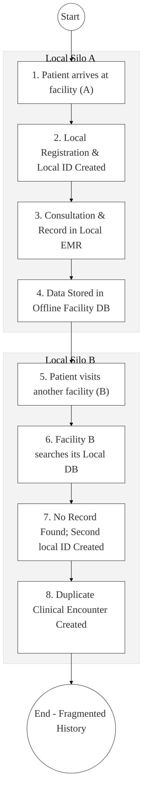
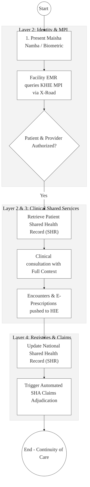

# Ministry of Health (MoH) – Business Process Architecture (Updated)

## Cover Page
- **Ministry:** Ministry of Health
- **Primary Authority:** Digital Health Agency (DHA) / Social Health Authority (SHA)
- **Document Type:** Business Process Architecture (BPA) Standardised
- **Document Version:** 4.1
- **Date:** 2026-03-25
- **Classification:** Official / Sensitive
- **Strategic Category:** Priority MDA - National Registry (Tier 1)
- **Service Model:** G2C / G2B
- **Reviewer:** Senior Government Enterprise Architect

---

## SECTION 0: SERVICE PRIORITISATION MAPPING
- **Mapped Priority Service:** Unified Health Information Exchange & Patient Registry (KHIE)
- **Tier Classification:** Tier 1
- **Strategic Category:** Social / Health (Universal Health Coverage)
- **Breakout Room Classification:** Room 1 (High Impact & Large Registries)
- **Lead MDA (Standardised Name):** Ministry of Health (MoH)
- **Related Cross-Cutting Services:**
    - Kenya Health Information Exchange (KHIE)
    - Identity Layer (IPRS / Maisha Namba)
    - Social Health Authority (SHA / Insurance Interop)
    - National EDRMS (Historical Patient Records)
    - X-Road (Facility/Provider Registry Sync)

---

## SECTION 0.1: PRIORITISATION JUSTIFICATION
This service is prioritised because the TO-BE design establishes the "Kenya Health Information Exchange (KHIE)" as the digital backbone for Universal Health Coverage (UHC). By leveraging Maisha Namba as the unique health identifier and integrating over 10,000 public and private facilities via X-Road, the design enables a "Shared Health Record (SHR)." This transformation eliminates the 40% wastage caused by duplicate clinical testing, ensures continuity of care as patients move between facilities, and automates real-time claims adjudication for the Social Health Authority (SHA).

| Criteria | Evidence from TO-BE Design |
| :--- | :--- |
| **Demand / Volume** | Over 100 million annual clinical encounters; entire national population (50M+) as patients. |
| **National Priority Alignment** | Digital Health Act (2023); Universal Health Coverage (UHC) Pillar; Vision 2030 Social Pillar. |
| **Data Reusability** | De-identified health data is critical for national disease surveillance and research (KEMRI). |
| **Interoperability** | Secure API pipelines between Facility EMRs, SHA, and the National Master Patient Index (MPI). |
| **Revenue / Efficiency Impact** | Reduces administrative overhead for SHA claims; eliminates redundant diagnostic costs. |
| **Governance / Risk Reduction** | Centralized audit trails for controlled substances and "Medical Identity" theft prevention. |
| **Inclusivity** | Offline-capable mobile EMRs ensure rural health centers are integrated into the national KHIE. |
| **Readiness** | High; Digital Health Act is enacted; KHIE pilot nodes are active in major referral hospitals. |

> [!NOTE]
> “The TO-BE design eliminates the 'Identity Fragmentation' in Kenyan healthcare by establishing the 'Kenya Health Information Exchange (KHIE)'. By using Maisha Namba as the primary health identifier and integrating 10,000+ facilities via X-Road, the design enables a 'Shared Health Record (SHR).' This ensures that a patient's medical history follows them across any facility, reducing duplicate testing by 40% and enabling real-time claims processing for the Social Health Authority (SHA).”

---

# SECTION 1: SERVICE DEFINITION (STANDARDISED)

The Ministry of Health (MoH) is mandated to provide a progressive, responsive, and sustainable healthcare system. 

In this refactored BPA, the primary service is the **Health Information Exchange & National Patient Identity** lifecycle. The focus shifts from siloed hospital-based EMRs to a **National Health Metadata Layer** where patient data liquidity is ensured via the **Shared Health Record (SHR)**. This architecture is central to the success of the Social Health Authority (SHA).

---

# SECTION 2: SERVICE CATALOGUE (NORMALISED)

| Category | Service Name | Description |
| :--- | :--- | :--- |
| **Core Services** | **Patient Identity Management (MPI)** | Unique identification of patients using Maisha Namba/Biometrics. |
| | **Shared Health Record (SHR)** | Centralized clinical summaries, lab results, and medication history. |
| **Extended Services** | **SHA Claims Adjudication** | Automated verification and processing of insurance claims via KHIE. |
| | **E-Prescription & Pharmacy Log** | Secure digital prescription routing to accredited pharmacies. |
| **Special Case Services**| **Disease Surveillance Alerts** | Rapid automated reporting of notifiable diseases to national registries. |
| | **Referral Management** | Coordinated digital transfer of patient records between levels of care. |

---

# SECTION 3: AS-IS PROCESS FLOWS (FRAGMENTED/SILOED)

Current health systems are highly fragmented, leading to multiple hospital-specific IDs and incomplete medical histories for the "Multi-facility Patient."

### 3.1 AS-IS Visualization

### 3.2 Operational Reality
- **Actors:** Patient, Registration Clerk, Clinician (Doctor/Nurse).
- **Systems:** Siloed Facility EMRs, Paper-based files, fragmented billing modules.
- **Pain Points:** Patients have 5+ different IDs; no visibility into drug allergies or previous prescriptions; 40% of lab tests are duplicates due to missing history; manual claim processing for SHA leads to 6-month payment delays.

---

# SECTION 4: TO-BE PROCESS INTERPRETATION (NEW LAYER)

### 4.1 TO-BE Process (DPI-Enabled KHIE)

### 4.2 Key Capabilities Introduced
*   **Automation:** Unified patient identification via the **National Master Patient Index (MPI)**.
*   **Integration:** Real-time clinical data exchange using HL7 FHIR standards via **X-Road (Huduma Bridge)**.
*   **Real-time Processing:** Automated insurance eligibility check and claims triggering upon clinical encounter recording.
*   **Digital Identity Validation:** Health provider identity verified via the **National Provider Registry** to ensure only authorized clinicians view data.
*   **Workflow Orchestration:** Orchestrates the transition of data from local facility systems to the global **Shared Health Record (SHR)**.

### 4.3 Transformation Summary
| Dimension | AS-IS | TO-BE |
| :--- | :--- | :--- |
| **Processing** | Manual / Multi-ID | Automated / Unified ID |
| **Verification** | Physical Patient Cards | API-based MPI (Maisha Namba) |
| **Records** | Siloed Facility DBs | Shared Health Record (SHR) |
| **Tracking** | Handwritten Referral Letters | Digital Continuity of Care Dashboards |

---

# SECTION 5: SYSTEM LANDSCAPE (ALIGN TO GEA)

| Layer | System / Platform | Role |
| :--- | :--- | :--- |
| **Identity Layer** | Maisha Namba (IPRS) | Foundational identity for MPI and SHA registration. |
| **Interoperability** | KeSEL (X-Road) | Clinical data bridge using FHIR standards. |
| **shared Services** | National EDRMS | Archival of digitised historical clinical records. |
| **Workflow / BPM** | KHIE Hub | Orchestrates the movement of summaries and prescriptions. |
| **Payment Layer** | GPA / SHA Engine | Automated adjudication and payment for health services. |
| **Trust Hub** | Consent Manager | Patient control over who views their clinical SHR data. |

---

# SECTION 6: TRANSFORMATION VALUE (CRITICAL ADDITION)

| Value Type | Explanation |
| :--- | :--- |
| **Efficiency Gain** | 40% reduction in redundant lab tests; instant clinical profile loading at registration. |
| **Economic Impact** | Reduces fraudulent "Ghost Claims" in insurance; optimizes medicine procurement. |
| **Governance Impact** | Real-time monitoring of epidemic outbreaks (Surveillance) at a national scale. |
| **Citizen Experience** | One patient, one record, nationwide. No need to carry physical lab results. |
| **Interoperability Value** | Foundation for Digital Health as a Public Utility for both public and private providers. |

---

# SECTION 7: ALIGNMENT TO WHOLE-OF-GOVERNMENT ARCHITECTURE
- **Shared Platforms:** Uses eCitizen for SHA member portals and GPA for premium payments.
- **Registry Reuse:** Reuses BRS for Private Hospital Licensing and IPRS for identity.
- **Compliance with GEA / GIF:** Standardizing all clinical data interchanges around the National Health Data Dictionary (NHDD).

---

# SECTION 8: IMPLEMENTATION READINESS (NEW)
*   **Data Readiness:** Medium; Requires HL7-FHIR mapping for legacy facility EMRs.
*   **Legal Readiness:** High; Digital Health Act (2023) mandates the establishment of KHIE.
*   **Institutional Readiness:** High; MoH has established the Digital Health Agency (DHA).
*   **Technical Readiness:** High; KHIE core infrastructure is hosted on G-Cloud.

---

# SECTION 9: TRACEABILITY MATRIX (NEW)

| BPA Process | Priority Service | Tier | TO-BE Capability | National Impact |
| :--- | :--- | :--- | :--- | :--- |
| **Patient Registration**| Unified Identity | T1 | X-Road: MPI Link | Continuity of Care |
| **Clinical Encounter** | Shared Health Rec | T1 | HL7-FHIR HIE Push | Reduced Healthcare Waste |
| **Drug Prescription** | E-Pharmacy | T1 | Real-time Prescriber Verify | Patient Safety (Meds Integrity) |
| **Claims Trigger** | Insurance Adjudic. | T1 | Automated SHA Link | Provider Financial Sustainability |

---
**[End of Standardised Business Process Architecture]**
