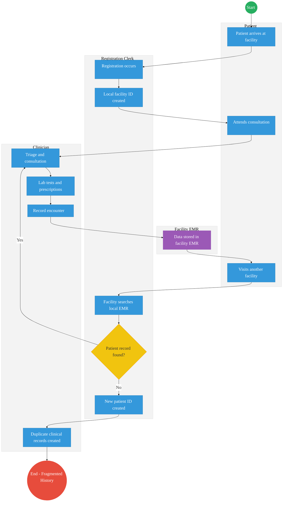
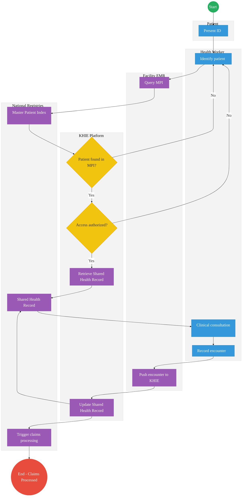

# MINISTRY OF HEALTH – Service Delivery

## Cover Page
- **Ministry/Department/Agency (MDA):** MINISTRY OF HEALTH
- **Process Name:** Health Information Exchange
- **Document Version:** 2.1
- **Date:** 2026-03-04
- **Classification:** Official
- **Strategic Category:** Priority MDA
- **Service Model:** G2C
- **Life-Cycle Group:** Cradle to Death (1. The Cradle)

## Service Mandate
The Ministry of Health’s (MoH) primary mandate is to build a progressive, responsive, and sustainable healthcare system to ensure all Kenyans attain the highest standard of health, as enshrined in the Constitution of Kenya 2010. Following the devolution of government in 2013, the Ministry’s role is structured around four core pillars:
1. **Health Policy:** Formulating national policies, standards, and guidelines.
2. **Health Regulation:** Oversight of health services, professionals, and products.
3. **National Referral Facilities:** Management of tertiary hospitals (e.g., Kenyatta National Hospital, Moi Teaching and Referral Hospital).
4. **Capacity Building & Technical Assistance:** Supporting the 47 County Governments, which are responsible for direct service delivery.
Core Functions include:
* **Preventive & Promotive Health:** Disease surveillance, immunization, and public health education.
* **Curative Services:** Oversight of clinical standards and specialized treatment.
* **Sanitation & Food Safety:** Policy and inspection for environmental health and food handling.
* **Health Research:** Coordinating research through agencies like KEMRI.
* **Universal Health Coverage (UHC):** Implementing reforms such as the Social Health Authority (SHA) to ensure affordable access to care.

---

## Executive Summary
The Ministry of Health plays a foundational role in the citizen lifecycle. Current health systems are highly fragmented, leading to poor patient experiences with multiple hospital-specific IDs and incomplete medical histories. The transition to the Kenya Health Information Exchange (KHIE) Architecture and a Shared Health Record (SHR) aims to unify patient identities and care data across all facilities.

---

## 1. AS-IS Process Flowchart (BPMN 2.0)
*Current State visualization (Fragmented Patient Identity based on Deep Dive).*

---

## Process Overview
### Process Name
Health Service Delivery & Identity

### Service Category
- G2C (Government to Citizen)

### Scope
- **In Scope:** Patient registration, clinical encounters, and data aggregation across public and private health facilities.
- **Out of Scope:** Core hospital billing logic (managed locally).

### Triggers
- Patient arriving at a health facility for care.

### End States
- **Successful (Current):** Care is provided, but data remains siloed in local facility systems.

### Policy Context
- Digital Health Act 2023; Health Act 2017; Data Protection Act 2019.

---

## Detailed Process (AS-IS)

| Step | Role | Action | Tool/System | Notes |
|---|---|---|---|---|
| 1 | Patient | Patient arrives at facility. | Physical | |
| 2 | Registration Clerk | Registration occurs and a local facility ID is created. | Paper/Local EMR | |
| 3 | Clinician | Performs triage and consultation, followed by lab tests and prescriptions. | Local EMR | |
| 4 | Clinician | Records the clinical encounter. | Local EMR | |
| 5 | Facility EMR | Data is stored in the facility EMR. | Local EMR | Data remains siloed. |
| 6 | Patient | Patient visits another facility for further care. | Physical | |
| 7 | Registration Clerk | Facility searches local EMR for the patient's record. | Local EMR | |
| 8 | Registration Clerk | No record found. A new patient ID is created at the second facility. | Local EMR | Identity becomes fragmented. |
| 9 | Clinician | Duplicate clinical records created without visibility into previous history. | Local EMR | Results in fragmented medical history and duplicate testing. |

---

## Pain Points & Opportunities
### Pain Points
- **Fragmented Identity:** Patients have different IDs at every hospital.
- **Data Silos:** Medical history, lab results, and prescriptions cannot be securely shared between facilities.
- **Incomplete Visibility:** The Ministry cannot view comprehensive public health data in real time.

### Opportunities
- **National KHIE Integration:** Deploying a central health exchange using the DSAP X-Road layer.
- **Unified Identity:** Leveraging Maisha Namba as the primary health identifier.
- **Shared Health Record (SHR):** Centralized clinical repository for continuity of care.

---

## 2. TO-BE Process Flowchart (BPMN 2.0)
*Future State visualization (Kenya Health Information Exchange - KHIE Architecture).*

## Future State Process (TO-BE)
### Narrative
**TO-BE Process: Kenya Health Information Exchange (KHIE)**

**Design Principles:**
- **Patient-Centric Identity:** Relying on IPRS/Maisha Namba via the Huduma Bridge to eliminate duplicate profiles.
- **Data Liquidity:** X-Road-based interoperability to allow secure exchange of clinical summaries, lab results, and prescriptions across all accredited facilities.
- **Automated Claims:** Seamless integration with the Social Health Authority (SHA) for real-time claims and coverage checks.

**Core National Components:**
- **Master Patient Index (MPI):** Central registry for unique patient identification.
- **Shared Health Record (SHR):** Centralized clinical repository for continuity of care.
- **Health Information Exchange (HIE):** Interoperability layer for secure data sharing.
- **Facility Registry:** Authoritative source for health facilities.
- **Provider Registry:** Authoritative source for healthcare workers.

### Optimized Steps (Digital)

| Step | Actor | Action | System |
|---|---|---|---|
| 1 | Health Worker | Patient identified using Maisha Namba or biometrics. | Facility EMR |
| 2 | Facility EMR | Facility system queries Master Patient Index (MPI) to locate the patient's unified profile. | KHIE MPI / X-Road |
| 3 | KHIE Platform | Patient profile retrieved. System retrieves Shared Health Record (SHR) upon authorization. | KHIE SHR / X-Road |
| 4 | Clinician | Clinician performs consultation with access to unified history, lab results, and medications. | Facility EMR |
| 5 | Clinician | Encounter recorded, including treatments and e-prescriptions. | Facility EMR |
| 6 | Facility EMR | Data shared via HIE (pushed to KHIE platform). | KHIE API Gateway |
| 7 | KHIE Platform | Updates the national Shared Health Record (SHR) immediately with new encounter data. | KHIE SHR |
| 8 | National Registries | Claims triggered for Social Health Authority (SHA) based on the recorded encounter. | Govt Payment Aggregator / SHA |

---

## References
- https://www.health.go.ke
- Digital Health Act 2023
- Desk Review

---

### Validation Survey
Please provide your feedback here: [https://ee.kobotoolbox.org/x/4Ls7SlCG](https://ee.kobotoolbox.org/x/4Ls7SlCG)

