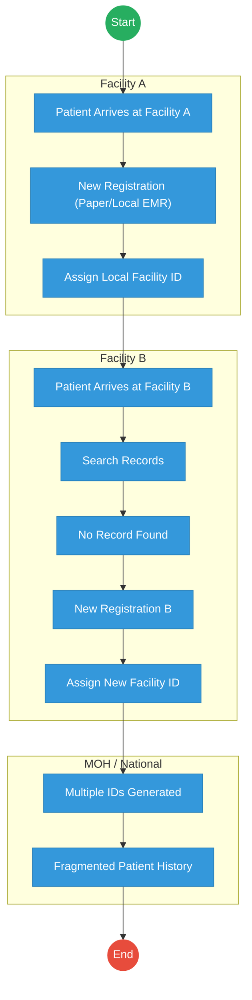
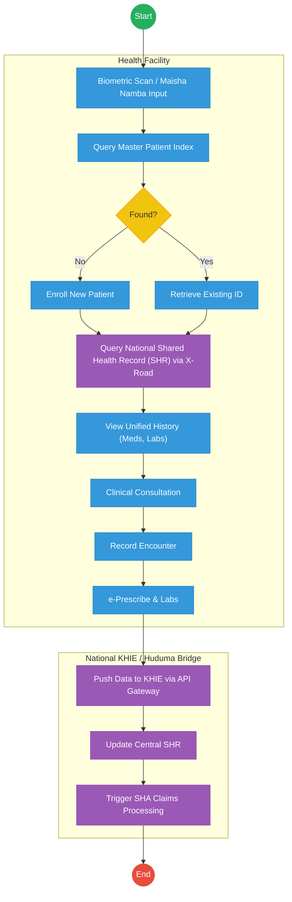

# MINISTRY OF HEALTH – Service Delivery

## Cover Page
- **Ministry/Department/Agency (MDA):** MINISTRY OF HEALTH
- **Process Name:** Health Information Exchange
- **Document Version:** 2.1
- **Date:** 2026-02-24
- **Classification:** Official

---

## Executive Summary
The Ministry of Health plays a foundational role in the citizen lifecycle. Current health systems are highly fragmented, leading to poor patient experiences with multiple hospital-specific IDs and incomplete medical histories. The transition to the Kenya Health Information Exchange (KHIE) Architecture and a Shared Health Record (SHR) aims to unify patient identities and care data across all facilities.

---

## 1. AS-IS Process Flowchart (BPMN 2.0)
*Current State visualization (Fragmented Patient Identity based on Deep Dive).*

---

## Process Overview
### Process Name
Health Service Delivery & Identity

### Service Category
- G2C (Government to Citizen)

### Scope
- **In Scope:** Patient registration, clinical encounters, and data aggregation across public and private health facilities.
- **Out of Scope:** Core hospital billing logic (managed locally).

### Triggers
- Patient arriving at a health facility for care.

### End States
- **Successful (Current):** Care is provided, but data remains siloed in local facility systems.

### Policy Context
- Digital Health Act 2023; Health Act 2017; Data Protection Act 2019.

---

## Detailed Process (AS-IS)
| Step | Role | Action | Tool/System | Notes |
|---|---|---|---|---|
| 1 | Patient | Arrives at Facility A. | Physical | |
| 2 | Registration Clerk | Creates a new patient file and assigns a local Facility A ID. | Paper/Local EMR | |
| 3 | Patient | Later visits a different facility (Facility B) for care. | Physical | |
| 4 | Registration Clerk | Searches for the patient in Facility B's system, finds no record. | Local EMR | |
| 5 | Registration Clerk | Creates another new patient file and assigns a new Facility B ID. | Paper/Local EMR | |
| 6 | MOH Systems | Patient ends up with multiple disconnected IDs across the health ecosystem, leading to fragmented medical history and duplicate testing. | Siloed Systems | |

---

## Pain Points & Opportunities
### Pain Points
- **Fragmented Identity:** Patients have different IDs at every hospital.
- **Data Silos:** Medical history, lab results, and prescriptions cannot be securely shared between facilities.
- **Incomplete Visibility:** The Ministry cannot view comprehensive public health data in real time.

### Opportunities
- **National KHIE Integration:** Deploying a central health exchange using the DSAP X-Road layer.
- **Unified Identity:** Leveraging Maisha Namba as the primary health identifier.
- **Shared Health Record (SHR):** Centralized clinical repository for continuity of care.

---

## 2. TO-BE Process Flowchart (BPMN 2.0)
*Future State visualization (Kenya Health Information Exchange - KHIE Architecture).*

## Future State Process (TO-BE)
### Narrative
**TO-BE Process: Kenya Health Information Exchange (KHIE)**

**Design Principles:**
- **Patient-Centric Identity:** Relying on IPRS/Maisha Namba via the Huduma Bridge to eliminate duplicate profiles.
- **Data Liquidity:** X-Road-based interoperability to allow secure exchange of clinical summaries, lab results, and prescriptions across all accredited facilities.
- **Automated Claims:** Seamless integration with the Social Health Authority (SHA) for real-time claims and coverage checks.

### Optimized Steps (Digital)
| Step | Actor | Action | System |
|---|---|---|---|
| 1 | Health Worker | Inputs Maisha Namba or captures biometrics to identify the patient upon arrival. | Facility EMR |
| 2 | Point of Care System | Queries the central Master Patient Index via X-Road to locate the patient's unified profile. | KHIE MPI / X-Road |
| 3 | Point of Care System | Pulls the patient's Shared Health Record (SHR), giving the clinician instant access to allergies, meds, and recent labs. | KHIE SHR / X-Road |
| 4 | Clinician | Conducts the consultation, records the encounter, and e-prescribes treatments. | Facility EMR |
| 5 | Core System | Pushes the encounter data back to the KHIE to update the SHR immediately. | KHIE API Gateway |
| 6 | Core System | Automatically triggers claims processing to the Social Health Authority (SHA) based on the recorded encounter. | Govt Payment Aggregator / SHA |

---

## References
- Digital Health Act 2023.
- Huduma Bridge DSAP Architecture.