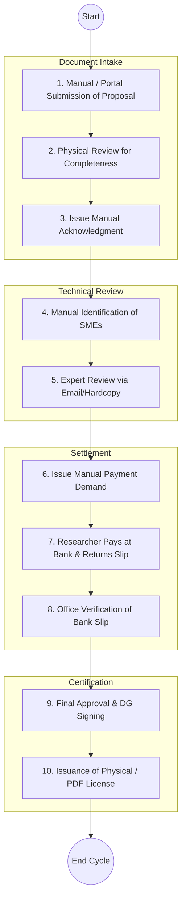
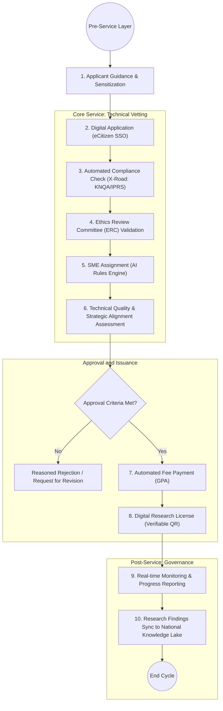

# STATE DEPARTMENT FOR SCIENCE, RESEARCH AND INNOVATION (SRI) – Advanced Research Ecosystem

## Cover Page
- **Ministry:** Ministry of Education
- **State Department:** State Department for Science, Research and Innovation (SRI)
- **Primary Authority:** National Commission for Science, Technology and Innovation (NACOSTI)
- **Document Type:** End-to-End Service Lifecycle Document (BPR Aligned)
- **Document Version:** 3.1 (Strategic Governance Model)
- **Date:** 2026-03-24
- **Classification:** Official
- **Strategic Category:** Priority MDA
- **Service Model:** G2B / G2C
- **Reviewer:** Senior Government Transformation Consultant

---

# PART 1: EXECUTIVE SUMMARY

The State Department for Science, Research and Innovation (SRI) is the strategic engine for Kenya's knowledge economy. This document refactors the research licensing and regulatory process into a **Full Service Lifecycle Model**. 

The transition shifts the department from a "transactional permit issuer" to a **comprehensive research governance authority**. By integrating Pre-service guidance, Core-service automated vetting, and Post-service compliance monitoring, the department ensures that all scientific activities in Kenya are ethically sound, strategically aligned with national priorities (e.g., KJET, Digitization), and captured as high-value intellectual capital within the **National Research Repository**.

---

---

# PART 2: AS-IS PROCESS (LEGACY REALITY)

The current operational state of research licensing is characterized by manual intersections, bank-based financial reconciliation, and fragmented communication with Institutional Review Boards (IRBs).

### 2.1 AS-IS Process Flowchart (Manual/Sequential)

### 2.2 AS-IS Process Details

| Step | Role | Action | Tool/System | Pain Points |
| :--- | :--- | :--- | :--- | :--- |
| **1** | Researcher | **Submission:** Enters details and uploads proposal. | Portal / Email | No real-time link to academic standing registries. |
| **2** | Clerk | **Completeness Check:** Manually verifies documents. | Checklist | Subjective and slow. |
| **3** | Technical Officer| **Expert Assignment:** Searches for a suitable examiner. | Spreadsheet / Memory | Inefficient; potential for bias or delays. |
| **4** | Examiner | **Review:** Vets the study's technical and ethical merit. | Word / Email | No integration with the ethics committee's system. |
| **5** | Finance Officer | **Reconciliation:** Wait for bank slip to clear manually. | Bank Statements | **Primary Bottleneck:** Takes 3-5 business days. |
| **6** | Director Gen. | **Sign-off:** Final decision on the permit. | Physical / Digitized Sign | Non-verifiable output for many field officers. |

---

# PART 3: ENHANCED SERVICE LIFECYCLE MODEL (TO-BE)

The SRI service model is structured into three distinct phases to ensure operational realism and regulatory depth.

### 3.1 The Research Lifecycle Journey
1.  **Pre-Service (Awareness & Guidance):** Proactive engagement via the SRI portal to provide "Researcher Onboarding Kits" and ethical guidelines before an application is even started.
2.  **Core-Service (The Licensing Track):** The streamlined path from Digital Application to Vetting, Approval, and Issuance.
3.  **Post-Service (Monitoring & Compliance):** Ongoing tracking of research progress, mandatory reporting of findings, and feedback loops for policy improvement.

---

# PART 4: UPDATED PROCESS DESIGN (DETAILED)

### 4.1 Decision Logic and SLAs
- **Standard Vetting:** (Local Students) Target SLA: **48 Hours**. Decision rules based on pre-vetted institutional lists.
- **Complex Vetting:** (Foreign Experts / High Sensitive Areas) Target SLA: **10 Business Days**. Requires human-in-the-loop SME review and multi-agency clearance.

---

# PART 5: PRE + CORE + POST SERVICE STRUCTURE

| Phase | Category | Process Element | Mode |
| :--- | :--- | :--- | :--- |
| **Pre-Service** | Guidance | Access to "Research Priority Areas" and "Ethics Standards" dashboard. | Digital (Open Access) |
| **Core-Service** | Application | Researcher identity (IPRS) and academic standing (KNQA/CUE) verification. | Fully Digital (X-Road) |
| **Core-Service** | Vetting | Assignment to **Subject Matter Examiners (SMEs)** based on research cluster tagging. | Hybrid (System Assignment + Human Review) |
| **Core-Service** | Approval | Automated approval for low-risk renewals; DG wet-signature replaced by NPKI Digital Signature. | Digital |
| **Post-Service** | Monitoring | Submission of progress reports and metadata capture for the national repository. | Digital / Field Audit |

---

# PART 6: RECORDS & DATA GOVERNANCE

1.  **Digital Records Lifecycle:** All research proposals, emails, and data artifacts are captured and retained according to the **National Records Retention Policy**.
2.  **Intellectual Property (IP) Protection:** Integration of **KIPI** data to ensure research findings don't infringe on existing patents and to facilitate IP registration of new innovations.
3.  **Data Protection:** Full compliance with the **Data Protection Act (2019)** regarding the storage and sharing of researcher sensitive data and study findings.
4.  **Classification:** Data is classified (Open, Restricted, Confidential) based on its strategic impact on national security or commercial value.

---

# PART 7: DPI & INTEGRATION

The SRI platform acts as a terminal within the **Kenya DSAP Architecture**:
- **Identity:** Using **Maisha Namba** for researcher identity and **BRS** for institutional verification.
- **Interoperability:** **X-Road** for cross-referencing ethics approval from IRBs and academic credentials from KNQA/Universities.
- **Trust:** **NPKI (National PKI)** for sealing research licenses with a cryptographic signature, making them globally verifiable.
- **Settlement:** **GPA (Government Payment Aggregator)** for seamless fee collection and reconciliation across different fund categories (NACOSTI, NRF).

---

# PART 8: IMPLEMENTATION PHASING

- **Short-Term (0-6 Months):** Digitization of the Application and Payment layers. Transition of physical licenses to PDF with QR codes. (Hybrid Model).
- **Medium-Term (6-18 Months):** Full API integration with KNQA, CUE, and major universities via X-Road. Implementation of the **Full Ethics Sync** (ERC).
- **Long-Term (18+ Months):** Deployment of the **AI Rules Engine** for automated SME matching and predictive risk categorization for research projects.

---

# PART 9: GOVERNANCE & CAPACITY

### 8.1 Institutional Roles
- **Ministry (SRI):** Policy oversight and high-level strategic direction.
- **NACOSTI:** Primary regulator and licensing authority.
- **KENIA / NRF:** Coordination for innovation commercialization and research funding.
- **DTU:** The **Digital Transformation Unit** coordinates cross-agency system uptime and data sharing agreements.

### 8.2 Capacity Building
- **Digital Literacy:** Training for technical examiners on using the new workflow engine.
- **Data Governance Skills:** Workshops on IP law, data privacy, and secure research handling for all NACOSTI staff.
- **AI Literacy:** Training for the technical committee on interpreting AI-driven risk scores.

---

# PART 10: CHANGE LOG

| Area | Original Issue | Change Made | Impact |
| :--- | :--- | :--- | :--- |
| **Service Scope** | Just Application/Issuance | **Full Lifecycle (Pre/Core/Post)** | Comprehensive regulatory coverage. |
| **Decision Logic** | No defined SLAs/Criteria | **SLA-based Rules Engine** | Operational realism and predictability. |
| **Integration** | Disconnected from registries | **Deep X-Road (KNQA+ERC) Sync** | Removal of manual vetting delays. |
| **Governance** | Lacked IP/Legal layer | **Integrated IP & Legal Structure** | Secure knowledge economy protection. |
| **Records** | Passive storage | **Active Records Lifecycle Management**| Persistent intellectual capital preservation. |
| **Post-Service** | Omitted | **Monitoring & Reporting Workflow** | Real-time compliance and impact tracking. |

---
**[End of Document]**
