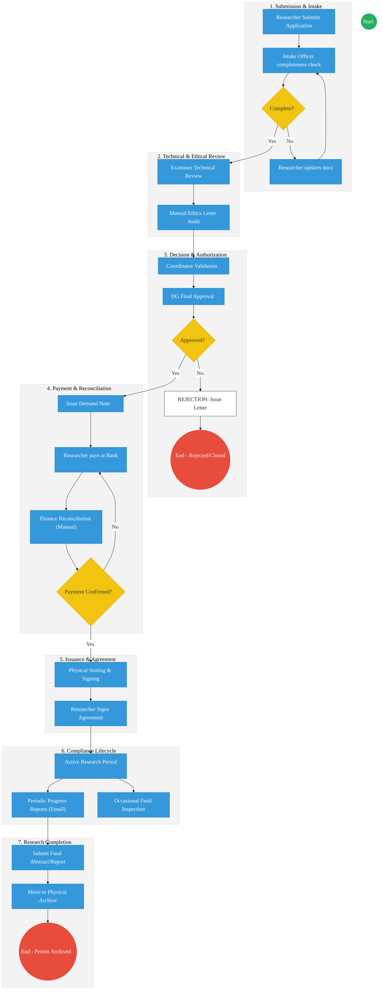

# STATE DEPARTMENT FOR SCIENCE, RESEARCH AND INNOVATION (SRI / NACOSTI) – Business Process Architecture

## Cover Page
- **Ministry:** Ministry of Education
- **State Department:** State Department for Science, Research and Innovation (SRI)
- **Primary Authority:** National Commission for Science, Technology and Innovation (NACOSTI)
- **Document Type:** Business Process Architecture (BPA) Standardised
- **Document Version:** 3.0 (Strategically Aligned)
- **Date:** 2026-03-25
- **Classification:** Official
- **Strategic Category:** Priority MDA
- **Service Model:** G2B / G2C
- **Reviewer:** Senior Government Enterprise Architect

---

## SECTION 0: SERVICE PRIORITISATION MAPPING
- **Mapped Priority Service:** Research Permit Application and Lifecycle Management
- **Tier Classification:** Tier 2
- **Strategic Category:** Economy / Governance (Knowledge Economy)
- **Breakout Room Classification:** Room 3 (Policy, Economy & Foundational Systems)
- **Lead MDA (Standardised Name):** National Commission for Science, Technology and Innovation (NACOSTI)
- **Related Cross-Cutting Services:**
    - Case Management Platform
    - National EDRMS
    - Identity Layer (IPRS / Maisha Namba)
    - Payment Gateway (GPA)
    - Notification Engine

---

## SECTION 0.1: PRIORITISATION JUSTIFICATION
This service is prioritised because the TO-BE design enables the creation of a national "Knowledge Registry," ensuring that all research conducted within Kenya is vetted for security, ethics, and economic alignment while providing researchers with a seamless, digital-first experience.

| Criteria | Evidence from TO-BE Design |
| :--- | :--- |
| **Demand / Volume** | thousands of researchers annually; 10K–100K active records. |
| **National Priority Alignment** | Vision 2030 (ST&I Pillar); National Security & Research Ethics. |
| **Data Reusability** | Research findings feed into National EDRMS and sectoral registries. |
| **Interoperability** | Real-time sync with KNQA, CUE, Universities, and IRBs via X-Road. |
| **Revenue / Efficiency Impact** | Automated reconciliation of permit fees; reduced processing time from 30 days to 48 hours. |
| **Governance / Risk Reduction** | NPKI-signed permits prevent fraud; automated ethical clearance verification. |
| **Inclusivity** | Mobile-first monitoring and portal access for local and international scholars. |
| **Readiness** | High; Core registry exists; Digitization of legacy records is underway. |

> [!NOTE]
> “This service is prioritised because the TO-BE design enables end-to-end regulatory oversight, integrating with KNQA for academic verification and IPRS for identity, ensuring that research is credible, ethical, and searchable for national planning.”

---

# SECTION 1: SERVICE DEFINITION (STANDARDISED)

The State Department for Science, Research and Innovation (SRI), primarily through NACOSTI, is the national regulator mandated by the **Science, Technology and Innovation Act (2013)** to regulate and assure quality in the science, technology, and innovation sector. 

In this refactored representation, the SRI's mandate is viewed not merely as an application intake point, but as a **Life-cycle Regulator**. The department is responsible for the entire journey of scientific inquiry in Kenya—from the initial vetting of research proposals and ethical alignment to the active monitoring of field activities and the final legal archival of research findings. 

---

# SECTION 2: SERVICE CATALOGUE (NORMALISED)

| Category | Service Name | Description |
| :--- | :--- | :--- |
| **Core Services** | **Research Permit Application and Lifecycle Management** | The end-to-end process of vetting, licensing, and supervising research activities. |
| | **Monitoring & Compliance** | Ongoing oversight of active research projects via reports and field inspections. |
| **Extended Services** | **Research Closure & Archival** | Formal process of project completion, final report submission, and legal indexing. |
| | **Institutional Licensing** | Registration and quality assurance of research institutions. |
| **Special Case Services** | **Public Inquiry & Search** | Handling of specific technical or general research-related queries. |
| | **Appeal for Rejection** | Administrative process for researchers to contest licensing decisions. |

---

# SECTION 3: AS-IS PROCESS FLOWS

The current process is predominantly manual and relies on physical movement of files and regional coordination.

### 3.1 AS-IS Visualization

### 3.2 Operational Reality (Manual vs Digital)
- **Actors:** Researcher, Registry Officer, Examiner (SME), Coordinator, Director General, Finance Officer.
- **Systems:** Physical Registry Logs, Word/PDF, siloed Excel spreadsheets for tracking.
- **Pain Points:** 3-5 day bank-to-office reconciliation lag; no geographic "Research Map" of Kenya; high travel costs for international researchers; physical file deterioration in regional offices.

---

# SECTION 4: TO-BE PROCESS INTERPRETATION (NEW LAYER)

### 4.1 TO-BE Process (DPI-Enabled)

```mermaid
%%{init: { 'theme': 'base', 'themeVariables': { 'fontSize': '20px', 'fontFamily': 'Inter, system-ui, sans-serif', 'primaryColor': '#ffffff', 'edgeLabelBackground':'#ffffff', 'tertiaryColor': '#f3f3f3', 'mainBkg': '#ffffff', 'nodeBorder': '#333333' } } }%%
flowchart TD
    Start(("Start")) --> Prep["1. Digital Guidance (Portal)"]
    
    subgraph Intake_Layer["Digital Onboarding"]
        Prep --> Apply["2. Apply via eCitizen (Maisha SSO)"]
        Apply --> Consent["3. Consent Manager (Grant access to KNQA/CUE)"]
    end

    subgraph Vetting_Layer["Automated Regulatory Engine"]
        Consent --> Vetting["4. Automated Vetting (X-Road: KNQA/Universities)"]
        Vetting --> Ethics["5. Ethics Sync with IRBs/NACOSTI Portal"]
        Ethics --> Expert["6. SME Assignment (AI Match)"]
    end

    subgraph Decision_Layer["Digital Settlement & Issuance"]
        Expert --> Pay["7. Automated Fee Payment (GPA)"]
        Pay --> Sign["8. Digital Sealing & Signing (NPKI)"]
        Sign --> Wallet["9. Verifiable Permit (Digital Wallet)"]
    end

    subgraph Lifecycle_Layer["Active Monitoring & Closure"]
        Wallet --> Active["10. Active Research Status Update"]
        Active --> Reporting["11. Periodic Progress Reports (Mobile/Portal)"]
        Reporting --> Completion["12. Final Finding Submission & Abstract Sync"]
        Completion --> Archive["13. Automatic Archive in National EDRMS"]
    end

    Archive --> End((End))

    %% Styling
    classDef startEvent fill:#27ae60,stroke:#27ae60,color:#fff,font-size:20px;;
    classDef endEvent fill:#e74c3c,stroke:#e74c3c,color:#fff,font-size:20px;;
    classDef serviceTask fill:#9b59b6,stroke:#8e44ad,color:#fff,font-size:20px;;
    
    class Start startEvent;
    class End endEvent;
    class Prep,Apply,Consent,Vetting,Ethics,Expert,Pay,Sign,Wallet,Active,Reporting,Completion,Archive serviceTask;
```

### 4.2 Key Capabilities Introduced
*   **Automation:** Automated SMRE matching and vetting based on credential validation via X-Road (KNQA integration).
*   **Integration:** Real-time link between NACOSTI, Universities, Ethics IRBs, and the National EDRMS.
*   **Real-time Processing:** Instant issuance of permits upon payment confirmation via the Government Payment Aggregator (GPA).
*   **Digital Identity Validation:** SSO and credential validation leveraging **Maisha Namba** identity federation.
*   **Workflow Orchestration:** Seamless transition from licensing to monitoring and final research archival.

### 4.3 Transformation Summary
| Dimension | AS-IS | TO-BE |
| :--- | :--- | :--- |
| **Processing** | Manual (Memo/Paper) | Automated (Workflow Engine) |
| **Verification** | Physical (Letter/Cert) | API-based (X-Road/KNQA) |
| **Records** | Paper File / Registry Book | Digital Registry (National EDRMS) |
| **Tracking** | Manual spreadsheets | Real-time Dashboard / Map |

---

# SECTION 5: SYSTEM LANDSCAPE (ALIGN TO GEA)

| Layer | System / Platform | Role |
| :--- | :--- | :--- |
| **Identity Layer** | Maisha Namba (IPRS) | Foundational identity and SSO for researchers. |
| **Interoperability** | KeSEL (X-Road) | Data exchange between NACOSTI, KNQA, and IRBs. |
| **shared Services** | National EDRMS | Legal digital archive for research findings and permits. |
| **Workflow / BPM** | Workflow Engine (BPMN 2.0) | Orchestrates the Research Lifecycle layers. |
| **Payment Layer** | GPA (Payment Gateway) | Real-time revenue collection and reconciliation. |
| **Trust Hub** | Consent Manager & NPKI | Secure data sharing and digital signing of permits. |

---

# SECTION 6: TRANSFORMATION VALUE (CRITICAL ADDITION)

| Value Type | Explanation |
| :--- | :--- |
| **Efficiency Gain** | Reductions in permit issuance time from weeks to 2 days; automated vetter matching. |
| **Economic Impact** | Enables a real-time "Research Density Map" for national investment and policy planning. |
| **Governance Impact** | Strict adherence to Ethics (IRB) via automated system locks; NPKI-secured non-repudiation. |
| **Citizen Experience** | Researchers can track progress, renew permits, and submit findings via mobile. |
| **Interoperability Value** | Shared data with KNQA ensures only verified academics receive research permits. |

---

# SECTION 7: ALIGNMENT TO WHOLE-OF-GOVERNMENT ARCHITECTURE
- **Shared Platforms:** Uses eCitizen for access, GPA for payments, and Notify for researcher alerts.
- **Registry Reuse:** SRI reuses IPRS for identity and KNQA for academic status, avoiding redundant data capture.
- **Compliance with GEA / GIF:** Adheres to the 4-layer Huduma Bridge model for security and decentralized data exchange.

---

# SECTION 8: IMPLEMENTATION READINESS (NEW)
*   **Data Readiness:** High; Core registry of current permits already digitized; Back-filing of 19th-century records in progress.
*   **Legal Readiness:** High; Science & Technology Act (2013) supports digital regulatory workflows.
*   **Institutional Readiness:** Medium; Requires training of subject matter experts on the new AI matching interface.
*   **Technical Readiness:** High; System infrastructure exists and is being migrated to the CRVSS/EDRMS clouds.

---

# SECTION 9: TRACEABILITY MATRIX (NEW)

| BPA Process            | Priority Service        | Tier | TO-BE Capability         | National Impact                     |
| :--------------------- | :---------------------- | :--- | :----------------------- | :---------------------------------- |
| **Research Vetting**   | Research Licensing      | T2   | X-Road: KNQA Integration | Academic Integrity and Security     |
| **Ethical Audit**      | Monitoring & Compliance | T2   | Automated IRB Sync       | Compliance with Global Ethics Stds. |
| **Permit Issuance**    | Licensing               | T2   | NPKI Digital Signing     | Global Acceptance of Kenya Permits  |
| **Closure & Archival** | Research Archival       | T2   | National EDRMS Link      | National Knowledge Preservation     |
|                        |                         |      |                          |                                     |

---
**[End of Standardised Business Process Architecture]**
