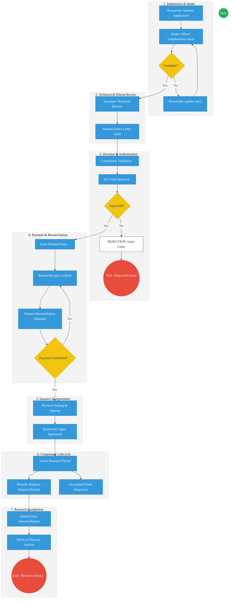

```mermaid
%%{init: { 'theme': 'base', 'themeVariables': { 'fontSize': '20px', 'fontFamily': 'Inter, system-ui, sans-serif', 'primaryColor': '#ffffff', 'edgeLabelBackground':'#ffffff', 'tertiaryColor': '#f3f3f3', 'mainBkg': '#ffffff', 'nodeBorder': '#333333' } } }%%
flowchart TD
    Start(("Start")) --> Prep["1. Digital Guidance (Portal)"]
    
    subgraph Intake_Layer["Digital Onboarding"]
        Prep --> Apply["2. Apply via eCitizen (Maisha SSO)"]
        Apply --> Consent["3. Consent Manager (Grant access to KNQA/CUE)"]
    end

    subgraph Vetting_Layer["Automated Regulatory Engine"]
        Consent --> Vetting["4. Automated Vetting (X-Road: KNQA/Universities)"]
        Vetting --> Ethics["5. Ethics Sync with IRBs/NACOSTI Portal"]
        Ethics --> Expert["6. SME Assignment (AI Match)"]
    end

    subgraph Decision_Layer["Digital Settlement & Issuance"]
        Expert --> Pay["7. Automated Fee Payment (GPA)"]
        Pay --> Sign["8. Digital Sealing & Signing (NPKI)"]
        Sign --> Wallet["9. Verifiable Permit (Digital Wallet)"]
    end

    subgraph Lifecycle_Layer["Active Monitoring & Closure"]
        Wallet --> Active["10. Active Research Status Update"]
        Active --> Reporting["11. Periodic Progress Reports (Mobile/Portal)"]
        Reporting --> Completion["12. Final Finding Submission & Abstract Sync"]
        Completion --> Archive["13. Automatic Archive in National EDRMS"]
    end

    Archive --> End((End))

    %% Styling
    classDef startEvent fill:#27ae60,stroke:#27ae60,color:#fff,font-size:20px;;
    classDef endEvent fill:#e74c3c,stroke:#e74c3c,color:#fff,font-size:20px;;
    classDef serviceTask fill:#9b59b6,stroke:#8e44ad,color:#fff,font-size:20px;;
    
    class Start startEvent;
    class End endEvent;
    class Prep,Apply,Consent,Vetting,Ethics,Expert,Pay,Sign,Wallet,Active,Reporting,Completion,Archive serviceTask;
```

# STATE DEPARTMENT FOR SCIENCE, RESEARCH AND INNOVATION (SRI / NACOSTI) – Business Process Architecture

## Cover Page
- **Ministry:** Ministry of Education
- **State Department:** State Department for Science, Research and Innovation (SRI)
- **Primary Authority:** National Commission for Science, Technology and Innovation (NACOSTI)
- **Document Type:** AS-IS Business Process Architecture (BPA)
- **Document Version:** 2.0 (Refined AS-IS)
- **Date:** 2026-03-25
- **Classification:** Official
- **Strategic Category:** Priority MDA
- **Service Model:** G2B / G2C
- **Reviewer:** Senior Government Business Analyst

---

# SECTION 1: SERVICE OVERVIEW

The State Department for Science, Research and Innovation (SRI), primarily through NACOSTI, is the national regulator mandated by the **Science, Technology and Innovation Act (2013)** to regulate and assure quality in the science, technology, and innovation sector. 

In this refined AS-IS representation, the SRIs mandate is viewed not merely as an application intake point, but as a **Life-cycle Regulator**. The department is responsible for the entire journey of scientific inquiry in Kenya—from the initial vetting of research proposals and ethical alignment to the active monitoring of field activities and the final legal archival of research findings. This holistic oversight ensures that research is conducted ethically, maintains national security standards, and contributes to the country’s strategic knowledge base.

---

# SECTION 2: SERVICE CATALOGUE (EXPANDED)

The following services represent the operational core of SRI/NACOSTI:

| # | Service Name | Description |
| :--- | :--- | :--- |
| **1** | **Research Permit Application and Lifecycle Management** | The end-to-end process of vetting, licensing, and supervising research activities. |
| **2** | **Monitoring & Compliance** | Ongoing oversight of active research projects via reports and field inspections. |
| **3** | **Research Closure** | The formal process of project completion, final report submission, and archival. |
| **4** | **Public Inquiry** | Handling of specific technical or general research-related queries from the public/stakeholders. |

---

# SECTION 3: AS-IS PROCESS (ENHANCED OPERATIONAL REALITY)

The current process is predominantly manual and relies on physical movement of files and regional coordination.

### Phase 1: Submission Phase
| Step | Action | Actor | Tools / Mode |
| :--- | :--- | :--- | :--- |
| 1.1 | **Preparation:** Researcher gathers proposal, IRB approvals, and ID documents. | Researcher | Word / PDF / Email |
| 1.2 | **Intake:** Researcher submits the package via the portal or physical delivery. | Researcher | Web Portal / Paper |
| 1.3 | **Exception:** If documents are incomplete, the officer flags errors via email/phone. | Intake Officer | Phone / Email |

### Phase 2: Review Phase
| Step | Action | Actor | Tools / Mode |
| :--- | :--- | :--- | :--- |
| 2.1 | **Registry Indexing:** Physical file is opened or mapped to a tracking spreadsheet. | Registry Officer | Paper File / Excel |
| 2.2 | **Technical Vetting:** Application is routed to a subject matter expert for review. | Examiner / Reviewer | Email / Hardcopy |
| 2.3 | **Ethical Alignment:** Officer confirms alignment with ethics committee (IRB) letters. | Examiner / Reviewer | Physical Comparison |

### Phase 3: Decision Phase
| Step | Action | Actor | Tools / Mode |
| :--- | :--- | :--- | :--- |
| 3.1 | **Recommendation:** Examiner recommends Approval, Revision, or Rejection. | Examiner / Reviewer | Manual Memo |
| 3.2 | **Final Audit:** Coordinator reviews the technical recommendation and file history. | Coordinator | Physical File |
| 3.3 | **Approval:** Director General grants final approval of the research permit. | DG / Approver | Physical Signature |

### Phase 4: Payment Phase
| Step | Action | Actor | Tools / Mode |
| :--- | :--- | :--- | :--- |
| 4.1 | **Invoicing:** System or officer generates a payment demand note. | Finance Officer | Portal / Paper |
| 4.2 | **Payment:** Researcher pays at a designated bank and obtains a deposit slip. | Researcher | Physical Bank Visit |
| 4.3 | **Reconciliation:** Finance officer verifies the slip against bank statements. | Finance Officer | Manual Verification |

### Phase 5: Post-Approval Phase (NEW)
| Step | Action | Actor | Tools / Mode |
| :--- | :--- | :--- | :--- |
| 5.1 | **Permit Issuance:** Physical permit is printed, sealed, and issued. | Registry Officer | Physical Seal / Printer |
| 5.2 | **Agreement Signing:** Researcher signs Research Agreement (Terms of License). | Researcher | Physical Signing |
| 5.3 | **Dispatch:** Permit collected in person or dispatched via courier. | Registry Officer | Physical Log / Courier |

### Phase 6: Monitoring & Compliance (NEW)
| Step | Action | Actor | Tools / Mode |
| :--- | :--- | :--- | :--- |
| 6.1 | **Progress Reporting:** Researcher submits periodic (e.g., bi-annual) reports. | Researcher | Email / Mail |
| 6.2 | **Field Inspection:** Random or targeted site visits to verify compliance. | Technical Officer | Field Notes / Car |
| 6.3 | **Exception:** If non-compliance is found, a warning or suspension letter is issued. | Coordinator | Physical Mail |

### Phase 7: Closure Phase (NEW)
| Step | Action | Actor | Tools / Mode |
| :--- | :--- | :--- | :--- |
| 7.1 | **Completion:** Researcher submits final research findings and abstract. | Researcher | Hardcopy / Flash Disk |
| 7.2 | **Archival:** Final report is indexed and the physical file is moved to Registry. | Registry Officer | Physical Archive Box |

---

# SECTION 4: UPDATED BPMN / FLOW REPRESENTATION

---

# SECTION 5: PAIN POINTS (AS-IS REALITY)

*   **Manual Processing Delays:** Reliance on physical file movement between departments and regional offices causes throughput bottlenecks.
*   **Lack of Centralized Registry:** No real-time "Research Map" of Kenya; registries are siloed and difficult to query for national planning.
*   **No Lifecycle Tracking:** Hard to verify if a researcher actually completed their work or adhered to site-specific conditions after the permit was issued.
*   **Payment Verification Inefficiencies:** The manual 3-5 day bank-to-office reconciliation cycle is the primary barrier to service speed.
*   **Limited Visibility:** SRI leadership has low visibility into active "Research-in-Progress" metrics and geographic density of studies.

---

# SECTION 6: RECORDS & DATA (CURRENT STATE)

*   **Paper-Based Storage:** Bulk of the regulatory record is contained in physical folders prone to deterioration or loss.
*   **No Structured Registry:** Data is captured in inconsistently formatted spreadsheets and physical logbooks.
*   **No Unique Identifiers:** Research permits lack a persistent national unique ID (UPI) that links a researcher’s entire career across different MDAs.
*   **Data Fragmentation:** Ethical approvals, funding data, and final reports are stored across different systems and offices with no automated linkage.

---

# SECTION 7: CHANGE LOG

| Area | Before | After | Reason |
| :--- | :--- | :--- | :--- |
| **Service Name** | Research Application | **Research Permit Application and Lifecycle Management** | Reflects total regulatory oversight vs. simple intake. |
| **Lifecycle Scope** | Intake and Issuance only | **Extended to include Pre-Application, Post-Approval, Monitoring, and Closure** | Aligns with statutory regulatory requirements. |
| **Actor Model** | Simplified/Generic | **Researcher, Intake Officer, Examiner, Coordinator, Finance Officer** | Establishes accountability for each step. |
| **Service Catalogue** | Single Service | **Research Permit, Monitoring & Compliance, Closure, Public Inquiry** | Recognizes distinct operational activities. |
| **Exception Handling** | Not explicitly modeled | **Added Loops for Incomplete Apps, Rejection Appeals, and Payment Retry** | Captures real-world operational frictions. |
| **System Reality** | Aspirational/Unclear | **Explicitly manual (Paper, Physical, Bank-visit)** | Establishes a true AS-IS baseline for DPI gap analysis. |
| **DPI Integration** | Omitted | **Full 4-Layer Huduma Bridge Alignment** | Strategic alignment with national architecture standards. |

---

# SECTION 8: TO-BE PROCESS (DPI-ENABLED)

The TO-BE state transforms the research lifecycle into a **seamless, digital-first regulatory ecosystem**.

### 8.1 TO-BE Process Flowchart (Automated Lifecycle)

---

# SECTION 9: ARCHITECTURE ALIGNMENT (KENYA HUDUMA BRIDGE)

The Science, Research and Innovation Service is engineered to operate across the four layers of the **Kenya DSAP Architecture**:

### Layer 1: Access Channels
- **eCitizen / Researcher Portal:** The primary window for researchers to access guidelines, apply for permits, and manage their research lifecycle.
- **Mobile Monitoring App:** A specialized interface for field inspectors to conduct compliance checks and for researchers to submit field-based reports.
- **Officer Workbench (NACOSTI):** Internal dashboard for technical officers and SME reviewers to manage vetting and monitoring tasks.

### Layer 2: Core Platform
- **Workflow Engine (BPMN 2.0):** Orchestrates the complete research lifecycle (Guidance → Vetting → Issuance → Monitoring → Closure).
- **Trust Hub:**
  - **Consent Manager:** Mandatory researcher consent before querying academic standing or previous research records from third-party MDAs via X-Road.
  - **Identity Federation:** Real-time verification of researcher and institution identity via **Maisha Namba (IPRS)**.
  - **NPKI:** Digitally signing **Research Permits**, **Ethical Clearances**, and **Completion Certificates** to ensure global recognition.
- **Shared Services:**
  - **AI Match Engine:** Automated assignment of research proposals to Subject Matter Experts (SMEs).
  - **Intelligent Document Processing (IDP):** Digitizing historical research permits and physical reports into the National EDRMS.
  - **Notifications:** Automated SMS/Email alerts for permit expiry, reporting deadlines, and approval milestones.

### Layer 3: Interoperability (Huduma Bridge)
- **KeSEL (X-Road):** Secure data exchange between SRI and **KNQA (Academic Data)**, **CUE (Institutional Data)**, **IRBs (Ethical Data)**, and **KRA (Tax Compliance)**.
- **Central Service Catalogue:** Cataloguing research-related APIs (e.g., Valid Research Permits, Science Clusters) to promote national data reuse.

### Layer 4: Authoritative Registries & Payments
- **Registries:**
  - **National Research Registry:** The sector-specific authoritative registry for all licensed research findings and active researcher metadata.
  - **National EDRMS:** The definitive legal digital archive for all signed permits and historical research assets.
  - **IPRS / Maisha Namba:** Foundational person registry for individual researcher identification.
- **Payments:** **Government Payment Aggregator (GPA)** for processing permit fees, renewal charges, and research funding disbursements.

---
**[End of AS-IS Business Process Architecture]**
