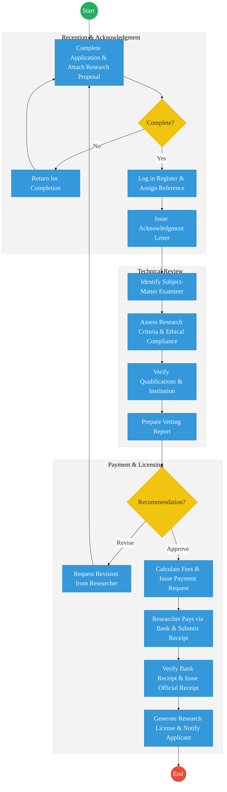
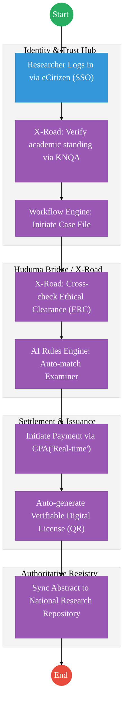

# NATIONAL COMMISSION FOR SCIENCE, TECHNOLOGY AND INNOVATION (NACOSTI) – Service Delivery

## Cover Page
- **Ministry/Department/Agency (MDA):** Ministry of Education
- **Authority:** National Commission for Science, Technology and Innovation (NACOSTI)
- **Process Name:** Research Licensing and Knowledge Management
- **Document Version:** 2.1
- **Date:** 2026-02-24
- **Classification:** Official
- **Strategic Category:** Priority MDA
- **Service Model:** G2B
- **Life-Cycle Group:** Cradle to Death (4. Employment & Business)

---

## Executive Summary
NACOSTI is the primary agency responsible for regulating and assuring quality in the science, technology, and innovation sector. Its key mandate is to license all research activities in Kenya. The current process involves manual document vetting, physical bank payments, and sequential expert reviews. The transition to the Kenya DSAP Architecture aims to establish an automated research portal integrated with KNQA for researcher verification and the Government Payment Aggregator for instant licensing.

---

## 1. AS-IS Process Flowchart (BPMN 2.0)
*Current State visualization (End-to-End Research Licensing based on Deep Dive).*

---

## Process Overview
### Process Name
End-to-End Research Application, Vetting, and Licensing

### Service Category
- G2C (Researchers) / G2B (Institutions)

### Scope
- **In Scope:** Application for research permits, ethical clearance vetting, fee processing, and issuance of licenses.
- **Out of Scope:** Actual funding of research projects.

### Triggers
- A researcher (local or foreign) applying for a permit to conduct a study in Kenya.

### End States
- **Successful:** Research License issued; Study metadata logged in the national repository.

### Policy Context
- Science, Technology and Innovation Act 2013; Data Protection Act 2019.

---

## Detailed Process (AS-IS)

| Step | Role | Action | Tool/System | Notes |
|---|---|---|---|---|
| 1 | Researcher | Submits research proposal, ethical clearance, and academic certificates. | Manual/Portal | |
| 2 | NACOSTI Officer | Manually checks if all documents are attached and assigns a physical file reference. | Manual | |
| 3 | Examiner | Reviews the proposal for technical validity and alignment with national priorities. | Manual/Word | |
| 4 | Finance Officer | Issues a payment demand note; waits for the researcher to pay at a bank and upload the slip. | Standalone System | Major delay (2-5 days). |
| 5 | NACOSTI Admin | Manually verifies the bank slip against bank statements before generating the final PDF license. | Manual | |

---

## Pain Points & Opportunities
### Pain Points
- **Payment Latency:** Waiting for manual bank reconciliation stalls the process even after technical approval.
- **Manual Verification:** Confirming researcher credentials (from Universities) is done via email/phone.
- **Fragmented Repositories:** Research findings are not automatically captured in a searchable national knowledge base.

### Opportunities
- **Instant GPA Integration:** Using the **Government Payment Aggregator** for real-time mobile/card payments and instant license generation.
- **Automated Credential Vetting:** Integrating with **KNQA** and **CUE** via **X-Road** to verify academic standing instantly.
- **Digital Research Repository:** Automatically archiving the research abstract into a national knowledge lake once the license is issued.

---

## 2. TO-BE Process Flowchart (BPMN 2.0)
*Future State visualization (Kenya DSAP Architecture - Huduma Bridge).*

## Future State Process (TO-BE)
### Narrative
**TO-BE Process: Automated Science & Research Vetting**

**Design Principles:**
- **Zero-Touch Licensing:** For standard academic research by recognized students, the system uses **AI Rules** to auto-approve the permit once the fee is paid via **GPA**.
- **Cross-Registry Trust:** Ethical clearance from Institutional Review Boards (IRBs) is pulled via **X-Road APIs**, removing the need for physical letters.
- **Data as a Strategic Asset:** Every license issued automatically populates the national research repository, ensuring the government has visibility into all studies conducted in the country.

### Optimized Steps (Digital)

| Step | Actor | Action | System |
|---|---|---|---|
| 1 | Researcher | Logs into the research portal. Personal and institutional data is pre-populated via IPRS and CUE. | eCitizen / SSO |
| 2 | System | Fetches the researcher's ethical clearance status directly from the Ethics Review Committee (ERC) portal via X-Road. | KeSEL / X-Road |
| 3 | System | Calculates the fee and allows the researcher to pay instantly via M-Pesa or Card. | GPA |
| 4 | System | Upon successful payment, the workflow engine triggers the issuance of a digital verifiable research license. | Output Generator |
| 5 | System | Automatically creates a record in the National Knowledge Repository, tracking the study's start and end dates. | Research Registry |

---

## References
- https://www.nacosti.go.ke
- Science, Technology and Innovation Act 2013
- Desk Review

---

## Feedback
We value your input on this blueprint. Please take a moment to provide your feedback using the link below:

[Provide Feedback](https://ee.kobotoolbox.org/x/4Ls7SlCG)
