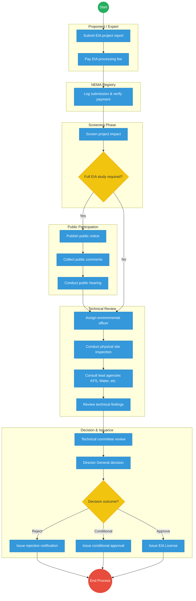
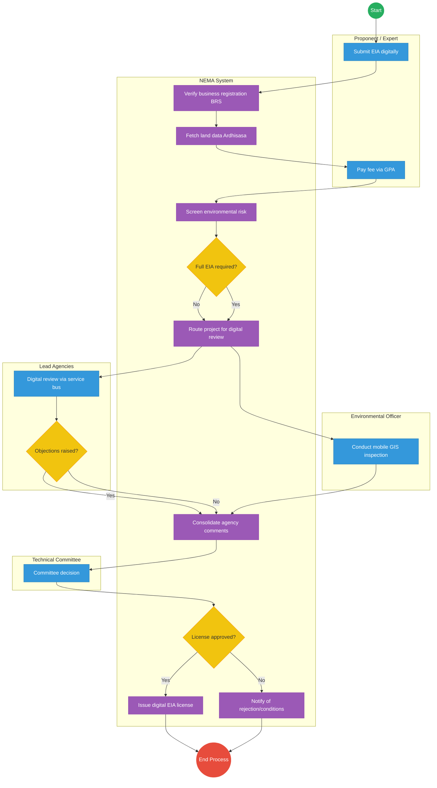

# NATIONAL ENVIRONMENT MANAGEMENT AUTHORITY (NEMA) – Service Delivery

## Cover Page
- **Ministry/Department/Agency (MDA):** Ministry of Environment, Climate Change and Forestry
- **Authority:** National Environment Management Authority (NEMA)
- **Process Name:** Environmental Impact Assessment (EIA) Licensing
- **Document Version:** 2.1
- **Date:** 2026-03-04
- **Classification:** Official

---

## Executive Summary
The National Environment Management Authority (NEMA) is responsible for the supervision and coordination of environmental management across Kenya. A critical service is the issuance of Environmental Impact Assessment (EIA) licenses for all development projects. Current permitting bottlenecks stem from manual document reviews, physical site visits, and sequential inter-agency consultations. The transition to the Kenya DSAP Architecture aims to automate compliance checks via X-Road and establish a digital inspection framework.

---

## 1. AS-IS Process Flowchart (BPMN 2.0)
*Current State visualization (EIA Licensing based on General Mandate).*

---

## Process Overview
### Process Name
Environmental Impact Assessment (EIA) Licensing and Compliance Monitoring

### Service Category
- G2B (Government to Business - Proponents)

### Scope
- **In Scope:** Review of project reports, site inspections, coordination with lead agencies, and issuance of EIA licenses.
- **Out of Scope:** Environmental auditing (post-license monitoring).

### Triggers
- Submission of a new project report by a developer or an environmental expert.

### End States
- **Successful:** Verifiable EIA License issued; Project registered in national environment map.

### Policy Context
- Environmental Management and Coordination Act (EMCA); The Constitution of Kenya; Data Protection Act 2019.

---

## Detailed Process (AS-IS)
| Step | Role | Action | Tool/System | Notes |
|---|---|---|---|---|
| 1 | Proponent / Registered Environmental Expert | Submits the EIA project report and pays the statutory processing fee. | Physical / Portal | |
| 2 | NEMA Registry | Logs the submission, verifies payment, and forwards the file for screening. | Manual | |
| 3 | NEMA Environmental Officer | Screens the project to determine if the report is sufficient or if a full EIA study is required due to high environmental impact. | Manual | |
| 4 | NEMA Environmental Officer | For full EIAs, initiates public participation by publishing notices, collecting comments, and potentially conducting public hearings. | Physical / Media | Extends processing time. |
| 5 | NEMA Environmental Officer | Conducts physical site inspection to verify details submitted in the report. | Manual / Camera | |
| 6 | Lead Agencies (e.g. KFS, WRA) | Reviews project documents and provides sector-specific comments and conditions. | Physical / Letters | Significant bottleneck (30-60 days). |
| 7 | Technical Review Committee | Reviews the consolidated technical findings, site inspection report, and lead agency comments. | Committee Meeting | |
| 8 | Director General | Makes the final decision: reject, approve with conditions, or approve outright. Signs the physical license. | Manual / Wet Signature | |

---

## Pain Points & Opportunities
### Pain Points
- **Lead Agency Delays:** Waiting for comments from other government departments via physical mail stalls projects for months.
- **Counterfeit Licenses:** Paper-based certificates are easily forged.
- **Manual Site Logs:** No centralized GIS record of all previous inspections for a specific parcel of land.

### Opportunities
- **Digital Lead Agency Consultation:** Using **X-Road** to route project reports to all lead agencies simultaneously for digital comment within 7 days.
- **Mobile GIS Inspections:** Officers use a mobile app to capture site photos and GPS coordinates, instantly syncing with the national environmental database.
- **Verifiable QR Licenses:** Issuing licenses as digital credentials that can be verified instantly by any law enforcement officer or citizen.

---

## 2. TO-BE Process Flowchart (BPMN 2.0)
*Future State visualization (Kenya DSAP Architecture - Digital Environmental Permitting).*

## Future State Process (TO-BE)
### Narrative
**TO-BE Process: Automated Environmental Permitting**

The To-Be process envisions a fully integrated **digital environmental permitting platform** that connects the proponent, NEMA, and Lead Agencies into a seamless ecosystem.

**Core Systems:**
- **Environmental Project Registry:** A national repository for all submitted EIA reports and ongoing projects.
- **Environmental GIS Mapping System:** Provides geospatial visualization of project footprints against ecologically sensitive zones.
- **Digital Inspection System:** A mobile application for officers to capture geo-tagged site data in real-time.
- **EIA Workflow Engine:** Automates routing, statutory timelines, and escalation of reviews.
- **Environmental Licensing Registry:** A verifiable, blockchain-anchored ledger of all issued licenses.

**Interoperability (via National Service Bus / X-Road):**
- **BRS Integration:** Instantly verifies business registration details of the proponent.
- **Ardhisasa Integration:** Fetches accurate cadastral maps and land ownership data.
- **Lead Agency Consultation:** Routes EIA documents simultaneously to KFS, WRA, County Governments, etc., for concurrent digital review.

### Optimized Steps (Digital)
| Step | Actor | Action | System |
|---|---|---|---|
| 1 | Proponent | Logs into eCitizen and submits the EIA digitally. Business ownership and expert registration are verified instantly. | eCitizen / X-Road (BRS) |
| 2 | NEMA System | Pulls the cadastral map to verify project coordinates against protected zones (e.g., riparian land). | KeSEL / X-Road (Ardhisasa) |
| 3 | NEMA System | Automatically screens the project for environmental risk and determines if a full EIA and public participation are required. | AI Rules Engine |
| 4 | NEMA System | Routes the report to relevant Lead Agencies via the national service bus for a concurrent digital review. | Workflow Engine |
| 5 | Environmental Officer | Conducts a site inspection using a mobile device, uploading geo-tagged photos directly to the project file. | Digital Inspection App |
| 6 | Technical Committee | Reviews the automatically consolidated agency comments and inspection data to make a decision. | NEMA Permitting Platform |
| 7 | NEMA System | Generates a digital EIA license with a secure QR code and pushes the project coordinates to the National Environmental Dashboard. | Licensing Registry / Output Generator |

---

## References
- https://www.nema.go.ke
- Environmental Management and Coordination Act (EMCA)
- Desk Review