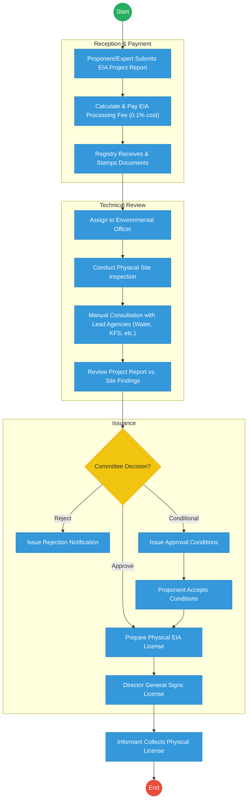
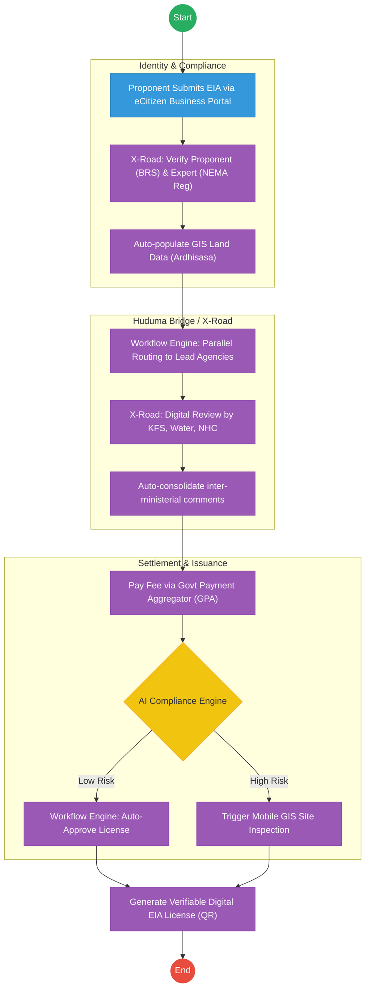

# NATIONAL ENVIRONMENT MANAGEMENT AUTHORITY (NEMA) – Service Delivery

## Cover Page
- **Ministry/Department/Agency (MDA):** Ministry of Environment, Climate Change and Forestry
- **Authority:** National Environment Management Authority (NEMA)
- **Process Name:** Environmental Impact Assessment (EIA) Licensing
- **Document Version:** 2.1
- **Date:** 2026-02-24
- **Classification:** Official

---

## Executive Summary
The National Environment Management Authority (NEMA) is responsible for the supervision and coordination of environmental management across Kenya. A critical service is the issuance of Environmental Impact Assessment (EIA) licenses for all development projects. Current permitting bottlenecks stem from manual document reviews, physical site visits, and sequential inter-agency consultations. The transition to the Kenya DSAP Architecture aims to automate compliance checks via X-Road and establish a digital inspection framework.

---

## 1. AS-IS Process Flowchart (BPMN 2.0)
*Current State visualization (EIA Licensing based on General Mandate).*

---

## Process Overview
### Process Name
Environmental Impact Assessment (EIA) Licensing and Compliance Monitoring

### Service Category
- G2B (Government to Business - Proponents)

### Scope
- **In Scope:** Review of project reports, site inspections, coordination with lead agencies, and issuance of EIA licenses.
- **Out of Scope:** Environmental auditing (post-license monitoring).

### Triggers
- Submission of a new project report by a developer or an environmental expert.

### End States
- **Successful:** Verifiable EIA License issued; Project registered in national environment map.

### Policy Context
- Environmental Management and Coordination Act (EMCA); The Constitution of Kenya; Data Protection Act 2019.

---

## Detailed Process (AS-IS)
| Step | Role | Action | Tool/System | Notes |
|---|---|---|---|---|
| 1 | Proponent | Submits a hard copy project report through a registered environmental expert. | Physical Paper | |
| 2 | Finance Officer | Calculates fees manually based on project cost and awaits bank confirmation. | Manual/Bank | |
| 3 | NEMA Officer | Travels to the site to verify the proponent's claims. | Physical Visit | Major bottleneck. |
| 4 | Registry | Sends physical copies of the report to Lead Agencies (e.g., KFS, Water) for comments. | Physical Dispatch | Takes 30-60 days. |
| 5 | Director General | Signs the physical license certificate. | Wet Signature | |

---

## Pain Points & Opportunities
### Pain Points
- **Lead Agency Delays:** Waiting for comments from other government departments via physical mail stalls projects for months.
- **Counterfeit Licenses:** Paper-based certificates are easily forged.
- **Manual Site Logs:** No centralized GIS record of all previous inspections for a specific parcel of land.

### Opportunities
- **Digital Lead Agency Consultation:** Using **X-Road** to route project reports to all lead agencies simultaneously for digital comment within 7 days.
- **Mobile GIS Inspections:** Officers use a mobile app to capture site photos and GPS coordinates, instantly syncing with the national environmental database.
- **Verifiable QR Licenses:** Issuing licenses as digital credentials that can be verified instantly by any law enforcement officer or citizen.

---

## 2. TO-BE Process Flowchart (BPMN 2.0)
*Future State visualization (Kenya DSAP Architecture - Huduma Bridge).*

## Future State Process (TO-BE)
### Narrative
**TO-BE Process: Automated Environmental Permitting**

**Design Principles:**
- **Interoperability (Once-Only):** Project land details are fetched from **Ardhisasa (Ministry of Lands)** and business details from **BRS** via **X-Road**, removing redundant data entry.
- **Parallel Consultation:** The "Sequential Paper Trail" is replaced by a "Parallel Digital Review." If a Lead Agency doesn't comment within 14 days, the system auto-escalates or defaults to approval.
- **Risk-Based Vetting:** Small-scale, low-impact projects are auto-approved by the **AI Rules Engine**, freeing up NEMA experts to focus on complex, high-risk industrial developments.

### Optimized Steps (Digital)
| Step | Actor | Action | System |
|---|---|---|---|
| 1 | Proponent | Logs into eCitizen. Business ownership and expert registration are verified instantly. | eCitizen / X-Road |
| 2 | System | Pulls the cadastral map from Ardhisasa to verify project coordinates against protected zones (e.g., riparian land). | KeSEL / X-Road |
| 3 | System | Routes the report to relevant Lead Agencies via the national service bus for concurrent 7-day review. | Workflow Engine |
| 4 | Proponent | Pays the EIA fee through the GPA, which provides an instant digital receipt. | GPA |
| 5 | System | Generates a digital license with a secure QR code and pushes the coordinates to the National Environmental Dashboard. | Output Generator |

---

## References
- EMCA (Environmental Management and Coordination Act).
- Huduma Bridge DSAP Architecture.