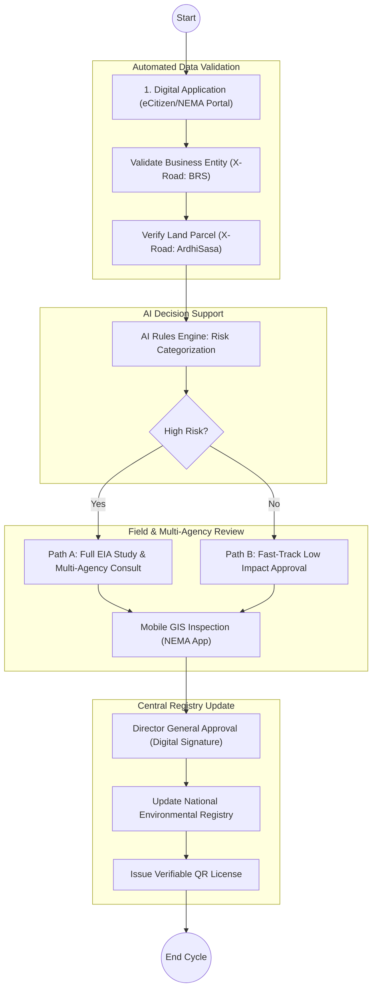

# NATIONAL ENVIRONMENT MANAGEMENT AUTHORITY (NEMA) – Advanced Regulatory Ecosystem

## Cover Page
- **Ministry/Department/Agency (MDA):** Ministry of Environment, Climate Change and Forestry
- **Authority:** National Environment Management Authority (NEMA)
- **Document Type:** Regulatory System Enhancement Document (BPR Aligned)
- **Document Version:** 3.1 (Strategic Maturity Model)
- **Date:** 2026-03-24
- **Classification:** Official
- **Strategic Category:** Priority MDA
- **Service Model:** G2B / G2C
- **Reviewer:** Senior Public Sector Digital Transformation Expert

---

# PART 1: EXECUTIVE SUMMARY

The National Environment Management Authority (NEMA) has successfully transitioned its core licensing functions to a digital environment. The focus of this Business Process Document (BPD) is no longer the "introduction of automation," but rather the **strategic enhancement of an existing digital ecosystem**. 

By shifting from a basic transactional licensing system to an **Intelligent Regulatory Platform**, NEMA is integrating advanced Digital Public Infrastructure (DPI) components—including **AI-driven screening, mobile GIS-based inspections, and real-time inter-agency data exchange via X-Road**. This transition ensures that environmental oversight in Kenya is proactive, data-driven, and seamlessly integrated with national registries like ArdhiSasa and BRS.

---

# PART 2: CURRENT DIGITAL MATURITY

NEMA currently operates a **mature digital licensing portal** that facilitates:
- **Online Submission:** Environmental experts and proponents submit EIA project reports digitally.
- **Workflow Management:** Internal routing of applications to regional and headquarters officers.
- **Digital Payment:** Integration with national payment gateways for statutory fees.
- **Record Archive:** Digital repository of historical licenses.

**Gaps for Strategic Enhancement:**
- **Manual Site Logs:** Lack of a standardized, geo-tagged mobile inspection framework.
- **Inter-Agency Latency:** Lead agency consultations (KFS, WRA) still rely on external email/physical protocols rather than native system-to-system integration.
- **Passive Compliance:** Monitoring is largely reactive rather than based on real-time data or remote sensing.

---

# PART 3: ENHANCED PROCESS MODEL

## 3.1 Licensing Process (Improved)

The enhanced licensing workflow leverages an **AI Rules Engine** to automate the preliminary screening of environmental risks.

## 3.2 Inspection Process (New/Enhanced)
The **Digital Inspection App** replaces paper-based site notes:
1.  **Task Assignment:** Inspection orders are pushed to the officer's mobile device based on GPS proximity or project risk.
2.  **Geo-Tagging:** The app mandates the capture of GPS coordinates and timestamped photos of the site.
3.  **Real-time Sync:** Inspection findings are uploaded directly to the central case file via a secure mobile gateway.

## 3.3 Compliance Monitoring
- **IOT & Remote Sensing:** Integration of satellite data to monitor riparian encroachment and industrial emissions in real-time.
- **Digital Alerts:** Automated triggers notify the **Compliance and Enforcement Unit** when an EIA condition (e.g., noise levels or waste management) is breached.

---

# PART 4: INTEGRATION ARCHITECTURE

NEMA's platform is an integrated hub within the national DPI framework:

| System | Integration Point | Data Flow |
| :--- | :--- | :--- |
| **BRS** | Business Registration | Fetch ownership/directorship details instantly. |
| **KRA** | Tax Systems | Validate KRA PIN and tax compliance of the proponent. |
| **IPS / GPA** | Payment Systems | Real-time reconciliation of license fees via the Payment Aggregator. |
| **eCitizen** | Single Sign-On | Unified citizen/business profile and service access. |
| **ArdhiSasa** | Land Systems | Cadastral map overlays to verify project boundaries against ecologically sensitive zones. |

---

# PART 5: REGISTRY DESIGN (LICENSING & PERMIT REGISTRY)

A centralized, blockchain-secured **Environmental Licensing Registry** manages the full lifecycle of every permit:

1.  **Application:** Initial entry and timestamping of intent.
2.  **Approval:** Formal technical and environmental validation status.
3.  **Renewal:** Automated 90-day notification engine for annual license renewals.
4.  **Revocation:** Instant system-wide flagging of licenses canceled due to environmental non-compliance.

---

# PART 6: DIGITAL PUBLIC INFRASTRUCTURE (DPI) ALIGNMENT

- **Huduma Bridge (X-Road):** Secure inter-agency data exchange for concurrent lead agency reviews.
- **Maisha Namba:** Linkage of individual environmental experts and company directors to authorized actions.
- **Digital Trust:** All licenses are issued with a cryptographically secure **QR code** for field verification by police or county officers.

---

# PART 7: GOVERNANCE & CAPACITY

- **Digital Transformation Unit (DTU):** A specialized unit mandated to oversee the Intelligent Regulatory Platform's uptime and API security.
- **Board-Level Oversight:** The NEMA Board provides strategic direction for the digital roadmap and data privacy policies.
- **Capacity Building:**
    - **GIS Training:** Equipping field officers with advanced geospatial data analysis skills.
    - **Data Governance:** Training on the **Data Protection Act (2019)** regarding the sensitive handling of proponent business data.

---

# PART 8: CHANGE LOG

| Area | Original Issue | Change Made | Impact |
| :--- | :--- | :--- | :--- |
| **Digital Stance** | Focus on "Automation" | **Repositioned as "Enhancement"**| Acknowledges NEMA as a mature digital entity. |
| **Inspection Logic** | Mentioned manual visits | **Digital Inspection Workflow** | Real-time, geo-tagged field data. |
| **Integration** | Standalone process | **ArdhiSasa & BRS Linked** | Instant land and business verification. |
| **Decision Support** | Manual screening | **AI Rules Engine** | Faster, consistent risk categorization. |
| **Compliance** | Reactive auditing | **Real-Time Monitoring** | Proactive environmental protection. |
| **Registry** | Static database | **Lifecycle Registry (Blockchain)** | Increased trust and verifiable security. |

---
**[End of Document]**
