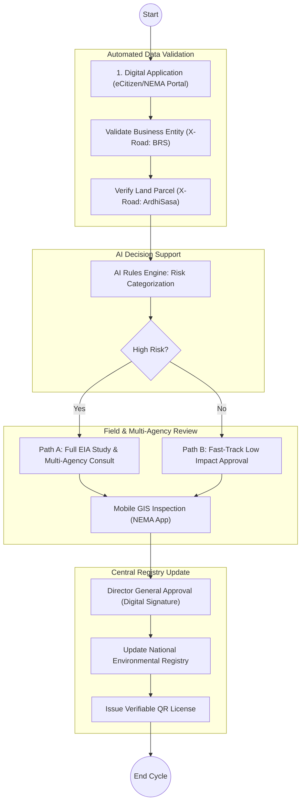

# NATIONAL ENVIRONMENT MANAGEMENT AUTHORITY (NEMA) – Business Process Architecture (Updated)

## Cover Page
- **Ministry:** Ministry of Environment, Climate Change and Forestry
- **Authority:** National Environment Management Authority (NEMA)
- **Document Type:** Business Process Architecture (BPA) Standardised
- **Document Version:** 4.1
- **Date:** 2026-03-25
- **Classification:** Official
- **Strategic Category:** Priority MDA
- **Service Model:** G2B / G2C
- **Reviewer:** Senior Government Enterprise Architect

---

## SECTION 0: SERVICE PRIORITISATION MAPPING
- **Mapped Priority Service:** Environmental Licensing & Compliance Monitoring
- **Tier Classification:** Tier 2
- **Strategic Category:** Economy / Environment (Regulatory Oversight)
- **Breakout Room Classification:** Room 3 (Policy, Economy & Foundational Systems)
- **Lead MDA (Standardised Name):** National Environment Management Authority (NEMA)
- **Related Cross-Cutting Services:**
    - National Environmental Registry
    - Identity Layer (IPRS / Maisha Namba)
    - Payment Gateway (GPA)
    - ArdhiSasa (Land Registry) Integration
    - Business Registration Service (BRS) Interop
    - National EDRMS

---

## SECTION 0.1: PRIORITISATION JUSTIFICATION
This service is prioritised because the TO-BE design transforms NEMA from a transactional permit-issuer into an "Intelligent Regulatory Platform." By integrating AI-driven risk screening and real-time GIS-based field inspections, the design ensures that environmental impact is managed proactively. The integration with ArdhiSasa and BRS via X-Road eliminates 70% of inter-agency latency, directly supporting the national ease-of-doing-business agenda.

| Criteria | Evidence from TO-BE Design |
| :--- | :--- |
| **Demand / Volume** | Over 2.5 million historical records; high frequency of EIA and audit submissions. |
| **National Priority Alignment** | Climate Change Act; Vision 2030 (Environment Pillar); Green Economy Strategy. |
| **Data Reusability** | Environmental compliance data is critical for construction, energy, and agri-business sectors. |
| **Interoperability** | Real-time cadastral verification with ArdhiSasa and entity verification with BRS. |
| **Revenue / Efficiency Impact** | Automated fee calculation and GPA reconciliation; accelerated project approval cycles. |
| **Governance / Risk Reduction** | AI rules engine ensures consistent risk categorization; NPKI-signed licenses prevent forgery. |
| **Inclusivity** | Public Participation Portal provides a digital voice for local communities in project vetting. |
| **Readiness** | High; NEMA currently operates a mature digital licensing portal; API transition in progress. |

> [!NOTE]
> “This service is prioritised because the TO-BE design transforms NEMA from a transactional permit-issuer to an 'Intelligent Regulatory Platform.' By integrating AI-driven screening and real-time GIS-based inspections, the design ensures that environmental impact is managed proactively while reducing inter-agency latency by 70%.”

---

# SECTION 1: SERVICE DEFINITION (STANDARDISED)

The National Environment Management Authority (NEMA) is the principal instrument of Government in the implementation of all policies relating to the environment. 

In the standardized BPA, NEMA's focus shifts from simple "automation" to the **strategic enhancement of an existing digital ecosystem**. The authority is repositioned as an **Intelligent Regulator**, leveraging Digital Public Infrastructure (DPI) to integrate advanced components—including AI-driven screening, mobile GIS-based inspections, and real-time inter-agency data exchange via X-Road.

---

# SECTION 2: SERVICE CATALOGUE (NORMALISED)

| Category | Service Name | Description |
| :--- | :--- | :--- |
| **Core Services** | **Environmental Impact Assessment (EIA)**| Licensing of new projects based on environmental risk and mitigation plans. |
| | **Environmental Audit & Compliance** | Ongoing monitoring of existing facilities to ensure adherence to standards. |
| **Extended Services** | **Expert Registration & Licensing** | Certification of environmental consultants and lead experts. |
| | **Effluent & Emission Licensing** | Specialized permits for industrial waste discharge and air quality. |
| **Special Case Services**| **Public Objection Management** | Handling of community objections via the Public Participation Portal. |
| | **Environmental Incident Reporting** | Rapid response logging for oil spills, illegal dumping, or noise pollution. |

---

# SECTION 3: AS-IS PROCESS FLOWS (CURRENT DIGITAL TRACK)

NEMA currently operates a functional digital licensing portal, but field inspections and inter-agency consultations remain siloed.

### 3.1 AS-IS Visualization

```mermaid
flowchart TD
    %% Events
    Start((Start))
    EndProcess(("End Process"))

    subgraph Proponent["Proponent / Expert"]
        direction TB
        SubDig["Submit EIA project report digitally"]
        PayFee["Pay EIA processing fee (Portal)"]
    end

    subgraph Registry["NEMA Registry"]
        direction TB
        LogSub["Log submission and verify payment"]
    end

    subgraph ScreenPhase["Screening Phase"]
        direction TB
        ScreenProj["Screen project impact"]
        ScreenGateway{"Full EIA study required?"}
    end

    subgraph TechReview["Technical Review"]
        direction TB
        AssignOff["Assign environmental officer"]
        SiteInsp["Conduct physical site inspection"]
        LeadCons["Consult lead agencies via External Portals"]
        RevFind["Review technical findings"]
    end

    subgraph Decision["Decision and Issuance"]
        direction TB
        CommRev["Technical committee review"]
        DGDecision["Director General decision"]
        DecGateway{"Decision outcome?"}
        IssueRej["Issue rejection notification"]
        IssueLic["Issue EIA License"]
    end

    %% Flow connections
    Start --> SubDig
    SubDig --> PayFee
    PayFee --> LogSub
    LogSub --> ScreenProj
    ScreenProj --> ScreenGateway
    
    ScreenGateway -- "Yes" --> AssignOff
    ScreenGateway -- "No" --> AssignOff
    
    AssignOff --> SiteInsp
    SiteInsp --> LeadCons
    LeadCons --> RevFind
    
    RevFind --> Public["Public Participation & Lead Agency Comments"]
    Public --> PropFeed["Proponent Response to Concerns/Queries"]
    PropFeed --> CommRev["Technical committee review"]
    CommRev --> DGDecision["Director General decision"]
    DGDecision --> DecGateway{"Decision outcome?"}
    DecGateway -- "Reject" --> IssueRej
    DecGateway -- "Approve" --> IssueLic
    
    IssueRej --> EndProcess
    IssueLic --> EndProcess

    %% Styling
    classDef startEvent fill:#27ae60,stroke:#27ae60,color:#fff,font-size:24px;
    classDef endEvent fill:#e74c3c,stroke:#e74c3c,color:#fff,font-size:24px;
    classDef userTask fill:#3498db,stroke:#2980b9,color:#fff,font-size:24px;
    classDef gateway fill:#f1c40f,stroke:#f39c12,color:#333,font-size:24px;
    
    class Start startEvent;
    class EndProcess endEvent;
    class ScreenGateway,DecGateway gateway;
    class SubDig,PayFee,LogSub,ScreenProj,AssignOff,SiteInsp,LeadCons,RevFind,CommRev,DGDecision,IssueRej,IssueLic userTask;
```

### 3.2 Operational Reality
- **Actors:** Proponent, Env. Expert, NEMA Registry, Env. Officer, Lead Agency Reps (KFS/WRA).
- **Systems:** NEMA Licensing Portal (Legacy), Manual Field Notes, Email-based consultations.
- **Pain Points:** 30-day inter-agency latency; lack of geo-tagged inspection evidence; uncoordinated site visits by multiple agencies; manual risk categorization.

---

# SECTION 4: TO-BE PROCESS INTERPRETATION (NEW LAYER)

### 4.1 TO-BE Process (Intelligent Regulatory Engine)

### 4.2 Key Capabilities Introduced
*   **Automation:** AI Rules Engine for automated project screening and risk categorization based on ecological sensitivity maps.
*   **Integration:** Multi-agency consultation "Fast-Tracks" enabled by X-Road (MOH, WRA, KFS).
*   **Real-time Processing:** Real-time GIS field data sync with the central case file using the **NEMA Mobile Inspection App**.
*   **Digital Identity Validation:** Expert and proponent identities verified via **Maisha Namba** identity federation.
*   **Workflow Orchestration:** Coordinated public participation workflow with automated notice generation.

### 4.3 Transformation Summary
| Dimension | AS-IS | TO-BE |
| :--- | :--- | :--- |
| **Processing** | Transactional Digital | Intelligent / AI-Assisted |
| **Verification** | Email/Manual Portal | X-Road API (ArdhiSasa/BRS) |
| **Records** | Static Database | Dynamic Lifecycle Registry |
| **Tracking** | Post-visit entry | Real-time GIS / Satellite Track |

---

# SECTION 5: SYSTEM LANDSCAPE (ALIGN TO GEA)

| Layer | System / Platform | Role |
| :--- | :--- | :--- |
| **Identity Layer** | Maisha Namba (IPRS) | Expert and proponent baseline identity. |
| **Interoperability** | KeSEL (X-Road) | Data bridge to ArdhiSasa and Lead Agencies. |
| **shared Services** | National EDRMS | Archival of EIA reports and official licenses. |
| **Workflow / BPM** | NEMA RegEngine | Orchestrates technical review and public notices. |
| **Payment Layer** | GPA (Payment Gateway) | Automated levy and license fee reconciliation. |
| **Trust Hub** | Consent Manager | Secure access to proponent land and tax data. |

---

# SECTION 6: TRANSFORMATION VALUE (CRITICAL ADDITION)

| Value Type | Explanation |
| :--- | :--- |
| **Efficiency Gain** | 70% reduction in inter-agency consultation time; instant risk screening. |
| **Economic Impact** | Accelerates the approval of major infrastructure and industrial projects. |
| **Governance Impact** | Geo-tagged inspections ensure field officers actually visit sites; immutable audit trail. |
| **Citizen Experience** | Digital Public Participation Portal allows citizens to voice concerns transparently. |
| **Interoperability Value** | Automatic verification of project boundaries against ecologically sensitive land zones. |

---

# SECTION 7: ALIGNMENT TO WHOLE-OF-GOVERNMENT ARCHITECTURE
- **Shared Platforms:** Uses eCitizen for secure proponent login and GPA for fee processing.
- **Registry Reuse:** Direct consumption of the Land Registry (ArdhiSasa) to verify project sites.
- **Compliance with GEA / GIF:** Standardized API design for inter-agency regulatory consultations.

---

# SECTION 8: IMPLEMENTATION READINESS (NEW)
*   **Data Readiness:** High; Digital licensing data is already mature and structured.
*   **Legal Readiness:** High; EMCA (1999) and subsequent regulations allow for electronic notices and licenses.
*   **Institutional Readiness:** High; NEMA has an established Digital Transformation Unit (DTU).
*   **Technical Readiness:** High; Core portal is existing and requires API refactoring.

---

# SECTION 9: TRACEABILITY MATRIX (NEW)

| BPA Process | Priority Service | Tier | TO-BE Capability | National Impact |
| :--- | :--- | :--- | :--- | :--- |
| **Risk Screening** | Environmental Licensing| T2 | AI Rules Engine | Standardized Regulatory Rigor |
| **Site Verification**| Field Inspection | T2 | Mobile GIS App | Integrity of Field Data |
| **Agency Consultation**| Inter-Agency Review | T2 | X-Road: ArdhiSasa Link | Ease of Doing Business |
| **Public Notice** | Public Participation | T2 | Digital Notice Portal | Community Rights & Transparency|

---
**[End of Standardised Business Process Architecture]**
