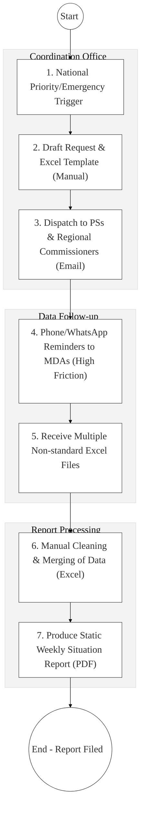
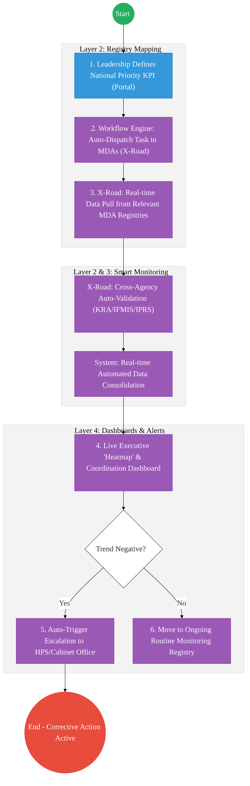

# NATIONAL GOVERNMENT COORDINATION – Business Process Architecture (Updated)

## Cover Page
- **Ministry:** Executive Office of the President
- **Department:** National Government Coordination (Secretariat)
- **Primary Authority:** National Government Coordination Secretariat (NGCS) / Interior & Coordination
- **Document Type:** Business Process Architecture (BPA) Standardised
- **Document Version:** 4.1
- **Date:** 2026-03-25
- **Classification:** Official / Restricted
- **Strategic Category:** Priority MDA
- **Service Model:** G2G (Inter-Ministerial Coordination)
- **Reviewer:** Senior Government Enterprise Architect

---

## SECTION 0: SERVICE PRIORITISATION MAPPING
- **Mapped Priority Service:** Inter-Agency Coordination and Information Tasking
- **Tier Classification:** Tier 2
- **Strategic Category:** Governance / Coordination (Executive Oversight)
- **Breakout Room Classification:** Room 2 (Coordination, Culture & Specialised Services)
- **Lead MDA (Standardised Name):** National Government Coordination
- **Related Cross-Cutting Services:**
    - National Government Dashboard (NGD - Real-time)
    - Identity Layer (IPRS / Maisha Namba - Officer Tier)
    - X-Road (MDA-wide Data Pulls & Interop)
    - National EDRMS (Situation Report & Archive Repository)
    - Government Delivery Hub (GDMIS / BETA Tracking)

---

## SECTION 0.1: PRIORITISATION JUSTIFICATION
This service is prioritised because the TO-BE design transforms national government coordination from manual "Excel-template-tagging" into a "Real-time Executive Data Hub." By shifting from asking for "Weekly Reports" to "Direct API Data Access" via X-Road (Huduma Bridge), the design allows the Presidency to pull live KPIs directly from authoritative MDA registries (Health, Agriculture, Lands). This transformation eliminates the historical 7-day "reporting lag" that hides implementation failures, automates the merging of complex multi-MDA datasets, and enables AI-driven proactive alerts for "at-risk" national priorities (e.g., Fertilizer distribution or Health clinic stockouts) before they become national crises.

| Criteria | Evidence from TO-BE Design |
| :--- | :--- |
| **Demand / Volume** | Continuous tasking for 20+ Ministries and 47 Counties; daily Situation Reports (SitReps). |
| **National Priority Alignment** | National Government Co-ordination Act 2013; Executive Order No. 1 of 2023. |
| **Data Reusability** | Consolidated coordination data is the primary input for the Cabinet's "State of the Nation" briefs. |
| **Interoperability** | One-to-Many API pipelines pulling data from dozens of disconnected MDA platforms via X-Road. |
| **Revenue / Efficiency Impact** | Reduces the cost of manual "Fact-Finding missions" by 60%; accelerates directive execution. |
| **Governance / Risk Reduction** | Real-time "Truth-check" of MDA progress vs. actual transactional data in registries. |
| **Inclusivity** | NGAO hierarchy integration ensures grassroots data (Sub-location) is visible at the Presidency. |
| **Readiness** | High; The National Government Dashboard (NGD) exists; X-Road nodes are active in key MDAs. |

> [!NOTE]
> “The TO-BE design transforms national coordination from manual 'Excel-template-tag' into a 'Real-time Executive Data Hub.' By shifting from asking for 'Weekly Reports' to 'API Data Access' via X-Road, the design allows the Presidency to pull live KPIs directly from MDA registries (Health, Agriculture, Lands). This transformation eliminates the 7-day 'reporting lag,' automates the merging of multi-MDA datasets, and enables AI-driven proactive alerts for 'at-risk' national priorities before they become crises.”

---

# SECTION 1: SERVICE DEFINITION (STANDARDISED)

National Government Coordination is mandated under the **National Government Co-ordination Act 2013** to coordinate national government functions across all levels. 

In this refactored BPA, the primary service is the **End-to-End Inter-Agency Tasking and Situation Reporting** lifecycle. The objective is to move from manual physical dispatch of "Excel Templates" to an **Automated Tasking Engine** where data is pulled in real-time from MDA authoritative registries via the **Huduma Bridge**.

---

# SECTION 2: SERVICE CATALOGUE (NORMALISED)

| Category | Service Name | Description |
| :--- | :--- | :--- |
| **Core Services** | **National Priority Tasking**| Automated dispatch and status tracking of presidential directives. |
| | **Real-time Situation Reporting**| Live, data-driven "Executive Heatmaps" of national projects. |
| **Extended Services** | **MDA Data Synchronization** | Automated "Pull" of KPIs from disconnected MDA registries. |
| | **NGAO Field Reporting** | Mobile-first status updates from Chiefs and Regional Commissioners. |
| **Special Case Services**| **Disaster Response Coord.** | Real-time mobilization dashboard for emergency assets across MDAs. |
| | **Escalation Management** | Automated alerting of the Head of Public Service for delayed tasks. |

---

# SECTION 3: AS-IS PROCESS FLOWS (MANUAL/DATA-LAGGED)

Currently, coordination is highly transactional and relies on manual requests, Excel templates, and follow-up phone calls.

### 3.1 AS-IS Visualization

### 3.2 Operational Reality
- **Actors:** Coordination Officer, Principal Secretaries, Regional Commissioners, Analysts.
- **Systems:** MS Word / Excel, Standalone Email, Phone/WhatsApp, Physical Files.
- **Pain Points:** 7-day delay in producing Situation Reports; MDAs modify templates making automated merging impossible; "Static" SitReps are often outdated by the time they reach leadership; massive "Reporting Fatigue" for MDAs being asked for the same data by multiple offices.

---

# SECTION 4: TO-BE PROCESS INTERPRETATION (NEW LAYER)

### 4.1 TO-BE Process (Executive Intelligence Engine)

### 4.2 Key Capabilities Introduced
*   **Automation:** Zero-Friction Data Pull – system fetches live transactional data directly from MDAs without requiring them to fill manual forms.
*   **Integration:** Full interoperability with **IFMIS** (Money spent), **KRA** (Taxes collected), and **MDA registries** (Fertilizer sacks delivered / People seen).
*   **Real-time Processing:** Live "Executive Scorecard" updated every 24 hours via secure X-Road endpoints.
*   **Digital Identity Validation:** Coordination officers and PS actions verified via **National Identity (Maisha SSO)**.
*   **Workflow Orchestration:** Orchestrates the complex coordination lifecycles from emergency trigger to final verified dashboard reporting.

### 4.3 Transformation Summary
| Dimension | AS-IS | TO-BE |
| :--- | :--- | :--- |
| **Processing** | Manual / Template-based | Digital / API-driven Pull |
| **Verification** | Self-reported (MDA claims) | Registry-verified (Actual data) |
| **Records** | Regional Excel Files | National Coordination Dashboard |
| **Tracking** | Static Weekly Snapshots | Real-time Proactive Alerting |

---

# SECTION 5: SYSTEM LANDSCAPE (ALIGN TO GEA)

| Layer | System / Platform | Role |
| :--- | :--- | :--- |
| **Identity Layer** | Maisha Namba (Officer) | Identity and Bio-login for all task-responsible officers. |
| **Interoperability** | KeSEL (X-Road) | The "Pulley" system for cross-MDA data extraction. |
| **shared Services** | National EDRMS | Restricted digital archive for Sensitive Situation Reports. |
| **Workflow / BPM** | Coordination Tasking Hub | Orchestrates task dispatch and deadline reminders. |
| **Reporting / Analytics**| Executive Radar Dashboard | Real-time geospatial view of project delivery status. |
| **Trust Hub** | Outcome Verification | Independent rules-engine to verify if data matches targets. |

---

# SECTION 6: TRANSFORMATION VALUE (CRITICAL ADDITION)

| Value Type | Explanation |
| :--- | :--- |
| **Efficiency Gain** | Report preparation time reduced from 40 man-hours/week to <5 minutes. |
| **Economic Impact** | Prevents resource wastage by identifying "Ghost Projects" via registry audits. |
| **Governance Impact** | Full accountability for Principal Secretaries; zero-hiding of implementation lags. |
| **Citizen Experience** | Accelerates the delivery of essential services (Drought aid, Education funds). |
| **Interoperability Value** | Shared coordination hub prevents "Information Tasking Fatigue" across Govt. |

---

# SECTION 7: ALIGNMENT TO WHOLE-OF-GOVERNMENT ARCHITECTURE
- **Shared Platforms:** Uses the Government Service Bus (KeSEL) for all data pulls from the 47 county nodes.
- **Registry Reuse:** Reuses project-ID data from MDAs to ensure a single thread of project traceability.
- **Compliance with GEA / GIF:** Standardizing Situation Report (SitRep) data schemas for Cabinet review.

---

# SECTION 8: IMPLEMENTATION READINESS (NEW)
*   **Data Readiness:** Medium; Requires MDAs to expose "View-Only" KPI endpoints on X-Road.
*   **Legal Readiness:** High; Coordination Act 2013 and Executive Orders provide a strong mandate.
*   **Institutional Readiness:** High; The National Government Coordination Secretariat is fully staffed.
*   **Technical Readiness:** High; HUDUMA Bridge is ready to host the central coordination dashboard.

---

# SECTION 9: TRACEABILITY MATRIX (NEW)

| BPA Process | Priority Service | Tier | TO-BE Capability | National Impact |
| :--- | :--- | :--- | :--- | :--- |
| **Priority Tasking** | Task Dispatch | T2 | Automated Dispatch Engine | Faster Policy Execution |
| **Data Extraction** | KPI Monitoring | T2 | X-Road: Auto-Data Pull | Accurate Service Delivery Tracking|
| **Report Consolidation**| Dashboarding | T2 | AI-Assisted Data Merging | Executive Visibility & Speed |
| **Escalation Mgt** | Remediation | T2 | Proactive Alerting Engine | Crisis Prevention & Security |

---
**[End of Standardised Business Process Architecture]**
