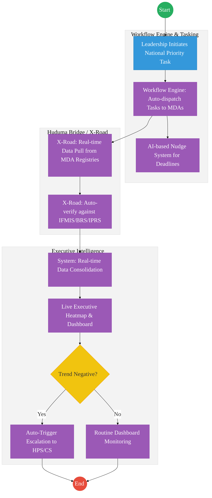

# NATIONAL GOVERNMENT COORDINATION – Service Delivery

## Cover Page
- **Ministry/Department/Agency (MDA):** Executive Office of the President
- **Department:** National Government Coordination
- **Process Name:** Inter-Agency Coordination and Information Tasking
- **Document Version:** 2.1
- **Date:** 2026-02-24
- **Classification:** Official
- **Strategic Category:** Priority MDA
- **Service Model:** G2G
- **Life-Cycle Group:** Cradle to Death (5. Social Protection & Justice)

---

## Service Mandate
National Government Coordination is primarily managed through the Ministry of Interior and National Administration and the National Government Coordination Secretariat (NGCS). Its mandate, derived from the National Government Co-ordination Act 2013, is to establish an administrative framework for coordinating national government functions at both national and county levels, ensuring that services are accessible in all parts of the Republic.

**Official Website:** [https://www.interior.go.ke](https://www.interior.go.ke) / [https://www.opcs.go.ke](https://www.opcs.go.ke)

**Key Functions:**
- **Service Delivery Coordination:** Overseeing the implementation of national government programs and projects across all ministries and state departments.
- **Internal Security:** Maintaining law and order through the coordination of security agencies and the National Government Administrative Officers (NGAO) structure.
- **National Government Administration:** Managing the hierarchy of administrative officers from the Regional level down to the Sub-location level.
- **Policy Implementation:** Ensuring that national policies (such as the Bottom-Up Economic Transformation Agenda - BETA) are executed effectively at the grassroots.
- **Monitoring and Evaluation:** Using tools like the National Government Dashboard (NGD) to track project delivery and performance indicators of various MDAs.
- **Disaster Management:** Coordinating responses to national emergencies and disasters.
- **Citizen Engagement:** Acting as the primary link between the national government and the public for feedback and participation.

---

## Executive Summary
National Government Coordination is responsible for the seamless alignment of government activities across all MDAs and regions. Its primary function is to manage information tasking, data collection for national priorities, and the escalation of critical issues to the Presidency. Currently, this coordination is highly transactional and relies on manual requests, templates, and follow-ups. The transition to the Kenya DSAP Architecture aims to establish an automated coordination hub that leverages the national service bus for real-time status tracking.

---

## 1. AS-IS Process Flowchart (BPMN 2.0)
*Current State visualization (End-to-End Coordination based on Deep Dive).*

```mermaid
%%{init: { 'theme': 'base', 'themeVariables': { 'fontSize': '24px', 'fontFamily': 'Inter, system-ui, sans-serif', 'primaryColor': '#ffffff', 'edgeLabelBackground':'#ffffff', 'tertiaryColor': '#f3f3f3', 'mainBkg': '#ffffff', 'nodeBorder': '#333333' } } }%%
graph TD
    Start((Start)) --> Trigger["Coordination Trigger (National Priority/Security/Reporting)"]
    
    subgraph Tasking["Information Tasking"]
        Trigger --> Scope["Define Scope & Identify Stakeholders"]
        Scope --> Objectives["Set Objectives & Define Deliverables"]
        Objectives --> Draft["Draft Request & Define Template (Word/Excel)"]
        Draft --> Dispatch["Dispatch to All MDAs & Copy Regions"]
    end
    
    subgraph Data_Collection["Data Collection"]
        Dispatch --> Monitor["Monitor Acknowledgments & Send Reminders"]
        Monitor --> AllAck{"All Acknowledged?"}
        
        AllAck -- "No" --> Monitor
        AllAck -- "Yes" --> Receive["Receive MDA & Regional Submissions"]
    end
    
    subgraph Escalation["Review & Escalation"]
        Receive --> Extract["Extract Data & Merge Submissions"]
        Extract --> Standardize["Standardize Formats & Create Master Dataset"]
        Standardize --> Analyze["Analyse Data & Identify Patterns/Gaps"]
        Analyze --> Critical{"Is it Critical?"}
        
        Critical -- "Yes" --> Escalate["Escalate to Leadership / HPS"]
        Critical -- "No" --> Routine["Routine Processing & Dashboard"]
    end
    
    Routine --> Report["Produce Situation Report & Archive"]
    Escalate --> Report
    Report --> End((End))

    classDef start fill:#27ae60,stroke:#27ae60,color:#fff,font-size:24px,font-size:24px;;
    classDef endNode fill:#e74c3c,stroke:#e74c3c,color:#fff,font-size:24px,font-size:24px;;
    classDef userTask fill:#3498db,stroke:#2980b9,color:#fff,font-size:24px,font-size:24px;;
    classDef gateway fill:#f1c40f,stroke:#f39c12,color:#333,font-size:24px,font-size:24px;;
    class Start start;
    class End endNode;
    class AllAck,Critical gateway;
    class Trigger,Scope,Objectives,Draft,Dispatch,Monitor,Receive,Extract,Standardize,Analyze,Escalate,Routine,Report userTask;
```

---

## Process Overview
### Process Name
End-to-End Inter-Agency Coordination and Situation Reporting

### Service Category
- G2G (Government to Government)

### Scope
- **In Scope:** Drafting coordination requests, monitoring submissions from MDAs and Regional Commissioners, and preparing consolidated Situation Reports (SitReps).
- **Out of Scope:** The actual operational implementation of projects by the MDAs.

### Triggers
- A Presidential directive, a national emergency, or a periodic reporting cycle (e.g., Budget/MTEF).

### End States
- **Successful:** Situation Report produced; Critical bottlenecks escalated and resolved.

### Policy Context
- Executive Order No. 1 of 2023; The Constitution of Kenya; Public Service Regulations.

---

## Detailed Process (AS-IS)

| Step | Role | Action | Tool/System | Notes |
|---|---|---|---|---|
| 1 | Coordination Officer | Identifies a coordination need (e.g., Drought Response) and defines the deliverables required from MDAs. | Manual | |
| 2 | Coordination Officer | Drafts a formal request letter and attaches an Excel template for data collection. | MS Word / Excel | |
| 3 | Dispatch Clerk | Sends the request to all relevant Principal Secretaries and Regional Commissioners via email/physical dispatch. | Email / Physical | |
| 4 | Coordination Unit | Follows up with MDAs via phone calls and reminders to ensure submissions are made. | Phone/WhatsApp | High friction step. |
| 5 | Analyst | Manually cleans and merges 20+ different Excel files into a single master sheet for analysis. | Excel | High risk of error. |

---

## Pain Points & Opportunities
### Pain Points
- **Template Non-Compliance:** MDAs often modify Excel templates, making automated merging impossible.
- **Reporting Fatigue:** MDAs are constantly asked for similar data by different coordination offices (Coordination, Cabinet, HPS).
- **Static SitReps:** Reports are "snapshots" in time and are often outdated by the time they reach leadership.

### Opportunities
- **Automated Data Pull:** Instead of asking MDAs for data, the coordination hub "pulls" the required fields directly from MDA databases via **X-Road**.
- **Real-Time Dashboards:** Replacing weekly SitReps with a live dashboard that MDAs update as part of their daily operations.
- **Unified Tasking:** A single "National Tasks" engine that ensures Principal Secretaries see all directives in one place.

---

## 2. TO-BE Process Flowchart (BPMN 2.0)
*Future State visualization (Kenya DSAP Architecture - Huduma Bridge).*

## Future State Process (TO-BE)
### Narrative
**TO-BE Process: Zero-Friction Government Coordination**

**Design Principles:**
- **Data over Documents:** The coordination office shifts from asking for "Reports" to asking for "Data Access." Access is granted via **KeSEL (X-Road)** endpoints.
- **Continuous Monitoring:** Leadership can view the status of a national directive (e.g., Fertilizer distribution) in real-time, as every transaction at the MDA level is broadcast across the government event bus.
- **Proactive Management:** Instead of waiting for a crisis to be reported, the system uses AI to detect "Negative Trends" (e.g., slow absorption of funds in a region) and alerts the coordinators automatically.

### Optimized Steps (Digital)

| Step | Actor | Action | System |
|---|---|---|---|
| 1 | Leadership | Defines a new national priority and sets the target KPIs in the Coordination Portal. | Executive Portal |
| 2 | System | Maps the KPIs to existing data fields in relevant MDA registries (e.g., Health, Agriculture, Lands). | Service Catalogue |
| 3 | System | Pulls data every 24 hours via X-Road to update the national achievement scorecards. | KeSEL / X-Road |
| 4 | System | Automatically notifies Principal Secretaries of any "at-risk" deliverables based on real data, not claims. | Workflow Engine |
| 5 | Coordinator | Focuses on resolving the "at-risk" blocks rather than manually cleaning data. | Executive Dashboard |

---

## References
- https://www.interior.go.ke
- Executive Order No. 1 of 2023
- Desk Review

---

### Validation Survey
Please provide your feedback here: [https://ee.kobotoolbox.org/x/4Ls7SlCG](https://ee.kobotoolbox.org/x/4Ls7SlCG)

