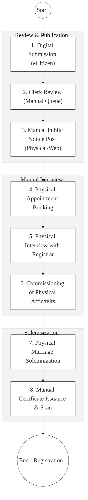
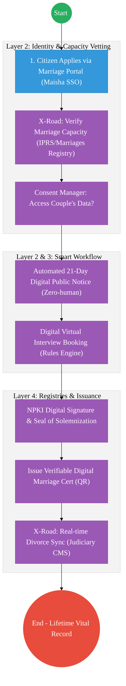

# REGISTRAR OF MARRIAGES (OFFICE OF THE ATTORNEY GENERAL) – Business Process Architecture

## Cover Page
- **Ministry:** Office of the Attorney General & Department of Justice
- **Department:** Registrar of Marriages
- **Primary Authority:** Registrar-General
- **Document Type:** Business Process Architecture (BPA) Standardised
- **Document Version:** 4.1
- **Date:** 2026-03-25
- **Classification:** Official / Sensitive
- **Strategic Category:** Priority MDA - National Registry (Tier 1)
- **Service Model:** G2C / G2B
- **Reviewer:** Senior Government Enterprise Architect

---

## SECTION 0: SERVICE PRIORITISATION MAPPING
- **Mapped Priority Service:** Civil, Customary, and Professional Marriage Registration
- **Tier Classification:** Tier 1
- **Strategic Category:** Social / Justice (Marriage & Family)
- **Breakout Room Classification:** Room 1 (High Impact & Large Registries)
- **Lead MDA (Standardised Name):** State Law Office - Registrar of Marriages
- **Related Cross-Cutting Services:**
    - National Marriages Registry (Unified)
    - Identity Layer (IPRS / Maisha Namba)
    - X-Road (Judiciary Divorce Decrees / DRS Interop)
    - National EDRMS (Historical Marriage Records)
    - Government Payment Aggregator (GPA / Fees)

---

## SECTION 0.1: PRIORITISATION JUSTIFICATION
This service is prioritised because the TO-BE design transforms marriage registration from a fragmented, regional paper-and-courier system into a "National Vital Life-Event Registry." By integrating with IPRS (Identity) and the Judiciary (Divorce Decrees) via X-Road, the design ensures that a citizen's marital status is instantly verifiable, legally certain, and tamper-proof. This transformation eliminates the deadly "courier lag" for divorce registration, automates the statutory 21-day public notice period, and digitizes millions of historical marriage records scattered across sub-counties and religious institutions, creating a secure digital vault for the nation's foundational family records.

| Criteria | Evidence from TO-BE Design |
| :--- | :--- |
| **Demand / Volume** | Over 500,000 marriage notices and thousands of divorce registrations annually. |
| **National Priority Alignment** | Marriage Act (Cap 150); Civil Registration and Vital Statistics (CRVS) Framework. |
| **Data Reusability** | Marital status is a critical input for Immigration (Spouse permits) and Banking (Lending). |
| **Interoperability** | Real-time intake of Divorce Decree Absolutes from Judiciary CMS via X-Road (Huduma Bridge). |
| **Revenue / Efficiency Impact** | Automated fee collection via GPA; removes physical certificate backlog. |
| **Governance / Risk Reduction** | NPKI digital sealing of certificates prevents "Bigamy" and marriage-record forgery. |
| **Inclusivity** | "Virtual Solemnization" and digital noticeboards ensure access for diaspora and remote citizens. |
| **Readiness** | High; eCitizen portal is established; OAG has a specialized Registrar team. |

> [!NOTE]
> “The TO-BE design transforms marriage registration from a fragmented, regional paper-and-courier system into a 'National Vital Life-Event Registry.' By integrating with IPRS (Identity) and the Judiciary (Divorce Decrees) via X-Road, the design ensures that a citizen's marital status is instantly verifiable and tamper-proof. This eliminates the 'courier lag' for divorce registration, automates the 21-day public notice period, and creates a secure digital vault for millions of historical marriage records.”

---

# SECTION 1: SERVICE DEFINITION (STANDARDISED)

The Office of the Attorney General (through the Registrar of Marriages) is mandated under the **Marriage Act, Cap 150** to register all statutory, customary, and religious marriages. 

In this refactored BPA, the primary focus is the **Unified Marriage & Divorce Lifecycle**. The objective is to move from manual "Marriage Book" entries and email-based notices to a **National Marriages Registry** where marital capacity is checked instantly via the **Huduma Bridge** and certificates are issued as **Verifiable Digital Credentials**.

---

# SECTION 2: SERVICE CATALOGUE (NORMALISED)

| Category | Service Name | Description |
| :--- | :--- | :--- |
| **Core Services** | **Civil Marriage Registration** | Registration of statutory marriages by notice or special license. |
| | **Customary Marriage Reg.** | Formalization and registration of tribal/customary unions. |
| **Extended Services** | **Divorce Registration** | Digital recording of Decree Absolutes (Judiciary Link). |
| | **Marital Status Verification** | Issuance of "Certificates of No Impediment" for international use. |
| **Special Case Services**| **Religious Leader Licensing** | Digital permitting and tracking of Ministers of Faith authorized to marry. |
| | **Foreign Marriage Registry** | Recording of marriages conducted by Kenyans outside national borders. |

---

# SECTION 3: AS-IS PROCESS FLOWS (HYBRID/COURIER-BASED)

The current workflow leverages eCitizen for the intake but maintains manual ceremony, physical interview stages, and courier-based divorce reporting.

### 3.1 AS-IS Visualization

### 3.2 Operational Reality
- **Actors:** Marriage Clerk, Registrar, Couple, Witnesses, Licensed Minister.
- **Systems:** eCitizen (Basic), Manual Marriage Books, Physical Files, Email.
- **Pain Points:** 21-day notice period is manually tracked; physical interviews cause citizen travel burden; divorce decrees are sent via post, leading to 6-month registry lags; millions of regional records remain in un-digitized "Registers" at sub-county offices.

---

# SECTION 4: TO-BE PROCESS INTERPRETATION (NEW LAYER)

### 4.1 TO-BE Process (vI-Event Life Cycle)

### 4.2 Key Capabilities Introduced
*   **Automation:** Automated 21-day statutory notice period – system releases notice at exactly T+21 days if no objections are logged.
*   **Integration:** Real-time bi-directional integration with the **Judiciary CMS** for divorce decrees and **IPRS** for marital capacity status.
*   **Real-time Processing:** Instant generation of verifiable digital certificates with NPKI-secured QR codes.
*   **Digital Identity Validation:** Identity and marital capacity of both parties and witnesses verified via **Maisha Namba** identity federation.
*   **Workflow Orchestration:** Orchestrates the complex lifecycle from notice to solemnization and divorce-status synchronization.

### 4.3 Transformation Summary
| Dimension | AS-IS | TO-BE |
| :--- | :--- | :--- |
| **Processing** | Manual / Hybrid-wait | Digital / Event-driven |
| **Verification** | Physical Original Documents | API-based (IPRS/Judiciary) |
| **Records** | Regional Marriage Books | National Marriages Registry |
| **Tracking** | Manual Ledger Queries | Real-time Vital-Event Dashboard |

---

# SECTION 5: SYSTEM LANDSCAPE (ALIGN TO GEA)

| Layer | System / Platform | Role |
| :--- | :--- | :--- |
| **Identity Layer** | Maisha Namba (IPRS) | Identity and capacity (Singleness) verification. |
| **Interoperability** | KeSEL (X-Road) | Data bridge to Judiciary (Divorce) and eCitizen. |
| **shared Services** | National EDRMS | Legal digital archive for historical marriage books. |
| **Workflow / BPM** | Marriage LifeCycle Hub | Orchestrates notices, interviews, and solemnization. |
| **Payment Layer** | GPA (Finance Aggregator) | Automated fee reconciliation and revenue tracking. |
| **Trust Hub** | Consent Manager | Couple control over shared marital history data. |

---

# SECTION 6: TRANSFORMATION VALUE (CRITICAL ADDITION)

| Value Type | Explanation |
| :--- | :--- |
| **Efficiency Gain** | Divorce registration lag reduced from 180 days to milliseconds via X-Road sync. |
| **Economic Impact** | Accelerates legal family-status resolution for banking, insurance, and travel. |
| **Governance Impact** | Full NPKI audit trail of who solemnized each marriage; prevents fraudulent unions. |
| **Citizen Experience** | Eliminates multiple trips for interviews via Virtual Solemnization support. |
| **Interoperability Value** | Shared data with Immigration and CRVS ensures 100% vital event consistency. |

---

# SECTION 7: ALIGNMENT TO WHOLE-OF-GOVERNMENT ARCHITECTURE
- **Shared Platforms:** Uses eCitizen for portal access and NPKI for all official Vital Event certificates.
- **Registry Reuse:** Feeds "Marital Status" back to IPRS to ensure a single national source of truth.
- **Compliance with GEA / GIF:** Standardizing marriage certificate schemas for global ICAO / CRVS compliance.

---

# SECTION 8: IMPLEMENTATION READINESS (NEW)
*   **Data Readiness:** Medium; Requires heavy digitisation (IDP) of millions of physical registry books.
*   **Legal Readiness:** High; Legal recognition of digital certificates is active; virtual solemnization needs rules update.
*   **Institutional Readiness:** High; OAG has specialized Marriage Registrars and Clerks across regions.
*   **Technical Readiness:** High; Judiciary-AG X-Road connection is high-priority and POC-ready.

---

# SECTION 9: TRACEABILITY MATRIX (NEW)

| BPA Process | Priority Service | Tier | TO-BE Capability | National Impact |
| :--- | :--- | :--- | :--- | :--- |
| **Intake Mgmt** | Marriage Filing | T1 | X-Road: IPRS Link | Marital Status Integrity |
| **Public Notice** | Statutory Posting | T1 | Automated 21-Day Release | Legal Transparency & Rules |
| **Solemnization** | Certification | T1 | NPKI Digital Seals | Fraud & Bigamy Prevention |
| **Status Update** | Divorce Registry | T1 | Real-time Judiciary Sync | Vital-event Record Accuracy |

---
**[End of Standardised Business Process Architecture]**
