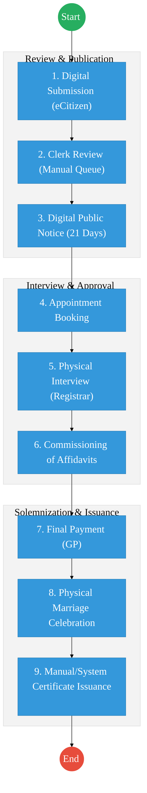

# REGISTRAR OF MARRIAGES (OFFICE OF THE ATTORNEY GENERAL) – Service Delivery

## Cover Page
- **Ministry/Department/Agency (MDA):** Office of the Attorney General & Department of Justice
- **Department:** Registrar of Marriages
- **Process Name:** Civil, Customary, and Professional Marriage Registration
- **Document Version:** 3.0 (Validated)
- **Date:** 2026-03-25
- **Classification:** Official / Sensitive
- **Strategic Category:** Priority MDA
- **Service Model:** G2C / G2B
- **Life-Cycle Group:** Cradle to Death (4. Marriage & Family)

---

## Service Mandate
**Official Website:** [www.statelaw.go.ke](https://www.statelaw.go.ke)

The Office of the Attorney General & Department of Justice (through the Registrar of Marriages) is mandated under the **Marriage Act, Cap 150** to:
- Perform and register all statutory marriages in Kenya.
- Issue marriage certificates for all registered unions.
- Determine the rules governing customary marriages and objections to notices of intention to marry.
- Appoint and license marriage officers (National and County levels) and Ministers of Faith.
- Register divorces and maintain marriage/divorce registers.
- Undertake public education and awareness on marital legal frameworks.

---

## Executive Summary
The Registrar of Marriages provides secure vital life-event records that are foundational to family status documentation in Kenya. This BPD outlines the transition to a fully digital workflow that eliminates manual "courier" steps for divorce registration and formalizes the 21-day public notice period within the **Digital Government Architecture (DSAP)**. 

A primary strategic priority is the **digitization of millions of previous marriage records** scattered across DCC offices and ministers of faith, bringing them into a centralized **National Marriages Registry** accessible via the **Huduma Bridge (KeSEL / X-Road)**.

---

## 1. SERVICE CATALOGUE

| # | Service Name | Target Population |
| :--- | :--- | :--- |
| **1** | Registration of Marriage by Notice | Civil, Christian, and Hindu Marriages |
| **2** | Registration of Marriage by Special Licence | Expedited Marriages (Civil/Christian/Hindu) |
| **3** | Certified Copy of Marriage Certificate | Citizens requiring replacements/certified copies |
| **4** | Certificate of No Impediment to Marriage | Kenyans marrying abroad |
| **5** | Registration of Existing Hindu Marriages | Couples with previous Hindu ceremony |
| **6** | Registration of Customary Marriages | New and existing customary unions |
| **7** | Licensing of Ministers of Faith | Religious leaders authorized to officiate |
| **8** | Issuance of Marriage Books | Licensed institutions and officers |
| **9** | Registration of Foreign Marriages | Kenyans who married outside national borders |
| **10** | Registration of Divorces | Citizens with Decree Absolutes from Courts |

---

---

## 2. AS-IS WORKFLOW (CIVIL MARRIAGE BY NOTICE)

The current workflow leverages eCitizen for the intake but maintains manual "ceremony" and interview stages.

### Stage 1: Application Submission and Review
1. **Submission:** Client submits marriage application via eCitizen portal.
2. **Review:** Marriage Clerk retrieves applications from the queue on a first-come, first-served basis.
3. **Decision:** Clerk approves, rejects, or returns for correction.

### Stage 2: Notice Fee Payment & Public Notice
1. **Payment:** Upon approval, client pays the prescribed **Notice Fee** via eCitizen.
2. **Display:** System automatically forwards the application to the **Digital Noticeboard**.
3. **Notice Period:** Application remains on the public noticeboard for **21 days** for objections.

### Stage 3: Appointment Booking & Interview
1. **Booking:** After 21 days, client is notified to book an interview appointment.
2. **Interview:** Parties appear before a Gazetted Registrar with original documents to verify capacity and document authenticity.
3. **Approval:** Registrar approves and commissions signed affidavits.

### Stage 4: Booking and Celebration
1. **Solemnization Fee:** Parties pay the final prescribed fee.
2. **Celebration:** Registrar books the marriage date; parties and witnesses appear for solemnization.
3. **Issuance:** Registrar officiates and issues marriage certificates.
4. **Digitization:** Triplicate copies are scanned and uploaded to create the database.

---

## 3. REGISTRATION OF DIVORCES

1. **Trigger:** Court delivers a certified copy of the **Divorce Decree Absolute** to the Registrar of Marriages.
2. **Action:** Registrar registers the divorce in the **Divorce Register**.
3. **Registry Update:** The original marriage record is marked to reflect the change in marital status.

---

---

# PART 3: TO-BE PROCESS (DPI-ENABLED)

The TO-BE state transforms the marriage lifecycle into an identity-integrated, verifiable workflow.

```mermaid
%%{init: { 'theme': 'base', 'themeVariables': { 'fontSize': '24px', 'fontFamily': 'Inter, system-ui, sans-serif', 'primaryColor': '#ffffff', 'edgeLabelBackground':'#ffffff', 'tertiaryColor': '#f3f3f3', 'mainBkg': '#ffffff', 'nodeBorder': '#333333' } } }%%
flowchart TD
    Start((Start)) --> Portal["Citizen Applies via Marriage Portal (Maisha SSO)"]
    
    subgraph Trust_Hub["Layer 2: Identity & Status"]
        Portal --> Verify["X-Road: Verify Capacity (IPRS/Marriages)"]
        Verify --> Consent["Consent Manager: Access Marital History?"]
    end
    
    subgraph Operations["Layer 2 & 3: Workflow & Notice"]
        Consent --> AutoNotice["Automated 21-Day Digital Public Notice"]
        AutoNotice --> ObjCheck["Auto-check for Objections (AI Screening)"]
        ObjCheck --> SmartBook["Digital Interview Booking / Virtual Interview"]
    end
    
    subgraph Settlement["Layer 4: Registries & Issuance"]
        SmartBook --> GPA["Final Fee Settlement (GPA)"]
        GPA --> Sign["NPKI Digital Signature & Seal"]
        Sign --> Wallet["Issue Verifiable Digital Certificate (QR)"]
        Wallet --> DivorceSync["X-Road: Sync Divorce Decrees (Judiciary)"]
    end
    
    DivorceSync --> End((End))

    classDef start fill:#27ae60,stroke:#27ae60,color:#fff,font-size:24px;;
    classDef endNode fill:#e74c3c,stroke:#e74c3c,color:#fff,font-size:24px;;
    classDef userTask fill:#3498db,stroke:#2980b9,color:#fff,font-size:24px;;
    classDef serviceTask fill:#9b59b6,stroke:#8e44ad,color:#fff,font-size:24px;;
    
    class Start start;
    class End endNode;
    class Portal userTask;
    class Verify,Consent,AutoNotice,ObjCheck,SmartBook,GPA,Sign,Wallet,DivorceSync serviceTask;
```

---

# PART 4: ARCHITECTURE ALIGNMENT (KENYA HUDUMA BRIDGE)

The Marriage Registration and Divorce Tracking Service is engineered to operate across the four layers of the **Kenya DSAP Architecture**:

### Layer 1: Access Channels
- **eCitizen / Marriage Portal:** The primary window for citizens to submit marriage notices, book interviews, and pay fees.
- **Officer Workbench:** The specialized interface for Marriage Clerks and Registrars to manage applications, objections, and solemnization schedules.
- **DCC Offices / Huduma Centers:** Distributed intake points for the scanning (IDP) of manual certificates and historical records from regional offices.

### Layer 2: Core Platform
- **Workflow Engine (BPMN 2.0):** Orchestrates the marriage lifecycle (Notice Submission → 21-Day Publication → Objection Check → Interview → Solemnization → Issuance).
- **Trust Hub:**
  - **Consent Manager:** Mandatory consent from both parties before querying their marital history or IPRS data via X-Road.
  - **Identity Federation:** Real-time verification of applicant and witness identity via **Maisha Namba (IPRS)**.
  - **NPKI:** Digitally signing **Marriage Certificates**, **Special Licenses**, and **Divorce Entries** to ensure legal non-repudiation.
- **Shared Services:**
  - **Intelligent Document Processing (IDP):** Digitizing millions of historical marriage records from DCC offices and religious institutions into the National EDRMS.
  - **Document Generator:** Automated creation of verifiable certificates and "Certificate of No Impediment" with secure QR codes.
  - **Notifications:** Automated SMS/Email alerts for notice expiry, interview reminders, and status updates.

### Layer 3: Interoperability (Huduma Bridge)
- **KeSEL (X-Road):** Secure data exchange between the AG's office, the **Judiciary (Divorce Decrees)**, and **IPRS (Marital Status and Death data)**.
- **Central Service Catalogue:** Cataloguing marriage-related APIs for national and international verification.

### Layer 4: Authoritative Registries & Payments
- **Registries:**
  - **National Marriages Registry:** The sector-specific authoritative registry for all civil, customary, and religious unions.
  - **National EDRMS:** The definitive legal digital archive for all signed marriage/divorce records and historical artifacts.
  - **IPRS / Maisha Namba:** Foundational person registry for individual identity and marital status linkage.
- **Payments:** **Government Payment Aggregator (GPA)** for processing notice fees, solemnization charges, and certified copy fees.

---

## 5. STRATEGIC PRIORITIES (12-MONTH PLAN)

1. **Backlog Digitization:** Digitizing historical marriage records from DCC offices nationwide.
2. **Amendment of Marriage Rules:** Updating legal rules to explicitly recognize digital certificates and Virtual Solemnization.
3. **Integration with Judiciary:** Establishing the automated API link for divorce decrees.

---

## References
- Marriage Act, Cap 150
- Data Protection Act (2019)
- Civil Registration and Vital Statistics (CRVS) Framework

---

### Validation Survey
Please provide your feedback here: [https://ee.kobotoolbox.org/x/4Ls7SlCG](https://ee.kobotoolbox.org/x/4Ls7SlCG)
