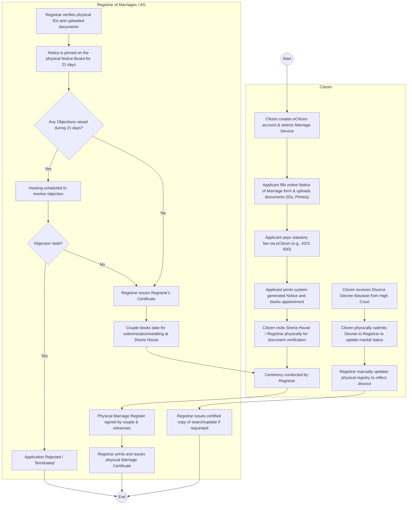
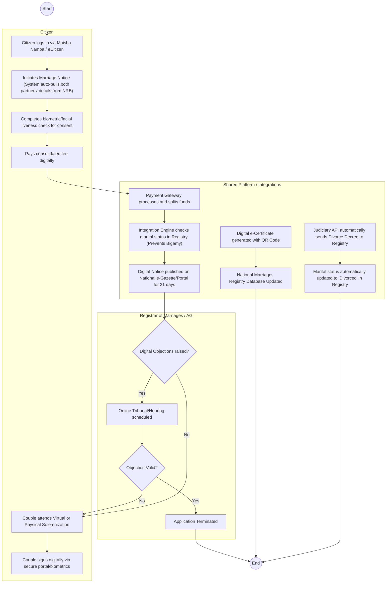

# OFFICE OF THE ATTORNEY GENERAL (AG) – Marriages & Divorces

## Cover Page
- **Ministry/Department/Agency (MDA):** OFFICE OF THE ATTORNEY GENERAL (AG) - REGISTRAR OF MARRIAGES
- **Process Name:** Civil Marriages & Divorces Registry
- **Document Version:** 2.0
- **Date:** 2026-03-17
- **Classification:** Official

---

## Executive Summary
The Office of the Attorney General (through the Registrar of Marriages) is mandated to register, solemnize, and maintain records of statutory marriages in Kenya. This includes processing notices of marriage, issuing certificates, conducting civil weddings, and updating the registry following court-ordered divorce decrees. The department plays a critical role in providing secure vital life-event records and family status documentation for citizens.

---

## 1. AS-IS Process Flowchart (BPMN 2.0)
*Current State visualization (Manual/Semi-Automated Marriage & Divorce Processing).*

---

## 2. Weaknesses & Pain Points (The "Why")
- **Manual Physical Presence Required:** Even though eCitizen handles the payment and initial application, couples must physically visit the registry for document verification and the ceremony, creating long queues.
- **Physical Notice Boards:** Relying on physical pin-boards for the 21-day statutory notice is outdated and fails to provide national visibility for objections.
- **Disconnected Divorce Updates:** The Judiciary handles divorces, but there is no automated API linking the High Court's Case Management System to the AG's Marriage Registry. Divorced individuals must manually carry court decrees to update their status.
- **Paper Registers:** The final legal artifact is still a physical signature in a large paper register book, making historical searches and certificate replacements very slow.

---

## 3. TO-BE Process Flowchart (BPMN 2.0)
*Future State visualization (Fully Digitized with Identity Federation).*

---

## 4. Automation & Digitization Opportunities (The "How")
- **National Population Register (NRB) Integration:** Auto-populate partner details to prevent identity fraud and automatically flag if a partner is already legally married in the system (preventing bigamy).
- **Digital Notice Board (e-Gazette):** Replace physical pin-boards with a centralized, searchable online portal where citizens can view notices and lodge objections digitally.
- **Judiciary API (Divorce decrees):** Establish a system-to-system integration with the Judiciary so that when a divorce is finalized in court, the AG's marriage registry is instantly updated without the citizen needing to act as a courier.
- **E-Certificates:** Issue digitally signed, QR-coded marriage certificates that can be instantly verified by embassies, banks, and other MDAs.

---

## 5. Required Integrations
- **NRB / IPRS:** For citizen identity verification and liveness checks.
- **Judiciary Case Management System (CMS):** To automatically receive and process absolute divorce decrees.
- **eCitizen / PayPay:** For payment processing.
- **Government e-Gazette:** For publishing 21-day marriage notices electronically.
