# OFFICE OF THE CHIEF OF STAFF – Service Delivery

## Cover Page
- **Ministry/Department/Agency (MDA):** Executive Office of the President
- **Office:** Office of the Chief of Staff
- **Process Name:** Whole-of-Government Oversight & Performance Monitoring
- **Document Version:** 2.2
- **Date:** 2026-03-04
- **Classification:** Official
- **Strategic Category:** Priority MDA
- **Service Model:** G2G
- **Life-Cycle Group:** Cradle to Death (5. Social Protection & Justice)

---

## Executive Summary
The Office of the Chief of Staff coordinates whole-of-government performance monitoring and strategic oversight. The current process relies on manual data collection from MDAs, leading to analysis lags. The transition to the Kenya DSAP Architecture aims to establish an automated performance engine that "pulls" data directly from MDA registries via the Huduma Bridge.

---

## 1. AS-IS Process Flowchart (BPMN 2.0)
*Current State visualization (Manual Whole-of-Government Oversight).*

```mermaid
%%{init: { 'theme': 'base', 'themeVariables': { 'fontSize': '24px', 'fontFamily': 'Inter, system-ui, sans-serif', 'primaryColor': '#ffffff', 'edgeLabelBackground':'#ffffff', 'tertiaryColor': '#f3f3f3', 'mainBkg': '#ffffff', 'nodeBorder': '#333333' } } }%%
flowchart TD
    %% Events
    Start((Start))
    EndClose(("End - Directive Closed"))
    EndEscalate(("End - Escalated"))

    subgraph OHPS["Office of the Head of Public Service"]
        direction TB
        ReceiveDir["1. Receive Directive (Memo/Physical)"]
        AnalyzeDir["2. Analyse & Identify Responsible MDAs"]
        TranslateDir["3. Translate into Instructions & KPIs"]
        DispatchInst["4. Dispatch Instructions to PSs (Manual)"]
    end

    subgraph MDAs ["Government Ministries (MDAs)"]
        direction TB
        ConfirmRec["5. PSs Confirm Receipt & Assign Tasks"]
        ImplDir["6. MDAs Implement Directive Tasks"]
        SubProg["7. Submit Progress Reports (Excel/Email)"]
    end

    subgraph Monitoring ["Executive Monitoring & Evaluation"]
        direction TB
        TrackImpl["8. Track Progress (Manual Follow-up)"]
        Consolidate["9. Consolidate Reports from MDAs"]
        AssessPerf["10. Assess Performance against KPIs"]
        EvalGateway{Satisfactory?}
    end

    subgraph Outcomes ["Decision Outcomes"]
        direction TB
        CloseFeed["11. Close Directive & Feedback"]
        IssueCorr["12. Issue Corrective Instructions"]
    end

    %% Flow connections
    Start --> ReceiveDir
    ReceiveDir --> AnalyzeDir
    AnalyzeDir --> TranslateDir
    TranslateDir --> DispatchInst
    
    DispatchInst --> ConfirmRec
    ConfirmRec --> ImplDir
    ImplDir --> SubProg
    
    SubProg --> TrackImpl
    TrackImpl --> Consolidate
    Consolidate --> AssessPerf
    AssessPerf --> EvalGateway
    
    EvalGateway -- "Yes" --> CloseFeed
    EvalGateway -- "No" --> IssueCorr
    
    IssueCorr --> ImplDir
    IssueCorr --> EndEscalate
    CloseFeed --> EndClose

    %% Styling
    classDef startEvent fill:#27ae60,stroke:#27ae60,color:#fff,font-size:24px,font-size:24px,font-size:24px;;
    classDef endEvent fill:#e74c3c,stroke:#e74c3c,color:#fff,font-size:24px,font-size:24px,font-size:24px;;
    classDef userTask fill:#3498db,stroke:#2980b9,color:#fff,font-size:24px,font-size:24px,font-size:24px;;
    classDef gateway fill:#f1c40f,stroke:#f39c12,color:#333,font-size:24px,font-size:24px,font-size:24px;;
    
    class Start startEvent;
    class EndClose,EndEscalate endEvent;
    class EvalGateway gateway;
    class ReceiveDir,AnalyzeDir,TranslateDir,DispatchInst,TrackImpl,Consolidate,AssessPerf,CloseFeed,IssueCorr,ConfirmRec,ImplDir,SubProg userTask;
```

---

## Process Overview
### Process Name
End-to-End Whole-of-Government Oversight (Tasking to Follow-Up)

### Service Category
- G2G (Government to Government)

### Scope
- **In Scope:** Performance data collection, analysis, governance standards oversight, and executive briefing.
- **Out of Scope:** Individual MDA internal HR operations.

### Triggers
- Executive directives or periodic reporting cycles.

### End States
- **Successful:** Governance compliance status assessed; Leadership briefed.

### Policy Context
- Executive Order No. 1 of 2023.

---

## Detailed Process (AS-IS)

| Step | Role | Action | Tool/System | Notes |
|---|---|---|---|---|
| 1 | Head of Public Service | Receives Presidential Directive. | Physical/Memo | Originates from Cabinet or Presidential instruction. |
| 2 | OHPS Analysis Team | Analyses the directive to identify responsible MDAs and scopes required actions. | Manual/Meetings | |
| 3 | Senior Coordinators | Translates the directive into formal implementation instructions and KPIs. | Word/Memo | |
| 4 | OHPS Secretariat | Dispatches instructions via memo/email to the respective Principal Secretaries. | Email/Registry | |
| 5 | Principal Secretaries | Confirm receipt of instructions and assign internally within their MDAs. | Memo/Email | |
| 6 | MDAs | Implement the directive tasks based on received instructions. | Internal Systems | |
| 7 | MDAs (Reporting Teams)| Compile and submit progress reports quarterly or as requested. | Email/Excel | High effort, prone to delays. |
| 8 | OHPS Analysis Team | Consolidates received reports manually from multiple MDAs. | Excel | Time-consuming process. |
| 9 | Senior Coordinators | Performs performance assessment against original directive KPIs. | Manual | |
| 10 | Head of Public Service | Reviews assessment to decide if implementation is satisfactory. If yes, closes directive. If no, issues corrective instructions or escalates. | Briefings | |

---

## Pain Points & Opportunities
### Pain Points
- **Manual Tracking:** Relying on emails and memos makes it nearly impossible to have real-time visibility into MDA compliance.
- **Data Silos:** Reports from MDAs are unstructured (Word/Excel), requiring massive manual effort to consolidate.
- **Delayed Intervention:** Corrective actions happen only after quarterly reports are reviewed, leading to long implementation delays.

### Opportunities
- **Automated Workflow:** Implement an Executive Coordination Portal to digitize tasking and tracking.
- **Interoperability (X-Road):** Pull actual performance data directly from MDA core systems rather than relying on self-reported spreadsheets.
- **Real-Time Dashboards:** Provide the Head of Public Service with live tracking of all directives.

---

## 2. TO-BE Process Flowchart (BPMN 2.0)
*Future State visualization (Kenya DSAP Architecture - Executive Coordination).*

```mermaid
%%{init: { 'theme': 'base', 'themeVariables': { 'fontSize': '24px', 'fontFamily': 'Inter, system-ui, sans-serif', 'primaryColor': '#ffffff', 'edgeLabelBackground':'#ffffff', 'tertiaryColor': '#f3f3f3', 'mainBkg': '#ffffff', 'nodeBorder': '#333333' } } }%%
flowchart TD
    %% Events
    Start((Start))
    EndSuccess(("End - Directive Goals Met"))
    EndEscalate(("End - Remediation Required"))

    subgraph Input["Presidential Directives Input"]
        direction TB
        EnterDir["1. Head of Public Service Enters Directive"]
        StoreDir["2. Secure Storage in National Registry"]
    end

    subgraph Automation["Digital Platform & Interoperability"]
        direction TB
        AssignTasks["3. System Automates Task Assignment"]
        ExposeData["4. MDAs Expose Progress Data via APIs"]
        SubUpdate["5. MDAs Submit Digital Milestone Updates"]
        FetchData["6. Real-time Data Fetch via X-Road"]
    end

    subgraph Monitoring ["Executive Performance Monitoring"]
        direction TB
        MonitorComp["7. System Monitors Compliance & KPIs"]
        GenDash["8. Real-time Performance Dashboard"]
        DetectGateway{All KPIs Met?}
    end

    subgraph Intervention ["Governance Interventions"]
        direction TB
        DeadlineGateway{Deadline Exceeded?}
        TrigEsc["9. Trigger Automated Reminders"]
        ActNudge["10. PSs Act on Reminders"]
        GenRep["11. Generate Strategic Situation Reports"]
    end

    %% Flow connections
    Start --> EnterDir
    EnterDir --> StoreDir
    StoreDir --> AssignTasks
    AssignTasks --> ExposeData
    AssignTasks --> SubUpdate
    
    ExposeData --> FetchData
    SubUpdate --> FetchData
    
    FetchData --> MonitorComp
    MonitorComp --> GenDash
    GenDash --> DetectGateway
    
    DetectGateway -- "Yes" --> GenRep
    DetectGateway -- "No" --> DeadlineGateway
    
    DeadlineGateway -- "No" --> MonitorComp
    DeadlineGateway -- "Yes" --> TrigEsc
    
    TrigEsc --> ActNudge
    TrigEsc --> GenRep
    
    GenRep --> EndSuccess
    ActNudge --> EndEscalate

    %% Styling
    classDef startEvent fill:#27ae60,stroke:#27ae60,color:#fff,font-size:24px,font-size:24px,font-size:24px;;
    classDef endEvent fill:#e74c3c,stroke:#e74c3c,color:#fff,font-size:24px,font-size:24px,font-size:24px;;
    classDef userTask fill:#3498db,stroke:#2980b9,color:#fff,font-size:24px,font-size:24px,font-size:24px;;
    classDef serviceTask fill:#9b59b6,stroke:#8e44ad,color:#fff,font-size:24px,font-size:24px,font-size:24px;;
    classDef gateway fill:#f1c40f,stroke:#f39c12,color:#333,font-size:24px,font-size:24px,font-size:24px;;
    
    class Start startEvent;
    class EndSuccess,EndEscalate endEvent;
    class DetectGateway,DeadlineGateway gateway;
    class StoreDir,AssignTasks,FetchData,MonitorComp,GenDash,TrigEsc,ExposeData serviceTask;
    class EnterDir,GenRep,SubUpdate,ActNudge userTask;
```

## Future State Process (TO-BE)
### Narrative
**TO-BE Process: Digital Whole-of-Government Oversight**

The To-Be process eliminates "Reporting Fatigue" by automatically pulling evidence-based performance data from MDA registries via **X-Road**. The **AI Analytics Engine** provides the President and Chief of Staff with a real-time governance heatmap, moving from reactive reporting to proactive intervention.

**Core Components:**
- **Executive Performance Dashboard:** Provides real-time visibility to the Chief of Staff and Presidency.
- **Workflow Engine:** Automates task assignment and routing to Principal Secretaries.
- **Interoperability (X-Road):** Ensures data integrity by pulling directly from authoritative registries.

---

## References
- https://www.president.go.ke
- Executive Order No. 1 of 2023
- Desk Review

---

## Feedback
We value your input on this blueprint. Please take a moment to provide your feedback using the link below:

[Provide Feedback](https://ee.kobotoolbox.org/x/4Ls7SlCG)
