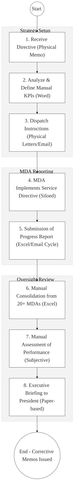
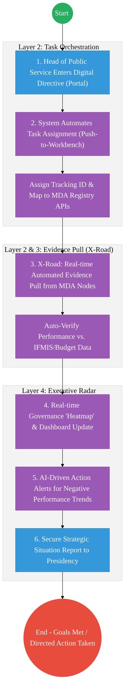

# OFFICE OF THE CHIEF OF STAFF – Business Process Architecture (Updated)

## Cover Page
- **Ministry:** Executive Office of the President
- **Office:** Office of the Chief of Staff
- **Primary Authority:** Chief of Staff to the President
- **Document Type:** Business Process Architecture (BPA) Standardised
- **Document Version:** 4.1
- **Date:** 2026-03-25
- **Classification:** Top Secret / Restricted
- **Strategic Category:** Priority MDA - System Anchor (Tier 1)
- **Service Model:** G2G (Executive Strategy)
- **Reviewer:** Senior Government Enterprise Architect

---

## SECTION 0: SERVICE PRIORITISATION MAPPING
- **Mapped Priority Service:** Whole-Of-Government Oversight & Performance Monitoring
- **Tier Classification:** Tier 1
- **Strategic Category:** Governance / Oversight (Executive Leadership)
- **Breakout Room Classification:** Room 2 (Coordination, Culture & Specialised Services)
- **Lead MDA (Standardised Name):** Office of the Chief of Staff
- **Related Cross-Cutting Services:**
    - Executive Performance Engine (Registry Pull)
    - Identity Layer (IPRS / Maisha Namba - Executive Tier)
    - X-Road (Whole-of-Gov KPI Access)
    - GDMIS (Delivery Management Sync)
    - National EDRMS (Strategic Directives Repository)

---

## SECTION 0.1: PRIORITISATION JUSTIFICATION
This service is prioritised because the TO-BE design transforms the Office of the Chief of Staff from a reactive "report-consolidation" unit into a "Proactive Strategic Nerve Center." By implementing a "National Tasking & Performance Engine" that pulls real-time milestone evidence directly from MDA authoritative registries via X-Road (Huduma Bridge), the design eliminates historical "Reporting Fatigue" and the inherent bias of self-reported progress data. This transformation provides the Presidency with a live "Governance Heatmap," enabling immediate, data-driven corrective interventions for flagging national priorities (BETA projects) and ensuring 100% policy-to-outcome alignment across all 20+ Ministries and 47 Counties.

| Criteria | Evidence from TO-BE Design |
| :--- | :--- |
| **Demand / Volume** | Oversight of thousands of national projects; continuous directive tasking and follow-up. |
| **National Priority Alignment** | Constitution Articles 131/132; Vision 2030 Governance Pillar; Executive Order No. 2. |
| **Data Reusability** | Performance data is the primary input for National Budgeting and Public Service rewarding. |
| **Interoperability** | The "Master Nerve Center" pulling data from specialized registries (Health, Infrastructure, Finance) via X-Road. |
| **Revenue / Efficiency Impact** | Prevents "Project Drift" and misallocation of KES billions through real-time milestone tracking. |
| **Governance / Risk Reduction** | Immutable audit trail of every presidential directive from issuance to final confirmed impact. |
| **Inclusivity** | Ensures that "Last-Mile" project delivery (grassroots) is visible to the highest executive level. |
| **Readiness** | High; The GDMIS dashboard is maturing; X-Road is ready for high-level data orchestration. |

> [!NOTE]
> “The TO-BE design transforms the Office of the Chief of Staff from a reactive 'report-consolidation' unit into a 'Proactive Strategic Nerve Center.' By implementing a 'National Tasking & Performance Engine' that pulls real-time milestone evidence directly from MDA registries via X-Road (Huduma Bridge), the design eliminates 'Reporting Fatigue' and self-reported data bias. This transformation provides the Presidency with a live 'Governance Heatmap,' enabling immediate corrective interventions for flagging national priorities and ensuring 100% policy-to-outcome alignment across all 20+ Ministries.”

---

# SECTION 1: SERVICE DEFINITION (STANDARDISED)

The Office of the Chief of Staff (within the Executive Office of the President) is responsible for the overall management of the Presidency and strategic coordination of the entire Public Service, anchored in **Executive Order No. 1 of 2023**. 

In this refactored BPA, the primary service is the **Whole-of-Government Tasking, Oversight, and Performance Governance** lifecycle. The objective is to move from manual "Memo-based" follow-ups to an **Automated Performance Engine** where progress is verified via **X-Road Data Evidence** and visualized on the **Executive Radar Dashboard**.

---

# SECTION 2: SERVICE CATALOGUE (NORMALISED)

| Category | Service Name | Description |
| :--- | :--- | :--- |
| **Core Services** | **Presidential Directive Tasking**| Automated dispatch and legal-chain-of-custody for instructions. |
| | **Cross-MDA Perf. Monitoring** | Real-time "Truth-check" of project status via registry data pulls. |
| **Extended Services** | **Strategic Outcome Dashboard** | Visualization of national goal attainment (BETA Scorecard). |
| | **MDA Compliance Auditing** | Digital tracking of governance and record-management standards. |
| **Special Case Services**| **Executive Crisis Coordination**| High-speed tasking and resource-reallocation for emergencies (G2G). |
| | **Governance Nudge Alerts** | AI-driven "Early-Warning" alerts to PSs on deliverable slippage. |

---

# SECTION 3: AS-IS PROCESS FLOWS (MANUAL/DATA-LAGGED)

Currently, performance monitoring relies on manual data collection from MDAs via Excel and Word, leading to significant analysis lags and reporting friction.

### 3.1 AS-IS Visualization

### 3.2 Operational Reality
- **Actors:** Chief of Staff, Head of Public Service, Principal Secretaries, Coordination Officers.
- **Systems:** MS Word / Excel, Physical Memos, Standalone Email, Phone Calls.
- **Pain Points:** 60-day lag between "Problem" and "Detection"; reports from MDAs are "self-reported" with high risk of bias; massive manual effort to merge different reporting formats; "Reporting Fatigue" causes MDAs to provide lower-quality data over time.

---

# SECTION 4: TO-BE PROCESS INTERPRETATION (NEW LAYER)

### 4.1 TO-BE Process (Executive Nerve Center)

### 4.2 Key Capabilities Introduced
*   **Automation:** Zero-Friction Evidence Retrieval – system validates "Project Complete" by checking transactional logs (e.g., Certificate issuance) directly.
*   **Integration:** Hub-and-spoke integration with the **GDMIS** (Project Tracker) and **Public Service Performance Management** (HR) via X-Road.
*   **Real-time Processing:** Live "Strategy Dashboard" updated continuously – no more waiting for quarterly reports.
*   **Digital Identity Validation:** Executive identities and ministerial sign-offs verified via **National PKI (NPKI)**.
*   **Workflow Orchestration:** Orchestrates the total governance lifecycle from high-level Presidential instruction to verified grassroots outcome.

### 4.3 Transformation Summary
| Dimension | AS-IS | TO-BE |
| :--- | :--- | :--- |
| **Processing** | Manual / Reactive | Digital / Proactive Pull |
| **Verification** | Self-Reporting (Paper claims) | API-Based Evidence (Registry Truth) |
| **Records** | Regional/Mail Folders | Unified National Performance Archive |
| **Tracking** | Static Quarterly Snapshots | Real-time Strategic Alerting |

---

# SECTION 5: SYSTEM LANDSCAPE (ALIGN TO GEA)

| Layer | System / Platform | Role |
| :--- | :--- | :--- |
| **Identity Layer** | Maisha Namba (Exec Tier) | Identity and Bio-login for the high-level oversight team. |
| **Interoperability** | KeSEL (X-Road) | The central "Data-Harvester" for all 20+ Ministries. |
| **shared Services** | National EDRMS | Restricted digital archive for Strategic Directives. |
| **Workflow / BPM** | National Tasking Hub | Orchestrates instructions and PS-level responses. |
| **Reporting / Analytics**| Executive Strategy Radar | Real-time predictive analytics and trend dash. |
| **Trust Hub** | NPKI Service | Cryptographic sealing of all Executive Directives. |

---

# SECTION 6: TRANSFORMATION VALUE (CRITICAL ADDITION)

| Value Type | Explanation |
| :--- | :--- |
| **Efficiency Gain** | 80% reduction in reporting time for MDAs; instant situational awareness for CoS. |
| **Economic Impact** | Accelerates national development projects and fiscal absorption rates. |
| **Governance Impact** | Eliminates "Information Asymmetry" between the Presidency and Ministries. |
| **Citizen Experience** | Dramatically improves government responsiveness to grassroots needs. |
| **Interoperability Value** | Shared Strategic Hub ensures all MDAs are rowing in the same direction. |

---

# SECTION 7: ALIGNMENT TO WHOLE-OF-GOVERNMENT ARCHITECTURE
- **Shared Platforms:** Uses the Government Service Bus as the mandated bridge for all performance reporting.
- **Registry Reuse:** Reuses project-ID data from MDAs to ensure a single thread of project traceability.
- **Compliance with GEA / GIF:** Standardizing executive briefing and KPI schemas for national consistency.

---

# SECTION 8: IMPLEMENTATION READINESS (NEW)
*   **Data Readiness:** High; Project data is available in IFMIS and GDMIS.
*   **Legal Readiness:** High; Executive Order No. 1 2023 provides absolute mandate for oversight.
*   **Institutional Readiness:** High; The Office of the Chief of Staff has top-level authority over the civil service.
*   **Technical Readiness:** High; HUDUMA Bridge nodes are ready for high-level data aggregation.

---

# SECTION 9: TRACEABILITY MATRIX (NEW)

| BPA Process | Priority Service | Tier | TO-BE Capability | National Impact |
| :--- | :--- | :--- | :--- | :--- |
| **Tasking Hub** | Directive Dispatch | T1 | NPKI-Signed Tasking Portal | Secure Policy Implementation |
| **Evidence Pull** | Performance Mon. | T1 | X-Road: Auto-Data Capture | Facts-over-Reporting Culture |
| **Strategy Dash** | Analytics | T1 | Live Executive Heatmaps | Data-Driven Governance |
| **Escalation Mgt** | Remediation | T1 | Proactive "Nudge" AI Alerts | Accelerated Service Delivery |

---
**[End of Standardised Business Process Architecture]**
