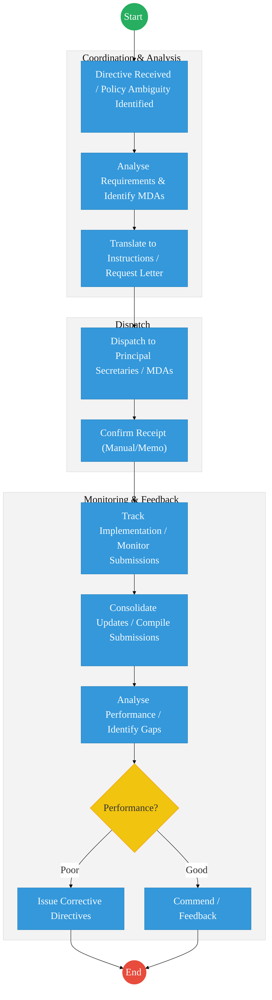
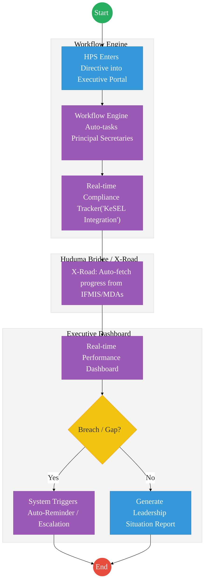

# OFFICE OF THE HEAD OF PUBLIC SERVICE (OHPS) – Executive Coordination

## Cover Page
- **Ministry/Department/Agency (MDA):** Executive Office of the President
- **Department:** Office of the Head of Public Service (OHPS)
- **Process Name:** Executive Coordination and Presidential Directives Management
- **Document Version:** 2.1
- **Date:** 2026-02-24
- **Classification:** Official
- **Strategic Category:** Priority MDA
- **Service Model:** G2G
- **Life-Cycle Group:** Cradle to Death (4. Employment & Business)

---

## Service Mandate
The Office of the Head of Public Service is responsible for managing the operations of the public service, coordinating policies across ministries, and supervising the implementation of government programs. Under Executive Order No. 2 of 2023, it oversees the administration of all State Corporations and public entities, facilitates communication between the Presidency and MDAs, and ensures the general efficiency and effectiveness of the civil service.

---

## Executive Summary
The Office of the Head of Public Service (OHPS) is the apex office for coordinating government-wide policy implementation and tracking the execution of Presidential Directives across all MDAs. The current process is heavily reliant on manual tracking, memo-based communication, and periodic quarterly reports from Principal Secretaries. The transition to the Kenya DSAP Architecture aims to create a real-time, digital "Executive Dashboard" that tracks compliance and performance via the national service bus.

---

## 1. AS-IS Process Flowchart (BPMN 2.0)
*Current State visualization (End-to-End Executive Coordination based on Deep Dive).*

---

## Process Overview
### Process Name
Executive Coordination, Directive Tracking, and Performance Monitoring

### Service Category
- G2G (Government to Government)

### Scope
- **In Scope:** Issuance of instructions to Principal Secretaries, tracking compliance with Presidential Directives, and monitoring government-wide performance.
- **Out of Scope:** Individual MDA internal HR/Admin processes.

### Triggers
- Issuance of a Presidential Directive or identification of a cross-cutting policy ambiguity.

### End States
- **Successful:** Directive implemented across MDAs; Performance targets met; Policy clarified.

### Policy Context
- The Constitution of Kenya; Executive Order No. 1 of 2023; Public Service Commission Act.

---

## Detailed Process (AS-IS)

| Step | Role | Action | Tool/System | Notes |
| :--- | :--- | :--- | :--- | :--- |
| 1 | Head of Public Service | Receives a Presidential Directive and translates it into specific instructions for relevant Ministries. | Memo/Letter |  |
| 2 | Senior Coordinators | Identify the specific MDAs responsible for various deliverables within the directive. | Manual |  |
| 3 | OHPS Admin | Dispatches instructions via official correspondence (letters/memos) to Principal Secretaries. | Physical/Email |  |
| 4 | Principal Secretaries | MDAs submit quarterly reports on the status of implementation. | Word/Excel Reports |  |
| 5 | OHPS Analysis Team | Manually consolidates reports, identifies gaps, and prepares a summary for the Head of Public Service. | Manual |  |

---

## Pain Points & Opportunities
### Pain Points
- **Delayed Feedback:** Relying on quarterly paper-based reports means gaps are identified months too late.
- **Manual Consolidation:** High risk of errors and data manipulation when merging reports from 20+ Ministries.
- **Lack of Real-Time Tracking:** No central dashboard to see the current status of "National Priority" projects instantly.

### Opportunities
- **Automated Performance Pull:** Instead of waiting for reports, the OHPS system can "pull" completion data from MDA systems via **X-Road**.
- **Unified Executive Dashboard:** A real-time visualization of all Presidential Directives and their current "RAG" (Red/Amber/Green) status.
- **Digital Directives:** Issuing and tracking instructions through a secure, non-repudiable workflow engine.

---

## 2. TO-BE Process Flowchart (BPMN 2.0)
*Future State visualization (Kenya DSAP Architecture - Huduma Bridge).*

## Future State Process (TO-BE)
### Narrative
**TO-BE Process: Data-Driven Executive Coordination**

**Design Principles:**
- **Automated Compliance:** The **Workflow Engine** replaces memos. Instructions are tracked as "Tasks" with hard deadlines.
- **Evidence-Based Monitoring:** OHPS no longer waits for manual reports. The system pings MDA-specific registries (e.g., IFMIS for spending, KIAMIS for farmer outreach) via **X-Road** to verify progress independently.
- **Proactive Escalation:** The **API Gateway** monitors response times, automatically flagging delays to the Head of Public Service before they become national bottlenecks.

### Optimized Steps (Digital)

| Step | Actor | Action | Tool / System |
| :--- | :--- | :--- | :--- |
| 1 | Head of Public Service | Enters a directive into the Executive Coordination Portal, defining the Lead MDA and key milestones. | Executive Portal |
| 2 | System | Instantly notifies relevant Principal Secretaries and creates a tracking record in the national service bus. | Workflow Engine |
| 3 | System | Periodically fetches implementation data from authoritative registries via X-Road to validate MDA claims. | KeSEL / X-Road |
| 4 | Senior Coordinators | Monitor the "Executive Heatmap" dashboard to identify underperforming sectors. | Executive Dashboard |
| 5 | System | Generates a weekly "Situation Report" for the President, highlighting critical paths and compliance scores. | Analytics Engine |

---

## References
- https://www.headofpublicservice.go.ke
- Executive Order No. 1 of 2023
- Desk Review

---

### Validation Survey
Please provide your feedback here: [https://ee.kobotoolbox.org/x/4Ls7SlCG](https://ee.kobotoolbox.org/x/4Ls7SlCG)

