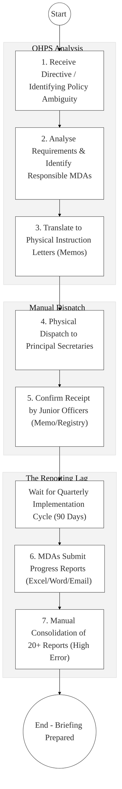
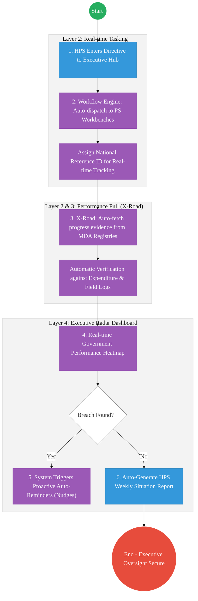

# OFFICE OF THE HEAD OF PUBLIC SERVICE (OHPS) – Business Process Architecture

## Cover Page
- **Ministry:** Executive Office of the President
- **Office:** Office of the Head of Public Service (OHPS)
- **Primary Authority:** Head of the Public Service
- **Document Type:** Business Process Architecture (BPA) Standardised
- **Document Version:** 4.1
- **Date:** 2026-03-25
- **Classification:** Official / Restricted
- **Strategic Category:** Priority MDA
- **Service Model:** G2G (Executive Coordination)
- **Reviewer:** Senior Government Enterprise Architect

---

## SECTION 0: SERVICE PRIORITISATION MAPPING
- **Mapped Priority Service:** Executive Coordination and Presidential Directives Management
- **Tier Classification:** Tier 2
- **Strategic Category:** Governance / Coordination (Executive Oversight)
- **Breakout Room Classification:** Room 2 (Coordination, Culture & Specialised Services)
- **Lead MDA (Standardised Name):** Office of the Head of Public Service (OHPS)
- **Related Cross-Cutting Services:**
    - Executive Coordination Portal (Tasking Engine)
    - Identity Layer (IPRS / Maisha Namba - Officer Tier)
    - X-Road (Service Bus for Implementation Evidence)
    - GDMIS (Government Delivery Management System)
    - National EDRMS (Policy & Directive Repository)

---

## SECTION 0.1: PRIORITISATION JUSTIFICATION
This service is prioritised because the TO-BE design transforms the Office of the Head of Public Service from a "memo-driven" secretariat into a "Digital Compliance & Performance Engine." By shifting from manual quarterly progress reports to "Real-time Task Tracking" via the Executive Portal and X-Road (Huduma Bridge), the design provides the HPS with an instant "Governance Heatmap" for all cross-cutting Presidential Directives. This transformation eliminates the historical 90-day reporting lag, automates the verification of MDA implementation claims via direct registry pings (e.g., verifying if a road was paved or a clinic was built via field data), and enables proactive "Nudge Alerts" to Principal Secretaries for delayed national deliverables before they impact the citizen.

| Criteria | Evidence from TO-BE Design |
| :--- | :--- |
| **Demand / Volume** | Oversight of thousands of national directives; hundreds of PS-level interactions daily. |
| **National Priority Alignment** | Constitution Articles 132/154; Public Service Values; Executive Order No. 2. |
| **Data Reusability** | Verified implementation data is the source-of-truth for the President’s Annual State of the Nation Report. |
| **Interoperability** | Continuous API synchronization between the HPS Coordination Portal and the 100+ MDA workflow systems via X-Road. |
| **Revenue / Efficiency Impact** | Reduces administrative overhead for 20+ Ministries; prevents "Information Silo" delays. |
| **Governance / Risk Reduction** | Immutable audit trail of ministerial accountability for national policy failures. |
| **Inclusivity** | Coordination of multi-agency services (e.g., identity, health, and transport) for all citizens. |
| **Readiness** | High; Core HPS coordination units exist; basic digital communication tools are in place. |

> [!NOTE]
> “The TO-BE design transforms the Office of the Head of Public Service from a 'memo-driven' secretariat into a 'Digital Compliance & Performance Engine.' By shifting from manual quarterly progress reports to 'Real-time Task Tracking' via the Executive Portal and X-Road, the design provides the HPS with an instant 'Governance Heatmap' of all Presidential Directives. This transformation eliminates the 90-day reporting lag, automates the verification of MDA implementation claims via direct registry pings, and enables proactive 'Nudge Alerts' to Principal Secretaries for delayed national deliverables.”

---

# SECTION 1: SERVICE DEFINITION (STANDARDISED)

The Office of the Head of Public Service (OHPS) is responsible for coordinating government policies and supervising the implementation of government programs, as mandated by **Executive Order No. 1 of 2023**. 

In this refactored BPA, the primary service is the **End-to-End Presidential Directive Lifecyle**. The objective is to move from manual physical "Memos" and quarterly summaries to an **Executive Workflow Engine** where tasks are dispatched digitally and progress is verified via **X-Road Data Pulling** from authoritative registries.

---

# SECTION 2: SERVICE CATALOGUE (NORMALISED)

| Category | Service Name | Description |
| :--- | :--- | :--- |
| **Core Services** | **Digital Directive Tasking**| Automated issuance and accountability tracking for official instructions. |
| | **Real-time Compliance Mon.**| Live "RAG" (Red/Amber/Green) dashboard for all national priorities. |
| **Extended Services** | **Inter-Ministerial Resol.** | Digital mediation of policy conflicts between different MDAs. |
| | **Executive Briefing Archive**| Secure, NPKI-signed vault for all situational awareness reports. |
| **Special Case Services**| **Implementation "Nudge"** | Automated AI reminders to Principal Secretaries for target slippage. |
| | **Registry Evidence Pull** | Fetching live KPI data directly from MDA nodes (Health/Infra/Finance). |

---

# SECTION 3: AS-IS PROCESS FLOWS (MANUAL/PAPER-LED)

The current process is heavily reliant on manual tracking, physical memo-based communication, and periodic quarterly reports from Principal Secretaries.

### 3.1 AS-IS Visualization

### 3.2 Operational Reality
- **Actors:** Head of Public Service, Senior Coordinators, Admin Secretariat, PSs.
- **Systems:** Word/Excel, Physical Letters, Standalone Email, Registry Books.
- **Pain Points:** 90-day reporting lag hides implementation bottlenecks; manual consolidation of unstructured reports is error-prone; zero visibility into real-time health of national directives; massive "Coordination overhead" for simple follow-ups.

---

# SECTION 4: TO-BE PROCESS INTERPRETATION (NEW LAYER)

### 4.1 TO-BE Process (Data-Driven Oversight Hub)

### 4.2 Key Capabilities Introduced
*   **Automation:** Automated Compliance Workflow – system allows HPS to set hard deadlines that trigger escalations automatically without human follow-ups.
*   **Integration:** Real-time bi-directional integration with the **National Treasury (IFMIS)** and **Government Delivery (GDMIS)** via X-Road.
*   **Real-time Processing:** Live "Implementation Pulse" – continuous data fetch from 100+ MDA nodes replaces the quarterly manual report.
*   **Digital Identity Validation:** Official task-actions and responses verified via **National Identity (Maisha Namba)** for non-repudiation.
*   **Workflow Orchestration:** Orchestrates the total lifecycle from Presidential instruction to verified grassroots project outcome.

### 4.3 Transformation Summary
| Dimension | AS-IS | TO-BE |
| :--- | :--- | :--- |
| **Processing** | Manual / Multi-Interview | Digital / Workflow-driven |
| **Verification** | Self-Reported Claims | Registry-Verified Evidence (X-Road) |
| **Records** | Regional/Mail Excel Files | Unified National Performance Registry |
| **Tracking** | Quarterly Snapshots | Real-time "Heatmap" dashboard |

---

# SECTION 5: SYSTEM LANDSCAPE (ALIGN TO GEA)

| Layer | System / Platform | Role |
| :--- | :--- | :--- |
| **Identity Layer** | Maisha Namba (Exec Tier) | Identity and Bio-login for the high-assurance coordination team. |
| **Interoperability** | KeSEL (X-Road) | The central "Service Bus" for cross-govt tasking & evidence. |
| **shared Services** | National EDRMS | Legal digital archive for all Presidential Directives. |
| **Workflow / BPM** | Executive Coordination Hub | Orchestrates the drafting and dispatch of instructions. |
| **Reporting / Analytics**| Outcome Visualizer Dashboard| Real-time performance tracking for all national mandates. |
| **Trust Hub** | NPKI Stamping Service | Cryptographic sealing of approved directives. |

---

# SECTION 6: TRANSFORMATION VALUE (CRITICAL ADDITION)

| Value Type | Explanation |
| :--- | :--- |
| **Efficiency Gain** | Elimination of the 90-day reporting lag; instant situational awareness. |
| **Economic Impact** | Accelerates multi-sector project delivery and fiscal absorption rates. |
| **Governance Impact** | Absolute accountability for ministerial results; zero-hiding of failures. |
| **Citizen Experience** | Dramatically improves the perception of government as a "Delivery Machine." |
| **Interoperability Value** | Shared coordination tools ensure all ministries work on a unified plan. |

---

# SECTION 7: ALIGNMENT TO WHOLE-OF-GOVERNMENT ARCHITECTURE
- **Shared Platforms:** Uses the Government Portal for the central executive coordination workbench.
- **Registry Reuse:** Reuses project identities from the Department of Projects to ensure data consistency.
- **Compliance with GEA / GIF:** Standardizing performance reporting data schemas for inter-ministerial use.

---

# SECTION 8: IMPLEMENTATION READINESS (NEW)
*   **Data Readiness:** High; Quarterly reports already identify the core KPIs to be digitized.
*   **Legal Readiness:** High; Executive Order No. 1 and 2 of 2023 provide strong oversight mandates.
*   **Institutional Readiness:** High; OHPS has established coordination secretariats across govt levels.
*   **Technical Readiness:** High; HUDUMA Bridge is ready to host the HPS Executive Coordination dashboard.

---

# SECTION 9: TRACEABILITY MATRIX (NEW)

| BPA Process | Priority Service | Tier | TO-BE Capability | National Impact |
| :--- | :--- | :--- | :--- | :--- |
| **Directive Tasking** | Task Dispatch | T2 | NPKI-Signed Executive Portal | Secure Policy Implementation |
| **Evidence Pull** | Performance Mon. | T2 | X-Road: Auto-Sync with MDA Data | Facts-over-Reporting Culture |
| **Executive Heatmap** | Analytics | T2 | Live Performance Visualizer Dashboard | Data-Driven Governance |
| **Implementation Nudge**| Corrective Action | T2 | Proactive AI "Nudge" Alerts | Rapid Service Remediation |

---
**[End of Standardised Business Process Architecture]**
