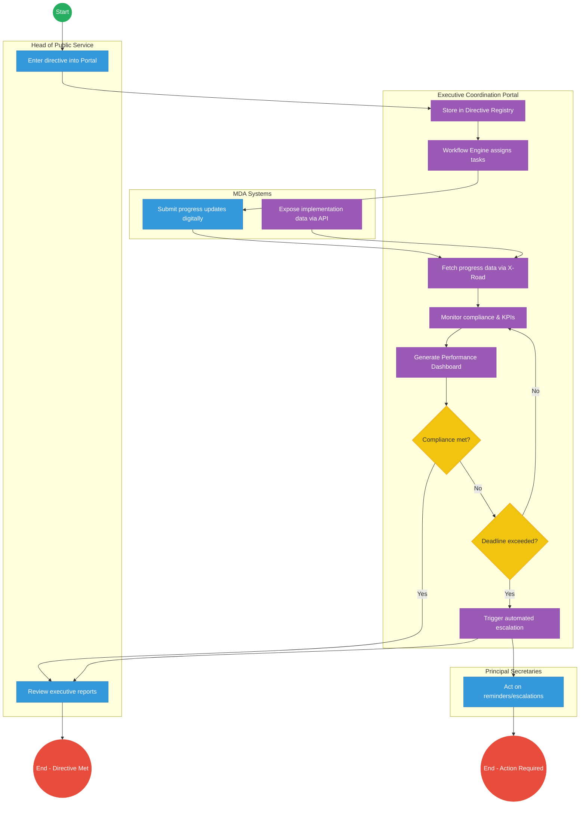

# OFFICE OF THE HEAD OF PUBLIC SERVICE (OHPS) – Executive Coordination

## Cover Page
- **Ministry/Department/Agency (MDA):** Executive Office of the President
- **Office:** Office of the Head of Public Service (OHPS)
- **Process Name:** Executive Coordination and Presidential Directives Management
- **Document Version:** 2.2
- **Date:** 2026-03-04
- **Classification:** Official

---

## Executive Summary
The Office of the Head of Public Service (OHPS) coordinates Presidential Directives, cross-Ministry policy implementation, and performance monitoring of all Ministries, Departments, and Agencies (MDAs). The current process relies heavily on memo-based communication, manual consolidation of quarterly reports, and email submissions. The transition to the Kenya DSAP Architecture aims to establish a real-time digital executive coordination platform that automates compliance tracking and data aggregation across government.

---

## 1. AS-IS Process Flowchart (BPMN 2.0)
*Current State visualization (Manual Executive Coordination & Directives).*

```mermaid
flowchart TD
    %% Events
    Start((Start))
    EndClose((End - Directive Closed))
    EndEscalate((End - Escalated))

    subgraph OHPS [Office of the Head of Public Service]
        direction TB
        ReceiveDir[Receive Presidential Directive]
        AnalyzeDir[Analyse directive & identify MDAs]
        TranslateDir[Translate into implementation instructions]
        DispatchInst[Dispatch instructions to PSs]
        TrackImpl[Track implementation progress]
        Consolidate[Consolidate reports from MDAs]
        AssessPerf[Perform performance assessment]
        EvalGateway{Implementation satisfactory?}
        CloseFeed[Close directive & provide feedback]
        IssueCorr[Issue corrective instruction or escalate]
    end

    subgraph MDAs [Ministries, Departments, Agencies (PSs)]
        direction TB
        ConfirmRec[Confirm receipt]
        ImplDir[Implement directive tasks]
        SubProg[Submit progress reports via email/memo]
    end

    %% Flow connections
    Start --> ReceiveDir
    ReceiveDir --> AnalyzeDir
    AnalyzeDir --> TranslateDir
    TranslateDir --> DispatchInst
    
    DispatchInst --> ConfirmRec
    ConfirmRec --> ImplDir
    ImplDir --> SubProg
    
    SubProg --> TrackImpl
    TrackImpl --> Consolidate
    Consolidate --> AssessPerf
    AssessPerf --> EvalGateway
    
    EvalGateway -- "Yes" --> CloseFeed
    EvalGateway -- "No" --> IssueCorr
    
    IssueCorr --> ImplDir
    IssueCorr --> EndEscalate
    CloseFeed --> EndClose

    %% Styling
    classDef startEvent fill:#27ae60,stroke:#27ae60,color:#fff;
    classDef endEvent fill:#e74c3c,stroke:#e74c3c,color:#fff;
    classDef userTask fill:#3498db,stroke:#2980b9,color:#fff;
    classDef gateway fill:#f1c40f,stroke:#f39c12,color:#333;
    
    class Start startEvent;
    class EndClose,EndEscalate endEvent;
    class EvalGateway gateway;
    class ReceiveDir,AnalyzeDir,TranslateDir,DispatchInst,TrackImpl,Consolidate,AssessPerf,CloseFeed,IssueCorr,ConfirmRec,ImplDir,SubProg userTask;
```

---

## Process Overview
### Process Name
Executive Coordination and Presidential Directives Management

### Service Category
- G2G (Government to Government)

### Scope
- **In Scope:** Translation of Presidential Directives into actionable tasks, assignment to MDAs, performance data collection, manual compliance evaluation, and executive briefing.
- **Out of Scope:** Internal MDA operations not related to directive implementation.

### Triggers
- Issuance of a Presidential Directive.
- Periodic cross-Ministry reporting cycles.

### End States
- **Successful:** Directive fully implemented and closed.
- **Unsuccessful/Delayed:** Directive escalated for non-compliance.

### Policy Context
- Executive Order No. 1 of 2023.

---

## Detailed Process (AS-IS)
| Step | Role | Action | Tool/System | Notes |
|---|---|---|---|---|
| 1 | Head of Public Service | Receives Presidential Directive. | Physical/Memo | Originates from Cabinet or Presidential instruction. |
| 2 | OHPS Analysis Team | Analyses the directive to identify responsible MDAs and scopes required actions. | Manual/Meetings | |
| 3 | Senior Coordinators | Translates the directive into formal implementation instructions and KPIs. | Word/Memo | |
| 4 | OHPS Secretariat | Dispatches instructions via memo/email to the respective Principal Secretaries. | Email/Registry | |
| 5 | Principal Secretaries | Confirm receipt of instructions and assign internally within their MDAs. | Memo/Email | |
| 6 | MDAs | Implement the directive tasks based on received instructions. | Internal Systems | |
| 7 | MDAs (Reporting Teams)| Compile and submit progress reports quarterly or as requested. | Email/Excel | High effort, prone to delays. |
| 8 | OHPS Analysis Team | Consolidates received reports manually from multiple MDAs. | Excel | Time-consuming process. |
| 9 | Senior Coordinators | Performs performance assessment against original directive KPIs. | Manual | |
| 10 | Head of Public Service | Reviews assessment to decide if implementation is satisfactory. If yes, closes directive. If no, issues corrective instructions or escalates. | Briefings | |

---

## Pain Points & Opportunities
### Pain Points
- **Manual Tracking:** Relying on emails and memos makes it nearly impossible to have real-time visibility into MDA compliance.
- **Data Silos:** Reports from MDAs are unstructured (Word/Excel), requiring massive manual effort to consolidate.
- **Delayed Intervention:** Corrective actions happen only after quarterly reports are reviewed, leading to long implementation delays.

### Opportunities
- **Automated Workflow:** Implement an Executive Coordination Portal to digitize tasking and tracking.
- **Interoperability (X-Road):** Pull actual performance data directly from MDA core systems rather than relying on self-reported spreadsheets.
- **Real-Time Dashboards:** Provide the Head of Public Service with live tracking of all directives.

---

## 2. TO-BE Process Flowchart (BPMN 2.0)
*Future State visualization (Kenya DSAP Architecture - Executive Coordination).*



## Future State Process (TO-BE)
### Narrative
**TO-BE Process: Digital Executive Coordination & Monitoring**

The To-Be process shifts from manual reporting to a **Digital Executive Coordination Platform**. 

**Core Components:**
- **Executive Coordination Portal:** The central interface for managing tasks and directives.
- **Directive Registry:** A national repository for tracking the lifecycle of all Presidential Directives.
- **Workflow Engine:** Automates task assignment and routing to Principal Secretaries.
- **Compliance Monitoring System:** Evaluates data against predefined KPIs.
- **Executive Performance Dashboard:** Provides real-time visibility to the Head of Public Service.

**Process Flow:**
1. The Head of Public Service enters the Presidential Directive into the Executive Portal.
2. The directive is securely stored in the national Directive Registry.
3. The Workflow Engine assigns specific implementation tasks to the responsible MDAs.
4. MDAs submit structured progress updates digitally.
5. Crucially, the system also automatically fetches implementation data directly from MDA backend systems via the national interoperability layer (X-Road), ensuring data integrity.
6. The Executive Dashboard processes this data to display real-time progress.
7. The system continuously monitors compliance; if delays are detected or deadlines exceeded, automated reminders and escalations are triggered.
8. Situation reports are automatically generated for the President and Cabinet, shifting governance from reactive to proactive.

---

## References
- https://www.president.go.ke
- Executive Order No. 1 of 2023
- Desk Review