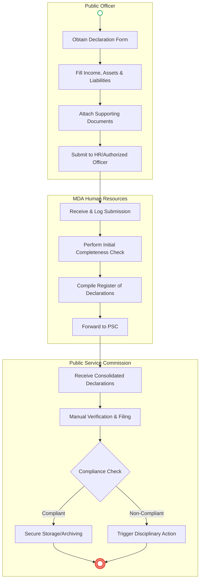
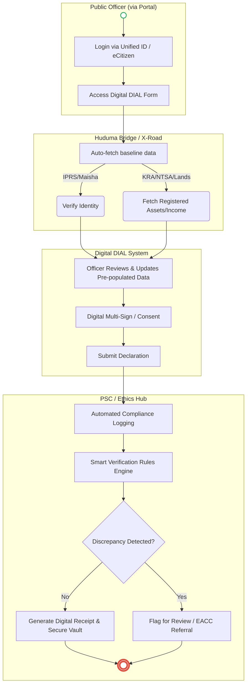

# PUBLIC SERVICE COMMISSION (PSC) – Service Delivery

## Cover Page
- **Ministry/Department/Agency (MDA):** Public Service Commission (PSC)
- **Department:** Ethics and Governance / Human Resource Management
- **Process Name:** Declaration of Income, Assets and Liabilities
- **Document Version:** 1.0
- **Date:** 2026-03-18
- **Classification:** Official
- **Strategic Category:** Priority MDA
- **Life-Cycle Group:** Public Service Management
- **Breakout Room:** Governance & Ethics
- **Facilitator:** Auto-generated
- **Assistant:** AI Assistant

## Service Mandate
The Public Service Commission (PSC) of Kenya derives its mandate primarily from Articles 233 and 234 of the Constitution of Kenya (2010). Its core functions include:
1. **Human Resource Management:** Appointing persons to hold or act in offices in the public service, confirming appointments, exercising disciplinary control, and developing human resources while reviewing conditions of service and qualifications.
2. **Promotion of Values and Principles:** Promoting the values and principles of public service (as outlined in Articles 10 and 232) throughout the service and investigating, monitoring, and evaluating the organization, administration, and personnel practices of the public service.
3. **Efficiency and Effectiveness:** Ensuring the public service is efficient and effective and making recommendations to the national government regarding the public service.
4. **Appeals and Petitions:** Hearing and determining appeals from persons in the county governments (in specific circumstances) and other public bodies.

---

## Executive Summary
The Public Service Commission (PSC) is constitutionally mandated to ensure an efficient and effective public service. A key aspect of this mandate is upholding ethics and integrity within the public service. Under the Public Officer Ethics Act, public officers are required to submit a Declaration of Income, Assets and Liabilities (DIAL) every two years, as well as upon initial appointment and exit from service. The current process is purely manual, relying entirely on physical paper forms, which poses significant challenges in verification, tracking, and compliance monitoring. The transition to a unified, digital-first architecture aims to automate submissions, integrate with foundational identity and asset registries for real-time verification, and ensure seamless compliance tracking.

---

### 1.1 AS-IS Process Flow (BPMN 2.0)

---

## Process Overview
### Process Name
Declaration of Income, Assets and Liabilities (DIAL)

### Service Category
- G2E (Government to Employee)
- G2G (Government to Government)

### Scope
- **In Scope:** Initial, biennial, and final declaration of income, assets, and liabilities by public officers; compliance tracking; verification of declared assets.
- **Out of Scope:** General HR recruitment processes; criminal investigations (handled by EACC/DCI).

### Triggers
- **Time-based:** Biennial declaration period (every two years).
- **Event-based:** New appointment to public service; exit from public service.

### End States
- **Successful:** Declaration accurately filed, verified, and securely archived; compliance certificate generated.
- **Exception:** Non-compliance flagged for disciplinary action.

### Policy Context
- Public Officer Ethics Act; The Constitution of Kenya (Chapter Six on Leadership and Integrity); Data Protection Act 2019.

---

## Detailed Process (AS-IS)

| Step | Role | Action | Tool/System | Notes |
|---|---|---|---|---|
| 1 | Public Officer | Obtains, fills out, and signs the physical paper DIAL form. | Manual / Paper | Often requires manual data entry of extensive financial details. |
| 2 | MDA HR Officer | Receives the physical form, logs the submission, and checks for physical completeness. | Manual / Physical Ledger | Labor-intensive tracking during peak declaration periods. |
| 3 | MDA HR Officer | Compiles a physical list of compliant and non-compliant officers and dispatches forms to PSC. | Manual / Dispatch | Risk of document loss or unauthorized access in transit. |
| 4 | PSC Ethics Officer | Receives forms from various MDAs, manually verifies data, and files them. | Physical Registry | Verification of assets is difficult and rarely done in real-time. |
| 5 | PSC Compliance | Identifies non-compliant officers and initiates follow-up or disciplinary procedures. | Manual / Files | Delays in identifying defaulters due to manual aggregation. |

---

## Pain Points & Opportunities
### Pain Points
- **Manual Data Entry:** Officers repeatedly fill out the same baseline information; prone to errors and omissions.
- **Verification Bottlenecks:** Lack of integration with external registries (e.g., Lands, NTSA, KRA) makes it virtually impossible to independently verify declared assets and income efficiently.
- **Compliance Tracking:** Fragmented systems across different MDAs make centralized compliance monitoring by the PSC difficult.
- **Data Security & Privacy:** Physical handling of sensitive financial information increases the risk of data breaches.

### Opportunities
- **Integrated Digital Portal:** A centralized, secure online portal for all public officers to submit declarations digitally.
- **Interoperability (X-Road/Huduma Bridge):** Integration with KRA (income), NTSA (vehicles), and Lands Registry (real estate) to pre-populate or automatically verify declared assets.
- **Automated Compliance:** System-generated alerts for upcoming deadlines and automatic flagging of non-compliant officers.
- **Data Analytics:** Ability to detect anomalies, conflicts of interest, or unexplained wealth through automated data analysis.

---

### 1.2 TO-BE Process (BPMN 2.0 - Unified Digital Architecture)

## Future State Process (TO-BE)
### Narrative
**TO-BE Process: Intelligent & Integrated Declaration of Assets**

**Design Principles:**
- **Pre-population and Verification:** The burden on the public officer is reduced. By leveraging the **Huduma Bridge/X-Road**, the system integrates with foundational registries (IPRS, KRA, NTSA, Lands). When the officer logs in, known assets and income streams are pre-populated for review, ensuring accuracy and making concealment difficult.
- **Seamless Compliance:** The system automatically tracks the declaration lifecycle (Initial, Biennial, Final). It sends automated reminders and instantly flags non-compliant individuals to the PSC and respective MDA HR heads immediately after the deadline.
- **Secure & Verifiable:** Declarations are cryptographically signed using the **Trust Hub / NPKI** to ensure non-repudiation. The data is stored in a secure digital vault with strict access controls and audit trails, ensuring data privacy in line with the Data Protection Act.

### Optimized Steps (Digital)

| Step | Actor | Action | System |
|---|---|---|---|
| 1 | Public Officer | Authenticates securely into the centralized HR/Ethics portal. | eCitizen / Unified Identity |
| 2 | System | Fetches and pre-populates identity, employment, and known asset/income data. | Huduma Bridge / X-Road (IPRS, KRA, NTSA) |
| 3 | Public Officer | Reviews pre-populated data, adds any missing liabilities or informal assets, and submits. | Digital DIAL System |
| 4 | Trust Hub | Applies a digital signature to the submission for non-repudiation. | NPKI Service |
| 5 | PSC System | Automatically logs compliance, issues a digital receipt, and securely archives the record. | Ethics Hub / Secure Vault |
| 6 | Rules Engine | Runs background analytics to detect anomalies or conflicts of interest for further review. | PSC Analytics Engine |

---

## References
- Public Officer Ethics Act
- Public Service Act
- Constitution of Kenya (Chapter 6)
- Data Protection Act 2019

---

### Validation Survey
Please provide your feedback here: [https://ee.kobotoolbox.org/x/4Ls7SlCG](https://ee.kobotoolbox.org/x/4Ls7SlCG)
